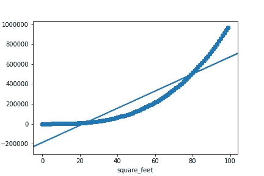
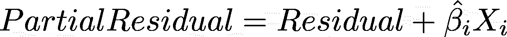
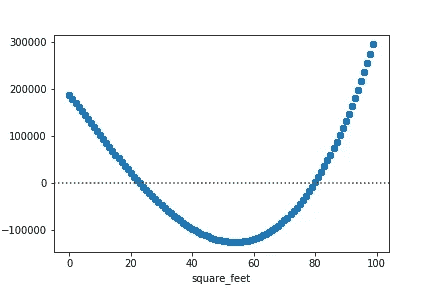
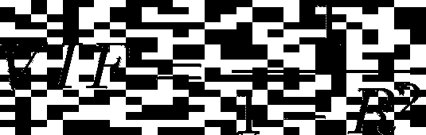

# 验证和处理线性回归的假设

> 原文：<https://towardsdatascience.com/verifying-and-tackling-the-assumptions-of-linear-regression-32126acea67b?source=collection_archive---------8----------------------->

## 线性回归依赖于五个主要假设。能够核实并据此采取行动尤其重要。

线性回归可能是数据科学中最重要的模型。尽管表面上很简单，但它依赖于几个关键的假设(线性、同异方差、不存在多重共线性、误差的独立性和正态性)。对这些的良好了解对于创建和改进您的模型至关重要。在这篇文章中，我将回顾五个主要假设，并解释它们的重要性以及一些解决方案，以防它们得不到尊重。

# **1。线性关系**

显而易见，线性回归假设因变量和预测变量之间存在线性关系。

**怎么能验证呢？**

成对散点图可能有助于验证线性假设，因为很容易在图上显示线性关系。

在上面的例子中，两个变量之间的关系显然不是线性的

此外，类似地，代表预测值和因变量之间关系的部分残差图，同时考虑所有其他变量，可能有助于可视化变量之间的“关系的真实性质”。

部分剩余图背后的公式

**如果不被尊重，对模特来说意味着什么？**

如果不考虑线性，回归将会不合适，并且不能准确地模拟因变量和自变量之间的关系。

有什么办法呢？

自变量和因变量可以转换，因此它们之间的关系是线性的。例如，您可能会发现因变量的*对数*和一些自变量的*平方*之间的关系是线性的(参见*多项式回归*和*广义可加模型* (GAM)对此进行了有趣的概括)。

# **2。同质性**

同方差意味着无论因变量的水平如何，残差都具有恒定的方差。

**如何验证？**

为了验证同方差性，可以查看残差图，并验证误差项的方差在因变量的值上是恒定的。

在上面的例子中，存在异方差，因为残差的方差不是常数

如果不被尊重，对模特来说意味着什么？

在异方差的情况下，模型将不会同样适合模型的所有部分，这将导致有偏差的预测。这也通常意味着混淆变量(重要的预测因素)被忽略了(这也可能是因为线性假设没有得到尊重)。虽然对于数据科学的预测环境，这可能不是最重要的，但异方差在推断环境中相对更重要，因为系数的可解释性。

能做些什么？

由于异方差通常反映了混杂变量的缺乏，因此可以通过检查预测值和提供额外的独立变量来解决(甚至可以检查线性假设是否得到了尊重)。

# 3.多重共线性缺失

多重共线性是指两个或两个以上的自变量高度相关(极端情况下甚至是冗余的)。虽然它对于非参数方法可能不重要，但对于线性回归等参数模型来说却是最基本的。

**怎么能验证呢？**

通常，多重共线性的一个明显迹象是，一些估计系数具有“错误”符号(即，在试图预测房价的模型中，与 a 的大小相关的系数为负)。

成对相关可能是识别各种独立变量之间潜在关系的第一步。

相关性热图可以允许快速注意到成对的相关性

然而，一个更彻底的方法是看看方差通货膨胀因素(VIF)。它的计算方法是将每个独立变量回归到所有其他变量上，并计算得分，如下所示:

计算独立变量 VIF 的公式

因此，如果自变量和其他变量之间存在线性关系，这将意味着回归的大的 *R 平方*，从而更大的 VIF。根据经验，VIFs 分数高于 5 通常是多重共线性的指标(高于 10 肯定会被认为是一个问题)。

**如果不被尊重，对模特来说意味着什么？**

该模型可能产生不准确的系数估计，因此无法解释。因此，这可能会损害推理能力和可能的预测性能。

在多重共线性存在的情况下，回归结果也可能变得不稳定，并且会因训练数据的不同而有很大差异。

有什么办法呢？

多重共线性可以通过执行特征选择来修复:删除一个或多个独立变量。

一种常见的方法是使用后向子集回归:首先用所有潜在的独立变量构建一个回归，并使用特定领域的知识迭代地删除具有高 VIF 的变量。

另一种方法可以是隔离并只保留多个独立变量之间的交互影响(通常使用直觉或正则化)。

随着多重共线性的减少，模型将变得更加稳定，系数的可解释性将得到改善。

# 4.残差的独立性(没有自相关)

自相关指的是观测误差相关的事实。

**如何验证？**

为了验证观察值不是自相关的，我们可以使用**德宾-沃森测试**。测试将输出 0 到 4 之间的值。越接近 2，各变量之间的自相关性越小(0–2:正自相关，2–4:负自相关)。

**如果不被尊重，对模特来说意味着什么？**

自相关可能意味着没有考虑关系的线性，或者变量可能被忽略。

自相关会导致自变量和因变量之间的虚假关系。

有什么办法呢？

对于时间序列，可以增加一个滞后变量。解决这一问题的另一个潜在方法是将变量从绝对值修改为相对变化(即，不是股票价格，而是从一个时期到下一个时期的变化百分比)。

更一般地说，变量应该进一步微调并添加到模型中。

# **5。误差的正态性**

如果残差不是正态分布，普通最小二乘法(OLS)以及回归可能会有偏差。

**如何验证？**

要验证误差的正态性，一个简单的方法是绘制残差相对于因变量水平的分布。人们可以使用 QQ 图来测量残差与正态分布的偏差。如果生成的曲线不正常(即偏斜)，可能会突出问题。

**如果不被尊重，对模特来说意味着什么？**

如果没有考虑到这一点，它可能会突出显示大的异常值的存在，或者突出显示违反的其他假设(即线性、同方差)。因此，用标准方法计算 t 统计量和置信区间会有偏差。

**能做些什么？**

在误差不是正态分布的情况下，可以验证是否考虑了其他假设(即同质性、线性)，因为这通常是这种违规的迹象，并相应地微调模型。

否则，还应该尝试处理数据中的大异常值，并检查数据是否可能是使用不同模型的单独子集。

除了上面列举的众多假设之外，验证您的线性回归没有外推超出训练数据的范围，并且没有异常值或单个记录可能会扭曲回归或对回归产生太大影响(参见 Cook 的距离和检测异常值的经验法则)也非常重要

正如这篇文章所强调的，尽管线性回归看起来很简单，但它依赖于许多假设。在构建模型时，重要的是要验证它们是否得到遵守，并在出现潜在违规时加以解决。我希望本指南能帮助你更好地理解线性回归背后的各种假设，并为你提供解决使用时可能面临的潜在问题所需的工具。

PS:我现在是伯克利的工程硕士，我还在学习这方面的知识。如果有什么需要改正或不清楚的地方，请告诉我。你也可以发邮件给我 [*这里*](mailto:ilias.miraoui@gmail.com) *。*