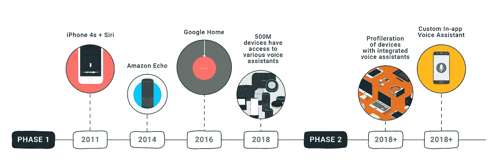
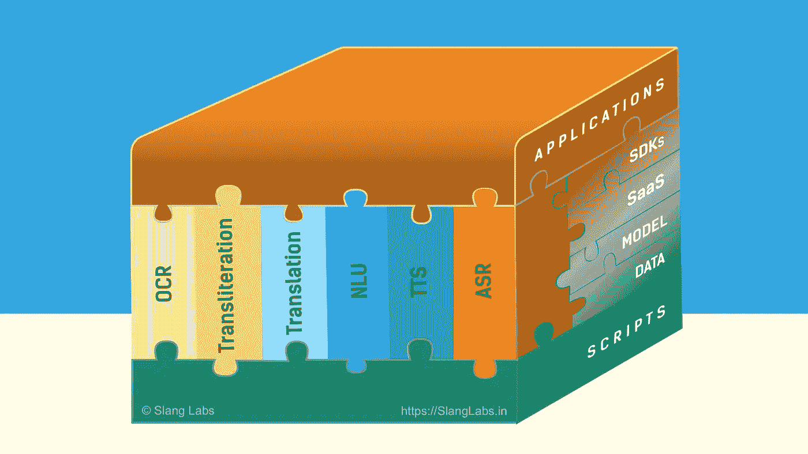

# 用于语音助手和对话式人工智能的印度语堆栈

> 原文：<https://towardsdatascience.com/vernacular-indic-language-bharat-bhasha-stack-for-conversational-ai-platform-and-voice-assistant-apps-6f8b9b4ad0a5?source=collection_archive---------51----------------------->

(图片由俚语实验室提供)

## 对话人工智能

## 巴拉特 Bhāṣā堆栈的案例

Bhārat Bhāṣā Stack 将像 India Stack 为 FinTech 所做的那样，为印度方言催化语音助手和对话式人工智能创新。

十年前，这是不可想象的。

在印度一个不起眼的小镇上，人们可以通过手机扫描挂在购物车上的二维码，向街头小贩付款。即使金额只有 50 卢比(不到一美元)。

将会有很多来自银行和非银行的移动应用和支付钱包。全部无缝互操作。任何两方将通过共享一个类似钱包地址的电子邮件进行交易。无需支付任何交易费用。

无数小企业会在 WhatsApp 上发送目录。送货上门。在家门口接受数字支付。而无需建立网站或支付网关。

十年前，现金是王道。

十年前，这是不可想象的。

但它发生了。感谢[印栈](https://www.indiastack.org/about/)。用于认证、支付和授权的数字基础设施。始于 2009 年。

India Stack 是一组 API，允许政府、企业、初创公司和开发者利用独特的数字基础设施来解决印度在**无出席**、**无纸化**和**无现金**服务交付方面的难题。

图片:[合众国际社标志](https://commons.wikimedia.org/wiki/File:UPI-Logo-vector.svg)

[统一支付接口](https://www.npci.org.in/product-overview/upi-product-overview) (UPI)是无现金即时支付的核心。UPI 成为小型企业的数字支付网关。它消除了一个只有大企业才能负担得起的进入壁垒。印度堆栈催化金融科技创新。

**Bhārat Bhāṣā栈可以为** [**印度语 tech**](https://cacm.acm.org/magazines/2019/11/240372-indic-language-computing/fulltext) **做印度栈为 FinTech 做的事情。**

现在，这可能是不可想象的。

印度任何角落的任何人都可以利用互联网的力量。跨语言和社会经济群体。即使他们不会读或写英语。通过与移动应用程序对话。用他们自己的语言。

任何企业都可以在应用程序中为大众烘焙语音助手。在所有印度语中。有负担得起的数据集、人工智能模型和服务。

现在，打字和触摸才是王道。但是巴拉特发现了自己的声音。[印度语的语音搜索一直在增长。](https://www.thinkwithgoogle.com/intl/en-apac/marketing-strategies/search/year-in-search-india-insights/)

所以这是有可能的。如果我们建造了巴拉特 Bhāṣā堆栈。印度语对话式人工智能的技术生态系统。

智能手机的普及率和语音的使用一直在增加。[根据谷歌的报告](https://www.thinkwithgoogle.com/_qs/documents/7677/Year_in_Search_report_India.pdf)，印度语的语音搜索也在增长。

Bhārat Bhāṣā堆栈可以成为小型企业的语音和语言 API。它可以**消除另一个只有大企业才能承受的进入壁垒**。它可以催化语音助手和对话式人工智能创新。

> Bhārat Bhāṣā堆栈可以跨越印度的语言和社会经济界限，为超过 10 亿人带来难以想象的创新浪潮。

文章的其余部分:

*   地图**对话式 AI** 当前语音助手和应用的格局，
*   提出 **Bhārat Bhāṣā栈**和所需的**技术**和**层**用于构建这些应用的各种入口点，以及
*   讨论**生态系统参与者**如何帮助构建堆栈。

# 对话人工智能

对话式人工智能必不可少，但需要巨额投资。

对话式人工智能使机器像人类一样交流。从研究实验室到消费者手中。它最初是像 Siri 这样的独立语音助手。它正以多种形式出现在应用程序和设备中。

对话式人工智能将在所有应用和设备中普及。(图片由俚语实验室提供)

## 语音助手

语音助手是使用语音进行交互的智能虚拟助手。这些也被称为**语音机器人**，尤其是当通过纯语音界面传送时。例如，作为客户支持语音机器人的交互式语音应答(IVR)系统。

[**Siri**](https://en.wikipedia.org/wiki/Siri) 是第一个著名的语音助手。然后是亚马逊 Echo 设备中的 [**Alexa**](https://en.wikipedia.org/wiki/Amazon_Alexa) ，除了其他功能之外，它还使亚马逊购物成为可能。下一个参赛者是 [**谷歌助手**](https://en.wikipedia.org/wiki/Google_Assistant) 。它最初是作为谷歌家用设备出现的，后来出现在安卓手机中。

它从有趣发展到有用，即使是在一个封闭和有限的生态系统中。

## 语音操作

下一个合乎逻辑的进展是让它在应用程序中可用。允许程序员集成语音命令来触发特定的应用程序操作。亚马逊用 Alexa 的[应用](https://developer.amazon.com/en-US/blogs/alexa/alexa-skills-kit/2020/07/you-can-now-seamlessly-connect-alexa-skills-to-mobile-apps)做到了这一点，谷歌用[应用动作](https://developers.google.com/assistant/app)做到了这一点。

[**语音搜索**](https://www.slanglabs.in/blog/in-depth-analysis-of-voice-search-inside-mobile-apps) 已经作为常见用例出现。几乎所有应用都有某种搜索功能:

*   搜索互联网
*   在地图应用程序中搜索路线
*   在音乐或视频应用程序中搜索歌曲
*   在购物应用程序中搜索商品
*   在旅行应用程序中搜索航班或火车

虽然所有的都是一种搜索，但每一种都涉及不同类别的世界知识。

## 应用程序中的语音助手

应用程序中的语音操作有严重的局限性。声音**旅程开始就结束**。一旦助手调用一个应用程序，用户只能通过触摸与应用程序进行交互。这阻碍了构建适合应用程序的丰富语音体验。

这就是为什么好几个应用在应用内部内置了语音助手**(而不是他们的应用藏在 Alexa 或者 Google Assistant 后面)。 [Gaana](https://www.slanglabs.in/blog/voice-in-mobile-apps-gaana) ， [YouTube](https://www.slanglabs.in/blog/voice-in-mobile-apps-youtube) ， [Paytm Travel](https://www.slanglabs.in/blog/voice-in-mobile-apps-paytm-travel) ， [My Jio](https://www.slanglabs.in/blog/voice-in-mobile-apps-my-jio) ， [Jio Mart](https://www.slanglabs.in/blog/voice-assistant-in-apps-jio-mart) ， [Amazon](https://www.slanglabs.in/blog/voicesearch-in-apps-amazon-shopping) ，[Flipkart](https://www.slanglabs.in/blog/voice-to-cart-powering-your-ecommerce-app-with-voice)app 针对各自领域优化了语音助手。**

构建这些优化的助手需要雄厚的资金。它需要大量的投资、努力和时间来构建。这些应用程序大多支持英语和印地语。缺少对大多数印度语的广泛支持。Bhārat Bhāṣā堆栈可以让小型企业家获得这些技术。

# Bhārat Bhāṣā堆栈:印度语堆栈

**一个开放的 Bhārat Bhāṣā栈可以降低** [**沟通**](https://www.expresscomputer.in/egov-watch/india-language-stack-can-help-overcome-barriers-of-communication-meity-secretary/27499/) **的壁垒，降低成本，刺激创新。**

Bhārat Bhāṣā堆栈应该有一套模型、服务和 SDK 来构建印度语言的对话应用程序。它应该包括构建语音应用程序所需的语音、语言和视觉技术。堆栈**层**应该提供使用这些技术的方便入口点。这将使建立聊天机器人、语音机器人、语音助手和应用程序变得容易。

# 技术

语音助手模仿人类动作:

*   **听:**将语音音频转换成文字。叫做 [**自动语音识别**](https://www.slanglabs.in/blog/automatic-speech-recognition-in-python-programs) **(ASR)** 或者 [**语音转文字**](https://www.slanglabs.in/blog/how-to-build-python-transcriber-using-mozilla-deepspeech)**【STT】**。
*   **理解:**理解文中意思或意图，提取重要实体。它叫做****【NLU】**。**
*   ****动作:**基于这种理解，应用程序执行期望的动作。这就是 app 的**业务逻辑**。栈为应用程序提供钩子来插入它们的逻辑。**
*   ****说:**问问题来澄清、确认或从用户那里寻求所需的信息。它被称为**语音合成**或**文本到语音(TTS)** 。**

****

**语音助手的步骤。(图片由俚语实验室提供)**

**其他对话式人工智能任务包括:**

*   **人类说不同的语言。应用程序可能需要将文本从一种语言翻译成另一种语言。叫做**机器翻译(MT)** 。**
*   **许多人在罗马键盘上使用语音拼写来输入印度语。计算机可能需要将文本的语音翻译成印度语言文字。叫做**音译**。**
*   ****参见/阅读:**识别手写或印刷字符图像的能力。它叫做**光学字符识别(OCR)** 。**

**所有这些都需要一种叫做深度神经网络(DNN)的机器学习技术。建立和训练 DNN 是非常昂贵的，因为它需要大量的数据和计算时间。**

**总而言之，Bhārat Bhāṣā堆栈涵盖了 dnn 擅长解决的所有三种类型的问题:**

*   ****语音:**自动语音识别，语音合成**
*   ****语言:**自然语言理解，机器翻译，音译**
*   ****视觉:**光学字符识别**

# **层**

**应用程序开发人员应该能够只关注他们的业务逻辑。Bhārat Bhāṣā堆栈应该为语音助手的其余步骤提供对话式人工智能技术的挂钩。本节描述了应用程序可以挂接的各个层。**

## **剧本**

**语言的脚本使用 [Unicode 字符集](https://en.wikipedia.org/wiki/Brahmic_scripts#Unicode)进行编码。对话式人工智能技术之间的信息交换使用这些字符集进行。**

**印度语是语音语言，即单词的拼写与其发音相同。这一特性可能允许使用语音数据进行跨相似语言的训练。**

**堆栈应利用并解决印度语使用者的独特性:**

*   **许多印度语是**低资源**语言。可用的语音和语言数据不足以训练模型**
*   **来自英语和印地语的外来词在对话中很常见(被称为**语码转换**)**
*   **由于共同的语言起源，重要的共享词汇**
*   **许多印度人会说多种语言。他们会说 2 到 3 种语言，理解 4 到 5 种语言。**

**在 IIT 钦奈开发的印度文字是印度语言的通用文字。[工作](https://biotech.iitm.ac.in/Faculty/CNS_LAB/VSC.html)表明印度语可以使用一对一的字符集映射进行音译。**

****

**在 IIT 钦奈发明的印度文字是印度语的通用文字。(图片来自 [Bharati 脚本项目](https://biotech.iitm.ac.in/Faculty/CNS_LAB/VSC.html))**

## **数据**

**数据的可用性和成本是大多数企业家面临的最大障碍。语音和语言的精选数据集是堆栈中的最低层。**

**许多著名的机构一直在为他们的研究收集有关印度语的数据。这些机构拥有数百小时的数据。但是随着时间的推移，这些数据以及使用这些数据的方法都丢失了。**

> **学生毕业后，论文资料就像祖母珍贵的首饰盒。很少有人知道它在哪里，也没有人打开过它。——一位教授@ IISc Bangalore**

**对于语音识别，一些可用的数据集:**

*   **[印度语言语言数据联盟(LDC-IL)](https://www.ldcil.org/) 可能拥有学术界最大的印度语言数据集。他们通过一个[数据发布门户](https://data.ldcil.org/speech/speech-raw-corpus)来收费。**
*   **微软为研究人员发布了一个小型的古吉拉特语、泰米尔语和泰卢固语的语音语料库。**
*   **[Mozilla 的 Common Voice](https://commonvoice.mozilla.org/en/datasets) 有阿萨姆语、旁遮普语、奥迪亚语和泰米尔语的语音数据。**

**对于自然语言，一些可用的数据集:**

*   **[来自 LDC-IL 的文本数据语料库](https://data.ldcil.org/text/text-raw-corpus)**
*   **来自 IIT 孟买的英语-印地语平行语料库**
*   **[印度语多语言平行语料库](https://lotus.kuee.kyoto-u.ac.jp/WAT/indic-multilingual/index.html)孟加拉语、印地语、马拉雅拉姆语、泰米尔语、泰卢固语和乌尔都语**

**巩固和建立一个类似 LibriSpeech 的印度语研发数据集将会带来丰厚的回报。**

## **模型**

**拥有数据是强制性的第一步。但是训练 DNN 模特需要高水平的专业知识。它也很昂贵。**

**合乎逻辑的下一步是为印度语提供预先训练好的现成模型。隐私敏感型应用程序可以在设备上使用这些模型，也可以将其作为服务托管在内部私有云上。**

## **软件即服务(SaaS)**

**SaaS 将开发人员从托管模型和管理服务基础设施中解放出来。这使得开始构建应用程序变得更加容易。**

**所有主要的云基础设施都为语音识别、自然语言理解和一些印度语言的文本到语音转换提供了 SaaS。**

**这些服务相当昂贵(就像支付网关一样)。让更多的 SaaS 供应商使用这些预先训练好的模型可以降低成本。**

## **软件开发工具包(SDK)**

**流行的编程语言和 OS 平台中的 SDK 构成了最后一层。SDK 可以使用模型或 SaaS。**

**[为应用领域调优模型或服务](https://www.slanglabs.in/blog/assistant-builder-vs-building-from-scratch)需要一些 ASR 和 NLU 的专业知识。[需要针对特定领域的 SDK](https://www.slanglabs.in/blog/slangs-assistant-builder-helps-you-forget-about-intents-and-entities)(例如，针对银行、电子商务、农业)来进一步降低准入门槛。**

**我们俚语实验室已经从我们的客户那里了解到这一点。我们现在提供[语音助手即服务(VaaS ),以提高客户对语音助手](https://www.slanglabs.in/blog/moving-to-vaas)的采用。**

****

****Bhārat Bhāṣā栈。**技术:自动语音识别(ASR)、文本到语音(TTS)、自然语言理解(NLU)、机器翻译、音译和光学字符识别(OCR)。(图片由俚语实验室提供)**

# **生态系统参与者**

****设计和建造 Bhārat Bhāṣā堆栈需要系统和持续的合作:****

*   ****学术界**分享代码为的[关于印度相关对话式人工智能问题的研究论文。](https://paperswithcode.com%27/)**
*   ****行业**为普通人打造语音产品和服务。**
*   ****政府**在建设印度堆栈中扮演类似的角色。**
*   ****行业团体**通过会议和联盟加快协作。**

**政府积极制定人工智能政策:**

*   **[Niti Ayog](https://niti.gov.in/) 发表了一篇关于[人工智能国家战略(#AIforAll)](https://niti.gov.in/writereaddata/files/document_publication/NationalStrategy-for-AI-Discussion-Paper.pdf) 的讨论论文**
*   **[印度语言的技术开发](https://tdil.meity.gov.in/)隶属[电子部&信息技术](https://www.meity.gov.in/)促成了 IDC-IL 数据发布门户的创建。**

**NASSCOM 和 FICCI 一直在举办研讨会，将公司和大学聚集在一起。俚语实验室一直是积极的参与者。**

# **摘要**

**支持语音的应用程序可以跨越不同语言和社会经济群体之间的互联网鸿沟。语音和自然语言技术正在成熟，但仍然非常昂贵。**

**对于企业家和小企业来说，数据和模型培训成本是巨大的障碍。本地印度语 Bhāṣā堆栈将消除进入障碍。**

**本文概述了堆栈，以及我们需要构建的组件。我们需要:**

*   **巩固各组织正在进行的努力**
*   **集中资源来建造它，和**
*   **使其以低成本可用。**

**FinTech 的 India Stack 之所以成功，是因为包括政府在内的所有人都走到了一起。根据印度的独特需求构建 Bhārat Bhāṣā堆栈是其成功和广泛采用的关键。**

**让我们开始吧！**

**一名家庭佣工努力在 SBI 应用程序中找到自己的账户余额。她犹豫地尝试了所有的东西，尽管“右”按钮在第一个屏幕上很突出。巴拉特·bhāṣā·斯塔克能让她的生活轻松一点。**

****如果你喜欢，请:****

************

***原载于* [*黑话实验室博客*](https://www.slanglabs.in/blog/vernacular-indic-language-bharat-bhasha-stack-for-conversational-ai-and-voice-assistant-apps) *。***