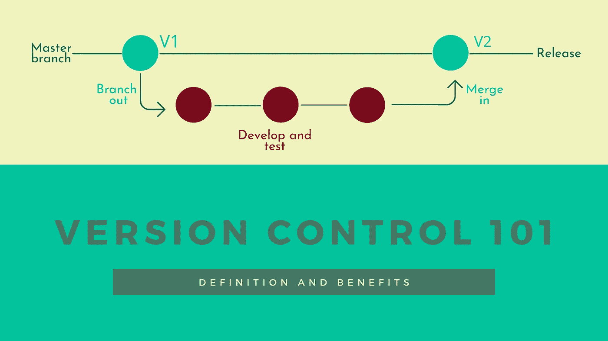
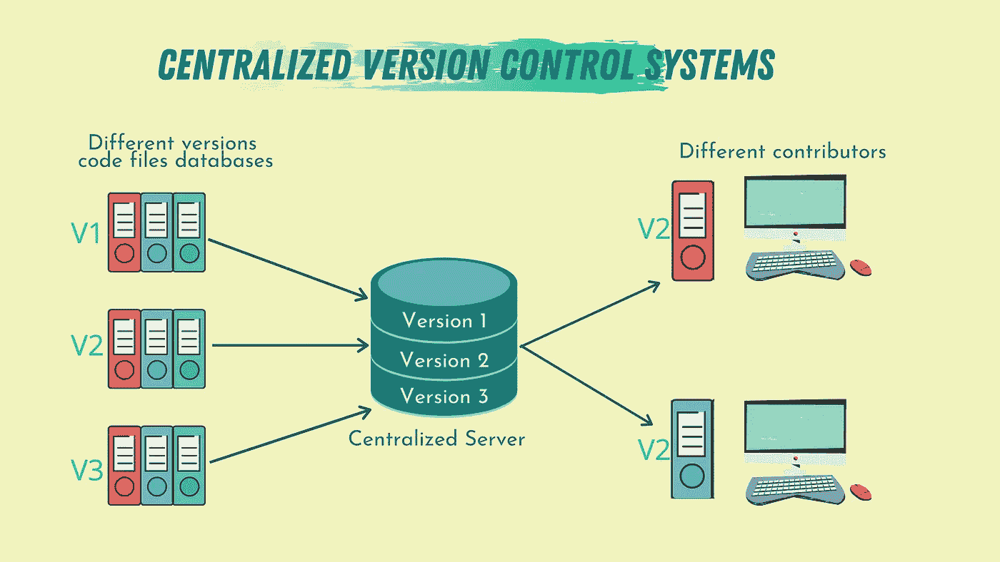
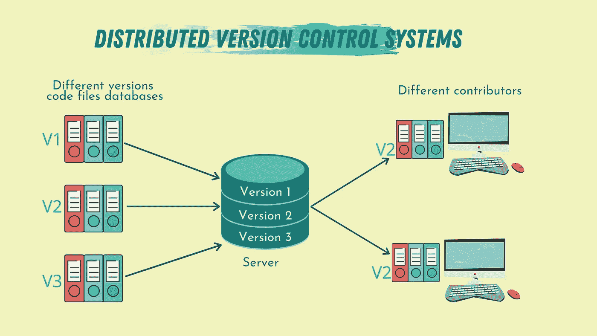

# 版本控制 101:定义和好处

> 原文：<https://towardsdatascience.com/version-control-101-definition-and-benefits-6fd7ad49e5f1?source=collection_archive---------18----------------------->

## 什么是版本控制，为什么它很重要？

图片由作者提供(使用 [Canva](https://www.canva.com/) 制作)

软件工程领域是一个快速变化的领域。说到软件，没有最终版本。所有的应用程序和代码总是在不断地发展。软件工程的一个重要方面是版本控制。

版本控制系统是一种特殊类型的软件开发工具，旨在帮助软件开发人员跟踪对任何特定应用程序的源代码所做的任何更改。

通常，任何软件项目都是由一个程序员/开发者团队来处理的。他们中的每一个人都致力于整个项目的一个特定方面。这些开发人员需要为他们分配的任务编写和测试代码，而不影响产品的工作版本。这就是版本控制的用武之地。

除了促进任何软件项目的并行开发之外，当代码中出现错误，导致它中断时，我们可以使用版本控制来跟踪错误，并返回到代码的最新工作版本。

随着我们构建的软件变得越来越大、越来越复杂、越来越通用，版本控制的知识以及如何有效地使用它是任何软件开发人员都需要获得和开发的基本技能之一。

在本文中，我们将深入了解版本控制的世界，它意味着什么，为什么使用它，以及如何开始使用它。

# 版本控制

如上所述，版本控制是一种帮助开发人员/程序员解决一些日常问题的工具，例如:跟踪代码中的更改，帮助维护代码，并允许他们在不影响彼此工作流的情况下处理相同的源代码文件。

版本控制的概念通常是通过称为版本控制系统(VCS)的特殊系统来实现的。近年来，这些系统经历了许多发展。有时，VCS 被称为源代码管理工具(SCM)或修订控制系统(RCS)。

也许当今世界上数百万开发人员和程序员使用的最流行的 VCS 是 Git。目前使用的其他 VCS 包括:

1.  必须的。
2.  豆茎。
3.  阿帕奇颠覆。
4.  AWS 代码提交。

# 版本控制系统的类型

有两种主要类型的版本控制系统:集中式和分布式版本控制系统。

## 集中式版本控制系统

图片由作者提供(使用 [Canva](https://www.canva.com/) 制作)

集中式版本控制系统(CVCS)是一种版本控制系统，它有一台服务器，包含所有版本的代码文件(通常存储在存储库中)、一些贡献者(处理代码文件的程序员)以及主项目的备份文件。

这种设置允许代码的每个贡献者知道其他人在做什么，使得基于特定任务的人员交流和管理更加容易。

这种设置的主要缺点是，由于所有的代码文件和备份文件都存储在一个集中的服务器上，如果服务器发生了什么问题，那么一切都将丢失。颠覆和被迫是 CVCS 的例子。

## 分布式版本控制系统

图片由作者提供(使用 [Canva](https://www.canva.com/) 制作)

分布式版本控制系统(DVCS)如 Git、Mercurial 或 Bazaar 是版本控制系统，有一个或多个包含代码文件的主服务器。

然而，与 CVCS 不同的是，在 DVCS，代码文件被镜像到每个贡献者的计算机上，这意味着他们每个人都有自己的代码版本，包括在本地工作的完整历史。

因此，如果任何服务器停止运行，一旦服务器恢复运行，贡献者的任何存储库都可以复制到服务器上，并恢复代码文件的历史。这很容易做到，因为原始代码文件的每个克隆实际上都是所有项目数据的完整备份。

DVCS 允许不同物理位置的不同人群在同一项目中同时协作。这是在中央系统中不可能实现的优势。

# 版本控制的好处

使用版本控制系统对任何软件开发团队都有各种好处，包括:

## 1 生成备份

也许使用版本控制系统最重要的好处是，每次贡献者克隆一个存储库，从某种意义上说，他们是在创建该存储库当前版本的备份。在不同的机器上有多个备份是很有价值的，因此我们可以保护数据不会因为服务器故障而丢失。

## 2 测试和实验

当今世界，任何源代码总是在开发中。新的功能总是在增加，新的受众是目标，新的应用程序是要开发的。

当一个团队在一个软件项目上工作时，他们通常有不同的主项目克隆来开发新的特性，测试它们，并确保它们在这个新的特性可以被添加到主项目之前正常工作。这可以节省时间，因为代码的不同方面可以同时开发。

## 3 保存历史并跟踪变化

拥有特定代码文件中变更的记录可以帮助您和新的贡献者理解代码的特定部分是如何形成的。它是如何开始并随着时间的推移发展到现在的版本的。

此外，如果随着时间的推移，某个特性的添加给项目的扩展带来了困难，那么使用版本控制可以让开发人员跟踪出那个特定的特性，并在不影响项目功能的情况下更改或删除它。

## 4 协作和贡献

版本控制系统的主要好处之一，尤其是 DVCS，是它允许我们为我们喜欢的项目做贡献，尽管我们身处不同的国家。我认为 DVCS 的存在是开源技术取得目前成功的主要推动者之一。

# 外卖食品

充分理解版本控制系统，它们是如何工作的，并有效地使用它们，这是任何程序员或软件开发人员都需要掌握的基本技能之一，并在他们的职业生涯中取得成功。

版本控制系统可能是非常复杂和难以理解的话题之一。这就是为什么我决定撰写一系列文章来解决版本控制的不同方面。这些文章的目标是让您轻松舒适地开始版本控制。

本系列即将发布的文章将涵盖每个开发人员都应该知道的 Git 基本命令，一些让您脱颖而出的高级命令，以及如何有效地使用 Git 来使您的工作流程流畅愉快。