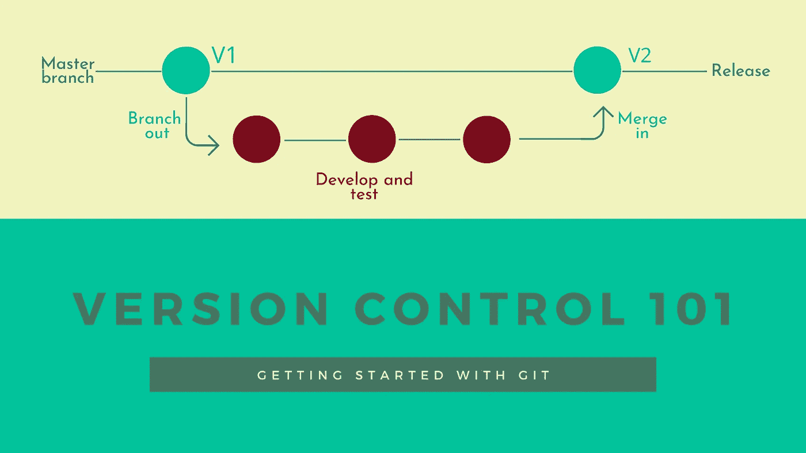
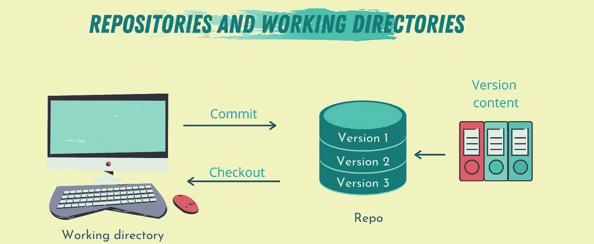
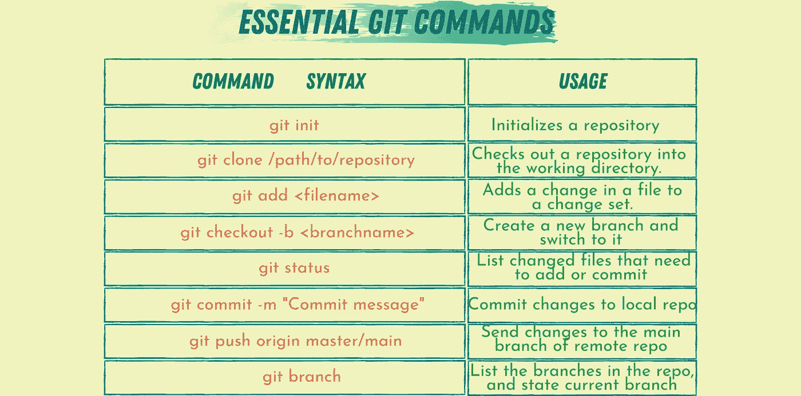
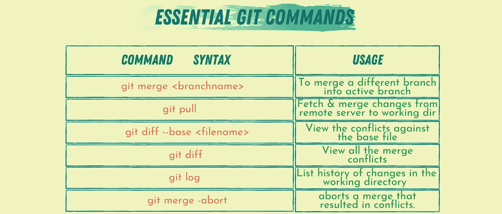

# 版本控制 101:Git 入门

> 原文：<https://towardsdatascience.com/version-control-101-getting-started-with-git-3b2c78d91184?source=collection_archive---------33----------------------->

## Git 如何工作的简要概述

图片由作者提供(使用 [Canva](https://www.canva.com/) 制作)

假设你是一名软件开发人员、数据科学家或程序员。在这种情况下，您一定在旅途中的某个时候遇到过 Git。掌握版本控制是所有软件相关领域共有的基本技能之一。

版本控制系统是一种特殊类型的软件，旨在帮助程序员跟踪任何特定的应用程序源代码更改。

一般来说，版本控制系统有两种类型，*集中式*和*分布式*系统。这两种类型的主要区别在于，在集中式系统中，代码文件和关于贡献者的信息存储在一个服务器中。然而，在分布式系统中，代码文件被复制到每个贡献者的机器上。

Git 是一个常用的基于存储库的分布式版本控制系统。它是由 Linux 的创造者 Linus Torvalds 创建的。Torvalds 创建了 Git 来管理 Linux 内核源代码。Git 是 GitHub 和 GitLab 等许多服务的核心。

 [## 版本控制 101:定义和好处

### 什么是版本控制，为什么它很重要？

towardsdatascience.com](/version-control-101-definition-and-benefits-6fd7ad49e5f1) 

在本文中，我们将介绍 Git 的工作原理及其基本构件。

# Git 是如何工作的？

Git 的算法被设计成利用真实源代码文件树的公共属性，以及它们通常如何随着时间的推移而被修改。

当处理代码文件时，Git 不关注文件名，而是跟踪其内容。Git 是这样设计的，因为大多数情况下，代码文件的名称是不固定的。

为了存储代码文件，Git 使用 delta 编码——保持文件内容的差异——来显式保存存储库内容和版本的元数据。

Git 处理内容变化的方式是存储不同的快照。每个快照都链接到源代码中的特定更改。Git 还被设计为可以很好地应用或回滚在两个快照之间执行的修改。

# Git 基础

## 仓库

Git 的主要构件是存储库(repo)。将存储库想象成计算机内存中的一个文件夹，该文件夹包含不同的文件，具有不同的类型和不同的编辑日期。

这些文件及其信息和任何子文件夹称为回购的内容。内容的所有版本都存储在 repo 中。repo 是存储内容和修改内容的地方，称为工作目录。

例如，假设您在硬盘上的特定目录中有多个 doc 文件。在这种情况下，这个目录将是 repo，其中的文件就是内容。假设你打开了其中一个文件进行编辑——使用文字处理器——编辑文档的应用程序就是工作目录。

读取内容当前版本的过程称为签出，存储新版本的过程称为提交。回到我们的目录示例，在字处理器中打开 doc 文件就是签出它，而单击 save 按钮相当于提交文件。

图片由作者提供(使用 [Canva](https://www.canva.com/) 制作)

每次提交文件时，您都会在存储库中创建该文件的新版本—快照。一系列版本创建一个分支。在 Git 中，主分支过去被命名为 master。然而，最近 Git 把它改成了 main。分支的概念用于实现一个具有分布式开发人员基础的项目，并在开发新功能的同时提供代码的稳定版本。

在 Git 中，术语 commit 在创建版本时用作动词，并作为结果快照的名称。

Git 包含许多处理和操作回购的命令。init、add、commit、branch、log 等命令。这些命令中的每一个都可以帮助您执行特定的任务。

## 分支

正如我们刚才提到的，一组变更称为一个分支。repo 通常包含不同的分支，主要分支和用于开发附加功能的独立分支。

在 Git 中，分支由称为变更集的有序变更列表组成。这些更改在应用到版本或快照时进行排序。分支只是指向特定版本的命名指针。当开发人员使用这个分支时，它会记录下哪里发生了变化。

分支背后的思想是，每次提交变更时，都会为该变更集创建一个新的分支。

图片由作者提供(使用 [Canva](https://www.canva.com/) 制作)

## 合并

在一个分支上完成开发之后，是时候将这些变更添加到主分支中了。这样做的过程称为合并。合并将两个分支的内容合并为一个。

根据所做更改的类型和分支的内容，您可以执行三种类型的合并:

1.  **快速向前合并:**在这种类型中，自创建第二个分支以来，原始分支没有任何新的变化。在这种情况下，Git 在最后一次提交原始分支更新之后添加第二次分支更新。由于原始分支中没有更早的更改，这种类型被称为快进分支，因为它将原始分支向前移动到第二个分支所在的位置。
2.  **无冲突合并:**在两个分支都发生变化的情况下，这些变化是独立的，不会引起任何冲突，Git 可以自动将所有的变化应用到原来的分支，并创建一个新的提交。
3.  **冲突合并:**如果两个分支中的更改发生冲突，例如，它们是在同一个代码文件上完成的，Git 会留下结果，导致工作目录中的冲突。用户必须解决冲突或中止合并。

图片由作者提供(使用 [Canva](https://www.canva.com/) 制作)

Git 检查冲突的方式非常有趣。它主要试图找到内容中发生变化的位置；如果两个分支在相同的位置有内容，Git 将停止并产生一个冲突标志。如果修改了相同的内容，但修改是独立的，Git 可以检测到这一点并执行快速向前合并。

# 外卖食品

理解 Git 的内部工作可能不是开发人员或程序员需要了解的关键知识，但了解它如何工作以及如何有效使用它的高级部分是一项技能，如果不获得这项技能，你就无法在职业生涯中进步。

Git 由包含不同代码文件以及版本元数据的存储库组成。在本文中，我们介绍了 Git 基础知识，如何创建和处理回购。如何创建和合并分支以及 Git 提供的不同类型的合并。

本系列的下一篇文章将介绍更高级的 Git 概念，比如挑选和回滚。