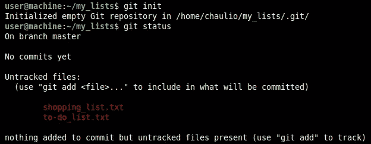
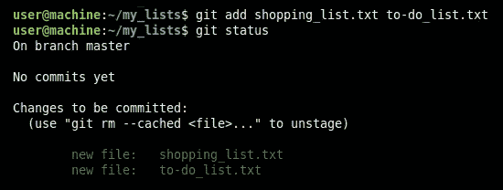
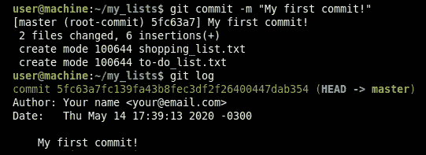
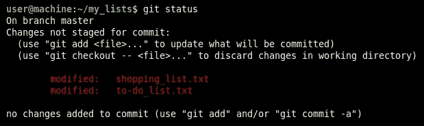
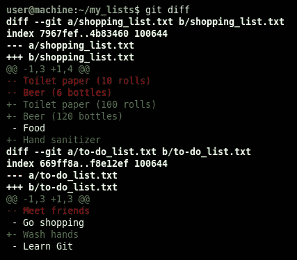
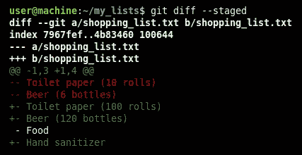
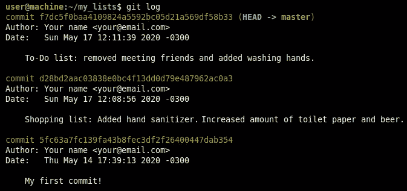

# 使用 Git 进行版本控制:不到 15 分钟即可开始

> 原文：<https://towardsdatascience.com/version-control-with-git-get-started-in-less-than-15-minutes-696b4ce7ce92?source=collection_archive---------25----------------------->

## 完全初学者的循序渐进教程。


在 [Unsplash](https://unsplash.com/?utm_source=unsplash&utm_medium=referral&utm_content=creditCopyText) 上由 [Bernd Klutsch](https://unsplash.com/@bk71?utm_source=unsplash&utm_medium=referral&utm_content=creditCopyText) 拍摄的照片。

你是否经常听说 Git(或者 GitHub ),但是不知道它意味着什么，它有什么好处，或者它是如何工作的？你来对地方了。

在本教程中，您将学习如何使用最基本的 Git 命令——在使用 Git 时，您大部分时间都需要知道这些命令。更具体地说，在这里您将学习如何为您的项目创建一个 Git 存储库，以及如何使用它来记录项目中所有未来的变更。并且完成这个教程应该花费你不到十五分钟的时间，假设你在安装过程中不会有任何问题(我希望大多数人不会有)。所以让我们开始吧。

# 版本控制？饭桶？为什么？

简而言之，Git 是一个开源版本控制系统，它允许您随时跟踪项目的变化。例如，使用 Git，您可以很容易地检查项目中每个文件在给定时间的状态，如果您愿意，甚至可以将其恢复到那个状态。这也使得管理多人同时工作的项目变得更加容易，每个人都在自己的计算机上工作。

[Git](https://git-scm.com/) 不是唯一可用的版本控制系统(其他例子: [SVN](https://subversion.apache.org/) 、 [CVS](https://www.nongnu.org/cvs/) 、 [Mercurial](https://www.mercurial-scm.org/) )，但它是现今使用最多的一个。如果你是一名软件开发人员、网页设计师、数据科学家，或者从事其他任何涉及文本文件的项目，学习如何使用 Git 对你来说肯定是一项非常有价值的技能。

# 安装和设置

在本教程中，我们将从命令行终端(在 Windows 中也称为*命令提示符*)运行 Git 命令，因此如果您已经有一些使用终端的经验，这会很有帮助。但是，如果您以前从未使用过它，也不用担心——您仍然可以遵循本教程。

## 打开终端/命令提示符

首先，让我们在您的计算机上打开一个命令行终端。根据您的操作系统，以下是一些快捷的方法:

*   Windows:按下`[⊞ Win]+[R]`，然后键入`cmd`并按回车键。
*   Linux:按`[Ctrl]+[Alt]+[T]`。
*   MacOS:按下`[Command]+[Space]`，然后输入`terminal`并回车。

## 安装 Git

我们将首先检查您的计算机上是否已经安装了 Git 如果没有，我们将安装它。在终端上键入`git --version`并按回车键。如果安装了 Git，您将看到当前安装的版本，如下图所示。如果您已经有了 Git，您可以直接跳到下一节“设置您的数据”。


如果你得到类似`git: command not found`的东西，那么你需要安装 Git。在 MacOS 上，运行`git --version`可能已经提示了一些安装说明，你只需要按照它们去做就可以了。如果不是这种情况，请根据您的操作系统遵循以下说明:

*   Windows:为 Windows 安装 [Git。](https://gitforwindows.org/)
*   Linux:在终端上运行`sudo apt-get install git`。
*   MacOS:安装 [Git for Mac](https://sourceforge.net/projects/git-osx-installer/) 。

## 设置您的个人数据

安装后，您需要配置您的姓名和电子邮件——它们将用于在您的“提交”中识别您的身份(稍后我将解释它们是什么)。为此，请在终端中使用您的个人数据运行以下两个命令:

```
git config --global user.name "Your Name"git config --global user.email "your@email.com"
```

就是这样。现在您已经准备好开始使用 Git 了！

# 创建您的第一个 Git 存储库

虽然 Git 主要由程序员使用，但它实际上可以用于任何包含一个或多个计算机文件的项目。在本教程中，您将使用 Git 来管理包含两个简单文本文件的项目:一个包含购物清单，另一个包含待办事项清单。您将用于管理这个项目的命令与您用于编程项目的命令完全相同。

## 为项目创建一个目录和一些文件

让我们从创建项目目录和其中的两个文本文件开始。在硬盘中创建一个名为`my_lists`的目录，并在其中创建两个文本文件，内容如下:

*   `shopping_list.txt`:

```
- Toilet paper (10 rolls) 
- Beer (12 bottles)
- Food
```

*   `to-do_list.txt`:

```
- Meet friends
- Go shopping 
- Learn Git
```

这将是我们项目的初始状态。

## 初始化 Git 储存库

使用终端，导航到刚刚创建的目录`my_lists`。你可以用命令`cd`来完成。如果你不知道如何使用终端导航，这里有一些说明:Windows 上的[；Linux 或 MacOS 上的](https://www.wikihow.com/Change-Directories-in-Command-Prompt)/。导航到`my_lists`之后，如果你运行`ls`(在 Linux/MacOS 上)或者`dir`(在 Windows 上)，你应该能看到你创建的两个文件。

现在，运行`git init`使您的项目目录正式成为 *Git 存储库。之后，你可以在任何时候从那个目录中运行`git status`来检查里面发生了什么。如果您现在这样做，您将看到您的存储库“还没有提交”，并且这两个文件被标记为“未跟踪”:*



## 添加新文件

要让这些文件开始被 Git 跟踪，您需要将它们“添加”到存储库中。为此，您将使用命令`git add`。这些选项中的任何一个都可以达到目的:

*   运行`git add shopping_list.txt`，然后运行`git add to-do_list.txt`，每次添加一个文件；*或*
*   运行`git add shopping_list.txt to-do_list.txt`用一个命令添加两个文件；*或*
*   运行`git add .`或`git add -A`一次性添加当前目录下的所有文件。

添加文件后，再次运行`git status`,您应该会看到如下内容:



现在，这两个文件位于所谓的“暂存区”中。这意味着这些文件将包含在您的下一次提交中。

## 你的第一次承诺

在 Git 中，*提交*是给定时间项目状态的快照。把它想象成一个将被永久保存的项目版本，这样将来你就可以很容易地看到从那时起发生了什么变化，如果你愿意，你甚至可以把项目恢复到那个状态。每次您在项目中进行重要的更改时，您都应该创建一个新的提交，这样您的工作就会记录在项目的历史记录中。

在将这两个文件添加到暂存区域之后，您可以使用命令`git commit -m "Your commit message"`创建您的第一个提交。确保总是写一个有意义的提交消息来描述什么已经改变了，因为任何检查项目历史的人都会看到这个消息。

提交后，运行`git log`。这将显示您的提交历史。此时，日志中应该只有一次提交，如下所示:



*注意:您也可以在没有* `*-m*` *选项的情况下运行命令*`*git commit*`*——这将打开一个文本编辑器，要求您输入提交消息。但是要小心，因为根据你的系统，这可能会打开一个命令行文本编辑器，如*[*vim*](https://www.vim.org/)*，如果你不知道如何使用它，那么* [*可能很难退出*](https://stackoverflow.com/questions/11828270/how-do-i-exit-the-vim-editor) *。你也可以用* `*git config --global core.editor <editor>*` *命令* [*改变默认的文本编辑器*](https://help.github.com/en/github/using-git/associating-text-editors-with-git) *。*

# 进行和提交更改

在为您的项目创建 Git 存储库之后，下一步是使用它来记录未来的变更。让我们回到我们的例子:假设您刚刚发现您所在的城市爆发了一场重大病毒，这迫使您修改了购物和待办事项列表，如下所示:

*   `shopping_list.txt`:

```
- Toilet paper (100 rolls)
- Beer (120 bottles)
- Food
- Hand sanitizer
```

*   `to-do_list.txt`:

```
- Go shopping 
- Wash hands
- Learn Git
```

## 查看您的更改

和以前一样，您可以用命令`git status`检查存储库的当前状态。这将显示 Git 已经检测到两个文件中的更改:



但是您也可以获得更多关于自从您最后一次使用`git diff`提交以来发生了什么变化的细节。这将逐行显示所有文件中所有已更改的内容:



通常，未更改的行打印为白色，而新行打印为绿色，删除的行打印为红色。请注意，被修改的行实际上显示出来，就好像旧版本已被删除，新行已被添加。

## 创建新提交

要创建一个包含这些更改的新提交，过程与创建第一个提交的过程相同:首先使用`git add`，然后使用`git commit`。

虽然您可以为两个文件中的更改创建一个提交，但是让我们为每个文件创建一个提交。首先，运行`git add shopping_list.txt`将这个文件添加到暂存区。之后，您可以使用`git diff --staged`检查哪些变更已经被添加到了临时区域。如果您现在运行`git commit`，这个命令将显示哪些更改将被提交。



如果一切都如预期的那样，那么现在通过运行`git commit`创建一个包含这些阶段化更改的新提交，就像创建第一个提交时所做的那样。同样，确保包含有意义的提交消息。之后，作为练习，您可以使用文件`list.txt`中的更改创建第三个提交。

## 全部完成！

如果您做的一切都正确，那么您的存储库中现在有三个提交。您可以使用`git log`进行检查，您应该会看到类似这样的内容:



就是这样。现在您知道了如何为您的项目创建一个 Git 存储库，以及如何为您将来的所有更改进行新的提交。一般来说，在使用 Git 的大部分时间里，您将会用到刚刚学到的这几个命令。

# 你可以做的其他事情

当然，Git 还有更多的东西——本教程的目标只是让您开始上面描述的基本工作流程。下面是您可以用 Git 做的一些其他事情的列表(包括更详细信息的链接):

*   您可以通过`git show`查看特定提交引入了哪些更改。
*   你可以用`git reset`来[撤销你所有未提交的修改](https://opensource.com/article/18/6/git-reset-revert-rebase-commands)(注意这一点)。
*   您可以使用`git revert`恢复由特定提交引入的所有更改。
*   你可以[用`git stash`暂时“隐藏”你的改变](https://git-scm.com/book/en/v2/Git-Tools-Stashing-and-Cleaning)。
*   您可以使用`git checkout`将项目恢复到旧的状态。
*   您可以使用 [Git 分支](https://git-scm.com/book/en/v2/Git-Branching-Basic-Branching-and-Merging)管理同时实现的多个特性。
*   你可以使用像 [GitHub](https://guides.github.com/activities/hello-world/) 或 [GitLab](https://docs.gitlab.com/ee/gitlab-basics/) 这样的远程 Git 平台分享你的项目和/或与其他人合作。

一般来说，你可以在像 [StackOverflow](https://stackoverflow.com/questions/tagged/git) 这样的在线论坛上找到非常有用的关于如何使用 Git 的建议。所以如果你不知道如何用 Git 做一些事情，你通常可以通过简单地在网上搜索来学到很多。

# 进一步阅读

*   Git:一个快速简单的版本控制指南，作者 Christian Leonardo。
*   [Git 和 GitHub 入门:新开发人员版本控制、项目管理和团队合作的综合指南](https://www.amazon.com/gp/product/1484253124?ie=UTF8&tag=chaulio0b-20&camp=1789&linkCode=xm2&creativeASIN=1484253124)，作者 Mariot Tsitoara。
*   对于一些其他有用的命令，查看[你应该知道的 10 个 Git 命令](/10-git-commands-you-should-know-df54bea1595c)。
*   如果你想学习如何使用 GitHub，请查看[数据科学家 GitHub 简介](/introduction-to-github-for-data-scientists-2cf8b9b25fba)。

# 更多由同一作者

[](https://medium.com/swlh/do-this-before-you-start-working-on-any-project-14fd7bfa7327) [## 在你开始做任何项目之前都要这样做

### 这是一个简单的策略，可以让你在任何项目中更有效率。

medium.com](https://medium.com/swlh/do-this-before-you-start-working-on-any-project-14fd7bfa7327) [](/the-math-behind-big-o-and-other-asymptotic-notations-64487889f33f) [## “大 O”和其他渐近符号背后的数学

### 像“大 O”、“大ω”和“大θ”这样的符号的正式定义。

towardsdatascience.com](/the-math-behind-big-o-and-other-asymptotic-notations-64487889f33f) [](https://levelup.gitconnected.com/8-ways-to-measure-execution-time-in-c-c-48634458d0f9) [## C/C++中测量执行时间的 8 种方法

### 不幸的是，没有放之四海而皆准的解决方案。在这里你会找到一些可用的选项。

levelup.gitconnected.com](https://levelup.gitconnected.com/8-ways-to-measure-execution-time-in-c-c-48634458d0f9) 

*披露:此帖子包含一个或多个来自亚马逊服务有限责任公司协会计划的链接。作为代销商，我从通过这些链接购买的商品中获得佣金，客户无需支付额外费用。*