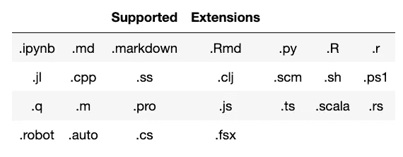
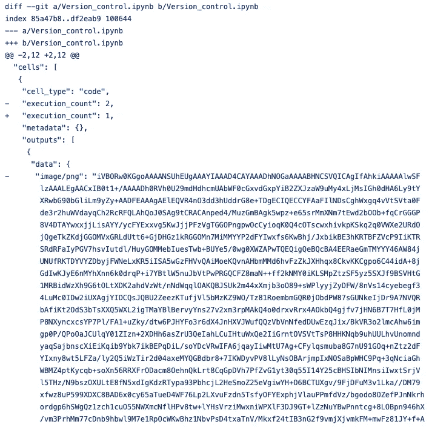

# 使用 Jupyter 笔记本进行版本控制

> 原文：<https://towardsdatascience.com/version-control-with-jupyter-notebook-b9630bc5996e?source=collection_archive---------10----------------------->

## 编程；编排

## Jupytext 分步指南


[博伊图梅洛·菲特拉](https://unsplash.com/@writecodenow?utm_source=medium&utm_medium=referral)在 [Unsplash](https://unsplash.com?utm_source=medium&utm_medium=referral) 拍摄的照片

```
**Table of Contents**[**Introduction**](#1cd1)1\. [Creating a demo repo](#a92d)
2\. [Jupytext setup](#9aab)
3\. [Converting to a python file](#b1b8)
4\. [Converting multiple files](#f3c3)
5\. [Converted file](#7ac3)
6\. [Adding ipynb to .gitignore](#3d3b)
7\. [Converting to ipynb files](#e9a8)
8\. [Other commands](#56e5)
9\. [Paired notebooks](#6b91)[**Conclusion**](#a9ad)
```

# 介绍

Jupyter notebook 生成包含元数据、源代码、格式化文本和富媒体的文件。`[git diff](https://gist.github.com/shinokada/fa5c18b1ed26eb11344b5344dc1391ac)`中一个字的改变导致成千上万个字母。

Jupytext 可以将 Jupyter Notebook 保存为 git 友好和人类友好的文件格式，包括 Markdown、Python、Julia、Bash、Clojure、Matlab、TypeScript、Javascript 等。

它还将这些文档转换成 Jupyter 笔记本。在本文中，我将使用 Jupytext 一步步地介绍 Jupyter Notebook 的版本控制指南。

> 如果你用的不是 [Github 的 ipynb 渲染](https://help.github.com/en/github/managing-files-in-a-repository/working-with-jupyter-notebook-files-on-github)、 [Nbviewer](https://nbviewer.jupyter.org/) 或者 [Binder](https://mybinder.org/) ，那么 Jupytext 应该是你版本控制的选择。

支持的扩展有:

[](https://levelup.gitconnected.com/a-painless-jupyter-notebook-code-review-and-diff-51d36d8cd20b) [## 一个无痛 Jupyter 笔记本代码审查和差异

### Jupyter 笔记本 Diff 入门

levelup.gitconnected.com](https://levelup.gitconnected.com/a-painless-jupyter-notebook-code-review-and-diff-51d36d8cd20b) [](/how-to-run-jupyter-notebook-on-docker-7c9748ed209f) [## 如何在 Docker 上运行 Jupyter 笔记本

### 不再有 Python 环境和包更新

towardsdatascience.com](/how-to-run-jupyter-notebook-on-docker-7c9748ed209f) [](/stepping-into-intermediate-with-jupyter-f6647aeb1184) [## Jupyter 用户的生产力提示

### 使用 Jupyter 笔记本和 JupyterLab 让您的工作流程更加高效

towardsdatascience.com](/stepping-into-intermediate-with-jupyter-f6647aeb1184) 

# 创建演示回购

首先，让我们用下面的代码创建一个新的 Jupyter 笔记本文件。

```
x = np.arange(-3, 3, 0.1)
y = np.sin(x)
plt.plot(x, y)
plt.show()
```

请创建一个 Github repo。

```
echo "# jupyter_notebook_version_control" >> README.md
git init
git add README.md
git commit -m "first commit"
git remote add origin [git@github.com](mailto:git@github.com):username/jupyter_notebook_version_control.git
git push -u origin master
```

我在 ipynb 文件中将“sin”改为“cos”。

```
y = np.cos(x)
```

[该链接是“git diff”的结果](https://gist.githubusercontent.com/shinokada/fa5c18b1ed26eb11344b5344dc1391ac/raw/d0a2958cd5ab5dd62ba1f68bdf19ca45cda94ba2/git_diff_1.bash)。它为三封信生成了数千封信。



# Jupytext 设置

让我们安装并设置 [Jupytext](https://github.com/mwouts/jupytext) 。

```
pip install jupytext --upgrade
```

或者对于康达用户

```
conda install -c conda-forge jupytext
```

重启 Jupyter 笔记本。

# 转换为 python 文件

您可以将 ipynb 文件转换为受支持的文件之一。我将在本文中使用一个 python 文件。

在你的终端里，你可以这样运行。

```
jupytext --to py <your-file-name>.ipynb
```

对于我的情况:

```
jupytext --to py Version_control.ipynb
```

产出:

```
[jupytext] Reading ./Version_control.ipynb
[jupytext] Writing ./Version_control.py
```

[](/7-essential-tips-for-writing-with-jupyter-notebook-60972a1a8901) [## 用 Jupyter 笔记本写作的 7 个基本技巧

### 第一篇数据科学文章指南

towardsdatascience.com](/7-essential-tips-for-writing-with-jupyter-notebook-60972a1a8901) 

# 转换多个文件

让我们一次转换所有的 ipynb 文件。请在您的目录中创建更多文件。

```
jupytext --to py *.ipynb
```

输出:

```
[jupytext] Reading Version_control.ipynb
[jupytext] Writing Version_control.py
[jupytext] Reading sine.ipynb
[jupytext] Writing sine.py
[jupytext] Reading tangent.ipynb
[jupytext] Writing tangent.py
```

您可以将文件转换成目录。如果不存在，Jupytext 将创建一个新目录。

```
jupytext --to destination_folder//py *.ipynb
```

## 注意事项:

如果您愿意，可以在其中一个单元格中运行 jupytext。但是这个单元格也会出现在转换后的文件中。

```
!jupytext --to py <your-file-name>.ipynb
```

# 转换文件

让我们在您的终端中查看转换后的文件。

```
cat Version_control.py
```

我的输出:

```
# ---
# jupyter:
#   jupytext:
#     text_representation:
#       extension: .py
#       format_name: light
#       format_version: '1.5'
#       jupytext_version: 1.3.3
#   kernelspec:
#     display_name: Python 3
#     language: python
#     name: python3
# ---

x = np.arange(-3, 3, 0.1)
y = np.cos(x)
plt.plot(x, y)
plt.show()
```

它非常紧凑，文件大小非常小。尼斯（法国城市名）😃 👏👏👏👏。

# 将 ipynb 添加到。gitignore

因为我们没有跟踪`ipynb`文件，所以我们可以将它添加到`.gitignore`文件中。请在您的项目根目录下创建一个`.gitignore`。git 目录。

```
touch .gitignore
```

请加上`*.ipynb`和`。ipynb_checkpoints `忽略所有 Jupyter 笔记本文件。或者将这个完整的列表添加到你的 gitignore 中。

```
# for Jupytext ignoring ipynb files
*.ipynb
```

在这个阶段，git 仍然会跟踪`.ipynb`文件中的变化。要解决这个问题，您需要删除 git 缓存并再次添加所有文件。

```
git rm -r --cached .
git add .
git commit -m "fixed untracked files"
```

在你的 Jupyter 笔记本上换了一行后，看看`.gitignore`是否工作。

```
# change whatever you want
y = np.arange(-2,2,0.1)
```

在您的终端中检查它:

```
git status
```

它不应该返回修改过的文件。让我们再次运行 Jupytext 来思考我们的变化。请在您的终端中运行以下程序。

```
jupytext --to py Version_control.ipynb
```

转换后的文件将被替换。😃

```
[jupytext] Reading ./Version_control.ipynb
[jupytext] Writing ./Version_control.py (destination file replaced)
```

让我们检查一下 git 状态。

```
git status

On branch master
Your branch is up to date with 'origin/master'.

Changes not staged for commit:
  (use "git add <file>..." to update what will be committed)
  (use "git checkout -- <file>..." to discard changes in working directory)

    modified:   Version_control.py

no changes added to commit (use "git add" and/or "git commit -a")
```

它只跟踪 python 文件，不跟踪 ipynb。请运行`git diff`。

```
git diff
diff --git a/Version_control.py b/Version_control.py
index 02d91ea..6522717 100644
--- a/Version_control.py
+++ b/Version_control.py
@@ -14,6 +14,7 @@
 # ---

 x = np.arange(-3, 3, 0.1)
+y = np.arange(-2,2,0.1)
 y = np.cos(x)
 plt.plot(x, y)
 plt.show()
```

请添加、提交并推送更改。

```
git add .
git commit -m "Update"
git push
```

# 转换为 ipynb 文件

我们将把这个 repo 克隆到另一个目录，并将其转换为 ipynb 文件。

```
cd ..
git clone git@github.com:shinokada/jupyter_notebook_version_control.git my-new-dir
```

我将我的 repo 克隆到一个名为 my-new-dir 的目录中。

```
cd my-new-dir
ls
README.md    Version_control.py sine.py    tangent.py
```

或者如果你有`[tree](https://formulae.brew.sh/formula/tree)`。

```
tree
.
├── README.md
├── Version_control.py
├── sine.py
└── tangent.py

0 directories, 4 files
```

我们有我们需要的所有文件。我们把它转换成 ipynb 文件吧。

从您的终端:

```
jupytext --to ipynb *.py
```

输出:

```
[jupytext] Reading Version_control.py
[jupytext] Writing Version_control.ipynb
[jupytext] Sync timestamp of 'Version_control.py'
[jupytext] Reading sine.py
[jupytext] Writing sine.ipynb
[jupytext] Reading tangent.py
[jupytext] Writing tangent.ipynbls
README.md      Version_control.py    sine.py    tangent.py.   Version_control.ipynb sine.ipynb   tangent.ipynb
```

# 其他命令

这些是您可以使用的其他命令。

```
# convert notebook.md to an .ipynb file and run it
jupytext --to notebook --execute notebook.md# update the input cells in the .ipynb file and preserve outputs and metadata 
jupytext --update --to notebook notebook.py# Turn notebook.ipynb into a paired ipynb/py notebook
jupytext --set-formats ipynb,py notebook.ipynb # Update all paired representations of notebook.ipynb
jupytext --sync notebook.ipynb
```

# 配对笔记本

Jupytext 可以将一个给定的笔记本写入多个文件。除了原始的笔记本文件之外，Jupytext 还可以将输入单元格保存到文本文件中——脚本或 Markdown 文档。如有兴趣，请阅读[更多详情](https://jupytext.readthedocs.io/en/latest/using-server.html#paired-notebooks)。

# 结论

Jupytext 易于使用并创建友好的文件，您也可以在另一个编辑器中编辑这些文件。如果你正在使用`git diff`，这是一个非常好的工具。我觉得这是目前用 Jupyter Notebook 做版本控制最完整的开源工具了。

**通过** [**成为**](https://blog.codewithshin.com/membership) **会员，可以完全访问媒体上的每一个故事。**


[https://blog.codewithshin.com/subscribe](https://blog.codewithshin.com/subscribe)

# 参考

[](/jupyter-notebooks-in-the-ide-visual-studio-code-versus-pycharm-5e72218eb3e8) [## IDE 中的 Jupyter 笔记本:Visual Studio 代码与 PyCharm

### 我每天都用 Jupyter 笔记本工作。每天我都在使用和编辑 Python 库。这两者都是我的…

towardsdatascience.com](/jupyter-notebooks-in-the-ide-visual-studio-code-versus-pycharm-5e72218eb3e8) 

*   [https://github.com/mwouts/jupytext](https://github.com/mwouts/jupytext)
*   [https://jupytext.readthedocs.io/en/latest/index.html](https://jupytext.readthedocs.io/en/latest/index.html)
*   [https://jupytext . readthedocs . io/en/latest/introduction . html # demo-time](https://jupytext.readthedocs.io/en/latest/introduction.html#demo-time)

你好。你坚持到了最后。既然你来了，请帮我传播这篇文章。你也可以关注我，获取更多的 Jupyter、统计和技术文章。

[](https://medium.com/series/jupyter-hacks-and-tips-1b1a3a10bc79) [## Jupyter 的技巧和窍门

### Jupyter 技巧和提示的集合

medium.com](https://medium.com/series/jupyter-hacks-and-tips-1b1a3a10bc79)