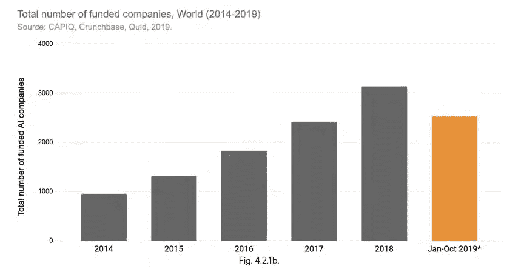
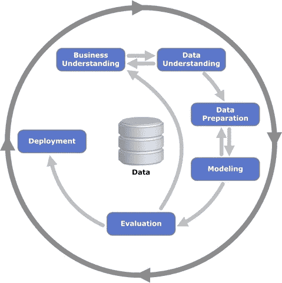
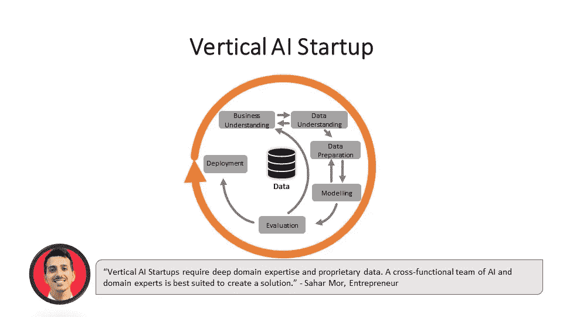
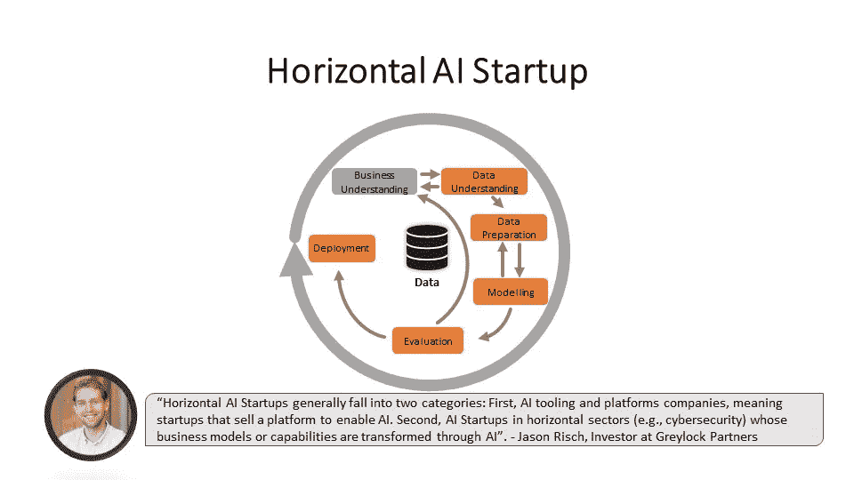
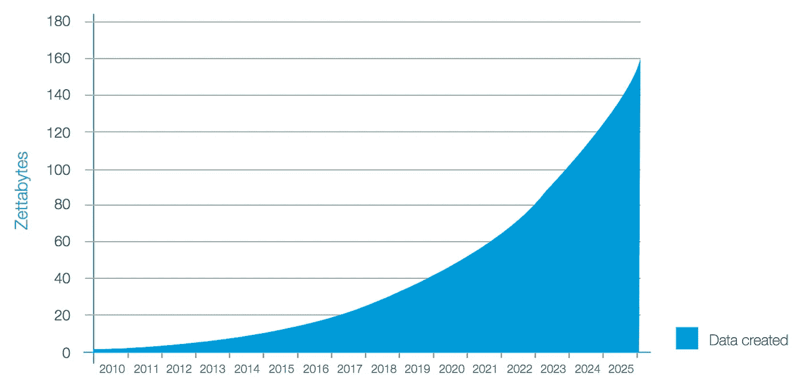
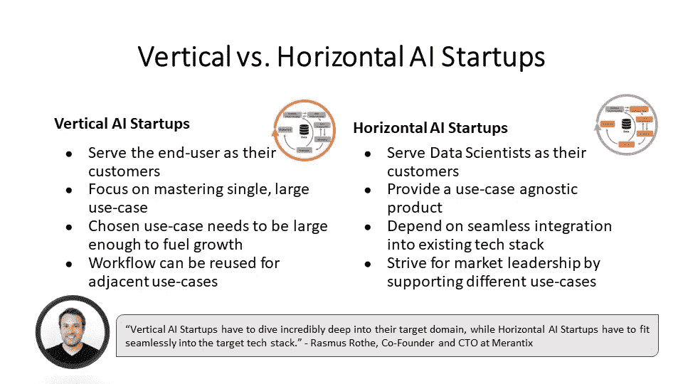

# 垂直与水平人工智能初创公司

> 原文：<https://towardsdatascience.com/vertical-vs-horizontal-ai-startups-e2bdec23aa16?source=collection_archive---------27----------------------->

## 人工智能初创公司有两种截然不同的风格。无论选择哪一种，都要记住什么。

初创公司继续快速涌现。根据[斯坦福人工智能指数](https://hai.stanford.edu/sites/default/files/ai_index_2019_report.pdf)，自 2014 年以来，超过 15798 家人工智能初创公司获得了至少 40 万美元的投资。根据 [CB Insights](https://www.cbinsights.com/research/report/ai-in-numbers-q2-2019/) 的说法，人工智能初创公司在 2019 年也吸引了创纪录的 266 亿美元投资。鉴于预计的数据指数级增长，投资者和企业家都渴望通过人工智能产生影响。

来源:[斯坦福人工智能指数，](https://hai.stanford.edu/sites/default/files/ai_index_2019_report.pdf)第 88 页

然而，并不是所有的人工智能初创公司都是平等的。本文考察了垂直和水平人工智能创业公司之间的差异和共性。这些见解是基于与人工智能专家的讨论，他们来自一家总部位于硅谷的风投公司、一家总部位于柏林的人工智能风险工作室和一位人工智能企业家。

要了解垂直和水平的 AI 产品，我们先来深入 AI 产品开发的话题。

# 开发人工智能产品

每个基于人工智能的产品都遵循大致相同的工作流程。对于每个机器学习项目，团队必须收集和准备数据，开发模型，部署并监控其性能。 [CRISP-DM](https://en.wikipedia.org/wiki/Cross-industry_standard_process_for_data_mining) 模型描述了下面的机器学习工作流程。

资料来源:德累斯顿大学

理解数据科学工作流程对于区分垂直和水平人工智能初创公司非常重要。垂直人工智能初创公司完成整个工作流程来交付产品，而水平人工智能初创公司则专注于实现一般的数据科学工作流程。

# 垂直人工智能初创公司

垂直人工智能初创公司提供基于人工智能的产品，拥有整个工作流程来解决非常有针对性的客户需求。这些初创公司从端到端开发一个完整的产品，从理解商业案例开始，到监控产品性能。

[Vara](https://www.varahealthcare.com/) 举例来说，它是一家垂直 AI 初创公司，可以在 x 光片上识别乳腺癌。Vara 是第一家获得联邦批准使用其人工智能解决方案来协助放射科医生的公司。该公司是垂直人工智能公司的一个主要例子，该公司完成了完整的数据科学工作流，以提供创新的人工智能产品。

[国立癌症研究所](https://unsplash.com/@nci?utm_source=unsplash&utm_medium=referral&utm_content=creditCopyText)在 [Unsplash](https://unsplash.com/?utm_source=unsplash&utm_medium=referral&utm_content=creditCopyText) 上拍摄的照片

人工智能是一种强大的工具，可以帮助公司在特定任务上实现超人的性能。人工智能为交付新产品、改进现有产品或自动化任务开辟了新的可能性。垂直人工智能初创公司针对特定的用例优化他们的预测。如果他们成功了，他们在这个用例中会比人类或竞争对手表现得更好。

> 垂直 AI 创业公司包括产品角色等关键岗位的领域专家。例如，制造自动化癌症检测产品的公司很可能拥有内部放射学家和/或肿瘤学家。——[萨哈尔·莫尔](https://www.linkedin.com/in/sahar-mor/)，隐形模式下的企业家

然而，垂直人工智能初创公司更难调整他们的产品来服务于相邻的用例。对于擅长识别乳腺癌的 Vara 来说，将任务切换到检测脑癌并不是一件小事。人工智能模型在其狭窄的任务中表现良好。Vara 可以训练一个新的人工智能模型，从新的数据集中检测脑癌，但仍然可以重用他们现有的模型开发管道。

> 在 10 年内，垂直人工智能初创公司将极大地改变我们在某些职业中的工作方式。—[Merantix 的联合创始人兼首席技术官 Rasmus Rothe](https://www.linkedin.com/in/rasmusrothe/)

垂直人工智能初创公司的其他例子有无人驾驶汽车公司 [Waymo](https://waymo.com/) 和金融犯罪预防公司 [hawk.ai](https://hawk.ai/en/) 。总而言之，对于垂直人工智能初创公司来说，最重要的是专注于解决一个足够大的用例，以确保增长。因为为新用例训练新模型需要时间和数据，所以最初的用例必须有足够的影响力来支持一个盈利的公司。

接下来我们来评价一下横向 AI 创业公司的具体情况。

# 横向 AI 公司

一个横向的 AI 公司使数据科学家能够更高效地完成数据科学工作流程。因此，横向 AI 创业公司的客户一般是数据科学家或开发团队。

横向 AI 公司挑选数据科学工作流程的特定或多个部分，并对其进行改进。例如，一家横向人工智能公司可以专注于帮助数据科学家监控他们的模型。横向 AI 产品是用例不可知的，用于开发任何基于 AI 的产品。

[土星云](https://www.saturncloud.io/?utm_source=Jan&utm_medium=Blog)是一家横向 AI 初创公司，旨在让数据科学家更加有效。它提供完全托管的服务，使数据科学家能够使用他们最熟悉的工具(Python、Jupyter 和 Dask)进行大规模工作。该工具是通用的，因此它可以用于任何基于人工智能的产品。

> *“在几十个行业中，我们听到自动化数据科学工作流如何为他们的最终客户带来更高效的团队和更好的体验。与此同时，Python 的使用正在飙升，并迅速主导了数据科学领域，因此采用一套 Python 原生工具进行分析和自动化对大多数数据团队来说是有意义的。”*——Hugo Shi，[土星云](https://www.saturncloud.io/?utm_source=Jan&utm_medium=Blog)的联合创始人，也是 Anaconda 的前创始人。

根据 IDC 的预测，随着数据量的指数增长，横向人工智能解决方案有望在未来变得更加有用。数据是人工智能产品的燃料，因此可用的数据越多，创造有价值的数据产品的潜力就越大。此外，数据科学家市场继续稳步增长。根据 IBM 的一项[研究，2020 年美国对数据科学家的需求将增长 28%，达到 270 万人。因此，目标客户群继续增长。](https://www.ibm.com/downloads/cas/3RL3VXGA)

资料来源: [IDC](https://www.idc.com/getdoc.jsp?containerId=prUS45213219)

但是，横向的 AI 产品也面临挑战。他们必须无缝集成到目标数据科学工作流和软件堆栈中。此外，“在开发横向人工智能产品时，争取市场领先地位很重要”，拉斯穆斯·罗斯说。对于横向人工智能初创公司来说，很难收集专有数据，从而建立数据防御。当定义数据科学工作流的哪个步骤要自动化时，记住不同的基于人工智能的模型的不同要求是很重要的。专注于对目标群体最有价值的功能，将使有志于成功的横向人工智能创业公司与众不同。

> 尽管横向人工智能公司通常面临更多竞争，但它们的产品通常更容易被收购，因为其技术可以被更广泛的收购者收购。— [杰森·里施](https://www.linkedin.com/in/jasoncrisch/)

横向人工智能初创公司的其他例子有数据标签公司 [understand.ai](https://understand.ai/) ，以及数据科学工作流管理初创公司 [neptune.ai](https://neptune.ai/) 。横向人工智能创业公司的潜力是巨大的。然而，构建一个超越竞争对手并达到市场领先地位的工具是具有挑战性的。一旦你给很多数据科学家提供了价值，你的横向 AI 创业就成功了。

# 垂直与水平人工智能初创公司

人工智能创业公司是不同的，理解他们独特的价值主张是建立一个成功的人工智能公司的核心。垂直 AI 创业公司交付产品，而水平 AI 创业公司则赋能 AI 产品创作。两种创业类型的 t 型组合也存在，但会在另一篇文章中讨论。

了解你正在建立的人工智能初创公司的类型很重要，因为这将最终影响你的产品路线图。

*   垂直人工智能初创公司需要专注于解决一个足够大的单一用例，以维持一个不断增长的公司
*   横向人工智能初创公司需要在他们选择的利基市场达到市场领先地位，为许多数据科学家提供价值

感谢您的关注！看完这篇帖子，你对垂直和水平 AI 创业公司的特点有了更深入的了解。如果你想听更多关于商业、项目管理和数据科学的交集，**在 [Medium](https://medium.com/@janzawadzki) 、 [LinkedIn](https://www.linkedin.com/in/jan-zawadzki/) 或 [Twitter](https://twitter.com/janmzawa) 上关注** me。