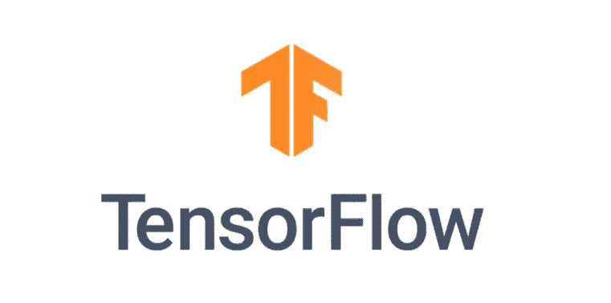
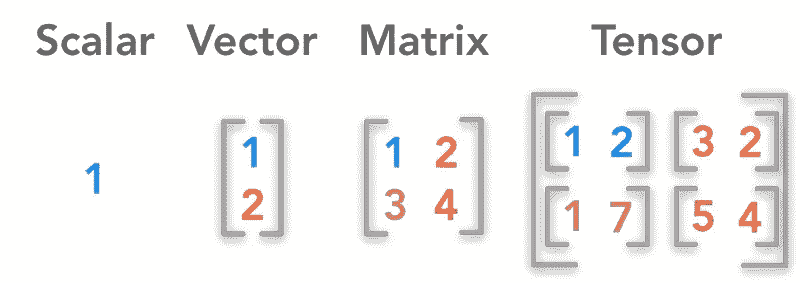
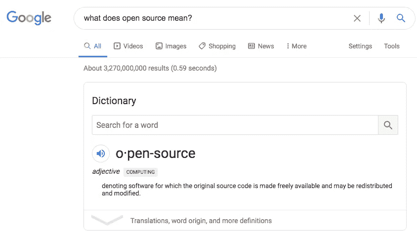
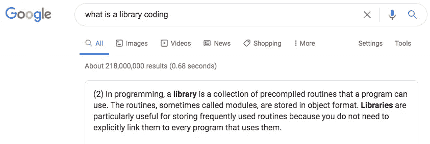

# 振动出张量流

> 原文：<https://towardsdatascience.com/vibing-out-tensorflow-e91c04cc3872?source=collection_archive---------65----------------------->

## 为数据科学家设计的张量流。

我们都知道，业界对合格的数据科学家有着巨大的需求。那么，我们如何向学生展示数据科学的世界呢？

我认为对学生来说，从一开始就了解行业标准工具很重要，这有助于塑造他们学习和思考问题的方式。

考虑到这一点，我想考虑学生如何在没有动手机器学习经验的情况下开始学习这些工具，而在第一次遇到这些工具时，动手机器学习经验通常是假定的知识。

因此，我想写一个例子，说明一个学生如何在没有经验的情况下开始研究某些工具。

今天，我选择做一个高层次的，面向学生的概述…

[图像来源](https://www.tensorflow.org/)

让我们首先从理解名字开始: *TensorFlow。*

> 张量

为什么 TensorFlow 的名称中包含了“张量”？

简单来说，张量是一个 n 维物体。含糊不清？让我分享一个我在学习张量时发现很有帮助的形象化:

[图片来源](https://hadrienj.github.io/posts/Deep-Learning-Book-Series-2.1-Scalars-Vectors-Matrices-and-Tensors/)

我想我们大多数人对标量是什么有一个相当直观的理解(一个数！)甚至向量和矩阵，但是从上面的图像看不清楚的是，所有这些东西都是不同维度的张量！

所以，一般来说，张量就像一个矩阵，但它不只是必须有行和列，它还可以有深度(通道)和更多深度(我们无法形象化)！

这意味着我们可以有一个对象存储对 *n* 特征*的引用。这是机器学习中经常出现的东西，尤其是张量，在深度学习中具有重要作用。*

有趣的是，TensorFlow 允许你以同步的方式处理机器学习和深度学习(神经网络)模型和算法，所以你可以开始看到这个名字的“张量”部分来自哪里。

> 流动

正如我稍后将触及的更多内容，TensorFlow 是一个工作流工具，它将一系列行业标准工具联系在一起，以便部署无缝的机器学习和深度学习项目。

简而言之，TensorFlow 给你你的机器学习*流程*。

> [“tensor flow 是**机器学习**的端到端**开源**平台。它有一个全面、灵活的**工具生态系统**、**库**和**社区资源**，让研究人员推动 ML 的最新发展，让开发人员轻松构建和部署 ML 驱动的应用。”](https://www.tensorflow.org/)

这是从 TensorFlow 网站复制粘贴的官方描述。

让我们打破这种描述，不要假设任何知识:

> “TensorFlow 是一款端到端的**开源软件—**

> 等等——“开源”是什么意思？？

好吧，既然这样，让我们磨练另一项关键的数据科学技能:

谷歌搜索是学生现在需要练习的技能。

感谢谷歌！所以“开源”是技术社区中广泛使用的一个短语，意思是让任何人都可以贡献和分发代码。

说到 Google，TensorFlow 是 Google Brain 团队打造的！

> W 谷歌为什么要让 TensorFlow 开源？

嗯，与大多数开源项目一样，由于**而不是**是开源的，TensorFlow 将使自己处于巨大的劣势，因为竞争对手的深度学习框架，如 Theano、Keras 和 PyTorch 都是开源的。

它本质上允许 TensorFlow 从世界上一些最优秀的头脑中获得免费输入，以保持他们在最先进的技术上的竞争力。(不要担心，TensorFlow 对采用什么样的贡献有最终决定权，这样世界上最糟糕的想法也不能添加狗 sh * t——这就是开源项目的本质)。

就像我们描述的那样…

> …用于**机器学习的平台—**

> 好吧，好吧，我**知道**我正在努力成为一名数据科学家，但是……实际上*什么是*机器学习？！

为了节省冗长的讨论…

具有讽刺意味的是，现在我已经向谷歌问了所有这些问题，我将在接下来的 4 周内看到机器学习课程的广告…机器学习(和 TensorFlow！！)在它最好的时候。

请注意机器学习和人工智能之间的区别。这两个术语经常互换使用，但正如你在这里看到的，机器学习实际上是人工智能的一个应用——但我们将在另一篇博客文章中讨论这个问题。

> 它[TensorFlow]拥有一个全面、灵活的**工具生态系统**、**库**和**社区资源—**

> 工具生态系统？图书馆？社区资源？

这有点像潘多拉的盒子，通常会突出更多需要学习的工具。但目前，我们可以理解为一个数据科学家使用了很多不同的软件工具，从清理和处理数据到开发和训练机器学习的模型。

TensorFlow 通过创建一个用户友好的框架来使用 Python、JavaScript 或 Swift 训练模型，从而帮助数据科学家导航这一工作流。然后，它让我们选择如何部署我们的工作——是在云中、在浏览器中还是在我们的设备上。点击查看更多相关信息[。](https://www.tensorflow.org/learn)

社区资源符合开源环境的本质。TensorFlow 还通过 GitHub 和 Stack Overflow 提供大量关于如何最好地使用其平台的教程和资源，以及社区论坛和帮助请求。你可以在这里看到更多关于这个[的内容。](https://www.tensorflow.org/community)

图书馆。如果你以前没有遇到过图书馆或者从来不知道它们是什么—

所以简单地说，库只是一个函数的集合，这些函数做我们一直需要做的事情。

有一个编码原则，如果你一遍又一遍地写同样的代码，你可能需要把它放到一个函数中。记住这一点，把库想象成人们反复编写的所有函数，最后，有人想“如果我需要这个函数，其他人可能也需要这个函数”。

显然，数据科学家的工作中有非常重复的部分，因此有许多包含执行这项工作所需的所有功能的库。[这里的](https://www.tensorflow.org/resources/libraries-extensions)是一些可以通过 TensorFlow 轻松访问的库和扩展。

> …这使得研究人员可以推动 ML 的最新发展，开发人员可以轻松构建和部署 ML 支持的应用程序。"

虽然我们可能还没有任何机器学习的经验**，**但我们现在知道，当时机成熟时，我们有像 TensorFlow 这样的平台随时准备支持我们的努力。

随着你对这个行业和机器学习本身了解的越来越多，TensorFlow 的用途和应用会越来越明显。但总而言之，TensorFlow 是一个平台，它将许多其他行业标准工具联系在一起，创建一个工作流，使我们能够部署端到端的机器学习项目。

我鼓励你继续搜索并比较其他平台，如 PyTorch、Keras 和 Theano。最终，你将能够对你最喜欢使用哪些工具形成自己的看法。

> 快乐学习！