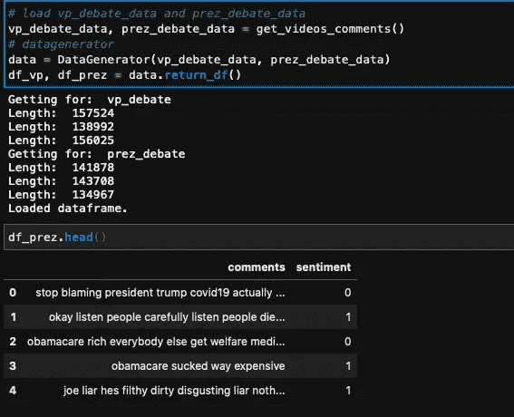
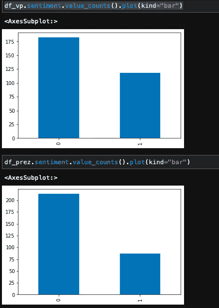
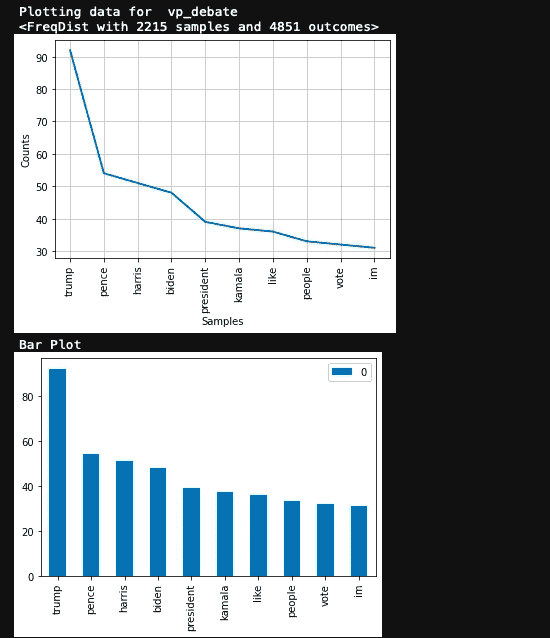
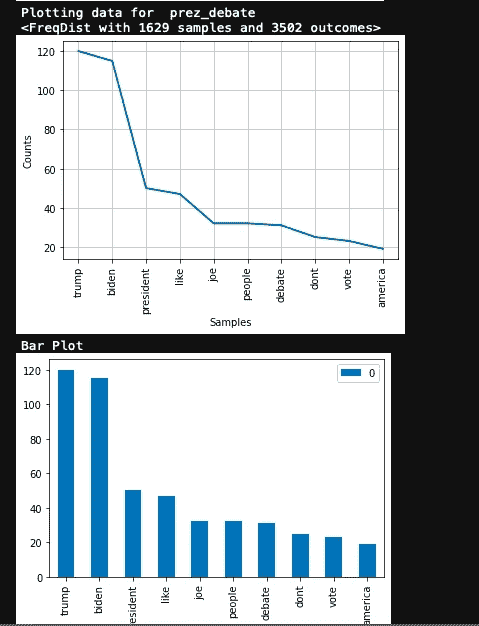
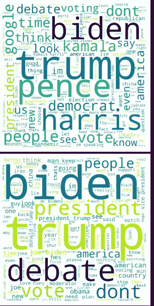
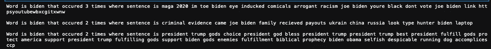

# 使用数据科学分析副总统和总统辩论

> 原文：<https://towardsdatascience.com/vice-presidential-and-presidential-debate-analysis-using-data-science-61d542f0c974?source=collection_archive---------29----------------------->

## 使用数据科学的辩论分析:使用 YouTube 评论发现选民的真实意图


[图像来源](https://unsplash.com/photos/5DDYHjk_KMU)

# I 简介

> 我相信数据科学让我以我从未想象过的方式表达我的好奇心。数据科学中最酷的事情是，我不是将数据视为数字，而是将数据视为**机会**(业务问题)**洞察力**(预测建模、统计和数据争论)，以及**改进**(指标)。带着这个想法，我决定**分析一下 VP 和总统辩论的 YouTube 评论。**

在从新闻来源得到混杂的结果后，我想用数据科学来分析副总统和总统的辩论。
我们的想法是使用 YouTube 评论作为媒介，获取关于辩论的情绪，并从数据中获得见解。在这个分析中，我们**绘制常用短语**、**常用词**，我们还**分析情绪**，最后，我向我所有的数据科学从业者展示了一个**完整的数据集，其中包含了 YouTube 上副总统的评论和总统辩论**。

# 如何以及为什么

hy:在从新闻来源获得关于辩论结果的混合结果后，我决定使用数据科学来帮助我看到结果的结果。随着选举的临近，技术或者更准确地说是分析在塑造我们的思想和支持我们的假设方面发挥了关键作用。

为了分析 YouTube 评论，我们使用 Python 和其他各种 NLP 库，然后使用一些数据可视化工具。我们将使用被称为熊猫的令人敬畏的数据争论图书馆的奇迹，我们希望找到一些有趣的见解。

# 要求

对于这个项目，我们要求:

*   Python 3.8
*   熊猫
*   sci kit-学习
*   Numpy
*   海生的
*   NLTK
*   Wordcloud
*   文本 Blob

# 数据集的创建

数据集包含 YouTube 上关于最受欢迎/最受关注的副总统和总统辩论的评论。我们使用 YouTube 数据 API 来获得所有评论(由于大小限制，我们每个视频只能获得 100 条评论)。这些视频是作者经过仔细审查挑选出来的，准确地说，我们关注的是最高浏览量和最高 YouTube 评论数。

```
def clean_text(string):
    string = re.sub(r'[^\w\s]', '', string) 
    return ''.join(i for i in string if ord(i) < 128)def remove_stopwords(string):
    stop_words = set(stopwords.words('english')) 
    word_tokens = word_tokenize(string) 
    filtered_sentence = [w for w in word_tokens if not w in stop_words] 
    filtered_sentence = [] 

    for w in word_tokens: 
        if w not in stop_words: 
            filtered_sentence.append(w)return ' '.join(filtered_sentence)
```

> 这些函数定义了文本的清理和停用词的删除。

## YouTube 评论提取

下面的函数定义了我们丢弃的 video _ ids 和一些基本的提取代码。我们以 JSON 的形式获取数据，然后执行预处理，最后将所有评论和情感评分(使用 TextBlob)组合成一个数据帧。

```
video_ids = {"vp_debate":['65twkjiwD90','t_G0ia3JOVs','xXE6I3gWiMc'], "prez_debate":[
                                                                         'yW8nIA33-zY','wW1lY5jFNcQ','K8Z9Kqhrh5c']}video_id = "&videoId="
content = Nonedef extract_comments(resp):
    """
        Get comments from the resp (json) yt comment
    """
    com = []
    for i in resp['items']:
        com.append(i['snippet']['topLevelComment']['snippet']['textOriginal'].lower())
    return comdef get_videos_comments():
    """
        Extract video comments and store in the arrays
    """
    vp_debate_data = []
    prez_debate_data = []
    for i,j in video_ids.items():
        print("Getting for: ",i)
        for id in j:
            video_id = "&videoId=" + id
            resp = requests.get(URL+video_id)

            print("Length: ",len(resp.content))
            content = resp.json()
            comments = extract_comments(content)
            if i == "vp_debate":
                vp_debate_data.extend(comments)
            else:
                prez_debate_data.extend(comments)
    return vp_debate_data, prez_debate_data
class Comment:
    def __init__(self, text):
        self.text = remove_stopwords(clean_text(text))
        # set threshold as 0.5
        self.sentiment = 0 if TextBlob(self.text).sentiment.subjectivity <= 0.5 else 1
    def return_comment(self):
        return selfclass DataGenerator:
    def __init__(self, vp_debate_data, prez_debate_data):
        self.vp_data = {"comments":[], "sentiment":[]}
        self.prez_data = {"comments":[], "sentiment":[]}
        for i in vp_debate_data:
            c = Comment(i)
            self.vp_data['comments'].append(c.text)
            self.vp_data['sentiment'].append(c.sentiment)
        for i in prez_debate_data:
            c = Comment(i)
            self.prez_data['comments'].append(c.text)
            self.prez_data['sentiment'].append(c.sentiment)
        self.df_vp = pd.DataFrame(self.vp_data)
        self.df_prez = pd.DataFrame(self.prez_data)
    def return_df(self):
        print("Loaded dataframe.")
        return self.df_vp, self.df_prez

    # return corpus given the debate key
    # to be used for getting the commonkeywords and plotting
    def get_corpus(self, key="vp_debate"):
        corpus = []
        if key == "vp_debate":
            corpus = [i for i in self.vp_data['comments']]
        else:
            corpus = [i for i in self.prez_data['comments']]  

        return corpus
```



我们数据的预览

# 分析

在检查数据时，我们首先将单词小写，然后去掉所有的标点符号，最后去掉所有的停用词。我们使用流行的文本块(【https://textblob.readthedocs.io/en/dev/】)来执行快速情感分析。



代表评论情感分析的条形图。

> 这些数据并没有提供太多的信息，但是如果我们试着用特定的词来分类或分组，那么我们可以得到更好的理解。

# 最常见的单词

我们找到每场辩论中最常见的单词(即 df_vp 和 df_prez)。我们使用称为 NLTK 的流行包来获取最常见的单词(经过预处理)

```
def most_common(corpus):
    fd = nltk.FreqDist(corpus)
    print(fd)
    fd_t10=fd.most_common(10)
    counter = dict(fd_t10)
    # pd.Dataframe from dict to show bar plot
    df = pd.DataFrame.from_dict(counter, orient='index')
    names, values = zip(*fd_t10)
    # plot method 1
    fd.plot(10)
    # plot method two
    print("Bar Plot")
    df.plot(kind='bar')
```



副总统辩论视频中的词频分布



总统辩论视频中的词频分布

> 正如你在总统辩论视频中看到的，最常见的词是“特朗普”和“拜登”。

# WordCloud

> 词云或标签云是词频的图形表示，对在源文本中出现频率较高的词给予更大的重视。视觉效果中的单词越大，该单词在文档中就越常见。

```
def plot_wordcloud(kind="vp_debate"):
    words = get_word_list(kind)
    wordcloud = WordCloud(width = 800, height = 800, 
                background_color ='white', 
                min_font_size = 10).generate(' '.join(words))
    plt.imshow(wordcloud) 
    plt.axis("off") 
    plt.tight_layout(pad = 0) 
    plt.show()
```



vp _ 辩论和 prez _ 辩论的词云表示

# 查找关键词:搜索特定单词的独特方式。

这个特性可以找到指定的关键字(最多前 10 个单词)。它作用于每个句子。

```
def find_keywords(word, df):
    """
        Find the specified keyword (most prob top 10 words)
        Acts on each sentence
        Add to the corresponding dataframe
        Returns: DataFrame

        Used inconjunction with get_most_common_words()

    """
    for i in df.comments:
        if word in i.split():
            c = Counter(i.split())
            if c[word] >= 2:
                print(f'Word is {word} that occured {c[word]} times where sentence is {i}\n')
[@interact](http://twitter.com/interact)(keyword="biden", debates=['vp_debate','prez_debate'])
def run(keyword, debates):
    df = None
    if debates == "vp_debate":
        df = df_vp
    else:
        df = df_prez
    find_keywords(keyword,df)
```



输出的一瞥。(提供演示)

# 结论

我们看到，通过使用数据科学，我们能够收集关于数据的有趣见解。我们当然可以通过使用更好的情感分类器和测试不同的假设来改进我们的工作。我们也可以使用 n-grams 并比较它们的频率。

试试这里:https://gesis . my binder . org/binder/v2/GH/aaditkapoor/debate analysis/main dataset 这里:[http://www . ka ggle . com/dataset/43532333d 82042 a 1287 e 00672 b 86 a2 c 76 e 76 ffbc 4d 85569715309714635172 b 0](http://www.kaggle.com/dataset/43532333d82042a1287e00672b86a2c76e76ffbc4d85569715309714635172b0)