# 视频通话数十亿无互联网

> 原文：<https://towardsdatascience.com/video-calling-for-billions-without-internet-40d10069c464?source=collection_archive---------32----------------------->

## 通过蜂窝电话呼叫进行可靠的视频通话和屏幕共享

图片来自 iStockphoto，授权给 P.K. Mishra

本博客中表达的观点和意见纯属我个人的观点和意见，并不代表我现在或过去雇主的官方立场。

上个周末，我看到一篇新闻文章提到[数百万印度学生被困在家里，既不能上网，也不能接受在线教育](https://www.newindianexpress.com/cities/bhubaneswar/2020/may/17/rural-odisha-no-state-for-online-education-2144400.html)。事实上，超过一半的世界人口仍然没有任何互联网连接。虽然这种数字鸿沟已经在美国显现出来，特别是在冠状病毒疫情封锁期间的儿童教育方面，但亚洲和非洲的问题要严重得多，那里只有不到五分之一的人连接到互联网。

由于在全球范围内实施封锁，许多成人和儿童被排除在在线教育和远程保健之外。

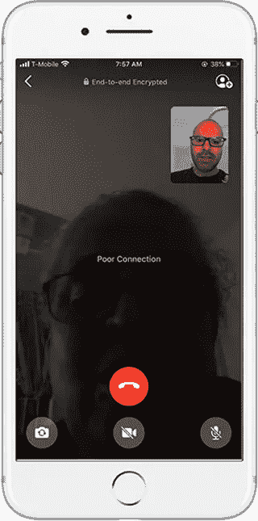

WhatsApp 视频通话

尽管上面提到了五分之一的统计数据，但实际上问题更严重。即使对那些能上网的人来说，价格也很高，而且带宽有限。例如，在与我在印度的父母交谈时，他们经常在配额期之前用完分配给他们的 4 GB，此后带宽被节流:**停滞的帧、断断续续的音频、令人痛苦的延迟和最终的断开，以及随后的重试是正常现象，但仍然可以说比正常的电话交谈好得多，因为我可以“看到”它们。**

当安德鲁·斯图亚特解释说视频通话更有利于人们的心理健康时，我明白了。但是，[视频通话通常需要 2 Mbps 的速度提升和 2 Mbps 的速度下降，就像 Zoom](https://support.zoom.us/hc/en-us/articles/204003179-System-Requirements-for-Zoom-Rooms#h_b48c2bfd-7da0-4290-aae8-784270d3ab3f) 的情况一样，许多人都无法享受这一特权。

为了解决这个问题，我提出了一种新的方法，这种方法基于这样一种认识，即如果我们愿意放弃一些面部和屏幕的现实主义或逼真的渲染，那么可以为超低带宽导出一个全新的面部和屏幕表示世界，并具有可接受的体验质量。

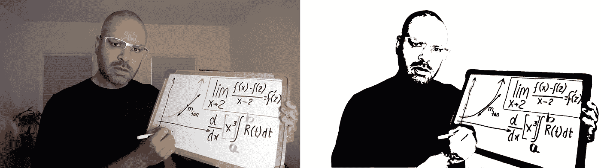

本文探讨了这样的表示和方法，它们将所需的带宽从正常的 2 Mbps 降低到 1.5 Kbps，允许视频与电话音频一起编码，而音频质量的下降最小。所提出的解决方案可以主要实现为软件，而不需要改变底层基础设施。这反过来会更便宜，并允许目前因支付能力而被边缘化的人接入互联网。

# 移动电话与互联网

*如果你确信手机通话比 VoIP 通话更可靠、更快捷、更好，你可以跳过这一部分*

从轶事经验来看，很明显，蜂窝电话呼叫在许多属性上通常比视频呼叫更可靠，例如延迟、掉线、易于使用、呼叫质量变化最小以及长途选项。

像 Google Meet、Discord、Gotomeeting、Amazon Chime 和潜在的脸书这样的视频电话提供商使用一种叫做 [WebRTC](https://webrtc.org/) 的协议，这种协议可以实现两方或多方之间的实时通信。WebRTC 还依赖于一种称为用户数据报协议的互联网协议，该协议提供了快速的数据包传递，但提供的保证较差，导致一些数据包要么没有到达，要么没有按顺序到达，从而导致帧丢失和抖动(对等点之间数据包流的延迟变化)。较新的机器学习技术，如在 Google Duo 中使用 WaveNetEq，提高了音频质量，但视频质量变化仍未解决。

另一方面，虽然蜂窝电话呼叫也越来越多地基于分组，但工程师们已经找到了通过不断确保严格的质量标准和巧妙的带宽管理来提高分组交换手机网络效率的方法。蜂窝电话工作良好的另一个原因是音频所需的带宽比视频低得多。此外，编码标准已经发展了几十年，允许人脑填补空白。我将最终证明，互联网视频通话的许多目标，如双向视频通话、多方视频广播和直播事件、屏幕共享、体验质量的 A/B 测试(QoE)⁷)也可以通过蜂窝电话实现。然而，在本文的其余部分，我们将只关注双向视频通话，以便做好准备。

# 架构:电话视频

教育视频的主要目标是获得最小的视频表示，优先考虑信息传输(例如白板、草图)，其次是人类动作(例如指点、书写)和表情(例如嘴唇、眉毛)，*，同时排除*干扰元素，例如背景、面部的无表情元素，以及恼人的视频呼叫元素，例如定格、可变帧速率等。**另一个架构目标是优先考虑具有低延迟和低抖动(平滑和一致)以及高音频质量的可靠帧速率。**

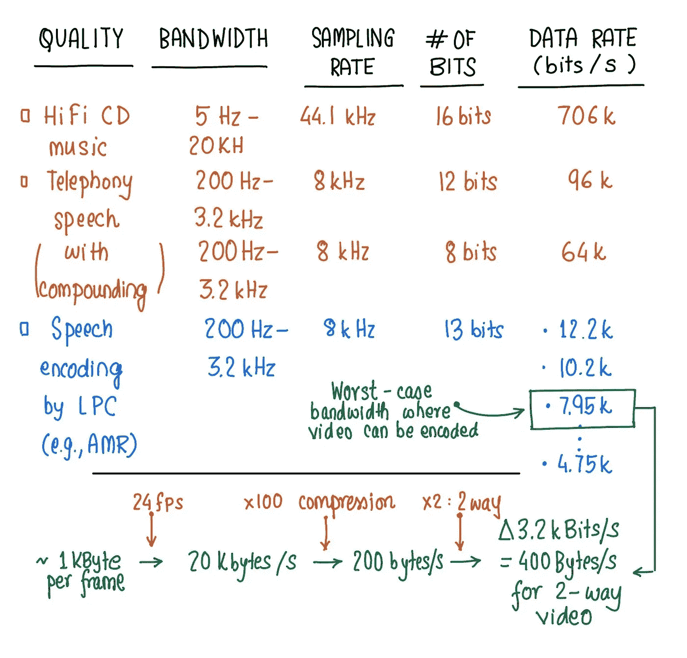

可用于视频通话的绝对最差(最低)带宽的信封背面计算

在任何电话呼叫中，人类对延迟的容忍度最多为 200 毫秒。对于电话呼叫，所有的数据包都无关紧要，因为编码方案非常复杂，即使一些数据包丢失，呼叫者仍然可以听到。复杂的方案可以处理基于可用带宽自适应调整的多种传输速率。因此，[自适应多码率编解码器](https://en.wikipedia.org/wiki/Adaptive_Multi-Rate_audio_codec) (AMR)大行其道。AMR 编解码器使用八种源编解码器，比特率分别为 12.2、10.2、7.95、7.40、6.70、5.90、5.15 和 4.75 Kbps。对于我们的分析，我们选择 7.95 Kbps 作为最差情况分析。假设帧率为每秒 24 帧，视频压缩比为 100 (H.264 有损视频压缩可高达 200)，**我们得到一个大约 1kb/帧的未压缩目标作为信封背面计算。假设音频传输速率为 7.5 kbps，其中 3.2 kbps 分配给双向视频传输，4.75 kbps 分配给音频传输。**如果我们要达到这个最坏情况的设计目标，我们肯定可以做得更好。

## **视频捕捉**

第一步是拍摄视频。对于我的原型，我以每秒 24 帧的速度捕捉了 640x480 帧大小的视频，因为这个频率对于获得美学电影般的运动特征来说已经足够好了。

## **接近真实的视频表现**

我尝试了不同的视频格式，但我决定采用二值图像(每个像素不是黑就是白)格式，使用[简单的全局阈值](https://opencv-python-tutroals.readthedocs.io/en/latest/py_tutorials/py_imgproc/py_thresholding/py_thresholding.html)来获得下面的视频。还有其他可用的二级阈值技术，如自适应均值阈值和自适应高斯阈值，后者噪声较小，但我喜欢将高级视频处理推迟到分割之后，因为我认为最好优先处理某些区域(如面部、白板)，而不是全局方法。如果神经计算在发送方是不可能的，那么一个简单的全局阈值可能会起作用。

使用 OpenCV 以 24fps 的简单二值阈值视频

我还试验了 ASCII 渲染格式，如下图所示。

使用 iDevelop Github 提供的 HTML5 getUserMedia API 的 Ascii 视频表示:【https://github.com/idevelop/ascii-camera 

此外，我尝试了[神经风格转移](https://www.pyimagesearch.com/2018/08/27/neural-style-transfer-with-opencv/)技术，使用基于 paper⁶的示例代码[和由](https://app.monstercampaigns.com/c/tortsem7qkvyuxc4cyfi) [Justin Johnson](http://cs.stanford.edu/people/jcjohns/) 、 [Alexandre Alahi](http://web.stanford.edu/~alahi/) 、[李飞飞](https://medium.com/u/7a81f3024ce?source=post_page-----40d10069c464--------------------------------)提供的 [Github 代码](https://github.com/jcjohnson/fast-neural-style)，但最终我出于完全实用的原因决定追求二值图像。

## **视频语义分割**

这里的核心思想是，我们可以使用深度学习来分割和优先考虑一帧的特定区域。在这种情况下，我按优先级降序排列了以下部分:白板、手、脸、躯干和背景。

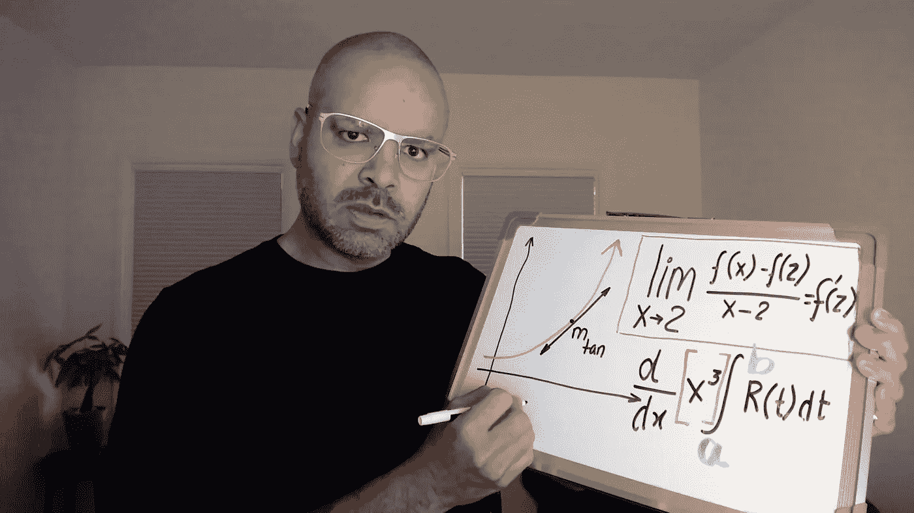

一帧原始图像

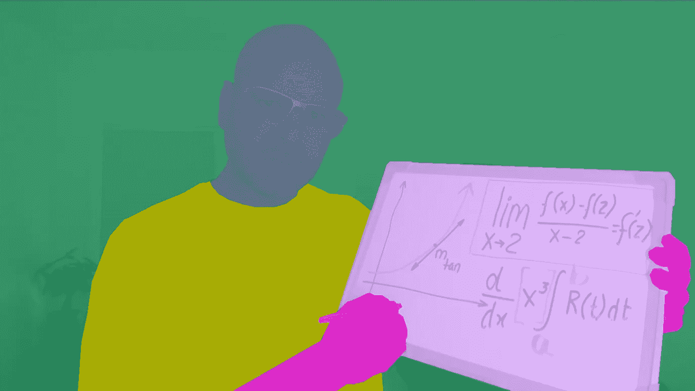

分段训练样本

我使用 [Superannotate](https://www.superannotate.com/) 来注释我的视频，并结合 OpenCV 和[达芬奇解析 16](https://www.blackmagicdesign.com/products/davinciresolve/) 来增强分割的视频帧。

## **基于片段的视频增强**

下一步是移除背景，然后是曝光、阴影和对比度增强。然而，确切的参数高度依赖于照明和曝光，因此我为我的训练样本开发了一些启发法。

我决定应用 S 曲线增强的试探法，而不是涉及曝光、阴影和对比度增强的多个步骤。

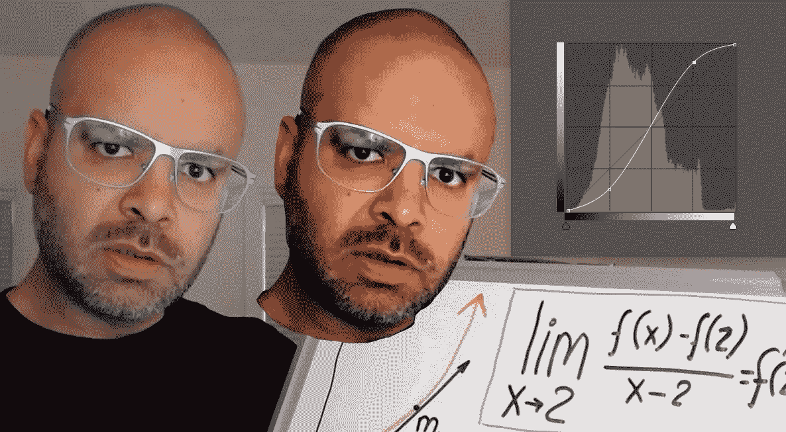

s 曲线增强，通过调整帧的色调属性来增加对比度

在 RGB 图像的色调直方图中，左下象限表示阴影，而右上象限表示高光。一个简单的试探是将阴影区域中的色调减少大约一个标准偏差，并将高亮区域中的色调增加大约两个标准偏差。

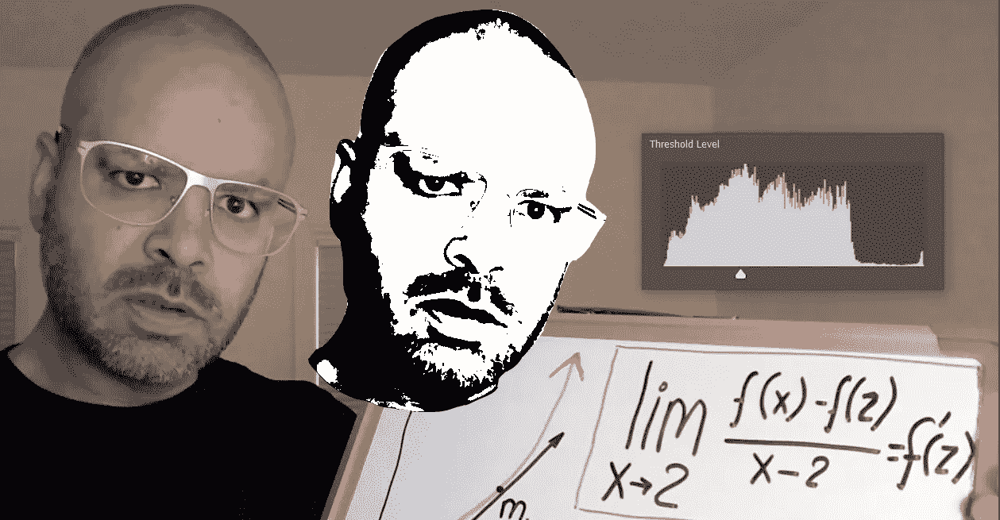

设置阈值

在设置二值图像的阈值时，我应用了将它设置在分布峰值的启发式方法。这种启发法似乎至少适用于夜间照明。

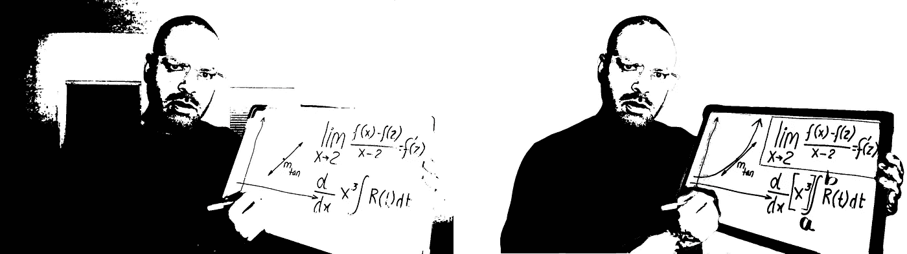

简单全局阈值和人工智能分割阈值。请注意白板的背景移除和清晰度

总体而言，基于分割视频帧的局部视频预处理提供了具有更高清晰度的二值图像。

## **矢量化**

下一步是将二值像素化图像转换成矢量图像。由于基于矢量的图像不是由特定数量的点组成的，因此它们不仅可以在不损失任何质量的情况下缩放到更大的尺寸，还可以显著减少图像的占用空间。

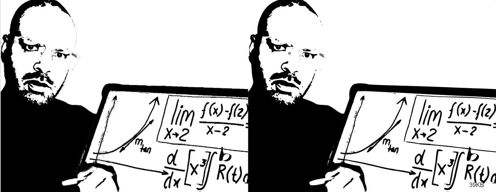

左边是原始像素帧，右边是矢量帧

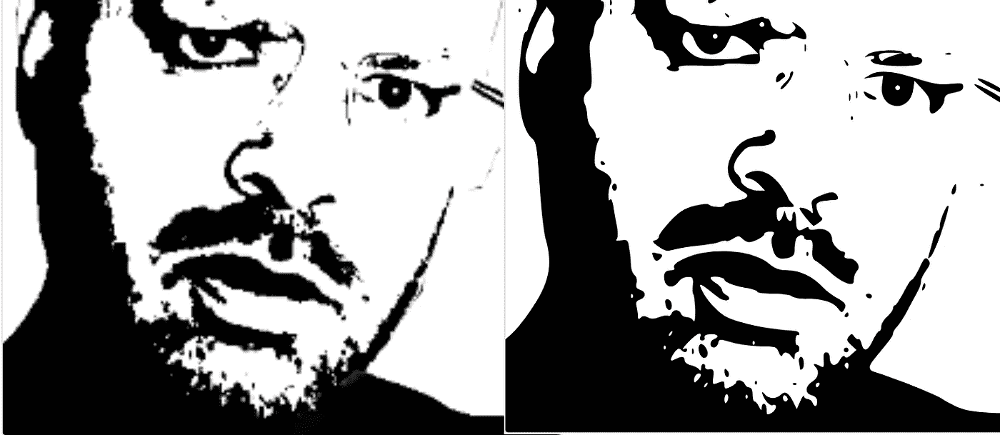

放大脸部:左边是原始像素帧，右边是矢量帧

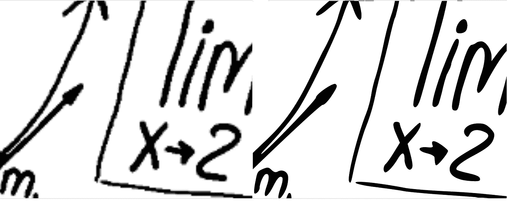

放大白板:左边是原始像素框架，右边是矢量框架

## **编码**

编码是压缩数据以适应可用的通信带宽以及满足延迟要求所必需的。大多数视频编码标准是基于离散余弦变换(DCT)的。像 H.264 标准这样的转换可以将视频压缩 200 倍，但是 H.264 不仅计算量很大，而且是为“自然”渲染而构建的。出于这个原因，我决定探索视频编码器优化我们的具体用途。视频压缩技术包括空间压缩和时间压缩，空间压缩利用单个帧内的冗余，时间压缩利用帧间的冗余，例如运动冗余。目前，我正在尝试不同的编码技术，以获得体验质量和压缩之间的平衡。这项研究包括基于二级位图(像素)的帧以及基于矢量的帧。流行的二值位图图像压缩方法有[游程编码](https://en.wikipedia.org/wiki/Run-length_encoding#:~:text=Run%2Dlength%20encoding%20(RLE),that%20contains%20many%20such%20runs.)，熵编码如[算术编码](https://en.wikipedia.org/wiki/Arithmetic_coding#:~:text=Arithmetic%20coding%20is%20a%20form,as%20in%20the%20ASCII%20code.&text=It%20represents%20the%20current%20information,range%2C%20defined%20by%20two%20numbers.)，以及二值图像的 [JBIG2](https://en.wikipedia.org/wiki/JBIG2) 标准。接下来，我将研究利用运动冗余。

## 解码和渲染

在接收端解码压缩流视频后，需要在智能手机或电视等大屏幕上呈现视频。矢量表示很容易缩放，并且很适合表示白板信息，但是它们会导致不真实的人脸渲染，这对于我们的目的来说可能很好。但是，我们需要测试体验的质量来证实这一点。另一方面，基于位图的表示在缩放时会导致像素化。应该注意的是，有一些简单的算法可以用于增强这些帧，例如最近邻增强、双三次增强、锐化和去除伪像。

*总之，我从 640 x 480 的 RGB 图像(~ 1mb/帧)开始，并将其转换为二值图像(~ 38kb/帧)。矢量化进一步将帧大小减少到大约 10kb/帧。虽然这比我们之前讨论的 1kb/帧的最坏情况目标还远，但我相信有机会达到该目标。通过使用利用冗余的定制压缩技术(例如没有背景)或通过极端矢量化中的进一步机会(例如具有线条画),这是可能的。*

# 研究挑战和后续步骤

基于发送端或接收端的可用计算以及可用的通信带宽，有许多方法值得研究。

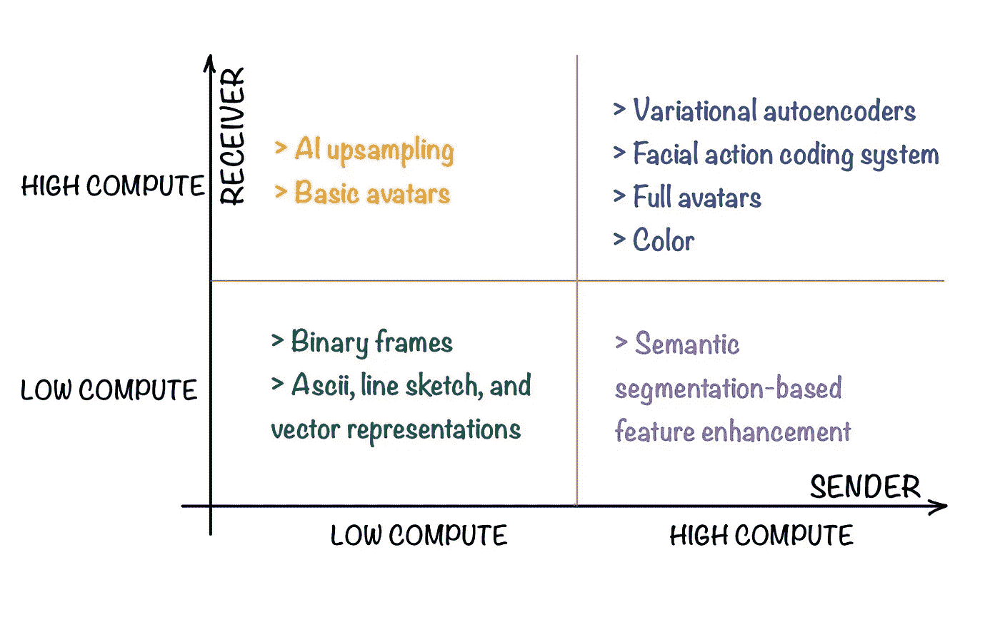

基于发送方或接收方可用计算的潜在方法

**视频优化**

研究领域包括优化空间频率周围的视频编码，以更好地解释人类 actions⁴和面部表情，如面部动作编码 Systems⁵.

**小说表述**

ASCII、3D 化身和其他人类可理解的表示法等简单表示法值得研究。基于端到端人工智能的方法，如使用[自动编码器](https://en.wikipedia.org/wiki/Autoencoder)可以用来生成紧凑的中间表示，尽管中间潜在空间编码不能被人类理解。在所有方法中，我最看好自动编码器和相关技术。另一种方法是[面部动作编码系统](https://www.paulekman.com/facial-action-coding-system/) (FACS)，其中中间表示由控制不同肌肉和运动的动作单元(au)组成。这样的 **FACS 中间表示实际上可以以大约 44 个 AUs 编码面部和位置，3 个用于 XYZ 平移，3 个用于角度，导致每帧 50 个浮点或 200 个字节，这在压缩后可以低得多，几乎肯定比 1kb/帧的目标低得多**。这种编码可用于在接收者端呈现化身。后两种方法在发送方和接收方都需要大量的计算。

**音频编码**

这是我认为最大的挑战。在呼叫的任何一端都有大量的音频编码标准，如增强语音服务、可变速率多模式宽带、多速率宽带、增强可变速率编解码器、GSM 增强全速率等。当一个呼叫从一个国家的一个运营商发起，并在另一个国家的另一个运营商结束时，流式音频的质量会因使用的编码和连接质量的不同而有很大差异。面临的挑战是将视频与音频一起编码，以便视频可以被可靠地解码并在传输中“幸存”。

**新型应用的框架**

有许多新颖的应用，例如使用矢量图形动画的交互式教学方法，甚至极简主义的增强现实以及视频和音频呼叫。

来源维基百科:[https://en . Wikipedia . org/wiki/File:Completing _ the _ square . gif](https://en.wikipedia.org/wiki/File:Completing_the_square.gif)

**用户:**打造安卓 app 做试点。

*如果您能提供一些反馈，或者将这篇文章转发给可能拥有资源和人才来开发完整解决方案和可在发展中国家部署用于教育目的的 Android 应用程序的个人或公司，我将不胜感激。在过去的周末，我一直在处理这个问题，对我来说，快速开发一个解决方案是不切实际的。我提前感谢你的帮助！*

[1]劳伦·e·谢尔曼；米纳斯·米奇扬；帕特里夏·格林菲尔德； [*文字、音频、视频、当面交流对朋友间粘合的影响*](https://cyberpsychology.eu/article/view/4285/3330) *。网络心理学:网络空间心理社会研究杂志，2013，7* (2)，第 3 条。

[2]加西亚，b；GallegoGortázar，f；Bertolino，a .， [*理解和评估 WebRTC 应用程序的体验质量*。](https://link.springer.com/article/10.1007/s00607-018-0669-7)计算 2018，101，1–23。

[3]帕布罗·巴雷拉，软件工程师，谷歌研究院和弗洛里安·斯廷伯格，研究工程师，DeepMind， [*用 WaveNetEQ*](http://ai.googleblog.com/2020/04/improving-audio-quality-in-duo-with.html) *，*2020 年 4 月 1 日，[谷歌 AI 博客](https://ai.googleblog.com/)。

[4]Steven m . Thurman Emily d . Grossman，[诊断空间频率和人类辨别行动的效率](https://www.ncbi.nlm.nih.gov/pmc/articles/PMC3037475/)，2010 年 11 月 16 日，Springer，注意力、知觉和心理物理学。

[5]保罗·艾克曼，[面部动作编码系统](https://www.paulekman.com/facial-action-coding-system/)，1978 年。

[6] [贾斯廷·约翰逊](http://cs.stanford.edu/people/jcjohns/)，[亚历山大阿拉希](http://web.stanford.edu/~alahi/)，[李菲菲](http://vision.stanford.edu/feifeili/)，[实时风格传递和超分辨率的感知损失](http://cs.stanford.edu/people/jcjohns/eccv16/)，2016 年，欧洲计算机视觉大会。

[7]朱莉(诺瓦克)贝克利，安迪·海因斯，，马修·沃德罗普，托比·毛，马丁·廷利，[大规模流媒体实验的数据压缩](http://Data Compression for Large-Scale Streaming Experimentation)，2019 年 12 月 2 日，科技博客。