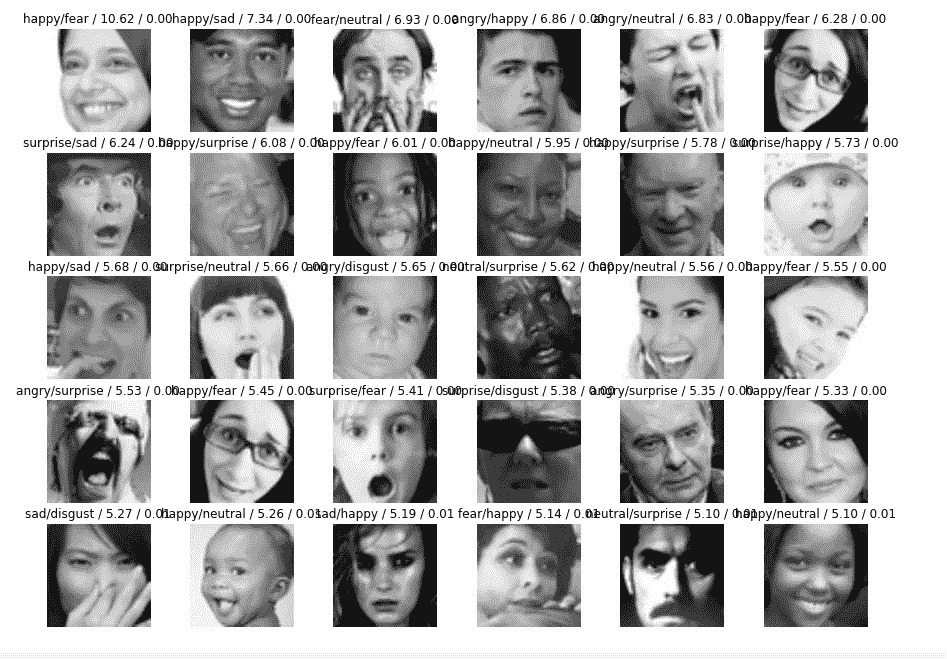
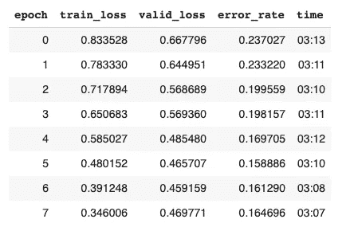
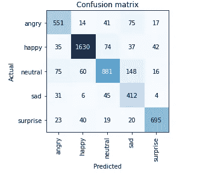

# 使用 Fast.ai 和 OpenCV 进行视频面部表情和意识检测

> 原文：<https://towardsdatascience.com/video-facial-expression-detection-with-deep-learning-applying-fast-ai-d9dcfd5bcf10?source=collection_archive---------8----------------------->

## 从实时视频或视频文件中检测面部表情和意识

*这背后的灵感？联邦调查局特工通过我的网络摄像头监视我，但被深度学习取代:)*

实时视频分类器演示

# 介绍

本教程的目标？使用 fast.ai 库训练面部表情分类模型，从网络摄像头或视频文件中读取面部表情，最后，添加面部地标来跟踪你的眼睛以确定意识！(**TL；博士**完整的工作代码在这里【https://github.com/jy6zheng/FacialExpressionRecognition 

我写这篇教程的主要原因是，在做这个项目时，一个很大的挑战是弄清楚如何使用我训练过的分类器，并使它有效地处理实时视频和视频文件。额外的眼部标记功能是基于我发现非常有用的本教程:[https://www . pyimagesearch . com/2017/05/08/sledy-detection-opencv/](https://www.pyimagesearch.com/2017/05/08/drowsiness-detection-opencv/)

# 培养

第一步是用卷积神经网络训练图像分类模型。我使用的数据来自[https://www . ka ggle . com/jonathanoheix/face-expression-recognition-dataset](https://www.kaggle.com/jonathanoheix/face-expression-recognition-dataset)

我使用了构建在 PyTorch 之上的 fast.ai 库来训练我的分类模型。该模型使用 resnet34 预训练权重和训练数据集进行训练，并导出为. pkl 文件。**关于一步一步的指导，请查看我的知识库中的 google colab 笔记本，它包含了训练你的模型的所有代码:**[https://github.com/jy6zheng/FacialExpressionRecognition](https://github.com/jy6zheng/FacialExpressionRecognition/blob/master/Facial_recognition.ipynb)

最大的挑战是首先找到一个公共数据集，然后清理数据。最初，当我使用 Kaggle 数据集时，我只能训练到 0.328191 的错误率，这意味着它只有大约 68%的时间是正确的(根本不是很好)。当我绘制产生最高损失的图像时，我很快意识到大量数据被错误地标记(左边是模型预测的表达，右边是标记的情绪)。



坐在最后一排左三的女孩看起来显然不开心

数据清洗后，错误率下降了 16%以上。现在分类器有大约 84%的准确率，这意味着它正确地识别了 84%的面部图像。仍有一些不正确和不完整的数据，因此还有进一步改进的空间。



正如你所看到的，中性和悲伤的脸最容易混淆

# 在实况视频上使用训练模型

现在，是时候将我们的分类器用于现场视频流了。首先，最好创建一个虚拟环境，这样这个项目就有自己的依赖项，并且不会干扰任何其他项目。然后，下载所需的包和库。创建一个名为 liveVideoFrame.py 的文件(或您想命名的任何名称),并导入以下内容:

```
from scipy.spatial 
import distance as dist
import numpy as np
import cv2
from imutils import face_utils
from imutils.video import VideoStream
from fastai.vision import *
import imutils
import argparse
import time
import dlib
```

我想选择将预测保存在一个. csv 文件中，并保存带标记的视频，所以我添加了参数解析。我还导出了经过训练的分类模型，并将其移动到我的工作目录中。

```
ap = argparse.ArgumentParser()
ap.add_argument("--save", dest="save", action = "store_true")
ap.add_argument("--no-save", dest="save", action = "store_false")
ap.set_defaults(save = False)
ap.add_argument("--savedata", dest="savedata", action = "store_true")
ap.add_argument("--no-savedata", dest="savedata", action = "store_false")
ap.set_defaults(savedata = False)
args = vars(ap.parse_args())path = '/Users/joycezheng/FacialRecognitionVideo/' #change this depending on the path of your exported model
learn = load_learner(path, 'export.pkl')
```

太好了！现在是时候开始我们的视频流了。我使用 imutils.video 的 VideoStream，因为我发现它比 cv2.VideoCapture 工作得更快。**注意:**对于内置的网络摄像头，视频流的来源是 0，如果您使用不同的相机，如插件，它会有所不同。

haar 级联分类器用于识别视频帧中的正面人脸。我们有一个名为 data 的数组来存储我们的预测。timer 和 time_value 用于标记数据中每个预测的时间，以便在. csv 文件中预测以 1 递增。

```
face_cascade = cv2.CascadeClassifier("haarcascade_frontalface_default.xml") 
vs = VideoStream(src=0).start()
start = time.perf_counter() 
data = []
time_value = 0
if args["save"]:    
    out = cv2.VideoWriter(path + "liveoutput.avi", cv2.VideoWriter_fourcc('M','J','P','G'), 10, (450,253))
```

现在，我们将实现一个 while 循环，从视频流中读取每一帧:

1.  因为图像分类器是在灰度图像上训练的，所以每一帧都被转换成灰度图像
2.  级联分类器用于在帧中寻找人脸。我将 minneighbors 参数设置为 5，因为我发现它在实时视频上效果最好。对于录制的视频文件，我将其设置为较高的值，因为每一帧中肯定会有一张脸
3.  由于我们的分类器是在没有太多背景的特写人脸上训练的，因此灰度图像随后被裁剪为具有 0.3 缓冲的人脸
4.  然后，在每一帧上绘制并显示文本和边界框
5.  然后使用 out.write(frame)将每一帧保存到视频编写器中

```
while True:    
    frame = vs.read()    
    frame = imutils.resize(frame, width=450)     
    gray = cv2.cvtColor(frame, cv2.COLOR_BGR2GRAY)   
    face_coord = face_cascade.detectMultiScale(gray, 1.1, 5, minSize=(30, 30))
    for coords in face_coord:        
        X, Y, w, h = coords        
        H, W, _ = frame.shape        
        X_1, X_2 = (max(0, X - int(w * 0.3)), min(X + int(1.3 * w), W))        
        Y_1, Y_2 = (max(0, Y - int(0.3 * h)), min(Y + int(1.3 * h), H))        
        img_cp = gray[Y_1:Y_2, X_1:X_2].copy()        
        prediction, idx, probability = learn.predict(Image(pil2tensor(img_cp, np.float32).div_(225)))
        cv2.rectangle(                
            img=frame,                
            pt1=(X_1, Y_1),                
            pt2=(X_2, Y_2),                
            color=(128, 128, 0),                
            thickness=2,            
        )        
       cv2.putText(frame, str(prediction), (10, frame.shape[0] - 25), cv2.FONT_HERSHEY_SIMPLEX, 0.7, (225, 255, 255), 2) cv2.imshow("frame", frame) if args["save"]:
        out.write(frame)
    if cv2.waitKey(1) & 0xFF == ord("q"):
        breakvs.stop()
if args["save"]:
    print("done saving video")    
    out.release()
cv2.destroyAllWindows()
```

现在，我们有了 fast.ai 学习模型，它可以与 imutils 和 OpenCV 合作，从直播视频中预测人脸！

接下来，是时候确定面部的意识了。函数 **eye_aspect_ratio** 根据眼睛的坐标计算眼睛的纵横比。从 dlib 预训练的面部标志检测器中找到每只眼睛的位置和坐标。函数 **data_time** 用于每隔 1 秒在数据数组中追加预测。

```
EYE_AR_THRESH = 0.20
EYE_AR_CONSEC_FRAMES = 10COUNTER = 0def eye_aspect_ratio(eye):
    A = dist.euclidean(eye[1], eye[5])
    B = dist.euclidean(eye[2], eye[4])
    C = dist.euclidean(eye[0], eye[3])
    ear = (A + B) / (2.0 * C)
    return eardef data_time(time_value, prediction, probability, ear):
    current_time = int(time.perf_counter()-start)
    if current_time != time_value:
        data.append([current_time, prediction, probability, ear])
        time_value = current_time
    return time_valuepredictor = dlib.shape_predictor("shape_predictor_68_face_landmarks.dat")(lStart, lEnd) = face_utils.FACIAL_LANDMARKS_IDXS["left_eye"]
(rStart, rEnd) = face_utils.FACIAL_LANDMARKS_IDXS["right_eye"]
```

在遍历面坐标的 for 循环中，添加以下代码块。使用 dlib 面部标志检测器检测眼睛，并将其绘制到帧上。当两只眼睛之间的平均计算眼睛纵横比小于超过十个连续帧的阈值(您可以根据自己的喜好修改该阈值)时，则该面部被标记为分心。

```
 rect = dlib.rectangle(X, Y, X+w, Y+h)
        shape = predictor(gray, rect)
        shape = face_utils.shape_to_np(shape)
        leftEye = shape[lStart:lEnd]
        rightEye = shape[rStart:rEnd]
        leftEAR = eye_aspect_ratio(leftEye)
        rightEAR = eye_aspect_ratio(rightEye)
        ear = (leftEAR + rightEAR) / 2.0
        leftEyeHull = cv2.convexHull(leftEye)
        rightEyeHull = cv2.convexHull(rightEye)
        cv2.drawContours(frame, [leftEyeHull], -1, (0, 255, 0), 1)
        cv2.drawContours(frame, [rightEyeHull], -1, (0, 255, 0), 1)
        if ear < EYE_AR_THRESH:
            COUNTER += 1
            if COUNTER >= EYE_AR_CONSEC_FRAMES:
                cv2.putText(frame, "Distracted", (10, 30), cv2.FONT_HERSHEY_SIMPLEX, 0.7, (0, 0, 255), 2)
        else:
            COUNTER = 0
        cv2.putText(frame, "Eye Ratio: {:.2f}".format(ear), (250, 30), cv2.FONT_HERSHEY_SIMPLEX, 0.7, (0, 0, 255), 2)
        time_value = data_time(time_value, prediction, probability, ear)
```

最后，在代码的底部，我们可以将数据保存为数据帧，然后保存为. csv 文件。

```
if args["savedata"]:
    df = pd.DataFrame(data, columns = ['Time (seconds)', 'Expression', 'Probability', 'EAR'])
    df.to_csv(path+'/exportlive.csv')
    print("data saved to exportlive.csv")
```

您可以通过运行以下命令在命令行中测试代码:

```
python liveVideoFrameRead.py --save --savedata
```

完整的代码在这里:

# 对视频文件使用训练模型

我对视频文件使用了与实况视频非常相似的方法。主要区别在于预测每隔一定数量的帧发生一次，这可以使用命令行参数— frame-step 来修改。完整代码如下:

就是这样！你现在可以从视频文件和网络摄像头中预测面部表情。

谢谢你看了这个:)，如果有什么改进或者问题请告诉我。完整的工作代码在这里:[https://github.com/jy6zheng/FacialExpressionRecognition](https://github.com/jy6zheng/FacialExpressionRecognition)