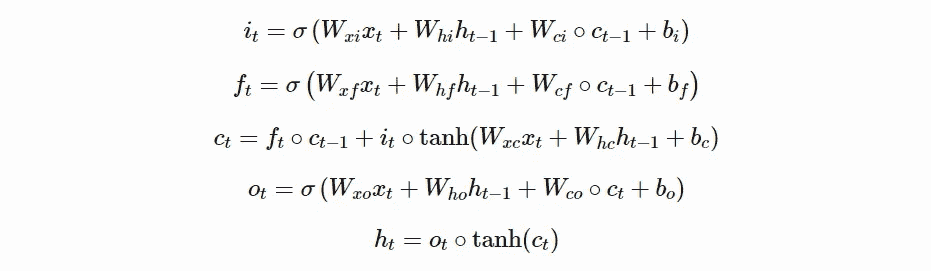
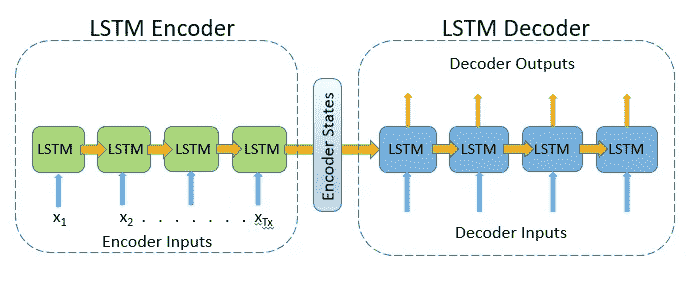
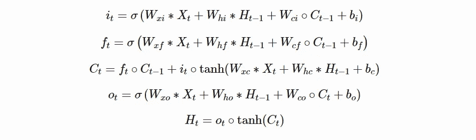
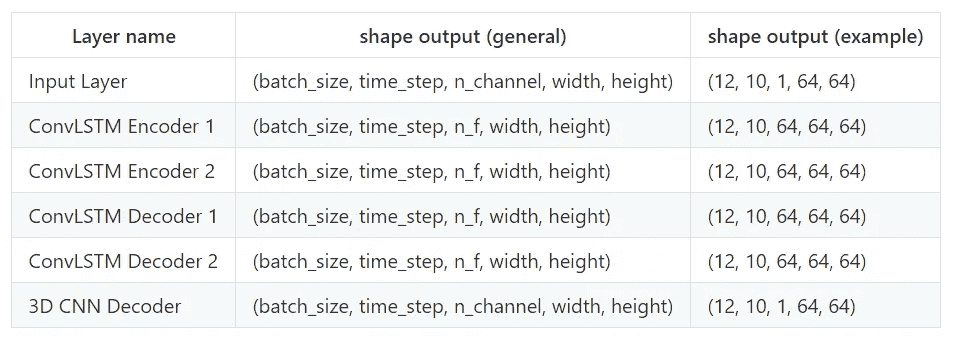

# 使用深度学习和 PyTorch (-lightning)的视频预测

> 原文：<https://towardsdatascience.com/video-prediction-using-convlstm-with-pytorch-lightning-27b195fd21a2?source=collection_archive---------6----------------------->

## 卷积 LSTM 模型的简单实现


托马斯·威廉在 Unsplash[拍摄的照片](https://unsplash.com/?utm_source=unsplash&utm_medium=referral&utm_content=creditCopyText)

在本指南中，我将向您展示如何使用一个**自动编码器** (seq2seq)架构对卷积长短期记忆(ConvLSTM)进行编码，该架构使用 MovingMNIST 数据集进行帧预测(但也可以轻松集成自定义数据集)。

这种方法最初用于 2015 年[NIPS](https://papers.nips.cc/paper/5955-convolutional-lstm-network-a-machine-learning-approach-for-precipitation-nowcasting.pdf)的降水预报，此后通过 PredRNN、PredRNN++和 Eidetic 3D LSTM 等方法得到了广泛的扩展…

我们还使用了 **pytorch-lightning** 框架，这对于删除大量样板代码非常有用，并且可以轻松集成 16 位训练和多 GPU 训练。

开始之前，我们将简要概述一下我们正在使用的库:

`python=3.6.8
torch=1.1.0
torchvision=0.3.0
pytorch-lightning=0.7.1
matplotlib=3.1.3
tensorboard=1.15.0a20190708`

# 1.数据加载器

从以下 repo[tychovdo/moving NIST](https://github.com/tychovdo/MovingMNIST)下载数据加载器脚本。
该数据集最初是由[开发并在此处](http://www.cs.toronto.edu/~nitish/unsup_video.pdf)描述的，它包含 10000 个序列，每个序列长度为 20，帧大小为 64 x 64，显示 2 个数字在不同轨迹上移动(并重叠)。

需要预先注意的是手指轨迹固有的随机性。我们确实期望这将成为我们将要描述的模型的一个主要障碍，并且我们也注意到更新的方法，例如变化的自动编码器，对于这种类型的任务可能是一个更有效的模型。

# 2.模型架构

我们将使用的特定模型类型称为 seq2seq 模型，通常用于 NLP 或时序任务(它实际上是在 2016 年的谷歌翻译引擎中实现的)。

关于 seq2seq 的原论文有 [Sutskever 等人，2014](https://papers.nips.cc/paper/5346-sequence-to-sequence-learning-with-neural-networks.pdf) 和 [Cho 等人，2014](http://emnlp2014.org/papers/pdf/EMNLP2014179.pdf) 。

在其最简单的配置中，seq2seq 模型将一系列项目作为输入(例如单词、单词嵌入、字母等。)并输出另一个项目序列。对于机器翻译，输入可以是西班牙语单词序列，输出是英语翻译。

我们可以将 seq2seq 模型分成三个部分，分别是

a)编码器(编码输入列表)
b)编码器嵌入向量(整个输入序列的最终嵌入)
c)解码器(将嵌入向量解码成输出序列)

对于我们的机器翻译示例，这意味着:

*   编码器通过顺序处理每个单词，将西班牙语序列作为输入
*   编码器输出一个嵌入向量作为我们输入的最终表示
*   解码器将嵌入向量作为输入，然后输出英语翻译序列

希望 a)部分和 c)部分对你来说比较清楚。就 seq2seq 模型的直觉而言，可以说最棘手的部分是编码器嵌入向量。你如何准确定义这个向量？

# 2.1 认识 RNN

在你继续前进之前，我强烈推荐以下[关于 RNN/LSTM 的精彩博文](https://colah.github.io/posts/2015-08-Understanding-LSTMs/)。密切了解 LSTM 的是大多数 seq2seq 模型的必要先决条件！

以下是常规 LSTM 电池的方程式:



其中∘表示哈达玛乘积。

让我们假设你完全理解什么是 LSTM 细胞，以及细胞状态和隐藏状态是如何工作的。seq2seq 型号中的编码器和解码器通常由 LSTM 单元组成，如下图所示:



# 分解

*   LSTM 编码器由 4 个 LSTM 单元组成，LSTM 解码器由 4 个 LSTM 单元组成。
*   每个输入(单词或单词嵌入)与来自先前 LSTM 单元的隐藏状态(输出)一起被馈送到新的编码器 LSTM 单元
*   来自最终 LSTM 编码器单元的隐藏状态(通常)是编码器嵌入。它也可以是来自所有编码器 LSTM 单元的隐藏状态的整个序列(注意——这与注意不同)
*   LSTM 解码器使用编码器状态作为输入，并通过各种 LSTM 单元迭代处理这些状态以产生输出。这可以是单向的或双向的

存在对标准 seq2seq 模型的几个扩展；最引人注目的是[注意力模块](https://arxiv.org/pdf/1409.0473.pdf)。

讨论了 seq2seq 模型之后，让我们将注意力转向帧预测任务！

# 2.2 帧预测

帧预测与 seq2seq 原有的任务如机器翻译有着本质的区别。这是因为编码器和解码器中的 RNN 模块(LSTM)使用全连接层来编码和解码单词嵌入(表示为向量)。

一旦我们处理了帧，我们就有了 2D 张量，为了按顺序编码和解码，我们需要扩展原始的 LSTM seq2seq 模型。

# ConvLSTM

这就是卷积 LSTM(convltm)的用武之地。在 2015 年的 [NIPS 上展示，ConvLSTM 修改了 LSTM 机制的内部工作方式，使用卷积运算而不是简单的矩阵乘法。让我们为 ConvLSTM 单元写出新的方程:](https://papers.nips.cc/paper/5955-convolutional-lstm-network-a-machine-learning-approach-for-precipitation-nowcasting.pdf)



∫表示卷积运算，∘表示阿达玛乘积，如前所述。

你能发现这些方程和常规 LSTM 之间的细微差别吗？我们简单地替换四个门之间的乘法运算

a)权重矩阵和输入 *(Wₓ xₜ* 与*、Wₓ* 、*和
)b)权重矩阵和先前隐藏状态( *Wₕ hₜ₋₁* 与 *Wₕ* 、 *Hₜ₋₁* )。
否则，一切照旧。*

如果你不想深究上面的方程，首先要注意的是，我们使用卷积(核)来处理我们的输入图像，以获得特征图，而不是从完全连接的层中获得的矢量。

# 2.2.2 n 步预测

设计帧预测模型(使用 ConvLSTM)时，最困难的事情之一是定义如何产生帧预测。我们在这里列出了两种方法(但也存在其他方法):

1.  预测下一帧，并将其反馈到网络中，经过多个 *n* 步骤，产生 *n* 帧预测(自回归)
2.  通过使 ConvLSTM 层的数量 *l* 等于 *n* 步的数量，一次性预测所有未来的时间步。因此，我们可以简单地使用每个解码器 LSTM 单元的输出作为我们的预测。

在本教程中，我们将重点关注数字 1，特别是因为它可以在未来产生任意数量的预测，而不必完全改变架构。此外，如果我们要预测未来的许多步骤，选项 2 在计算上变得越来越昂贵。

# 2.2.3 ConvLSTM 实施

对于我们的 ConvLSTM 实现，我们使用来自 [ndrplz](https://raw.githubusercontent.com/ndrplz/ConvLSTM_pytorch/master/convlstm.py) 的 PyTorch 实现

它看起来如下:

希望您可以看到前面定义的方程是如何在上面的代码中编写的。

# Seq2Seq 实施

我们使用的具体架构如下:



## 编码器和解码器

编码器和解码器使用两个 ConvLSTM 单元(encoder_1_convlstm、encoder_2_convlstm、decoder_1_convlstm、decoder_2_convlstm)。

## 3D CNN

我们的最终 ConvLSTM 单元(decoder_2 *convlstm)为每个预测帧(12、10、64、64、64)输出 _nf* 特征图。

因为我们本质上是在做回归(预测像素值)，所以我们需要将这些特征图转换成实际的预测，类似于您在经典图像分类中所做的。

为了实现这一点，我们实现了一个 3D-CNN 层。3D CNN 层执行以下操作:

1.  将作为每个批次和时间步长的输入(nf、宽度、高度)
2.  使用 3D 内核迭代所有 *n* 个预测帧
3.  每个图像输出一个通道(1，宽度，高度)，即预测的像素值

## 乙状结肠层

最后，由于我们已经将像素值转换为[0，1]，我们使用 sigmoid 函数将我们的 3D CNN 激活转换为[0，1]。

基本上就是这样！

现在我们为 seq2seq 模型定义 python 实现:

# 3.培养

也许你已经知道 pytorch-lightning 这个优秀的库，它在使用 pytorch 时基本上把所有的锅炉板工程从机器学习中去掉了，比如下面的命令:optimizer.zero_grad()、optimizer.step()。
它还标准化了培训模块，并支持针对 Volta 架构 GPU 卡的轻松多 GPU 功能和混合精度培训。

pytorch-lightning 中有如此多的可用功能，我将尝试演示我创建的工作流，我认为它工作得相当好。

`class MovingMNISTLightning`的大多数功能都是不言自明的。以下是整体工作流程:

1.  我们实例化我们的类并定义所有相关的参数
2.  我们采取训练步骤(针对每一批)
3.  创建预测 y_hat
4.  计算 MSE 损失—
5.  在 tensorboard 中每 250 个全局步长保存一个带有输入和地面实况的预测可视化
6.  将每批的学习率和损耗保存到 tensorboard 中

当我们实际运行我们的`main.py`脚本时，我们可以定义几个相关的参数。例如，如果我们想要使用 2 个 GPU 运行，混合精度且 batch_size = 16，我们只需键入:

```
python main.py --n_gpus**=**2 --use_amp**=**True --batch_size**=**16
```

请随意尝试各种配置！

当我们运行`main.py`脚本时，我们会使用多重处理自动启动 tensorboard 会话，在这里您可以迭代跟踪我们模型的性能，还可以看到我们每 250 个全局步长的预测可视化。

感谢阅读这篇文章！我希望你喜欢它！

如果您对上述论文有任何问题或评论，请联系这里或在 [Twitter](https://twitter.com/HolmML) 上。你也可以在我的网页上找到更多的教程[https://holmdk.github.io/](https://holmdk.github.io/)。