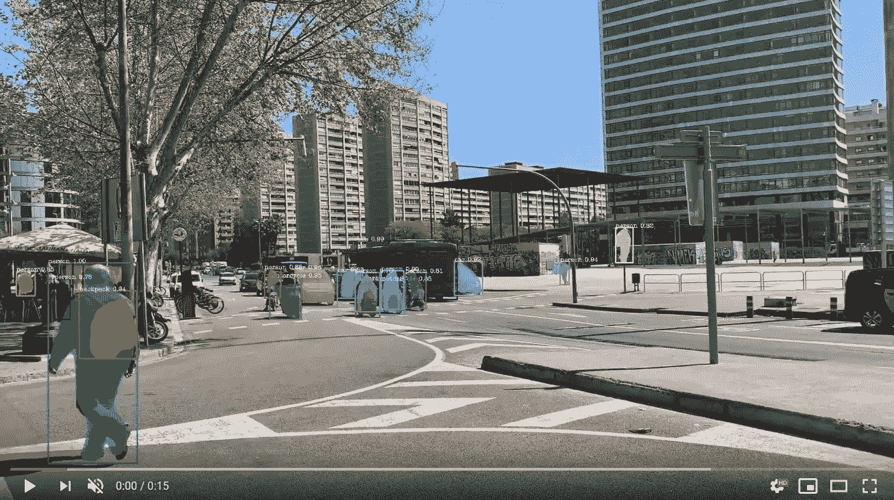

# 用 5 行代码实现视频分割

> 原文：<https://towardsdatascience.com/video-segmentation-with-5-lines-of-code-87f798afb93?source=collection_archive---------24----------------------->

## **视频的语义和实例分割**



PixelLib 的第一个版本是为了使用几行代码执行图像分割而构建的。我很兴奋地宣布，新发布的 PixelLib 版本支持五行代码的视频分段。

如果你没有读过关于 PixelLib 图像分割的文章，点击[这里](/image-segmentation-with-six-lines-0f-code-acb870a462e8)。

安装 tensorflow，包括:

*   *pip3 安装张量流*

安装 PixelLib 与:

*   *pip3 安装 pixellib —升级*

**视频的语义分割:**

基于 pascal voc 模型的视频分割；

我们将在下面解释每一行代码。

```
import pixellibfrom pixellib.semantic import semantic_segmentationsegment_video = semantic_segmentation()
```

我们导入了用于执行语义分段的类，并创建了该类的一个实例。

```
segment_video.load_pascalvoc_model("deeplabv3_xception_tf_dim_ordering_tf_kernels.h5")
```

我们加载了在 pascal voc 数据集上训练的 xception 模型来执行语义分割，它可以从[这里](https://github.com/ayoolaolafenwa/PixelLib/releases/download/1.1/deeplabv3_xception_tf_dim_ordering_tf_kernels.h5)下载。

```
segment_video.process_video_pascalvoc("video_path",  overlay = True, frames_per_second= 15, output_video_name="path_to_output_video")
```

我们调用函数对视频文件进行分割。

它采用以下参数:-

*   *video_path* :我们要分割的视频文件的路径。
*   *每秒帧数:*该参数用于设置保存的视频文件每秒帧数。在这种情况下，它被设置为 15，即保存的视频文件每秒将有 15 帧。
*   *输出 _ 视频 _ 名称:*保存的分段视频的名称*。*输出的视频会保存在你当前的工作目录下。

***sample _ video 1***

***输出视频***

这是使用 pascal voc 模型保存的分段视频。

*现场摄像机的语义分割。*

我们可以使用相同的模型在相机上执行语义分割。这可以通过对用于处理视频文件的代码进行少量修改来实现。

```
import cv2capture = cv2.VideoCapture(0)
```

我们导入了 cv2 并包含了捕捉相机帧的代码。

```
segment_video.process_camera_pascalvoc(capture,  overlay = True, frames_per_second= 15, output_video_name="output_video.mp4", show_frames= True,frame_name= "frame")
```

在执行分割的代码中，我们将视频的文件路径替换为*捕获*，即我们正在处理摄像机捕获的帧流，而不是视频文件。我们添加了额外的参数来显示相机的帧:

*   *显示帧:*该参数处理分段摄像机帧的显示，按 q 退出帧的显示。
*   *帧名:*这是显示的摄像机帧的名称。

展示 pixelLib 使用 pascal voc 模型对摄像机输入进行语义分割的输出的演示。

## 干得好！它能够成功地将我和我面前的塑料瓶分割开来。

**视频实例分割:**

```
import pixellib
from pixellib.instance import instance_segmentation segment_video = instance_segmentation()
```

我们导入类来执行实例分段，并创建了类的一个实例。

```
segment_video.load_model("mask_rcnn_coco.h5")
```

我们加载了在 coco 数据集上训练的 maskrcnn 模型来执行实例分割，它可以从[这里](https://github.com/ayoolaolafenwa/PixelLib/releases/download/1.2/mask_rcnn_coco.h5)下载。

```
segment_video.process_video("video_path", frames_per_second = 20, output_video_name = "output_video.mp4")
```

我们调用该函数对视频文件执行*实例分割*。

它采用以下参数:-

*   *video_path:* 这是我们想要分割的视频文件的路径。
*   *每秒帧数:*该参数用于设置保存的视频文件每秒帧数。在这种情况下，它被设置为 15，即保存的视频文件每秒将有 15 帧。
*   *输出 _ 视频 _ 名称:*这是保存的分段视频的名称*。*输出的视频将保存在您当前的工作目录中。

***样本 _ 视频 2***

我们可以通过将参数 *show_bboxes* 设置为 *true* 来实现实例分割。

***输出视频***

*现场摄像机的实例分割。*

我们可以在摄像机的帧上执行实例分割。这可以通过对用于处理视频文件的代码进行少量修改来实现。

```
import cv2 capture = cv2.VideoCapture(0)
```

我们导入了 cv2 并包含了捕捉相机帧的代码。

```
segment_video.process_camera(capture, show_bboxes = True, frames_per_second = 15, output_video_name = "output_video.mp4", show_frames = True, frame_name = "frame")
```

在执行分段的代码中，我们替换了要捕获的视频文件路径，也就是说，我们正在处理摄像机捕获的帧流，而不是视频文件。为了显示摄像机画面，我们添加了额外的参数:

*   *显示帧:*该参数处理分段摄像机帧的显示，按 q 退出帧显示
*   *帧名:*这是显示的摄像机帧的名称。

一个展示 pixelLib 使用 Mask-RCNN 对摄像机输入进行实例分割的输出的演示。

## 干得好！它能够成功地检测到我和我的手机。

> [访问 PixelLib 的官方 github 库](https://github.com/ayoolaolafenwa/PixelLib)
> 
> [访问 PixelLib 的官方文档](https://pixellib.readthedocs.io/en/latest/)

通过以下方式联系我:

电子邮件:[olafenwaayoola@gmail.com](https://mail.google.com/mail/u/0/#inbox)

推特: [@AyoolaOlafenwa](https://twitter.com/AyoolaOlafenwa)

脸书:[阿尤拉·奥拉芬娃](https://web.facebook.com/ayofen)

Linkedin: [阿尤拉·奥拉芬娃](https://www.linkedin.com/in/ayoola-olafenwa-003b901a9/)