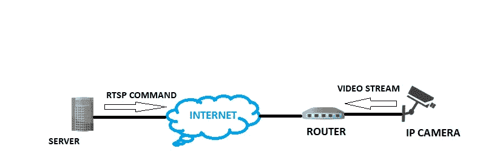

# 使用 OpenCV & Flask 在 Web 浏览器中进行视频流传输

> 原文：<https://towardsdatascience.com/video-streaming-in-web-browsers-with-opencv-flask-93a38846fe00?source=collection_archive---------0----------------------->

## 借助计算机视觉，从 IP 摄像机或网络摄像头传输实时视频


罗布·萨米恩托在 [Unsplash](https://unsplash.com?utm_source=medium&utm_medium=referral) 上的照片

你不厌其烦地在家里、办公室或任何你拥有的地方安装网络摄像头或监控摄像机。显然，你希望能够随时随地观看视频直播。

大多数人使用 [**IP 摄像机**](https://en.wikipedia.org/wiki/IP_camera) (网络摄像机)而不是 [**CCTV**](https://en.wikipedia.org/wiki/Closed-circuit_television) (闭路电视)进行监控，因为它们的分辨率更高，布线成本更低。你可以在这里找到这两个系统的详细区别[。在本文中，我们将重点关注 IP 摄像机。](https://www.taylored.com/blog/cctv-vs-ip-cameras-which-is-best-suited-for-your-business/)

> IP 摄像机是一种数字视频摄像机，它通过 IP 网络接收控制数据并发送**图像数据，不需要本地记录设备。大多数 IP 摄像机都是基于**[**【RTSP】**(实时流协议)](https://www.red5pro.com/blog/ip-camera-live-streaming-rtsp-to-webrtc/)的，因此在互联网浏览器中“不支持”**。******

********

****图片由《RTSP 议定书》作者提供****

## ****那么，你如何使用网络浏览器观看直播呢？****

****在这篇文章中，我们将学习如何使用 [**计算机视觉**](https://en.wikipedia.org/wiki/Computer_vision) 来做到这一点。****

> ******计算机视觉**是一个跨学科领域，研究如何让计算机从数字图像或视频中获得高层次的理解。****

****为了实现计算机视觉部分，我们将使用 Python 中的 **OpenCV** 模块，为了在网络浏览器中显示实时流，我们将使用 **Flask** 网络框架。在进入编码部分之前，让我们先简单了解一下这些模块。如果你已经熟悉这些模块，你可以直接跳到下一节。****

> ******根据维基百科，Flask** 是一个用 [Python](https://en.wikipedia.org/wiki/Python_(programming_language)) 编写的微型 [web 框架](https://en.wikipedia.org/wiki/Web_framework)。它被归类为微框架，因为它不需要特殊的工具或库。它没有数据库抽象层、表单验证或任何其他组件，而现有的第三方库提供了通用功能。****
> 
> ******根据 GeeksForGeeks 的说法，OpenCV** 是用于计算机视觉、机器学习和图像处理的巨大开源库，现在它在实时操作中发挥着重要作用，这在当今的系统中非常重要。****

## ******步骤 1-安装烧瓶& OpenCV :******

****您可以使用' *pip install* flask '和'*pip install opencv-python*命令。我使用 PyCharm IDE 开发 flask 应用程序。 ***要在 PyCharm*** 中轻松安装库，请遵循以下[步骤](https://www.jetbrains.com/help/pycharm/installing-uninstalling-and-upgrading-packages.html)。****

## ****步骤 2- **导入必要的库，初始化 flask app :******

****我们现在将导入必要的库并初始化我们的 flask 应用程序。****

```
****#Import necessary libraries**
from flask import Flask, render_template, Response
import cv2
**#Initialize the Flask app**
app = Flask(__name__)**
```

## ****第 3 步-使用 OpenCV 捕获视频:****

****创建一个 VideoCapture()对象来触发摄像机并读取视频的第一个图像/帧。我们既可以提供视频文件的路径，也可以使用数字来指定使用本地网络摄像头。为了触发网络摄像头，我们传递“0”作为参数。为了捕捉来自 IP 摄像机的实时反馈，我们提供了 **RTSP 链接**作为参数。要知道你的 IP 摄像机的 RTSP 地址，请浏览这个— [**查找 RTSP 地址**](http://help.angelcam.com/en/articles/372649-finding-rtsp-addresses-for-ip-cameras-nvrs-dvrs) 。****

```
**camera = cv2.VideoCapture(0)'''
for ip camera use - rtsp://username:password@ip_address:554/user=username_password='password'_channel=channel_number_stream=0.sdp' for local webcam use cv2.VideoCapture(0)
'''**
```

## ****步骤 4-添加窗口并从相机生成帧:****

********

****按作者分类的图像-帧生成功能****

****gen_frames()函数进入一个循环，在这个循环中，它不断地从摄像机返回帧作为响应块。该函数要求摄像机提供一个帧，然后它将这个帧格式化为一个内容类型为`image/jpeg`的响应块，如上所示。代码如下所示:****

****帧生成函数****

## ******第五步-定义网络应用默认页面的应用路径**:****

****路由是指某个 app 的 URL 模式(如 myapp.com/home 或 myapp.com/about)。`@app.route("/")`是 Flask 提供的一个 Python 装饰器，用于轻松地将我们应用程序中的 URL 分配给函数。****

```
**@app.route('/')
def index():return render_template('index.html')**
```

****装饰器告诉我们的`@app`，每当用户在给定的`.route()`访问我们的应用程序域( *localhost:5000 用于本地服务器)*，执行`index()`函数。Flask 使用 Jinja 模板库来渲染模板。在我们的应用程序中，我们将使用模板来呈现将在浏览器中显示的 HTML。****

## ****步骤 6-定义视频馈送的应用程序路由:****

```
**@app.route('/video_feed')
def video_feed():
    return Response(gen_frames(), mimetype='multipart/x-mixed-replace; boundary=frame')**
```

****“/video_feed”路由返回流响应。因为这个流返回要在网页中显示的图像，所以这个路由的 URL 在图像标记的“src”属性中(参见下面的“index.html”)。浏览器将通过在其中显示 JPEG 图像流来自动保持图像元素的更新，因为大多数/所有浏览器都支持多部分响应****

****让我们看看我们的**index.html**文件:****

```
**<body>
<div class="container">
    <div class="row">
        <div class="col-lg-8  offset-lg-2">
            <h3 class="mt-5">Live Streaming</h3>
            ****
        </div>
    </div>
</div>
</body>**
```

## ******步骤 7-启动 Flask 服务器**:****

```
**if __name__ == "__main__":
    app.run(debug=True)**
```

****app.run()被调用，web 应用程序被本地托管在*【localhost:5000】上。*****

****“debug=True”确保我们不需要在每次进行更改时都运行我们的应用程序，我们只需在服务器仍在运行时刷新我们的网页来查看更改。****

## ****项目结构:****

********

****按作者分类的图像-项目结构****

****该项目保存在一个名为“相机检测”的文件夹中。我们运行“app.py”文件。在运行这个文件时，我们的应用程序被托管在端口 5000 的本地服务器上。****

> ****运行“app.py”后，您只需在 web 浏览器上键入“localhost:5000”即可打开您的 web 应用程序****

*   ****app.py —这是我们在上面创建的 Flask 应用程序****
*   ****模板—该文件夹包含我们的“index.html”文件。渲染模板时，这在 Flask 中是强制的。所有 HTML 文件都放在这个文件夹下。****

****让我们看看运行“app.py”时会发生什么:****

********

****作者图片 Flask 应用程序的本地服务器****

****点击提供的 URL，我们的网络浏览器会打开实时提要。由于我使用了上面的 **VideoCapture(0)** ，网络摄像头的视频显示在浏览器上:****

********

****图片由作者提供-本地网络摄像头在网络浏览器上提供****

****就是这样！！****

****您的网络浏览器上有来自 IP 摄像头/网络摄像头的实时视频流，可用于安全和监控目的。****

****[](https://www.buymeacoffee.com/nakullakhotia)

如果你喜欢读这篇文章，请支持我。点击上图。谢谢你**** 

****参考我的 [**GitHub 代码**](https://github.com/NakulLakhotia/Live-Streaming-using-OpenCV-Flask) 。****

*******注意*** *:本文中已经提到了开始工作所需的所有资源及其链接。希望你好好利用:)*****

****我希望这篇文章能让你对尝试计算机视觉领域的新事物感兴趣，并帮助你增加知识。如果你喜欢读这篇文章，请与你的朋友和家人分享。谢谢你的时间。****