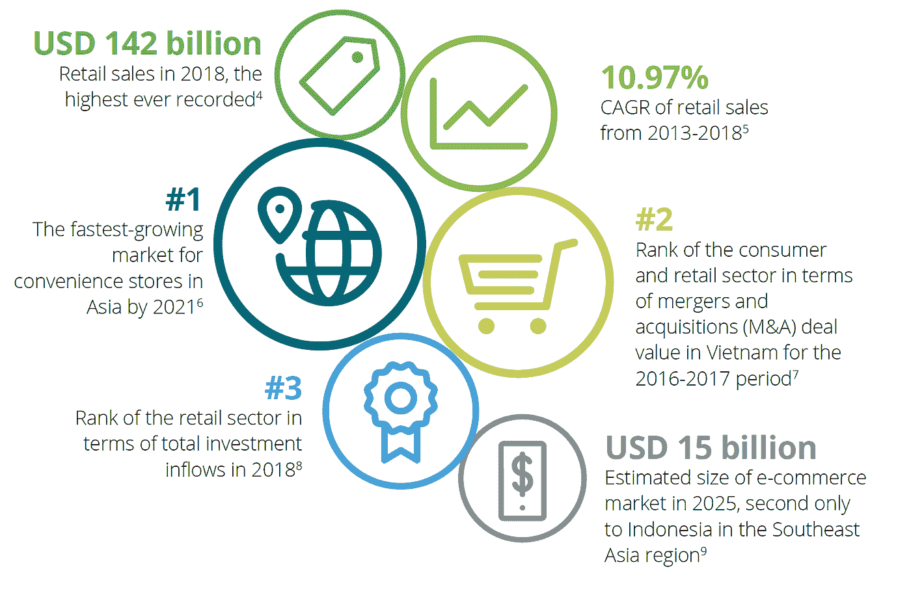
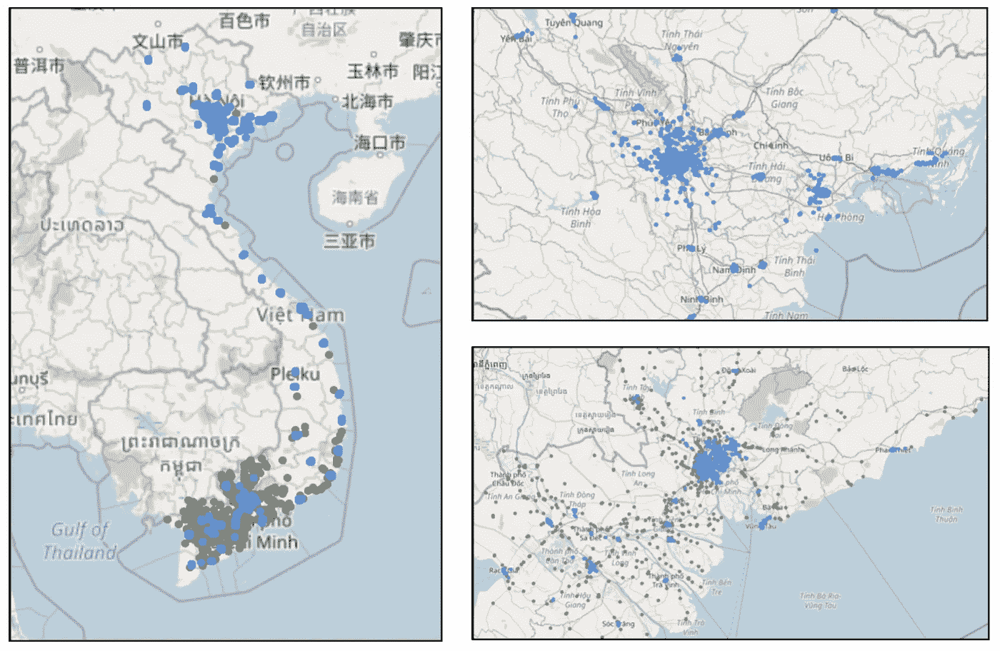
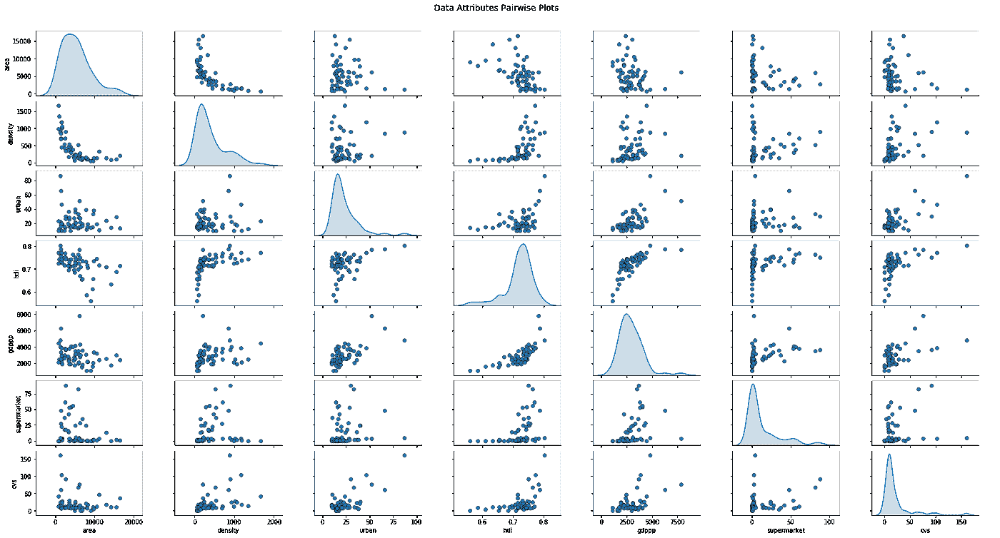
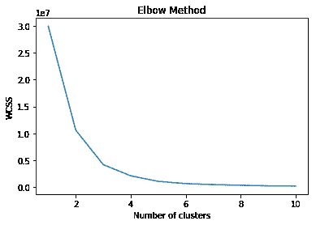
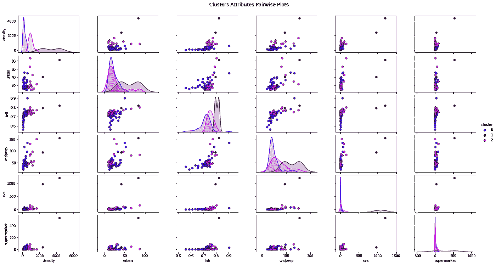
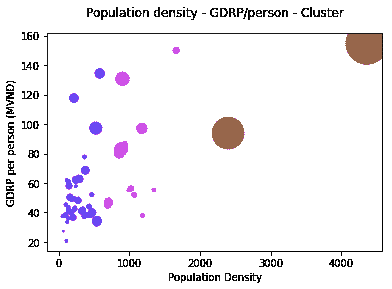

# 越南零售景观:零售足迹分析(上)

> 原文：<https://towardsdatascience.com/vietnam-retail-landscape-an-analysis-of-retail-footprint-part-1-10cd9d367754?source=collection_archive---------37----------------------->

## 在一个过去 5 年以+10%的速度增长但被实体渠道主导的零售市场中，“下一家店开在哪里”是决定一个品牌成败的问题。

[Minh Minh](https://unsplash.com/@jamesemyn?utm_source=unsplash&utm_medium=referral&utm_content=creditCopyText) 在 [Unsplash](https://unsplash.com/s/photos/retail-vietnam?utm_source=unsplash&utm_medium=referral&utm_content=creditCopyText) 上的照片

这篇博文是我在 IBM-Coursera 应用数据科学峰会上的工作的一部分。

# 1.介绍

2013 年至 2020 年间，越南零售业快速增长了+10%。作为东南亚中产阶级增长最快的国家，其零售业的这一惊人增长率预计至少在未来五年内将持续下去。德勤越南公司在其关于[越南零售业 2019](https://www2.deloitte.com/vn/en/pages/consumer-business/articles/vietnam-consumer-retail-2019.html) 的报告中报告了以下关键统计数据:

德勤对越南零售业的主要统计数据

根据这份报告，尽管越南的零售业拥有巨大的增长潜力，但竞争程度非常激烈。通过不同的商店形式:商业中心、超市、杂货店和便利店，越南的国内外零售巨头正在进行一场争夺主导权的战争，因为他们开始了积极的扩张战略。与此同时，尽管数字渠道兴起，但实体渠道继续主导零售领域。

因此，一个有趣的问题是:( 1)这些零售巨头目前在越南的零售足迹如何,( 2)新店的下一个目标应该是哪个省/市/区。谁有兴趣回答这些问题？答案是越南的零售巨头，以及任何计划进入越南零售市场的新玩家。

*   对于越南的零售巨头来说，回答这个问题将为他们决定在哪里扩大商店网络提供关键信息，也许他们当前的商店应该关闭(由于同一地区的竞争商店的数量)。用数据驱动的方法做出这些决定将使这些公司在市场中找到自己的最佳位置，并抓住新的需求。
*   对于计划进入越南零售市场的新玩家来说，通过了解当前在越南的零售足迹，可以了解他们的市场进入策略。

# 2.数据

**2.1*。数据来源***

为了进行分析，获得了以下数据来执行分析:

*   [越南行政区划列表](https://www.gso.gov.vn/dmhc2015/):省级和区级。该信息来自越南统计总局(GSO)数据库(于 2020 年 4 月 4 日在 GSO 数据库检索)
*   [人口普查数据](https://vi.wikipedia.org/wiki/T%E1%BB%89nh_th%C3%A0nh_Vi%E1%BB%87t_Nam):包括各省的人口、面积、人口密度、人类发展指数、GDP/资本等数据(2020 年 04 月 04 日检索自维基百科)。这一数据由 2019 年 4 月 1 日的 GSO 人口普查报告提供。然而，由于这些数据无法通过 GSO 数据库获得，维基百科是下一个最好的选择。
*   [地理空间坐标](https://data.opendevelopmentmekong.net/en/dataset/a-phn-huyn?type=dataset):是包含来自 OpenDevelopmentMekong 数据库(2020 年 4 月 5 日检索)的越南各省和行政区地理空间数据的多边形数据集。这些数据集(JSON 格式)为项目结果在越南地图上的可视化提供了输入。
*   主要零售连锁店的店铺列表:根据[德勤关于越南零售 2019 的报告](https://www2.deloitte.com/vn/en/pages/consumer-business/articles/vietnam-consumer-retail-2019.html)，确定了以下零售连锁店，其店铺列表通过网络抓取从其官方网站获得。web 抓取的结果是商店列表，其中包含(1)商店名称，(2)商店地址，以及(3)商店的纬度和经度。
*   夫妻店和小型零售店:除了主要零售连锁店的商店，夫妻店仍然是越南零售市场的重要组成部分之一。夫妻店是家庭经营的杂货店。小型零售店由小公司经营，倾向于针对特定客户群的需求(例如，高端进口糖果、葡萄酒和酒类商店等)。).这类商店的数据是通过 Foursquare API 获得的。

关于主要的零售连锁店，以下超市、便利店(CVS)和食品杂货连锁店，这些都是德勤关于越南零售业前景的报告中所报告的，包括在本分析中:

*   Vingroup: [VinMart](https://www.vincommerce.com/vinmart/he-thong-cua-hang) —连锁超市，以及 [VinMart+](http://www.vinmartplus.vn/he-thong-cua-hang) —不同业态的 CVS，从混合型(即生鲜产品 CVS)到传统 CVS。
*   西贡超市: [Co.Op Mart](http://www.co-opmart.com.vn/lienhe/hethongcoopmart.aspx) 超市、 [Co.Op Smile](https://momo.vn/thanh-toan-momo-coop-smile) — CVS、 [Co.Op Food](http://www.saigonco-op.com.vn/linhvuchoatdong/banle/chuoicuahangCoopFood/chuoi-cua-hang-thuc-pham-coop-food_442.html) —生鲜店
*   Satra: [SatraMart](https://www2.deloitte.com/vn/en/pages/consumer-business/articles/vietnam-consumer-retail-2019.html) —超市
*   杂货店
*   [7-Eleven](https://www.7-eleven.vn/cua-hang-7-eleven-viet-nam/) : CVS(仅在胡志明市)
*   永旺集团: [MiniStop](http://ministop.vn/ms/all) — CVS(仅在胡志明市和平阳省)
*   BigC :连锁超市
*   [圈 K](https://www.7-eleven.vn/cua-hang-7-eleven-viet-nam/) : CVS
*   [B'mart](http://www.bsmartvina.com/bsmart_store/en) : CVS

*注:Shop & Go 和欧尚连锁店包含在德勤报告中，然而:*

*   [*店铺& Go*](https://www.vir.com.vn/vingroup-to-acquire-shop-go-grocery-store-chain-for-1-66816.html) *于 2019 年 4 月出售给 VinGroup，*
*   [*欧尚*](https://www.vir.com.vn/saigon-coop-acquires-auchan-vietnam-68923.html) *于 2019 年 7 月被西贡公司 Op 收购。*

*因此，假设在收购后，这些商店将被重新命名并纳入收购方商店链，因此它们不包括在分析中。*

**2.2*。数据清理和探索*和**

在此分析的所有数据中，行政区划和人口普查数据是结构化的，不需要进一步的数据清理和格式化。相比之下，从主要零售商的网站上搜集的商店数据没有结构化，存在语法错误、重复记录和质量差。对于此商店列表，在数据准备好进行进一步分析之前，采取了以下步骤:

*   从数据中移除越南语重音符号，以便稍后分类
*   检查每个商店的地址、纬度和经度，以确保一致性和数据质量
*   删除重复记录

使用叶库，以下越南地图是使用上述数据构建的，以反映商店的分布情况:

从左至右:(1)越南各省地图，包括主要零售连锁店的所有超市(蓝点)和便利店(绿点)。(2)右上图为越南北部地区概况(以河内市为中心)。(3)右下方的地图展示了越南南部的概况(以胡志明市为中心)

进行解释性数据分析(EDA)是为了进一步了解数据集并为聚类模型选择数据特征。

# 3.分析

***3.1。方法论***

对于这个项目，K-Means 聚类方法将用于根据零售足迹和统计普查来描述各省/地区。从[到数据科学](/machine-learning-algorithms-part-9-k-means-example-in-python-f2ad05ed5203)，K-Means 聚类是一种无监督的机器学习算法，试图在没有首先用标记数据训练的情况下对数据进行分类。由于本项目的目的是了解越南不同行政区划的零售足迹，因此选择了这种方法。

为了确定此分析中的最佳聚类数，我们将评估聚类数之间的关系以及聚类平方和(WCSS)内的关系，以选择 WCSS 变化开始趋于平稳的聚类数(肘形法)。

***3.2。k 均值聚类***

从第 2 节中进行的 EDA 中，我选择与其他变量具有低相关性(-0.5，0.5)的变量作为聚类模型的输入。选取了以下变量:人口密度、城市化水平、人类发展指数(HDI)、人均收入、位于各省的各类商店数量(超市、CVS 等。).使用肘方法，三个是此分析的最佳聚类数:

使用三作为聚类的数目，我获得了如下三个聚类:

*   集群#1 —“成熟”市场:包括河内和胡志明市—越南最大的两个城市，拥有最多的商店数量(各+1000 家商店)，在人口密度、城市化和人均收入方面名列前茅。
*   集群#2 —“新兴”市场:包括 14 个城市/省份，可视为集群#1 的下一级城市/省份
*   集群#0 —“发展中”市场:包括其他省份。

下文概述了分组过程中使用的输入变量的三个分组。

# 4.结果和讨论

聚类分析:人均 GDP(百万越南盾)和人口密度(人/平方公里)。气泡大小表示每个省的商店数量。颜色代表聚类结果。

在该图中，我们可以看到三个聚类之间的分离:聚类#0 —蓝色，聚类#1 —棕色，聚类#2 —紫色。在聚类#2 中，我们可以确定人口密度和人均收入较高的省份，但与同一个聚类中的其他省份相比，这些省份的商店数量较少。

分析中最有趣的聚类是聚类 2，其中多个城市/省份具有相似的状态(面积、人口、密度等。)但是有非常不同数量的零售商店。回顾归类为群组 2 的省份清单，可以得出一些有趣的观察结果，例如:

*   北宁市:在人均收入和人口密度方面与海防市非常相似，但是商店的数量要少 50%。尽管北宁市的人口和城市化水平比海防市低约 30%,但两省之间人均收入高出约 50%,这应该为进一步扩大店铺提供了巨大的潜力。
*   Can Tho:在其他属性方面与岘港非常相似，但商店数量只有岘港的 50%。尽管同城的城市化和人类发展指数分别比岘港低约 30%和 10%,但商店仍有进一步扩张的潜力，因为这两个省份之间的人均收入和人口密度差距仍低于 10%。

有了这个结果，现在的问题是“那又怎样？这些信息能对任何人有什么帮助？”。如本文开头所述，这项分析最初是针对主要的零售连锁店，或任何有兴趣进入越南市场的公司。进行与本分析类似的聚类分析，并确定与本分析中的聚类 2 类似的聚类，可以帮助这些公司找到潜在市场，在这些市场中，需求和增长没有被完全捕获。

# 5.未来方向

当然，这种分析是极其简单和幼稚的，没有考虑到各省零售市场的几个不同因素。此分析中的以下一些限制是我进一步扩展此分析并获得更多见解的大好机会:

*   夫妻店数据:与超市和现有零售连锁店的商店不同，夫妻店数据很难使用 Foursquare API 完成。Google API 可能是一个更好的选择，但是，即使使用 Google，获得的数据仍然不能反映该类别商店的实际分布情况。
*   普查数据:这种分析使用的普查数据没有反映每个省的增长潜力(即人口增长、人均收入变化等)。).拥有每个省的历史发展的进一步数据可以通过更复杂的聚类获得进一步的洞察力。
*   区一级的分组:目前的分析是在省一级进行的。像河内或胡志明这样的城市，商店的数量很大(+1000 家商店/每个城市)，意味着更高的密度。在区一级的进一步详细聚类分析可以提供关于这两个特殊城市的景观和足迹的更有趣的见解。

使用此链接可以访问此分析的更多详细信息和交互式地图: [myGithub](https://nbviewer.jupyter.org/github/lbpham/Coursera_Capstone/blob/master/IBM_DS_%234_Clustering_province.ipynb)

当然，请随时分享您对这一分析的宝贵意见。我很乐意看到你对这个项目及其结果的想法和意见。