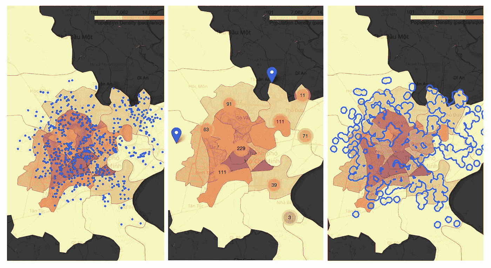
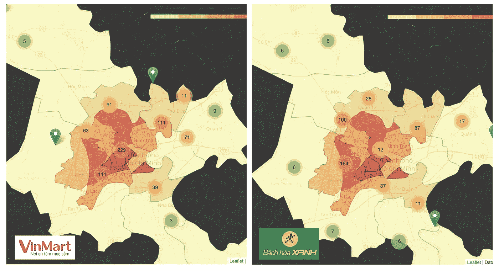
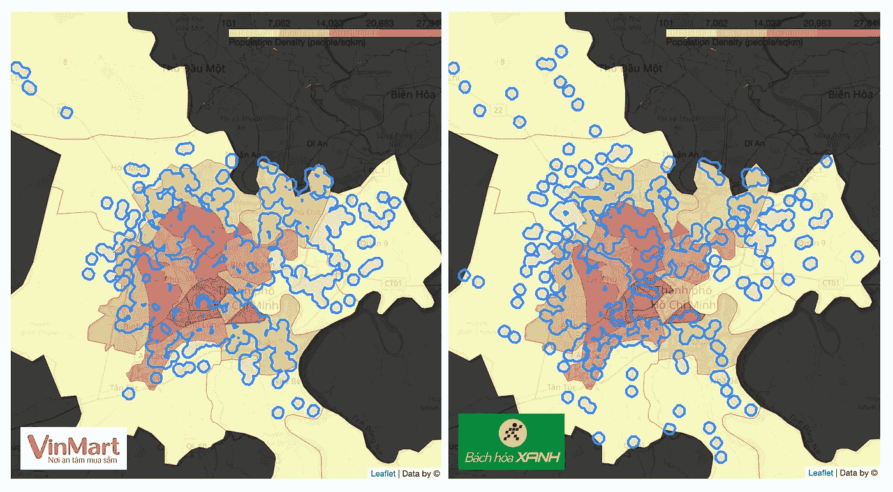
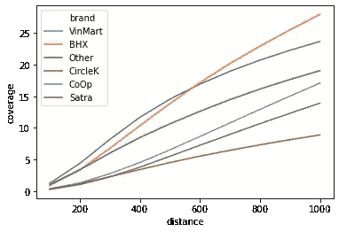
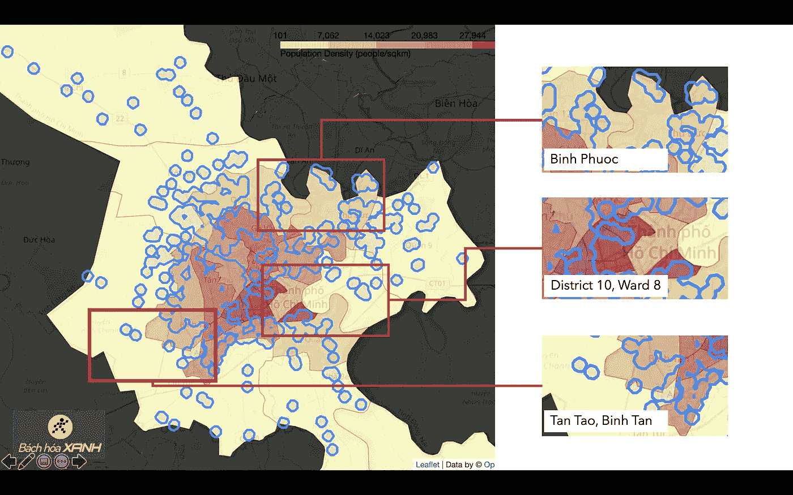
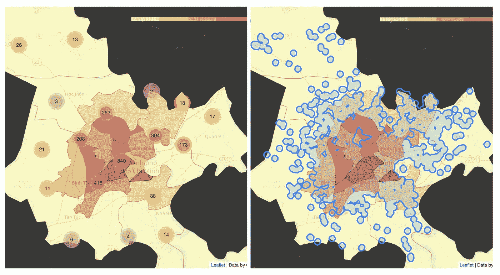

# 越南零售景观:零售足迹分析(下)

> 原文：<https://towardsdatascience.com/vietnam-retail-landscape-an-analysis-of-retail-footprint-part-2-3eae1db65889?source=collection_archive---------66----------------------->

## *一个品牌的门店足迹有多好？如何识别商场足迹中的差距？商店占地面积的所有缺口都需要填补吗？*

照片由[彼得·阮](https://unsplash.com/@peterng1618?utm_source=unsplash&utm_medium=referral&utm_content=creditCopyText)在 [Unsplash](https://unsplash.com/s/photos/map-vietnam?utm_source=unsplash&utm_medium=referral&utm_content=creditCopyText) 上拍摄

这篇博客文章是我在 IBM-Coursera 应用数据科学峰会上的后续工作。你可以查看第一部分以了解越南零售市场的概况、最初的问题陈述以及我的分析中使用的数据来源。

在上一部分中，我回顾了主要零售品牌在越南全国的商店足迹，并使用聚类技术找到了应该被视为具有吸引力的扩张市场的省份。正如我之前研究的数据一样，大多数商店位于河内和胡志明市(HCMC)也就不足为奇了——这是越南最大的市场。因此，在第二部分，我想深入了解这两个城市中每个品牌的商店网络。

对于这篇文章，我将主要讨论我对 HCMC 的研究结果，因为两个主要原因:(1) HCM 是更大的市场(考虑到两个城市之间的人口、人口密度和人均收入)；(2)河内市场由 Vinmart 商店主导，没有多少品牌可以与 Vinmart 竞争(在河内的零售商店中，不包括夫妻店，Vinmart 商店占 77%)，而 HCMC 的情况正好相反。

# **方法**

当深入研究 HCMC 的商店网络和位置时，我遵循了三个步骤:

*   **商场占地面积**:将商场分配分解到区级，并根据区级的人口密度审查商场密度
*   **地理覆盖范围**:比较不同品牌的店铺网络的地理覆盖范围，找出覆盖范围最好的店铺网络。对于此分析，覆盖范围定义为网络中每个商店给定距离内所有点的集合。这意味着顾客可以在给定的距离内进入零售店的区域。
*   **下一步何去何从:**确定城市中品牌应考虑开店的区域/位置，以增加其在城市中的覆盖面。

# 调查的结果

**1。商店占地面积**

为了探索这个方面，我研究了商店相对于同一网络中的其他商店以及城市中的人口密度的位置。例如:对于 Vinmart(超市和便利店网络)，我探索了如下不同的可视化:

从左至右:(1)店铺位置；(2)商店集群；以及(3)使用 HCMC 人口密度(人/平方公里，2019 年数据)choropleth 地图，HCMC VinMart 商店(包括超市和便利店)的商店覆盖范围(2020 年 6 月 30 日获得的商店数据)。

从左至右，地图显示 HCMC 人口密度(人口/平方公里，在地区一级，较深的颜色代表较高的密度)和:

*   [地图(1)](https://lbpham.github.io/mediumpost/VNretail/map1.1_vm_hcm.html) :网络中所有 Vinmart 商店的位置
*   [地图(2)](https://lbpham.github.io/mediumpost/VNretail/map1.2_vm_cluster.html):Vinmart 店铺群
*   [地图(3)](https://lbpham.github.io/mediumpost/VNretail/map1.3_vm_buffer.html) :店铺缓冲区:表示每个店铺 500 米范围内的所有点

*要查看上述地图的互动版本，请使用每张地图描述中包含的链接。*

看看 HCMC 店铺数量最多的两个品牌的店铺集群——[VinMart](https://lbpham.github.io/mediumpost/VNretail/map1.2_vm_cluster.html)和 [BachHoaXanh](https://lbpham.github.io/mediumpost/VNretail/map2_bhx_clusters.html) (BHX)，我们可以看到一个显著的区别:虽然 VinMart 店铺密集地位于市中心(80%的店铺)，但 BHX 店铺更分散，不太集中在最密集的区域(3 区、5 区、10 区和 11 区)。这种差异可能反映了关于其目标客户的品牌战略。

从左至右:( 1) VinMart 和(2)BHX(2020 年 6 月 30 日获得的商店数据)的商店集群地图，以及 HCMC 人口密度(人口/平方公里，2019 年数据)choropleth 地图。

**2。地理覆盖范围**

为了比较不同品牌商店网络的地理覆盖范围，我使用了 geopandas 中的 buffer 函数来获取同一网络中每个商店的给定距离内所有点的集合。

例如，上面的两张地图显示了从 [Vinmart](https://lbpham.github.io/mediumpost/VNretail/map1.3_vm_buffer.html) 和 [BHX](https://lbpham.github.io/mediumpost/VNretail/map2_bhx_buffer.html) 的每家商店 500 米范围内所有点的集合，这两家商店是 HCMC 商店数量最多的商店网络。难怪 Vinmart 商店大多位于人口密度较高的城市中心，基本上覆盖了中心区域。另一方面，尽管假定人口密度很高，但 BHX 的商店网络使得市中心相当大一部分区域没有商店。

从左至右:(1) VinMart 和(2) BHX 商店网络(2020 年 6 月 30 日获得的商店数据)与 HCMC 人口密度(人/平方公里，2019 年数据)choropleth 地图 500 米距离的商店覆盖范围。

为了进一步比较覆盖范围，我查看了 HCMC 不同品牌的每家商店在给定距离内(100 米到 1 公里之间)的面积百分比。交集和。geopandas 的面积函数。

不同距离(以米为单位)的地理覆盖范围(占 HCMC 总面积的百分比)衡量领先零售品牌在越南的表现

因此，该折线图显示了 HCMC 距离 HCMC 的 VinMart、BHX、CircleK、CoOp(包括 Coopfood 和 Coopsmile)、Satra 和其他零售品牌 100 米至 1 公里范围内的商店网络所占的百分比。

按照预期，商店数量越多，观察到的覆盖范围就越大。然而，唯一的例外是，BHX 在 600 米左右或更远的距离的覆盖范围方面超过了文马特，尽管 BHX 的商店比文马特少 20%。这可以用以下事实来解释:80%的 VinMart 商店位于市中心地区，而 BHX 的这一数字仅为 68%。因此，随着缓冲距离的增加，与 BHX 相比，VinMart 商店网络的覆盖范围增长速度较慢。

**3。接下来去哪里？**

***对于领先的零售品牌*** :利用缓冲和覆盖分析，公司可以识别其商店网络中的地理差距，并解决差距，以进一步加强其商店网络。

例如，下图显示了 BHX 商店网络的地理差距。如果 BHX 希望通过增加 500 米的覆盖范围来加强网络，该公司可以考虑在下图中突出显示的一些区域进一步开店。

左图:BHX 商店网络 500 米范围内的商店覆盖范围。右图:BHX 商店网络中的地理差距示例

商店占地面积中的所有缺口都需要填补吗？这取决于公司的战略和市场目标。

*   如果一个品牌的目标是让城市中的所有顾客都能在 10-15 分钟的步行距离内到达其商店，也许是的。
*   如果一个品牌的目标是在市场上有效竞争，它应该缩小位于高人口密度地区的差距，或者换句话说，位于更有潜力的细分市场。
*   如果一个品牌的目标是扩大其商店网络，同时支持其供应链网络，则应考虑进一步的标准。

***对于较小的零售品牌或新进入者*** :他们可以使用相同的技术来寻找其直接竞争对手的商店足迹的差距，或在市场上主要品牌的整体商店足迹中寻找机会。

从左至右:(1)商店集群，以及(2)主要品牌商店足迹 500 米距离内的商店覆盖范围，以及 HCMC 人口密度(人/平方公里，2019 年数据)choropleth 地图。

请随时分享您对此分析的宝贵意见。我很乐意看到你对这个分析和发现的想法和意见。