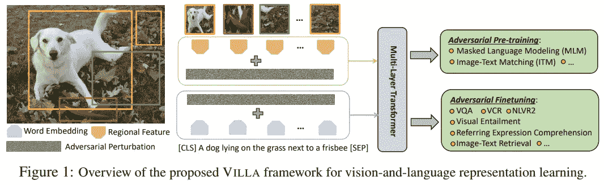

# 维拉:一种通用的视觉和语言对抗训练技术

> 原文：<https://towardsdatascience.com/villa-a-generic-adversarial-training-technique-for-vision-and-language-5e6cd5d3abd7?source=collection_archive---------69----------------------->

## 第一个用于图像和文本模型的多模态对抗训练技术

图片由来自 Pixabay 的 Gerd Altmann 提供

为视觉和语言多模态学习建立大规模预训练模型是近年来机器学习研究的一个热点。像 [UNITER](/uniter-d979e2d838f0) 、ViLBERT 和 LXMERT 这样的模型在数百万个具有不同目标函数的图像-文本对上进行训练，并且能够学习图像和文本的有效通用联合表示。

然后，这些表示在特定任务上进行微调，以在无数图像和语言任务上实现最先进的性能，如图像 QA、图像-文本检索、图像基础、图像推理等。在对特定任务进行微调时，可用的数据量只是所用预训练数据的一小部分。如此少量的数据通常会导致模型**过度拟合**，并打破了试图为图像和文本建立一个通用嵌入的目标。

那么我们如何防止这种过度拟合呢？针对图像和文本的单一模态任务的对抗性训练技术已被证明可以使模型更加健壮和可推广。这种培训可以通过以下方式进行

1.  创造人类可以理解的对立例子(如 Szegedy 等人)
2.  给嵌入空间增加对抗性扰动(如 [FreeLB](/freelb-a-generic-adversarial-training-method-for-text-92ac25828495) )。

将对抗性训练技术应用于多模态学习是对单模态技术的自然扩展，这正是微软动态 AI 365 研究的研究人员所做的。

他们提出了 **VILLA(视觉和语言大规模对抗性训练)**，这是第一个已知的针对视觉和语言设计的对抗性训练技术。VILLA 遵循第二种对抗性训练方法，因为他们的目标是建立一个健壮的模型，而不管人类是否理解对抗性的例子。对于文本模态，他们增加了对单词嵌入的对抗性干扰。先前关于图像对抗训练的工作向图像像素添加噪声，并且发现鲁棒性是以性能为代价的。在 VILLA 中，这些对立的扰动被添加到所提取的图像区域特征而不是像素，这提高了鲁棒性和性能。在训练期间，扰动一次仅添加到一个模态，而另一个模态保持不变，如图所示。

维拉还利用“免费”训练策略(沙法希等人，2019；Zhang et al. 2019)在计算输入的梯度时，几乎没有额外的成本就获得了参数的梯度。通过这种方式，模型可以在不增加成本的情况下看到更多的示例，并且培训变得更具成本效益。

对抗性训练技术通常确保对抗性示例的标签与原始示例的标签相同。VILLA 不仅试图做到这一点，还试图使用 KL-divergence 来匹配两个例子的预测类别概率。通过这样做，训练损失函数变得更平滑，并且模型可以更好地估计它。这进一步提高了模型的性能。

VILLA 可以应用于预训练和微调阶段，以提高学习嵌入的泛化能力。当应用于 UNITER-large 时，VILLA 进一步提高了其性能，在 VQA 上从 74.02%提高到 74.87%，在 VCR 上从 62.8%提高到 65.7%。集成后，VQA 性能进一步提高到 75.85%。维拉还在另外 4 项任务上将尤尼特的成绩提高到了最高水平。

VILLA 也是模型不可知的。它被应用于另一个大规模预训练模型 LXMERT，并在 VQA 上显示出性能的提高。

如果你想更详细地了解维拉是如何工作的，这里有一个[链接](https://arxiv.org/pdf/2006.06195.pdf)到论文，点击[这里](https://aka.ms/mmai)看更多他们的出版物和其他工作。

**参考文献**

1.  [日元-陈春](https://arxiv.org/search/cs?searchtype=author&query=Chen%2C+Y)、[李林杰](https://arxiv.org/search/cs?searchtype=author&query=Li%2C+L)、[李成玉](https://arxiv.org/search/cs?searchtype=author&query=Yu%2C+L)、[艾哈迈德·埃尔·科利](https://arxiv.org/search/cs?searchtype=author&query=Kholy%2C+A+E)、[费萨尔·艾哈迈德](https://arxiv.org/search/cs?searchtype=author&query=Ahmed%2C+F)、[哲甘](https://arxiv.org/search/cs?searchtype=author&query=Gan%2C+Z)、[于成](https://arxiv.org/search/cs?searchtype=author&query=Cheng%2C+Y)、[刘晶晶](https://arxiv.org/search/cs?searchtype=author&query=Liu%2C+J)、**统一者:学习通用的图像-文本表示法**、欧洲计算机视觉会议(ECCV) 2020
2.  J [iasen Lu](https://arxiv.org/search/cs?searchtype=author&query=Lu%2C+J) ， [Dhruv Batra](https://arxiv.org/search/cs?searchtype=author&query=Batra%2C+D) ， [Devi Parikh](https://arxiv.org/search/cs?searchtype=author&query=Parikh%2C+D) ， [Stefan Lee](https://arxiv.org/search/cs?searchtype=author&query=Lee%2C+S) ， **ViLBERT:预训练任务不可知的视觉-语言任务的视觉-语言表征**，arXiv 预印本，arXiv:1908.02265
3.  郝坦和莫希特·班萨尔， **Lxmert:从变形金刚**学习跨通道编码器表示，EMNLP 2019。
4.  C [赫里斯蒂安·塞格迪](https://arxiv.org/search/cs?searchtype=author&query=Szegedy%2C+C)，[沃伊切赫·扎伦巴](https://arxiv.org/search/cs?searchtype=author&query=Zaremba%2C+W)，[伊利亚·苏茨克弗](https://arxiv.org/search/cs?searchtype=author&query=Sutskever%2C+I)，[琼·布鲁纳](https://arxiv.org/search/cs?searchtype=author&query=Bruna%2C+J)，[杜米特鲁尔汉](https://arxiv.org/search/cs?searchtype=author&query=Erhan%2C+D)，[伊恩·古德费勒](https://arxiv.org/search/cs?searchtype=author&query=Goodfellow%2C+I)，[罗布·弗格斯](https://arxiv.org/search/cs?searchtype=author&query=Fergus%2C+R)，**神经网络的耐人寻味的性质** (2013)，arXiv 预印本，arXiv:1312。
5.  、[于成](https://arxiv.org/search/cs?searchtype=author&query=Cheng%2C+Y)、[哲干](https://arxiv.org/search/cs?searchtype=author&query=Gan%2C+Z)、[孙思齐](https://arxiv.org/search/cs?searchtype=author&query=Sun%2C+S)、[汤姆·戈尔茨坦](https://arxiv.org/search/cs?searchtype=author&query=Goldstein%2C+T)、[刘晶晶](https://arxiv.org/search/cs?searchtype=author&query=Liu%2C+J)、 **FreeLB:语言理解的强化对抗训练** (2019)，学习表征国际会议，ICLR 2020
6.  A.沙法希，m .纳吉比，a .吉亚西，z .徐，j .迪克森，c .斯图德，l .戴维斯，g .泰勒，t .戈尔茨坦，**对抗性训练免费！、神经信息处理系统**、NeurIPS 2019
7.  张定淮，张天元，陆，朱占兴，董斌，**你只传播一次:最大原理无痛对抗训练**，神经信息处理系统，NeurIPS 2019
8.  哲淦，晏，李林杰，诸宸，于成，刘晶晶，**视觉-语言表征学习的大规模对抗性训练**，arXiv 预印本，arXiv:2006.06195。