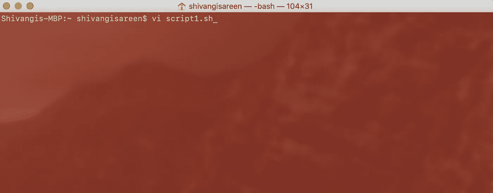
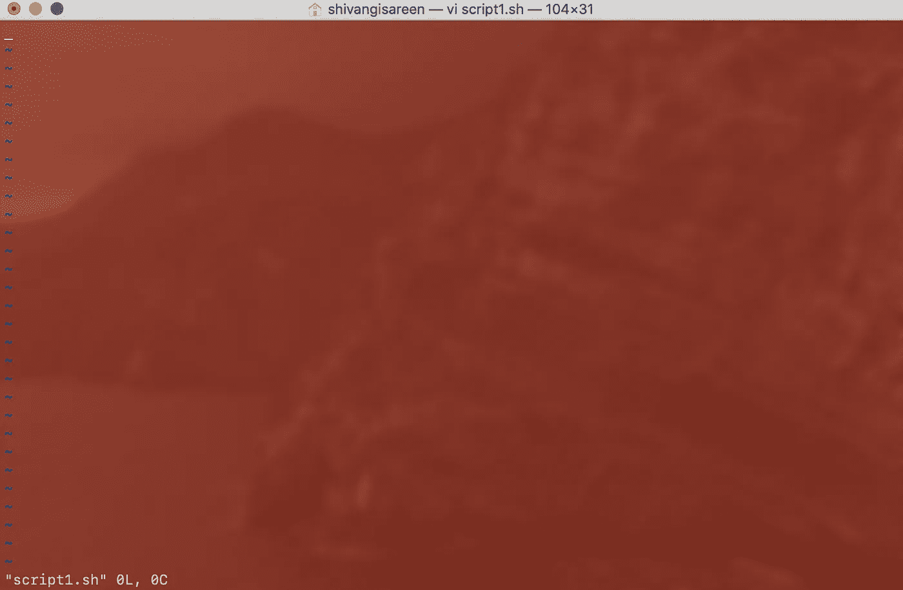
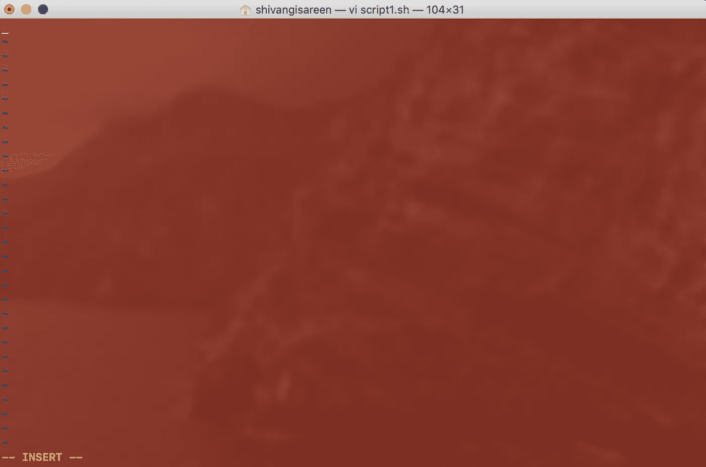
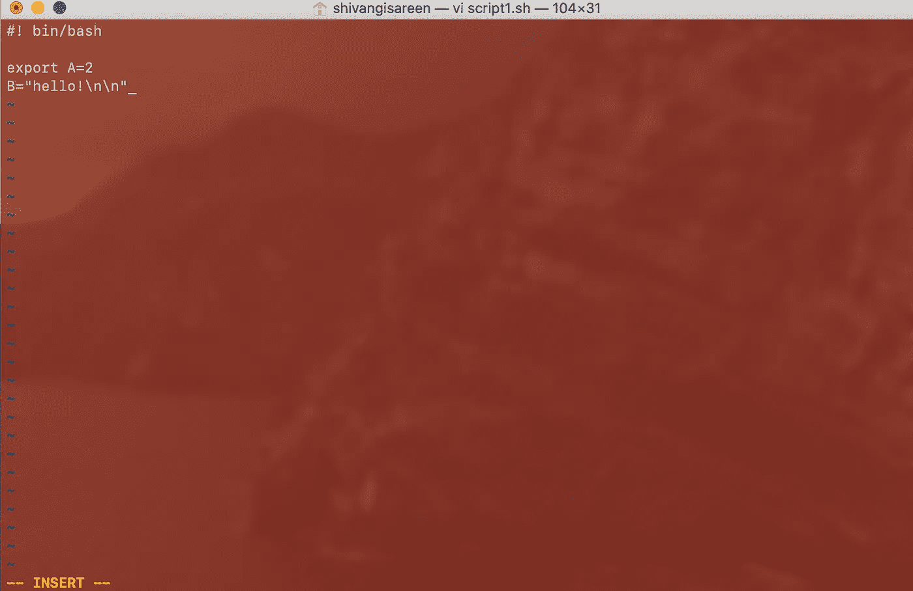
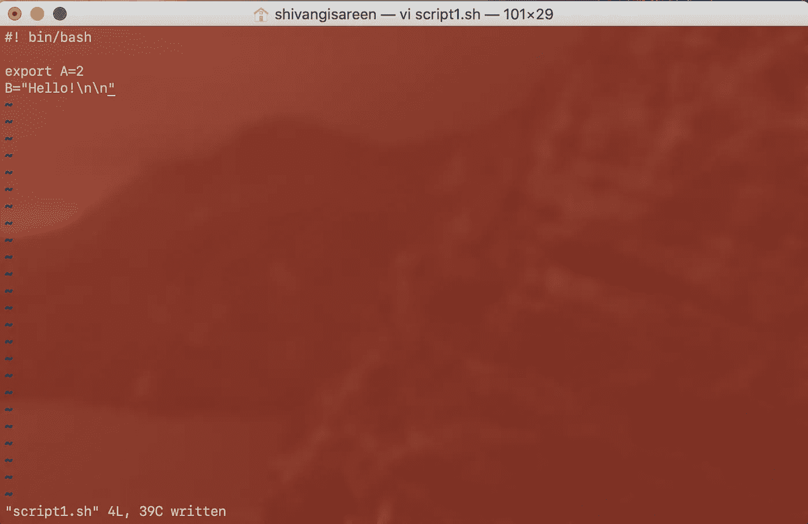
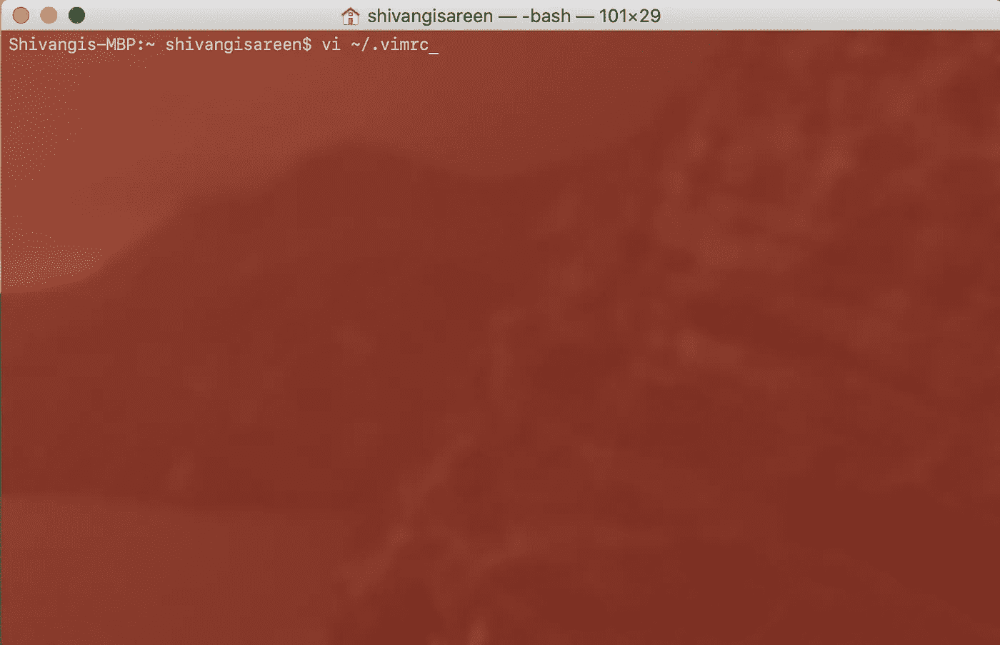
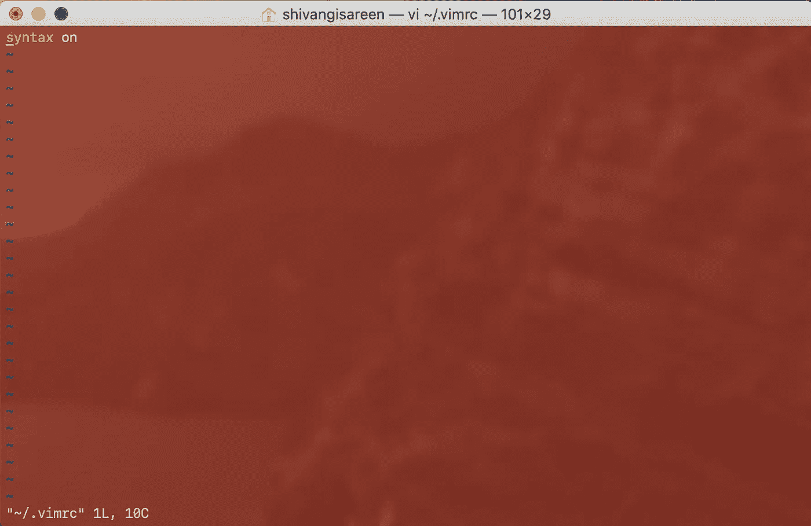
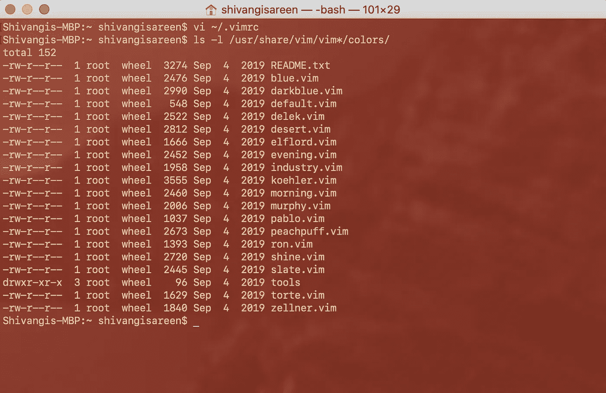
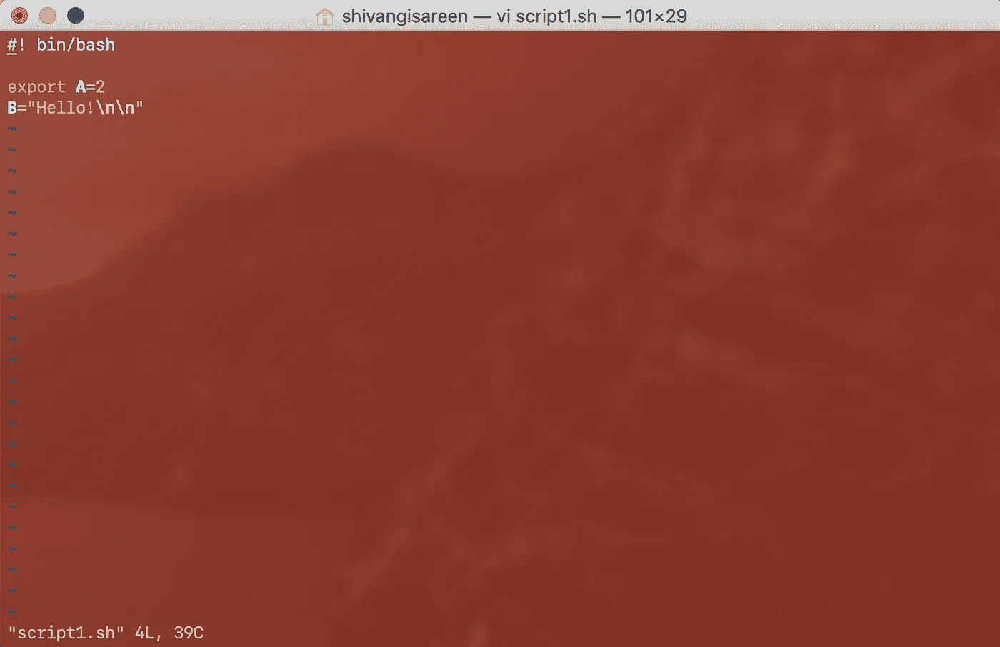
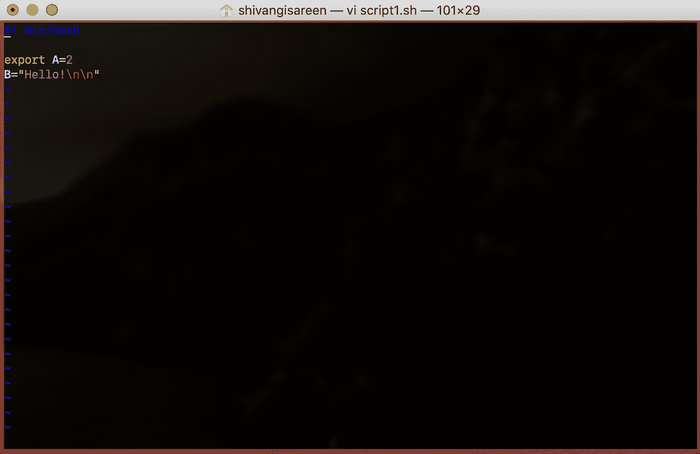

# “Vim —无处不在的文本编辑器”

> 原文：<https://towardsdatascience.com/vim-the-ubiquitous-text-editor-b4e09374df57?source=collection_archive---------39----------------------->

## Vim 很牛逼

[McDobbie Hu](https://unsplash.com/@hjx518756?utm_source=unsplash&utm_medium=referral&utm_content=creditCopyText) 在 [Unsplash](https://unsplash.com/s/photos/tech?utm_source=unsplash&utm_medium=referral&utm_content=creditCopyText) 上的照片

第一次遇到 Vim 时，我被通过命令行编辑文本的完全不同的方式所征服，以至于我没有再回头看它。

但是耐心地试验过之后，我就迷上了。Vim 有一些很棒的高级特性，我已经读到过，但还没有探索过。这篇文章是为了说服你并让你开始使用 Vim。我们将讨论基本命令，然后研究如何为 Vim 启用语法高亮显示。

vim(**V**I**IM**proven)是 Bill Joy 的 [vi](https://en.wikipedia.org/wiki/Vi) 文本编辑器程序在 Unix 和苹果 OS X 上的克隆版，可以在这里下载。

## 为什么使用 Vim？

当使用 bash 终端时，Vim 是必不可少的。例如，您可以直接使用命令行界面编辑像`.bash_profile`这样的文件。这是一项伟大的技能。作为一个高度可定制的文本编辑器，它可以被任何人使用——软件开发人员、数据分析师、数据科学家。这是一个免费的强大的工具，你不能把它扔出窗外。作为一个控制台编辑器，它与 shell 密切配合。这是熟悉 shell 的第一步，之后你就可以做程序员需要做的几乎所有事情了。

## 基本命令:

要在 Vim 中打开一个文件，在终端中键入`vi <name-of-the-file>`。我将使用一个空的`bash`脚本，`script1.sh`作为例子。

`vi script1.sh`:打开文件。

空文件- 0 行和 0 个字符

如果您尝试键入任何内容，将不会显示任何内容，因为它处于`NORMAL`模式。要编辑文件，按键盘上的`i`。这是进行编辑的`INSERT`模式。

注意窗口底部黄色的`INSERT`。

一旦你对这些变化感到满意，你就必须脱离`INSERT`模式。要在不同模式之间切换，我们使用`ESC`键。

保存:按下`ESC`和`:w`。

还可以看到写的行数和字符数。

保存后退出:`:q`

这两个命令可以组合为:`:wq`

不保存就退出:`:q!`

记得按`ESC`来切换模式！

## 语法突出显示:

永久地(因为，当然，我们不希望它是一次性的！)添加语法高亮，我们编辑`.vimrc`文件(隐藏文件)。

> `*.vimrc*`代表 **Vim 运行时配置**。当编辑器打开时，它保存编辑器的默认设置，允许用户自定义编辑器的选项。

为了在 Vim: `vi ~/.vimrc`
中打开`.vimrc`文件，这个文件驻留在您的主目录中，为了避免更改目录，我们添加了一个`~`(这是主目录的快捷方式)。

编辑文件:按`i`并添加`syntax on`。
`ESC`和`:w`保存。

当您保存时，您将在文件中看到语法高亮显示。
`:q`退出。

要获得可用配色方案的列表:

`ls -l /usr/share/vim/vim*/colors/`

这在你的根目录中，如果你想找到它，不要着急。`/usr`是一个隐藏的文件夹，按下`command` + `shift` + `.`就可以看到

现在，要对这些配色方案进行采样并选择您最喜欢的方案，请在 vim 中打开一个文件。

类型:`:colorscheme <name-of-colorscheme-to-test-out>`

按下`ENTER`。

> (诶，不喜欢)

不断尝试不同的方案，直到你选定了你最喜欢的方案！

请注意，通过 Vim 更改的配色方案仅适用于当前 Vim 会话，不会被保存。要永久使用特定的配色方案，我们必须将其添加到`.vimrc`:

`colorscheme <name-of-colorscheme>`

如果您想禁用配色方案，则按照上述相同的步骤编辑您的`.vimrc`文件，并将`syntax on`更改为`syntax off`。

自从我掌握了这个窍门，我就喜欢使用 shells 和 Vim。希望你也是！