# 蒂华纳市的暴力和当地商业

> 原文：<https://towardsdatascience.com/violence-and-local-business-in-the-city-of-tijuana-5cf018111f6d?source=collection_archive---------36----------------------->

## 在这项工作中，使用 Foursquare API 识别了提华纳的暴力街区，并找到了它们最常见的场所

*专业证书期末项目* [*IBM 数据科学*](https://www.coursera.org/professional-certificates/ibm-data-science)

*该报告的 pdf 版本在* [*my Github*](https://github.com/victor-onofre/Capstone-Project/blob/master/Tijuana_final_project.pdf) 中

# **1 简介**1.1 背景

T 伊瓜纳是墨西哥最大、发展最快的城市之一，2014 年有 340 万人口[1]，是美墨边境上最大的墨西哥城市。“这个城市是下加利福尼亚州大约 49 %人口的家园，而只占该州领土的大约 2%”[10]。蒂华纳每天接纳来自墨西哥其他地方的移民，增加近 96 名新居民。

蒂华纳是北美的医疗设备制造之都，一项研究估计，该地区约占该地区所有视听产品制造的 40%[34]。但是工作的丰富并不意味着生活质量的提高。根据国家社会发展政策评估委员会(CONEVAL，在西班牙语中是他的名字)2018 年的一项最新研究，近 70 %的人口生活在贫困状态中[9]，有很多工作岗位，但工资很低，社会流动条件很差。

鉴于该城市的地理位置，在过去几十年中，与贩毒和有组织犯罪集团有关的暴力事件有所增加[11]。这个城市也有很高的药物使用水平，这是由它靠近美国造成的，但仍然没有对真正问题的分析甚至数据[27]。毒品暴力继续在蒂华纳占据主导地位，2017 年的凶杀案比墨西哥其他任何城市都多，这是全国凶杀案数字创纪录的一年，2017 年，墨西哥 20 起谋杀案中有 1 起发生在蒂华纳。政府没有对该市的暴力事件进行简明的分析。这项工作是我希望成为简明分析的开始，从关注暴力对当地商业的影响开始。

## 1.2 个人动机

我在蒂华纳长大，在那里生活了 18 年。自从我有记忆以来，暴力一直是这座城市的一部分，生活在暴力最严重的街区之一(“Sanchez Taboada”)帮助我从年轻时就意识到了这一点。从我的个人经验来看，过一段时间你习惯了，暴力就变得正常了，是意料之中的，害怕被抢劫、被枪击，或者，对于女人来说，害怕被强奸，这种事情并不总是在你的脑海中出现，但它总是在你的背后，在袖手旁观。晚上在街上意味着危险，如果你听到你家附近有枪响，你不会报警，因为有时警察比罪犯更危险。在墨西哥其他城市的街道上行走的恐惧是我生活中的一个常数，我已经习惯了，我可以继续我的生活，但每次我去蒂华纳看望我的父母，我都很害怕，每次我回来，恐惧都成倍增长，就像暴力和贫困一样。举个例子，一年前，出租车和像优步这样的应用程序服务开始拒绝在晚上 7 点后去我的旧社区，因为害怕被抢劫或被杀。

我不想害怕我成长的城市，害怕墨西哥，我越来越需要了解影响它的问题。也许，如果我理解了这个城市的错综复杂，我的恐惧会开始成为一种燃料，以一种小的方式提供帮助，并最终提供做出真正改变的工具。那么，暴力事件上升的原因是什么？为什么我长大的地方是这个城市里比较暴力的地方之一？也许生活贫困是暴力的原因，或者是缺乏良好的司法系统，还是卡特尔的错？或者是我们社会基础中一个更深层次的问题？。这些问题必须由城市和政府的负责人来回答。但是在我过去几个月所做的研究中，我没有发现墨西哥政府
对提华纳暴力原因的明确调查。我发现的唯一明确的调查是“为墨西哥伸张正义”(Justice for Mexico)，这是一个总部位于美国的项目，有一些有趣的分析，但还有很大的发展空间。墨西哥政府的答案总是一样的，需要把“坏人”关进监狱，暴力就会消失，但这几十年来没有奏效，而且永远不会奏效[18，8]。

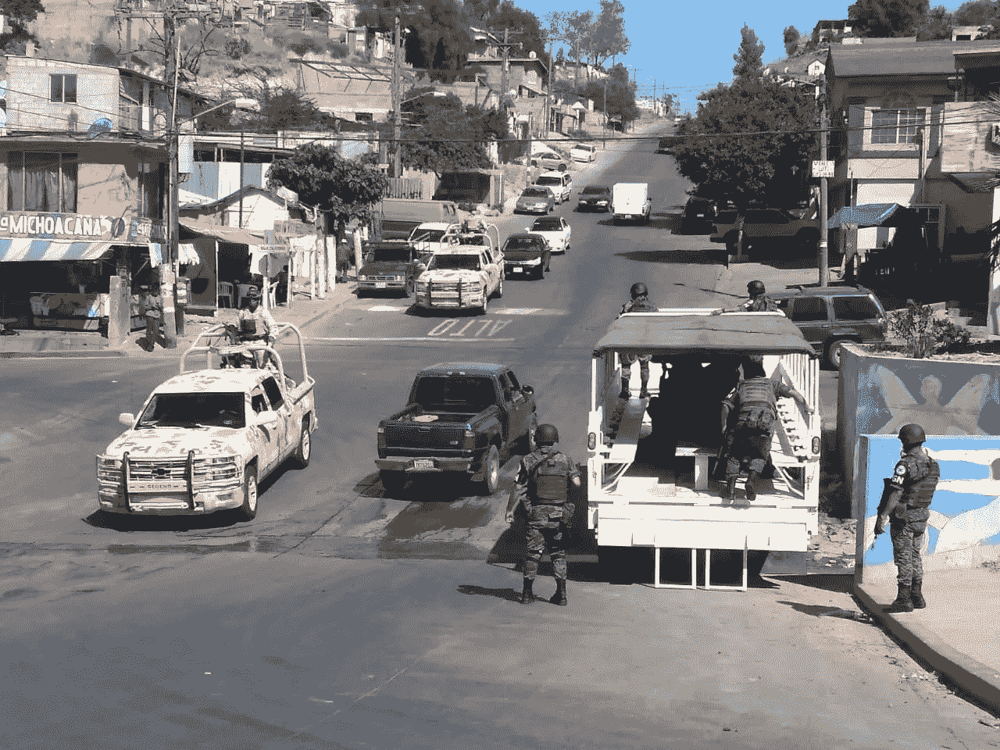

图 1:蒂华纳 Camino Verde 社区的国民警卫队[36]，这是新政府在过去一年里对暴力和移民危机增加的回应。许多人认为这是该国军事化的第一意图。图片来自[【36】](https://psn.si/guardia-nacional-comienza-patrullar-cv/2019/07/)。

## 1.3 问题

这个项目的大背景是分析蒂华纳的可用数据，犯罪、教育、移民和经济搜索暴力背后的故事；相关性在哪里？为什么某些街区的暴力事件会增加？这是一个雄心勃勃的项目，我知道这一点，我仍在学习数据科学，这种类型的分析对我来说是新的，但背后有这么多个人动机，我可以学得更快，同时找到有趣的结果。这个项目将被分成几个必要的部分，第一部分，我将在 Coursera“IBM 数据科学”专业的期末项目中展示，是关于提华纳暴力最严重的社区中暴力和当地商业之间的关系。问题是，在提华纳市暴力程度较高的社区，有哪些共同之处？

## 1.4 目标受众

什么类型的客户或人群会对这个项目感兴趣？

*   想要在暴力社区投资的企业家可以识别社区中缺失的商业类型。
*   负责该社区的当局可以看到机会之窗，帮助更常见类型的企业繁荣发展，提供信贷或管理指导。
*   居民可以更好地理解他们社区的数据

# 2 数据采集和清理

*本节使用的程序是在我的 Github 下面* [*这个链接*](https://github.com/victor-onofre/Capstone-Project/blob/master/Creating_the_dataframes_cleaning_data.ipynb)

## 2.1 犯罪

关于蒂华纳在线的数据很少，但由于几年前政府的新政策，更多的数据变得可用。在犯罪案件中，我只能在一个地方找到可用信息，即国家安全和国家调查卫队的官方网站(Guardia Estatal de Seguridad e investigación)，但这一信息非常不完整。让我们开始回顾数据集，引用
网站的话，“本节包含的数据库仅细分了被认为具有高度和中度影响的犯罪选择，这些犯罪威胁到人们的生命和完整性以及他们的遗产”，因此数据是不完整的，无法找到更完整的数据集。我尽了最大努力将犯罪数据从西班牙语翻译成英语，但在法律术语中，每项犯罪的定义可能会有一些差异。这些罪行的分类如下:

*   暴力和非暴力车辆盗窃
*   暴力和非暴力入室盗窃
*   暴力和非暴力的商业盗窃
*   在公路上暴力抢劫
*   公共场所的简单抢劫
*   其他没有暴力的抢劫
*   其他暴力抢劫
*   恶意伤人
*   非法伤害
*   凶杀(暴力)
*   绑架

正如你所看到的，分类遗漏了一些非常重要的犯罪，如敲诈勒索、杀害女性和性侵犯，这些在蒂华纳非常常见的犯罪[13，30，23]。出于某种原因，国家检察官不认为强奸属于“被认为具有威胁人的生命和完整性的高度和中度影响的犯罪”的类别。现在，为了理解数据库中包含的字段，需要做一些解释。首先，墨西哥各州划分为市，而不是像美国那样划分为县。蒂华纳是下加利福尼亚州的一个直辖市。蒂华纳市分为行政区或“代表区”。行政区又被划分为“殖民地”，对“殖民地”的最佳翻译是邻居。我将把我的分析集中在“Colonias”上，所以我将使用那个翻译。

*   犯罪:指已登记的犯罪
*   犯罪分类:指上面引用的犯罪分类。
*   犯罪地附近:指犯罪地附近。
*   犯罪记录日期:犯罪报告开始的日期。该日期用于根据月、日和年进行统计计数。
*   犯罪日期:犯罪发生的日期(有时与犯罪登记的日期不同)，因为犯罪可能在某一天报案，而在另一天实施。
*   犯罪时间:犯罪发生的时间。
*   自治市:犯罪登记的自治市。

这些数据的来源是州检察长，并由州情报中心统计协调处处理。

## 2.2 当地企业

鉴于某些社区的犯罪信息，我想探索这些社区的当地企业。我使用 **Foursquare API** 来获取一个给定街区的场地，但要做到这一点，我需要坐标。这比预期的要困难。我的第一个想法是使用城市的 12 个区(“Delegaciones”)并根据每个区的犯罪情况进行分析。这个想法给我带来的最大问题是，我找不到每个地区的社区列表。在蒂华纳都市规划研究所(IMPLAN)的官方网站上有一个交互式地图，您可以在其中选择区域，区域会出现在地图上[17]，但是在蒂华纳有 3000 多个社区，并且用这种方式寻找每个社区的每个社区太复杂了；令人惊讶的是，在蒂华纳政府的任何官方网站上，我都找不到更多关于该地区的信息。我能做的下一个最好的分析是集中在更暴力的社区。

现在，理解什么类型的本地企业是被期待的也是棘手的。例如，近年来所谓的医疗旅游浪潮如此之大，以至于该市在 2018 年接待了约 120 万名来自美国寻求健康治疗的患者。“咨询、程序、药物和手术的低成本——价格比美国低 30 %至 70%——使这座城市成为一个伟大的健康中心”[3]。

因此，预计会有许多药房，但也有许多非正规商业，据估计，蒂华纳超过 30%的企业是非正规的，因此 Foursquare API 可以提供的信息将无法提供该市当地企业的清晰画面。

## 2.3 街区坐标

为了获得每个邻域的坐标，我使用了 geopy，这是几个流行的地理编码 web 服务的 Python 2 和 3 客户端，geopy 使 Python 开发人员可以使用第三方地理编码器和其他数据源轻松定位全球各地的地址、城市、国家、
和地标的坐标[32]。问题是提华纳的许多社区似乎没有 geopy 中的坐标，结果是 NaN。目前的解决方案
是手动输入其余的坐标，问题是这里有超过 3000 个社区，所以我选择关注 100 个更暴力的社区。这一部分做了一些考虑:

*   Mariano Matamoros Centro 街区在谷歌或其他在线网站上没有坐标，所以我将其重命名为最近的街区，在这种情况下，Mariano Matamoros。
*   我找不到 Tres de Octubre 街区的坐标，问题是“Tres”，所以我把它改成了数字 3。
*   Obrera Seccion 1 和 Fraccionamiento Natura 街区存在与 Mariano Matamoros Centro 相同的问题，完成了相同的过程，在这种情况下，最近的街区是 Obrera 和 Fraccionamiento Hacienda las Delicias。
*   Sanchez Taboada Produsta 和 Sanchez Taboada 街区之间的划分是不存在的。这两个街区总是被视为一体，所以我也这样做了。
*   Foranea 和 Hacienda Las Fuentes 社区与 Mariano Matamoros Centro 有同样的问题，但这次我在任何在线地图上都找不到它们的位置。我决定从数据中剔除他们两个。

# 3 方法论

*本节中使用的直方图的程序在我的 Github 中如下* [*链接*](https://github.com/victor-onofre/Capstone-Project/blob/master/Methodology_crime.ipynb) *而对于地图* [*这个*](https://nbviewer.jupyter.org/github/victor-onofre/Capstone-Project/blob/master/maps_crimes.ipynb)

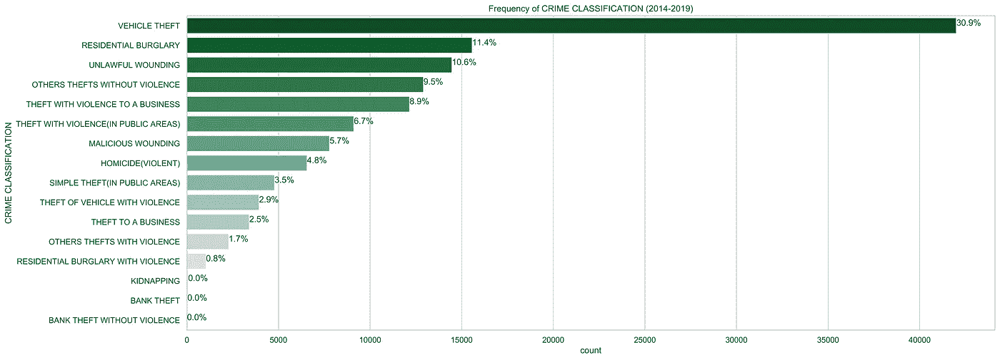

图 2:2014-2019 年期间犯罪分类的频率

下加利福尼亚州是全国汽车盗窃案的第一名[25]，在蒂华纳，这种犯罪的数量如此之大也就不足为奇了。对每一项犯罪的分析都很重要，但在这项工作中，重点将放在暴力犯罪上，特别是暴力盗窃和杀人。因此，我们可以将暴力犯罪的数据划分如下:

*   暴力抢劫(公共区域)
*   暴力盗窃生意
*   暴力盗车
*   其他暴力抢劫
*   暴力入室盗窃
*   恶意伤人
*   凶杀(暴力)

这些暴力犯罪仅占数据显示的犯罪总数的 31.49%，但这些类型的犯罪对城市生活的影响更大。

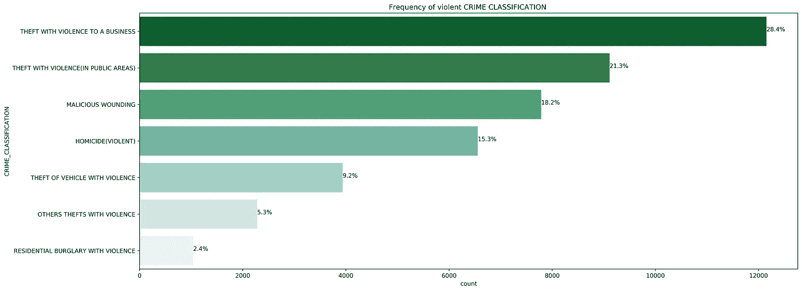

图 3:2014-2019 年期间暴力犯罪的频率

从图 3 中可以看出，对企业的暴力盗窃是更常见的犯罪，这是一个私营部门一直要求当局注意的问题[2]。

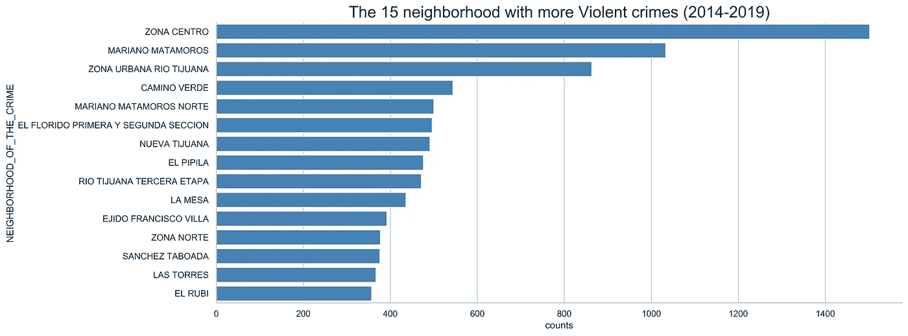

图 4:最暴力的街区正如所料，这份名单一直都是一样的

图 4 显示了 15 个最暴力的街区。图 5 显示了 100 个暴力程度较高的社区的犯罪数量集群，通过描述中的链接可以看到每个社区的犯罪数量。

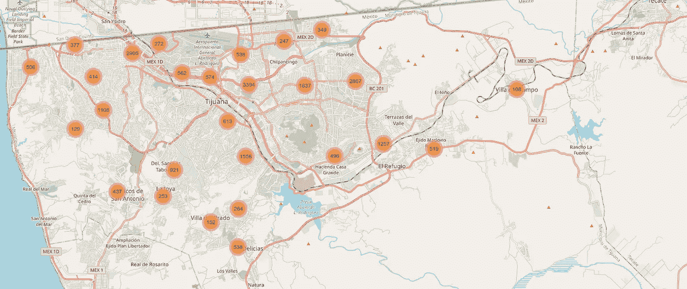

图 5:显示 100 个最暴力的社区和每个社区暴力犯罪数量的地图。点击[此链接](https://rawcdn.githack.com/victor-onofre/Capstone-Project/b53d7076d87109d42c45ad870a382c22f88cf2f1/violent_crimes_Tijuana.html)观看互动地图。

现在我们将关注:对企业的暴力盗窃和杀人；这些都是社区安全的有力指标。

## 3.1 暴力盗窃企业

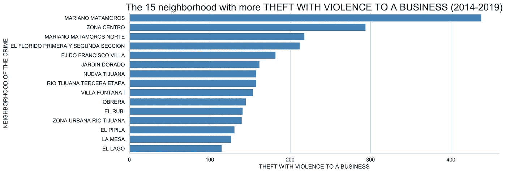

图 6:暴力盗窃案件数量最多的社区

在图 6 中，显示了 15 个对企业暴力盗窃较多的街区。图 7 是聚类图，其中红色表示此类犯罪数量较多。

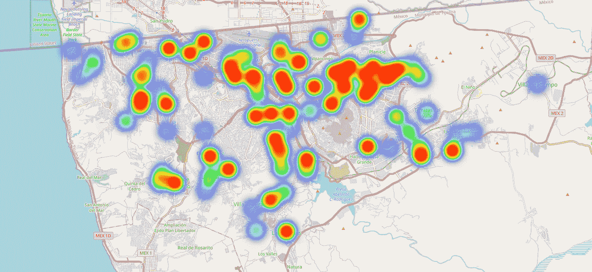

图 7:显示 100 个暴力程度较高的社区中针对企业的暴力盗窃数量的地图，
红色的强度意味着该区域的盗窃数量较高。点击[链接](https://rawcdn.githack.com/victor-onofre/Capstone-Project/804cf8f048646050dc5c7df6c79484458ee3ef73/THEFT_BUSINESS_Tijuana.html)观看互动地图。

图 8 显示了企业暴力盗窃的频率。我们可以看到，这种类型的犯罪在晚上更常见，在 0 点时有一个高峰。2017 年是对企业更危险的一年，2015 年是最危险的一年，2018 年和 2019 年没有变化。

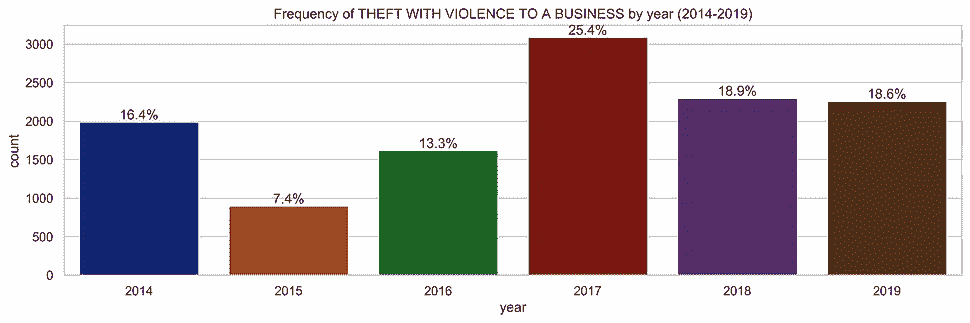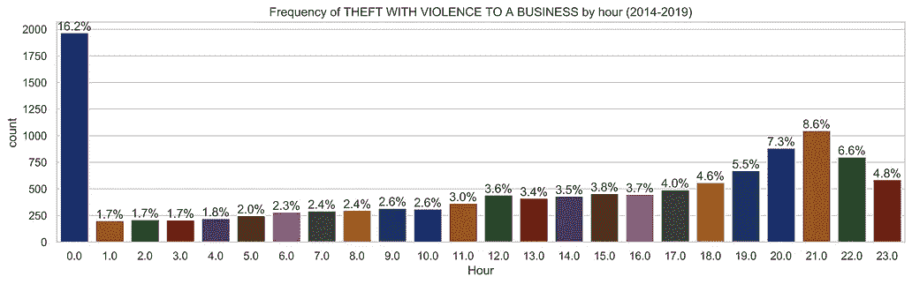

图 8:按年份和小时划分的暴力盗窃发生频率

## 3.2 凶杀案

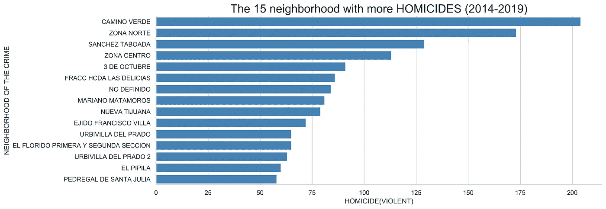

图 9:凶杀案数量最多的社区

图 9 显示了凶杀案较多的 15 个街区。图 10 是一个聚类图，其中红色显示了这类犯罪的高数量。

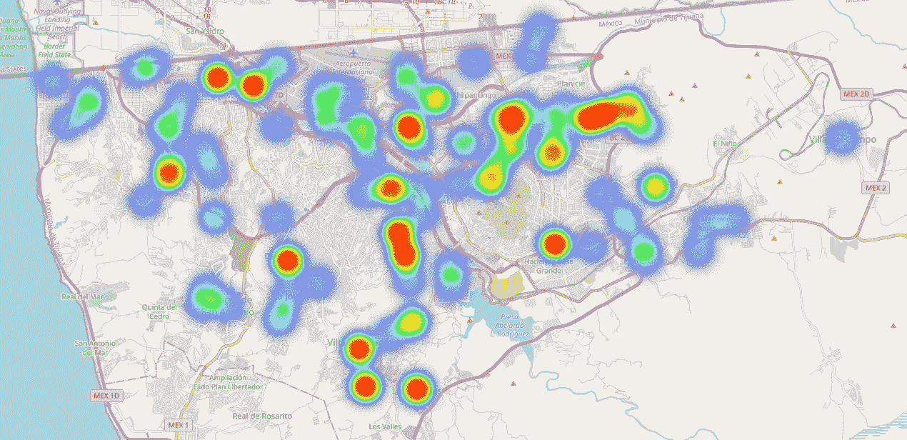

图 10:显示 100 个暴力程度较高的社区的凶杀案数量的地图，红色的强度表示该地区有更多的凶杀案。点击[链接](https://rawcdn.githack.com/victor-onofre/Capstone-Project/b53d7076d87109d42c45ad870a382c22f88cf2f1/Homicides_Tijuana.html)观看互动地图。

图 11 显示了凶杀案的发生频率。我们可以看到，令人惊讶的是，这种类型的犯罪通常发生在白天和下午高峰的 7、20、21 和 22 小时。2018 年是最危险的一年，2014 年是最危险的一年，2019 年显示出了一点好转。

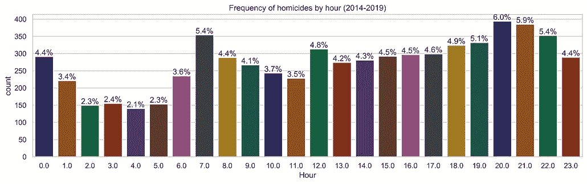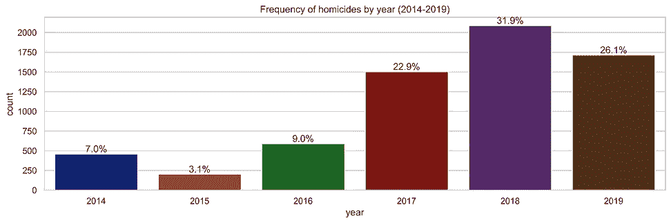

图 11:按年份和小时分列的凶杀频率

## 3.3 当地企业

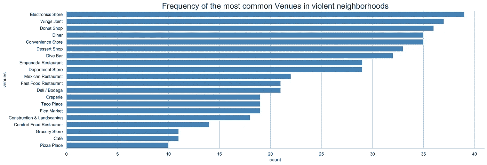

图 12:暴力社区中更常见场所的出现频率

图 12 显示了暴力街区中更常见的场所的出现频率。这张直方图是使用 Foursquare API 搜索该市 100 个暴力程度较高的社区中更常见的场所制作的。最常见的是电子商店，在 Foursquare 城市指南中快速搜索，主要是指智能手机及其配件和互联网提供商办公室的销售。第二和第三常见的是甜甜圈店和潜水酒吧。

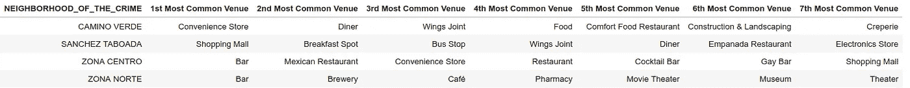

图 13:凶杀案较多的 4 个街区和最常见的地点

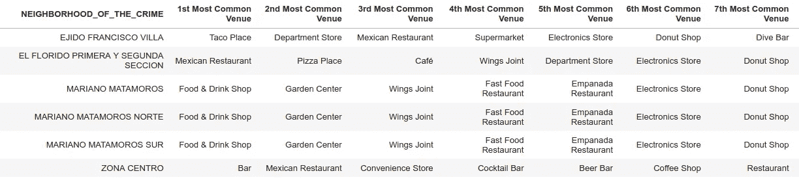

图 14:对企业实施暴力盗窃较多的 5 个社区及其常见场所

图 14 显示了凶杀案较多的 4 个街区中最常见的公共场所。更多的公共场所是酒吧和食品摊贩。

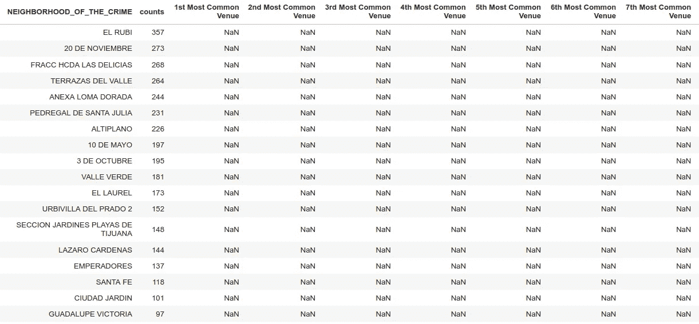

图 Foursquare API 在 18 个街区没有找到场地

图 15 显示了 Foursquare 中没有场地的 18 个社区。

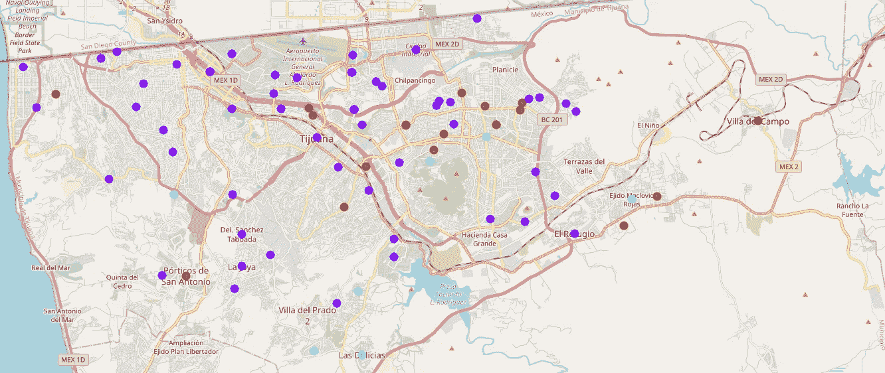

图 16:城市暴力街区中最常见场所的集群。紫色和红色的
点大多是餐馆和酒吧，绿色的点大多是便利店。点击[链接观看互动
地图。](https://rawcdn.githack.com/victor-onofre/Capstone-Project/39f0420ff1e9ce2b927cb1e84ed77fa58d5c8da2/Venues_Clusters_Tijuana.html)

# 4 结果和讨论

从数据中可以看出，凶杀案的数量在括号中伴随着暴力这个词。对我来说，这很奇怪，我找不到更多关于这种分类定义的信息。我能推断的是，这些数据只显示了被认为是暴力杀人的案件，其余的都被忽略了，这非常令人不安。不被认为是暴力的凶杀案的数量可能会更高。

关于社区中最常见的场馆的信息很少，18 个没有显示任何场馆。剩下的一个被认为是不完整的，考虑到城市中的非正规商业[33]非常高，Foursquare 基于用户输入，但 43 %的墨西哥人是数字文盲，只有 39 %的家庭有网络连接[16]。Foursquare 上提供的信息并不能展示该城市商业的全貌。

考虑到所有这些问题，我们可以看到更重要的本地商业都与食物有关:餐馆、甜点店和街头小吃。酒吧都在离边境最近的社区，至少在暴力地区是这样。

凶杀和暴力盗窃案件较多的 5 个社区如下:

**凶杀案(暴力)**

1.  绿色卡米诺
2.  北带
3.  桑切斯·塔博达
4.  中央区
5.  10 月 3 日

**暴力盗窃一家企业**

1.  马里亚诺·马塔莫罗斯
2.  中央区
3.  北马里亚诺·马塔莫罗斯
4.  埃尔弗洛里多 1 区和 2 区
5.  埃吉多·弗朗西斯科别墅

只有 Zona Centro 重复出现在两项犯罪的前 5 名中。考虑到凶杀率对一个社区的影响，我将把重点放在凶杀率较高的 5 个社区，并将这些数字放在上下文中。

**卡米诺·维德和桑切斯·塔博达**

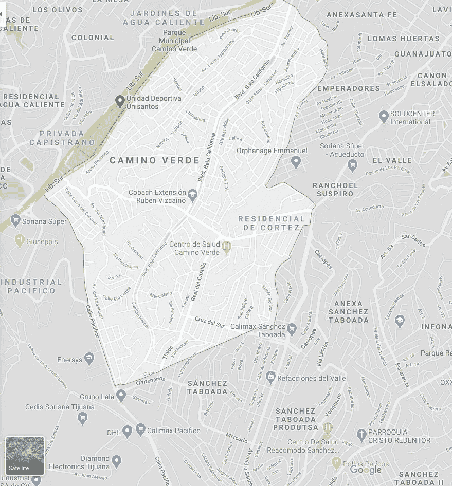

图 17:谷歌地图上的 Camino Verde 和 Sanchez Taboada 街区

在图 17 中显示了 Camino Verde 和 Sanchez Taboada 社区的地图，可以看出它们是并排的，没有明显的分界线。这两个街区可以被认为是一个凶杀率非常高的大区域。

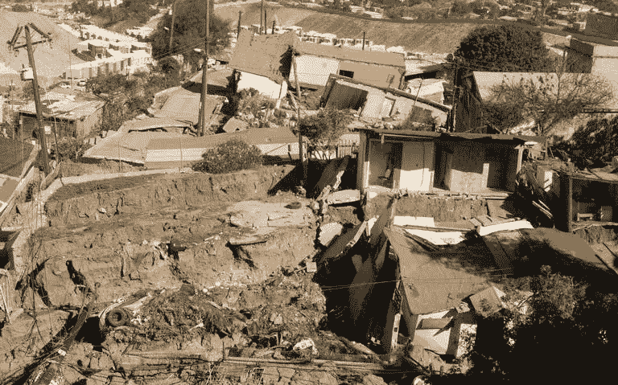

图 18:地质断层和下沉摧毁了 Sanchez Taboada 社区的数千所房屋。图片来自[【31】](https://www.elsoldetijuana.com.mx/policiaca/demoleran-casas-en-fraccionamiento-sanchez-taboada-jaime-bonilla-4632848.html)。

几年来，地质断层和下沉摧毁了 Sanchez Taboada 社区的数千所房屋[31，26]，导致大约 2000 人无家可归。暴力和吸毒对一个已经贫困的社区的影响还没有被调查过。

**北部区域和中部区域**

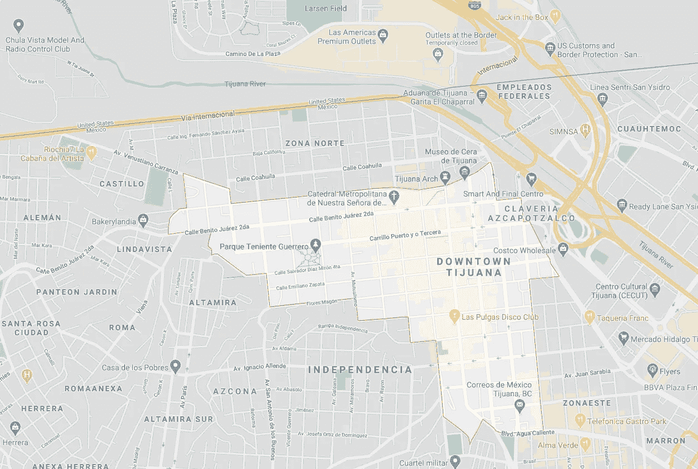

图 19:谷歌地图上的 Zona centro(蒂华纳市中心)附近

在图 19 中显示了 Zona Norte 和 Zona Centro 街区的地图，与 Camino Verde 和 Sanchez Taboada 相同，它们是并排的。它可以被认为是另一个大的暴力区域。Zona Centro 是该市最古老的街区之一，也是游客最多的地方之一，因为它靠近边境。

靠近北部区域和中部区域的是蒂华纳河，它至少从 20 世纪初就被用作废水管道。这条河的隧道里住着大量无家可归者、吸毒者和移民，他们正等着越境去美国或者已经被驱逐出境。这条河是暴力犯罪的热点。

北部区域是这个城市的红灯区。摘自报纸" La voz de la frontera "的一篇文章[15]:圣地亚哥州立大学的维克多·克拉克·阿尔法罗教授估计，蒂华纳是世界上与性旅游有关的一切都最繁荣的城市之一。专家指出，只有在城市的北部，有 2000 名性工作者在工作。这还不包括酒店、夜总会和出租车司机的员工，他们靠直接从国际线接游客为生。“这个地区的酒吧不仅有来自美国的顾客，还有来自欧洲的顾客，他们专门来寻求这种服务。从事性旅游的人是带着巨大的经济能力来到蒂华纳市的，”他说。许多受性服务驱使来到蒂华纳的游客的经济实力如此强大，以至于一些俱乐部和酒吧每天 24 小时都有一辆国际线路的豪华轿车，负责接送他们最尊贵的客户，并将他们直接送到容忍区。

没有官方数据显示它给这个城市带来的经济溢出。人口贩卖和毒品销售是这个地区的大问题，也是暴力犯罪的另一个热点。

十月三日

图 20:10 月 3 日街区的极端贫困。照片来自[【7】](https://www.facebook.com/TijuanaTelevisa/videos/la-3-de-octubre/416565892220378/)。

10 月 3 日街区是蒂华纳许多不规则形成的街区之一，只是占据了一部分土地。这导致了基本服务的缺乏，比如水、电力设施和许多其他服务。极端贫困是暴力犯罪的另一个热点。

# 5 个结论

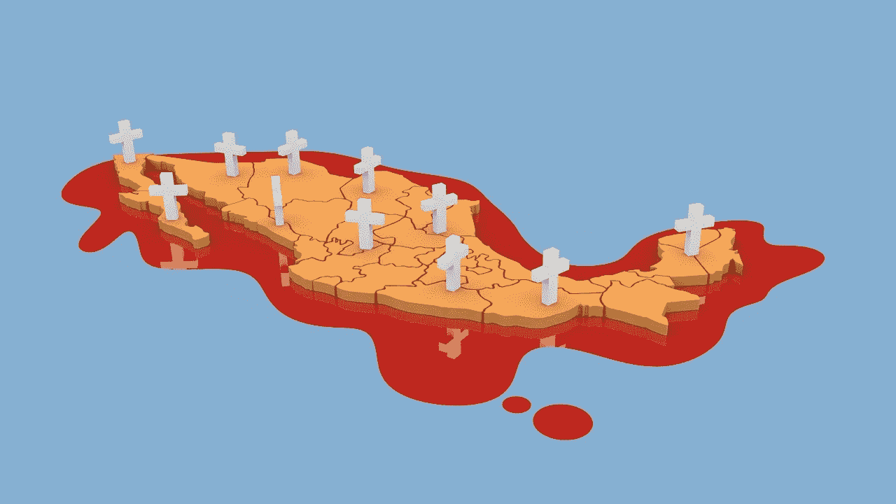

图 21:“在墨西哥，杀人容易，不进监狱难”[【24】](https://www.animalpolitico.com/muertos-mexico-homicidios-impunidad/)。图片来自 [Pixabay](https://pixabay.com/?utm_source=link-attribution&utm_medium=referral&utm_campaign=image&utm_content=1733711) (CC0)的[mizer _ X94](https://pixabay.com/users/Mizter_X94-2533164/?utm_source=link-attribution&utm_medium=referral&utm_campaign=image&utm_content=1733711)

在这项工作中，使用 Foursquare API 确定了蒂华纳最暴力的社区，并找到了它们最常见的场所，得出了以下结论:

*   在暴力街区，更重要的当地商业是酒吧和食品相关的，例如，餐馆、甜品店和街头小吃。在数据采集部分预测的药店的预期高数量是错误的。
*   鉴于墨西哥的数字文盲，从 Foursquare 获得的信息并不能展示该城市商业的全貌。
*   为了完成一部更完整的作品，需要该城市当地商业的完整数据。这些数据可以在政府部门找到。
*   更暴力的社区与贫困、卖淫、吸毒和移民有关
*   蒂华纳的暴力事件只是墨西哥正在发生的事情的一个例子，一个需要改变的失败的系统。例如，记者在《动物政治》上的研究发现:“在墨西哥，杀人很容易，而且永远不会进监狱。每 100 起谋杀案中，只有 5 起有人被定罪。如果我们只专注于寻找那些在 2010 年至 2016 年期间犯下杀人罪的人，我们将需要 124 年才能做到这一点，因为按照这个速度，墨西哥司法系统是有效的”[24]。

> “我不可能回墨西哥。我无法忍受身处一个比我的画更超现实的国家。”

著名画家萨尔瓦多·达利的这句话再好不过了，墨西哥是一个充满矛盾的国家。蒂华纳只是一个例子:尽管高度的不安全和暴力，这个城市仍然保持着稳定的经济增长。

# *参考文献*

[1]国家发展规划委员会。下加利福尼亚和城市人口。2014 年 1 月。网址:[http://www . copladebc . gob . MX/seis/pdf/apuntepoblacionbcymunicipiosene 14 . pdf](http://www.copladebc.gob.mx/seis/pdf/apuntePoblacionBCyMunicipiosEne14.pdf)pdf(2020 年 4 月 13 日访问)。

[2]Julieta aragón . preo cupa a empresioners robos a commercios，pes a Baja incidents in El Estado .2020 年 1 月 27 日。网址:【https://zetatijuana.com/2020/01/preocupa- a-empresarios-robos-a-comercios-pese-a-la-Baja-incidencia-en-El-Estado/(2020 年 4 月 16 日访问)。

[3]达罗·布鲁克斯。墨西哥的墨西哥旅游:蒂华纳是一个旅游胜地。2019 年 4 月 9 日。网址:[https://www.bbc.com/mundo/noticias-美洲-拉丁- 47809220](https://www.bbc.com/mundo/noticias-america-latina-47809220) (于 2020 年 4 月 16 日访问)。

[4] 尤金妮亚·希门尼斯·卡利斯。蒂华纳港,移民和吸毒者的家园。七月 31, 2014\. url: [https://www.milenio.com/politica/el-borde-de-tijuana-hogar-de-migrantes-y-吸毒者](https://www.milenio.com/politica/el-bordo-de-tijuana-hogar-de-migrantes-y-drogadictos) (访问 04/17/2020)。

[5] 格拉西拉·迪亚兹(Graciela Dìaz),马赫主义-制造-普塔斯(Machism-Fabrica-Putas)。url: [https://feminismoinc.org/2018/03/machismo-](https://feminismoinc.org/2018/03/machismo-)
fabrica-putas.html(访问于 2020 年 4 月 17 日)。

桑德拉·迪布尔。什么驱动 Tijuana's Next Major?2013 年 7 月 14 日,URL:[https://www.sandiegouniontribune](https://www.sandiegouniontribune).com/news/border-baja-california/sdut-what-drives-tijuanas-next-mayor-2013jul14-story.html(访问于 04/13/2020)。

[7] 拉斐尔·科罗拉多和埃德加·卡拉皮亚。10 月 3 日的。Feb 的。19,2019.url: [https://www.facebook.com/TijuanaTelevisa/videos/416565892220378/](https://www.facebook.com/TijuanaTelevisa/videos/la-3-de-octubre/416565892220378/)(访问时间 04/17/2020)。

[8] 以弗所 AMLO 的安全策略不起作用:专家;墨西哥将在 2019 年以更多暴力解雇
Dec.网址:[https://www.sinembargo.mx/22-12-2019/3700383](https://www.sinembargo.mx/22-12-2019/3700383)(访问于 04/13/2020)。

[9] 国家社会发展政策评估委员会(CONEVAL)。国家贫困 2018.2018.url:https : / / www 。Coneval。组织。mx / 协调 / 实体 / 下加利福尼亚州 / char / Pobreza_2018.aspx (visited on 04/13/2020).

[10] 奥克塔维奥·罗德·拉塔涅格斯·费雷拉和大卫·A。饰 Shirk 蒂华纳暴力犯罪的复苏:墨西哥司法的分析。May 18, 2018\. url: [https://justiceinmexico.org/el-resurrection-](https://justiceinmexico.org/el-resurgimiento-) del-crime-violento-en-tijuana-new-spanish-translation-of-justice-in-mexico-working-paper/ (visited on 04/13/2020)。

[美] 温迪·弗莱 Tijuana still Mexico’s bloodiest city 提华纳仍然是墨西哥最血腥的城市。毒品暴力 Blame Drug Violence 简。7,
2020 url: [https://www.latimes.com/world-nation/story/2020-01-07/tijuana-drug-violence](https://www.latimes.com/world-nation/story/2020-01-07/tijuana-drug-violence) (访问于 04/13/2020)。

[12] 大卫·加涅蒂华纳的警察腐败现象普遍存在:报告。Feb 的。18, 2016\. url: [https://es](https://es) .insightcrime.org/新闻/新闻- del-day/corruption-police-tijuana-generalized-report/ (visited on 04/17/2020)。

[13]胡安·米格尔·埃尔南德斯。杀害妇女，不受惩罚。02 月。http://www . elsoldetijuana . com . MX/local/murders-de-women-sin-un-punishment-489276 . html(访问日期:2020 年 3 月 4 日)。

[14]胡安·米格尔·埃尔南德斯。提华纳在经济上保持稳定。02 月。2，2019 . URL:[https://www](https://www)elsoldetijuana。-是啊。mx / local / tijuana —经济上保持—稳定— 3009856。html(于 2020 年 7 月 4 日访问)。

[15]胡安·米格尔·埃尔南德斯/。容忍区仍然存在于提华纳。八月 20，2019 . URL:https://[www . lavozdelafrontera . com . MX/local/tolerance zone-persistent-en-Tijuana-404833 . html](http://www.lavozdelafrontera.com.mx/local/zona-de-tolerancia-persiste-en-tijuana-4064833.html)(访问日期:2020 年 7 月 4 日)。

[16] idc。43 %的墨西哥人是数字文盲。打开它。8，2019\. url: https : / / idconline。MX/corporate/2019/04/08/43-de-los-Mexican-son-文盲-数字(访问日期:2020 年 7 月 4 日)。

[17]部署。2014 年各国代表团/2014 年殖民地基本地图。2014 . URL:[http://implan . Tijuana . gob](http://implan.tijuana.gob)。MX/services/map/map . aspx(访问时间:2004/17/2020)。

[18]卡洛斯·加西亚。墨西哥的劳动者洛佩斯安全策略有什么缺陷？七个。5，2019\. url: https : / /当前。rt 你好吗？com/current/326183-故障-战略-安全性-Lopez-labor-Mexico(访问日期:2020 年 13 月 4 日)。

[19]劳拉·桑切斯·雷。-卖淫。提华纳的儿童地狱。02 月。页:1。elnivasal . com . MX/article/States/2016/02/28/prostitution-El-hell-infantil-in-Tijuana # image-1(访问日期:2020 年 4 月 17 日)。

[20]米格尔马歇尔。提华纳和贸易的未来。2015 年 5 月 7 日，URL:[https://www . weforum . org/agenda/](https://www.weforum.org/agenda/)2015/05/Tijuana-and-the future-of-trade/(访问日期:2020 年 13 月 4 日)。

[21]安东尼奥玛雅。在桑切斯塔布达发生的抢劫和暴力事件。2019 年 5 月 4 日，URL:[https://www . elsoldetijuana](https://www.elsoldetijuana)com . MX/policia/assault-y-violence-en-Sanchez-tabada-3570659 . html(访问日期:2020 年 13 月 4 日)。

[22]伊莎贝尔市场。在当局的漠视下，边缘再次被重新定位。2017 年 7 月 24 日，URL:https://zeta Juana。com/2017/07/ante----对当局无动于衷----返回----重新部署/(访问日期:2020 年 7 月 4 日)。

[23] 亚当·蒙德拉贡在下加利福尼亚州,有超过 7,800 起强奸和 18,000 起性犯罪。Aug。17,2019.url: [https://cadenanoticias.com/regional/2019/08/en-baja-california-mas-de-7-mil-](https://cadenanoticias.com/regional/2019/08/en-baja-california-mas-de-7-mil-)800-强奸和 18-mil-性犯罪(访问 04/13/2020)。

[24] 政治动物在墨西哥杀人:有罪不罚的保证。六月 19, 2019\. url: [https://www.animalpolitico.com/muertos-mexico-凶杀案-有罪不罚/](https://www.animalpolitico.com/muertos-mexico-homicidios-impunidad/) (访问于 04/17/2020)。

[25] Lourdes Loza Romero。BC:汽车盗窃的第一个国家。Apr。13,2020 URL:https :/ / zetatijuana 。com / 2020 / 04 / bc — 第一 — 地方 — 国家 — 在 — 盗窃 — 从 — 车 / (访问 04/16/2020).

[26] 丹尼尔·安赫尔·卢比奥迫切需要在 Sánchez Taboada 重新安置 2,000:Rosas。Dec。22, 2019\. url: https : // [www.elsoldetijuana.com.mx/local/urge-](http://www.elsoldetijuana.com.mx/local/urge-) 重新定位- a- 2-mile-en-桑切斯-塔布阿达-玫瑰- 4619362.html (访问 04/17/2020).

[27] 格伦·桑切斯蒂华纳需要研究成瘾。七个。26,2019.url: [https://www.elimparcial](https://www.elimparcial) .com/tijuana/tijuana/Tijuana-required-studio-de-瘾-20190926-0005.html (visited on04/13/2020)。

[28] 国家安全和调查警卫队。犯罪行为数据库。url: [https://www.seguridadbc.gob.mx/content/statisticas3.php](https://www.seguridadbc.gob.mx/contenidos/estadisticas3.php) (visited on 04/13/2020)。

[29] 辛提斯,在你脚下。url:https : / / synesistv 。com。mx /卖家 - 街头小贩 - 在 - 的 - 不规则 - 通过 - 延迟 - 通过 - 约会/下 5 / (visited on 04/17/2020)。

[30] 提华纳的太阳他们在 BC 的电话勒索中筹集了大量资金。May 4, 2019.url:https : / / www 。Elsoldetijuana。com。mx / 本地 / 增加 — 金额 — 从 — 钱 — 在 — 勒索 — 电话 — 从 bc-3573103.html (visited on 04/13/2020).

[31] 提华纳的太阳。他们将拆除 Sánchez Taboada 分裂的房屋。Dec。2018 年 2 月 28 日,URL: [https: / / www 。Elsoldetijuana。com。mx / 警察 / 拆除 — 房屋 — 在 — 分割 — 桑切斯 — —
taboada-jaime-bonilla-4632848.html](https://www.elsoldetijuana.com.mx/policiaca/demoleran-casas-en-fraccionamiento-sanchez-taboada-jaime-bonilla-4632848.html) (visited on 04/17/2020).

[32]python geooding toolbox . geo 1 . 21 . 0 .2018 . URL:[https://pypi . org/project/geo/](https://pypi.org/project/geopy/)(访问时间:2020 年 13 月 4 日)。

[33]卡琳·托雷斯。非正规贸易造成了数百万美元的损失:卡纳克。八月 7，2019 . URL:https://[www . elsoldetijuana . com . MX/local/commerce-](http://www.elsoldetijuana.com.mx/local/comercio-)非正式-代表损失-百万美元-canaco-4005433.html(访问日期:2020 年 7 月 4 日)。

[34]美国-墨西哥研究中心。无边界的工作:就业、工业集中，以及在卡利巴地区的比较优势。2014 . URL:[https://usex . ucsd . edu/_ fil/2014 _ report _ jobs withoutdaters . pdf](https://usmex.ucsd.edu/_files/2014_report_jobswithoutborders.pdf)(访问时间:2020 年 13 月 4 日)。

[35]戴维·维森特诺和德国瓦努阿图。国民警卫队是国家的军事化:联阿援助团的学者。-简！10，2019 . URL:[https://www . excelsior . com . MX/national/guard-es-la-](https://www.excelsior.com.mx/nacional/guardia-nacional-es-la-)军事化-del-Pais-academic-de-la-unam/1289456(访问日期:2020 年 4 月 16 日)。

[36]卡罗莱纳·巴斯克斯。国民警卫队开始沿绿线和桑切斯塔布达巡逻。2019 年 7 月 12 日，URL:[https://psn . si/Guardia-national-start-patrol-cv/2019/07/](https://psn.si/guardia-nacional-comienza-patrullar-cv/2019/07/)(访问日期:2020 年 4 月 16 日)。

[37]劳拉·沃登贝格。被驱逐者的炼狱。2013 年 6 月 9 日，URL:[https://www . vice . com/es _](https://www.vice.com/es_)latam/article/z9 JMX/El-purgatorio-de-los-expulsado-0000410-v6n4(访问日期:2020 年 17 月 4 日)。

[38]奥斯瓦尔多·扎瓦拉。国民警卫队和边境军事化。2019 年 7 月 12 日，URL:https://[www . process . com . MX/592118/la-Guardia-national-y-la-armitation-de-las-fronteras](http://www.proceso.com.mx/592118/la-guardia-nacional-y-la-militarizacion-de-las-fronteras)(访问日期:2020 年 4 月 16 日)。