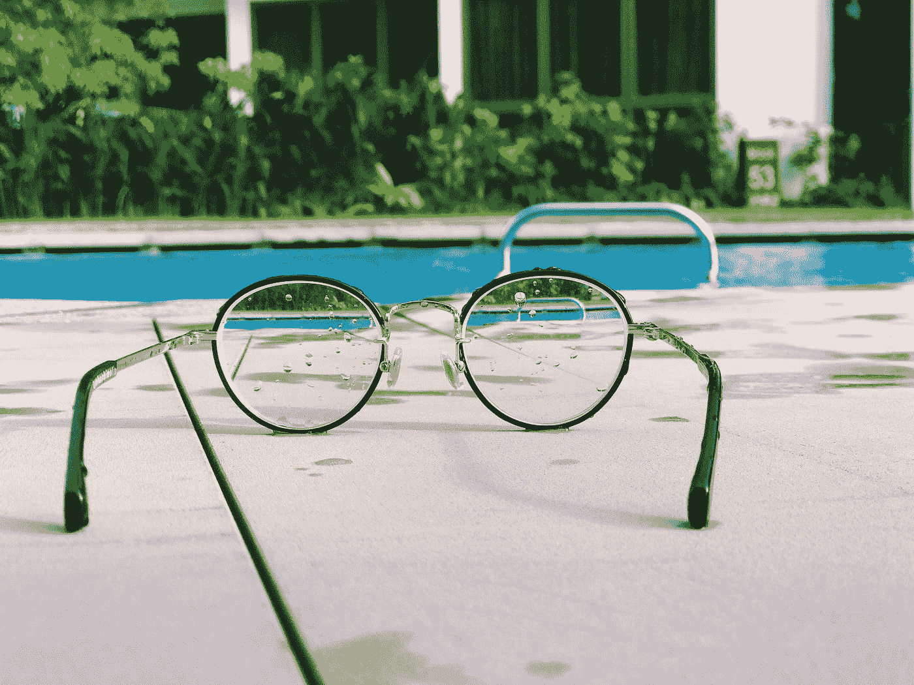
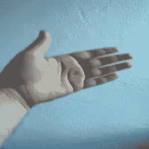
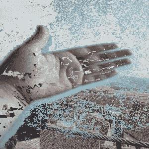

# Python 和 OpenCV 中视频会议的虚拟背景——一种愚蠢的方法

> 原文：<https://towardsdatascience.com/virtual-background-for-video-conferencing-in-python-and-opencv-a-silly-approach-5f5ad1a5abef?source=collection_archive---------24----------------------->

用 Python 和 OpenCV 创建视频会议的虚拟背景。基本方法教程和思想。



[timJ](https://unsplash.com/@the_roaming_platypus?utm_source=medium&utm_medium=referral) 在 [Unsplash](https://unsplash.com?utm_source=medium&utm_medium=referral) 上的照片

虚拟背景是目前远程工作的员工的热门话题之一。由于新冠肺炎疫情，我们中的一些人目前被隔离，许多人不得不进行视频通话，以便继续他们的工作。一些用于视频会议的软件工具允许设置虚拟背景，以便用户可以为接听这些电话营造更友好的氛围。

作为一名程序员，我第一次使用这样的虚拟背景时，自然被激起了兴趣。我想知道它是如何工作的。我能建立这样的虚拟背景吗？如果是的话，我该怎么做？*剧透:进展不顺利！尽管如此，我认为这是一个很好的教育练习，在研究这个话题的时候，我没有找到太多的信息。因此，正如我对所学的一切所做的那样，我决定把它记录在这里，也许其他人会从中受益。*

因此，在本教程中，我们将尝试一种用计算机视觉技术构建虚拟背景的基本方法，使用 Python 和 OpenCV。

# 介绍

这个项目的目标是拍摄一段视频，试着找出视频的背景和前景，去掉背景部分，用一张图片代替——虚拟背景。因为在这个项目中，我们将使用平凡的方法，我们将需要假设，在一般情况下，前景将有不同于背景的颜色。但是首先，让我们看看我们的工具是什么。

## 计算机视觉

计算机视觉是一个跨学科领域，研究计算机如何处理和(也许)理解图像和视频。我们说它是一个*跨学科*领域，因为它从不同学科(计算机科学、代数、几何等等)借用了很多概念，并将它们结合起来解决了很多不同的复杂任务，比如图像和视频中的**对象跟踪**、**对象检测、** **对象识别**、**对象分割**。

## OpenCV

[**OpenCV**](https://opencv.org/) 是为解决计算机视觉任务而构建的库。它是开源的，可用于几种编程语言，包括 Python 和 C++。它有大量的计算机视觉功能，其中一些基于数学和统计方法，另一些基于机器学习。

## 计算机编程语言

如果您已经阅读了本文，那么您可能知道 Python 是什么😀

# 构建虚拟背景

我尝试的方法如下。我将展示每一步的代码片段，在文章的最后，您将看到完整的代码。

1.  导入依赖项

```
import numpy as np
import cv2
```

2.从本地环境加载视频并初始化数据

```
ap = cv2.VideoCapture('video6.mp4')
ret = True
frameCounter = 0
previousFrame = None
nextFrame = None
iterations = 0
```

3.从本地环境加载替换背景图像

```
backgroundImage = cv2.imread("image1.jpg")
```

4.逐帧分割视频

```
while (ret):
	ret, frame = cap.read()
```

5.取每一对两帧

```
if frameCounter % 2 == 1:
            nextFrame = frame if frameCounter % 2 == 0:
            frameCounter = 0
            previousFrame = frame frameCounter = frameCounter + 1
        iterations = iterations + 1
```

6.求两帧的绝对差值并转换成灰度->获取蒙版。

```
if iterations > 2:
            diff = cv2.absdiff(previousFrame, nextFrame)
            mask = cv2.cvtColor(diff, cv2.COLOR_BGR2GRAY)
```

每幅图像都由像素组成——你可以把它想象成一个由行和列组成的 2D 矩阵，矩阵中的每个单元都是图像中的一个像素(当然，对于彩色图像，我们有不止 2 个维度，但为了简单起见，我们可以忽略这一点)。

我们通过在第一幅图像中逐个像素地(在第一矩阵中逐个单元地)替换另一幅图像中的相应像素(在另一矩阵中的相应单元)来获得差异。

这里有一个窍门:如果在两帧之间，一个像素没有被修改，那么结果当然会是 **0** 。*2 帧之间像素怎么会不一样？*如果视频是完全静态的(图像中没有任何东西移动)，那么所有像素的每一帧之间的差异将为 0，因为没有任何东西发生变化。**但是，如果图像中有物体移动，那么我们可以通过检测像素差异来识别物体在图像中的移动位置。我们可以假设，在视频会议中，移动的东西在前景中——也就是你——而静止的部分是背景。**

还有这个 **0** 有什么重要的？图像中每个为 0 的像素将显示黑色，我们将利用这一点。

7.找到遮罩中超过阈值的单元格—我选择了 **3** 作为阈值，但是您可以使用不同的值。较大的值将从背景中移除更多，但也可能从前景中移除更多。

```
th = 3
            isMask = mask > th
            nonMask = mask <= th
```

8.创建一个空图像(每个单元格为 0)，大小为两个帧中的任意一个。

```
result = np.zeros_like(nextFrame, np.uint8)
```

9.调整背景图像的大小，使其与框架大小相同。

```
resized = cv2.resize(backgroundImage, (result.shape[1], result.shape[0]), interpolation = cv2.INTER_AREA)
```

10.对于遮罩中大于阈值的每个单元，从原始帧复制。

```
result[isMask] = nextFrame[isMask]
```

11.对于低于阈值的遮罩中的每个单元格，从替换背景图像中复制。

```
result[nonMask] = resized[nonMask]
```

12.将结果帧保存到本地环境。

```
cv2.imwrite("output" + str(iterations) + ".jpg", result)
```

# 结果和结论

那么结果如何呢？老实说，我对这个结果有点失望。然后我做了更多的研究，原因变得更加明显。你需要更先进的方法来解决这个问题，大公司在这类问题上投入大量资源也就不足为奇了。

下面是我试的视频截图。基本上就是我的手在墙前移动的视频。



虚拟背景 Python 和 OpenCV 教程—输入

这是输出图像的截图。作为背景，我用了一张我在罗马尼亚拉斯诺夫的照片。



虚拟背景 Python 和 OpenCV 教程—输出

正如我所说的，我对结果不是很满意。但是我对从这个项目中学到的东西很满意。这是一次有趣的学习经历，也是一种很好的方式来花时间处理我不习惯处理的概念。

# 创建虚拟背景的其他方法

如果你认为一个问题非常复杂，需要你在计算机软件中看到的不寻常的智能水平，那么答案可能是机器学习。😀

已经有深度学习模型可以执行这种任务。但是这样一个模型需要大量的数据集来训练和大量的处理能力，而在我写这篇文章的时候，我还没有这样的能力。这样的深度学习模型要解决的任务叫做图像分割。

另一种方法是计算机视觉方法，用于寻找照相机和图像中的物体之间的距离。然后你可以建立一个阈值来区分前景和背景。在那之后，你可以使用我用来移除背景的相同遮罩，并引入一个新的遮罩。

*本文原载于* [*程序员背包博客*](https://programmerbackpack.com/virtual-background-python-opencv/) *。如果你想阅读更多这类的故事，一定要访问这个博客。*

*非常感谢您阅读本文！对更多这样的故事感兴趣？在 Twitter 上关注我，地址是*[*@ b _ dmarius*](https://twitter.com/b_dmarius)*，我会在那里发布每一篇新文章。*