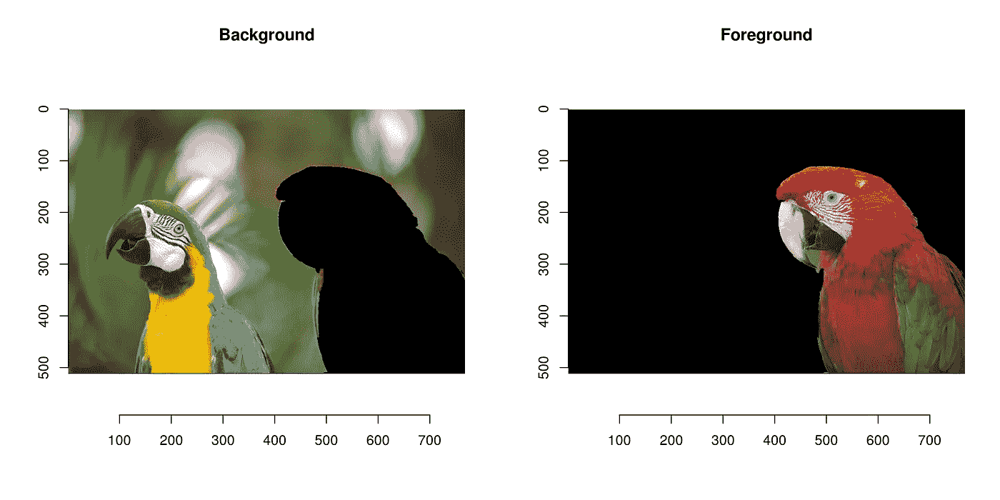
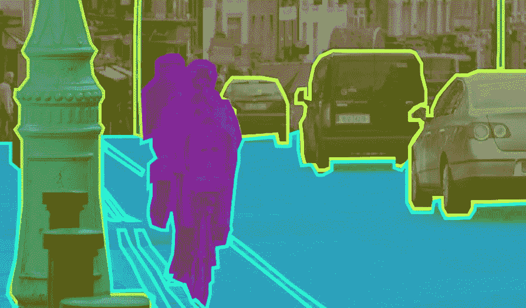
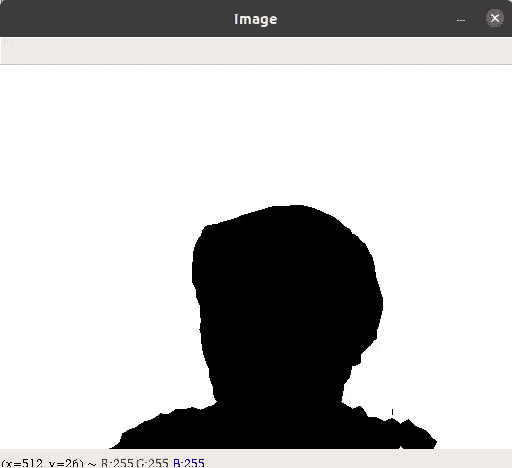
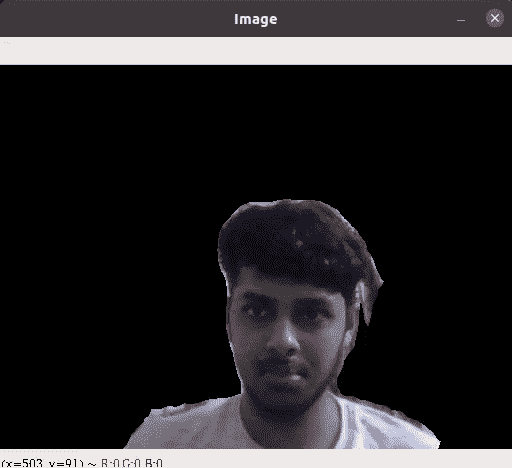
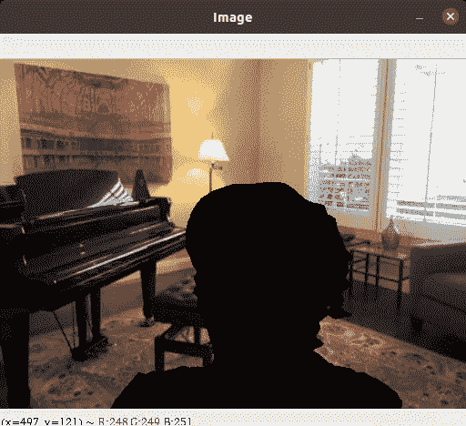
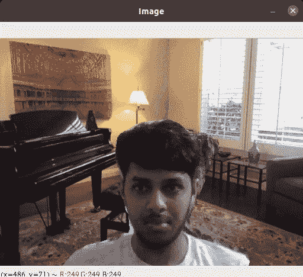

# 使用机器学习的视频会议的虚拟背景

> 原文：<https://towardsdatascience.com/virtual-background-for-video-conferencing-using-machine-learning-dfba17d90aa9?source=collection_archive---------19----------------------->

## 使用 DeepLab v3 图像分割模型和 OpenCV Python 实现

在[https://pixabay.com/](https://pixabay.com/)的图像

每当我们的环境发生变化，技术也随之发展。COVID 期间增加的视频会议突出了**虚拟背景**的概念。说出任何一种视频通信服务，无论是 Google Meet、Zoom 还是 MS Teams，你都会注意到这个功能。保护一个人的隐私或者只是隐藏他们混乱的环境，虚拟背景真的很有帮助。

好奇如何用简单的编码实现？本文包含理解并在您自己的系统中执行它所需的所有信息。图像分割和掩蔽的概念用分步编码来解释。

# 虚拟背景

虚拟背景的目的是为了各种个人原因定制一个人的背景。为了能够修改我们的，让我们了解细节。你如何定义背景？在数码相框中，除了你的身体定义之外的一切都可以被认为是背景。想象一下你的网络摄像头的画面，一个像素一个像素地把你的身体描述从其余部分中分离出来。

https://dahtah.github.io/imager/foreground_background.html[中](https://dahtah.github.io/imager/foreground_background.html)[西蒙·巴塞尔姆](http://sites.google.com/site/simonbarthelme)拍摄的图片

同样，这幅图像也描述了手头的任务。没有背景的分割前景鹦鹉是主要焦点。它可以叠加在任何图像/背景上，形成一个整体图像。使用一个简单的 OpenCV 代码来导入一个虚拟的背景图像

# 图象分割法

图像分割是一种计算机视觉算法，用于将任何图像分成各种片段。分割的输出完全基于应用。对于对象检测，分割的图像将包含不同颜色的汽车、人、道路、停车标志、树和场景中存在的其他对象。

https://www.anolytics.ai/semantic-segmentation-services/[中的图像](https://www.anolytics.ai/semantic-segmentation-services/)

我们的目标是如前所述分割背景和前景。因此，如果我们检测到一个人的数字，它的像素化分割应该执行。这种分割是使用 TensorFlow 的 DeepLab v3 模型实现的。它相当于迄今为止最好的开源实现之一，甚至能够在视频分割上给出体面的帧速率。

编写以下代码来下载模型。下载后，将其复制到工作目录并删除该块。它必须使用此代码下载，不能通过链接手动完成。

参考:[https://colab . research . Google . com/github/tensor flow/models/blob/master/research/deep lab/deep lab _ demo . ipynb # scroll to = C4 oxkmnjw 6 I _](https://colab.research.google.com/github/tensorflow/models/blob/master/research/deeplab/deeplab_demo.ipynb#scrollTo=c4oXKmnjw6i_)

导入必要的库。PIL 和 OpenCV 主要用于分割后的图像处理，而其他的则用于运行 DeepLab 类。该模型能够在以下提到的标签之间进行分类。它接收一个 zip 模型文件并分别预测输出。

声明 DeepLab 类和分割图像所需的其他函数。以下代码段可以在 DeepLab 在其自述文件中提供的笔记本参考中找到。如果您过于担心这段代码的复杂性，请不要担心。一般来说，所有分割模型都是使用 Coco 或 ImageNet 数据集训练的。根据架构、输入和输出格式的不同，下面的代码会有所不同。

让我们做一个状态检查。我们导入了需要的虚拟背景，下载了模型，加载了模型，定义了 DeepLab 类。通过调用该类的 run 函数可以获得分段输出。总的来说，我们有我们的背景和分割需要叠加在它上面。

# OpenCV

OpenCV 在我们的应用程序中的主要任务是在虚拟背景中创建分割的遮罩，将所有正在使用的图像调整到相同的尺寸，最后添加被遮罩和分割的图像。从加载的模型继续，让我们看看 OpenCV 中的每一步是如何执行的。

> 第一步:视频拍摄

视频的每一帧都必须被提取、分割并添加到虚拟背景中。OpenCV video capture 用于加载网络摄像头视频并提取每一帧。一般来说，这个过程会导致延迟，但是轻量级模型和最少的预处理能够提供不错的帧速率。

> 步骤 2:帧分割

每一帧都通过 MODEL.run()函数来获得结果分割。该类返回 2 个值:调整大小的原始图像和分割的地图轮廓。分割图用于形成描绘边界的图像。

分段掩码的输出

> 步骤 3:分段地图处理

分割的图像用于从每一帧中提取原始姿态。首先使用下面的方法将它转换成黑白图像。进行这种转换是为了简化掩蔽过程。

在 seg_im 预处理之后

> 第四步:遮盖

简单来说，遮罩就是在图像上创建一层遮盖物。一方面，我们有一个黑白分段帧，另一方面，原始网络摄像头帧。在 *seg_img* 中有分段(黑色/0)的地方，原始帧的相应像素保持不变，否则转换为黑色。这是原始帧中分割的遮罩。使用类似的逻辑，在虚拟背景上执行相反的操作。哪里有分割，哪里的像素就转换成黑色。

a.原始帧的屏蔽分割 b .虚拟背景屏蔽

## 输出

我们就要到达终点了。在对每个所需图像进行遮罩后，只剩下加法。在显示视频的每一帧之前，添加 *seg_img* 和 *back* 。

最终输出

# 结论

我们已经通过 TensorFlow DeepLab v3 模型实现了图像分割。通过使用遮罩和其他 OpenCV 预处理，可以看到最终的虚拟背景。这种方法符合当前的技术标准。虽然这也可以通过其他计算机视觉和图像处理算法来完成，即使不包括深度学习，也可以观察到许多缺陷。让我们列举一些例子:

*   简单的图像处理算法依赖于颜色变化来分离背景和前景。然而，这是一个深度学习模型，侧重于识别。
*   实时输出的准确性，尤其是在视频中，有时会很差。
*   在一个好的系统中，帧速率相当不错，但否则，输出可能会包含巨大的滞后。为了克服这一点，代码可以在 CUDA 上托管或实现。
*   代码主要使用 TensorFlow 和 OpenCV。它可以很容易地编码并在任何系统上运行，没有太多的依赖性问题。

这篇文章大体上到此为止。我希望这有助于理解虚拟背景是如何实现的。对于最初的 DeepLab v3 实现，请访问 [DeepLab 笔记本](https://colab.research.google.com/github/tensorflow/models/blob/master/research/deeplab/deeplab_demo.ipynb#scrollTo=c4oXKmnjw6i_)。结果的准确性可能不太令人满意，因此我期待任何改进的建议。如果你遇到任何错误或有任何疑问，请评论。

**关于我**

我是一名三年级的 CSE 学生。我的主要兴趣和工作主要在于深度学习、强化学习、遗传算法和计算机视觉。如果你对这些话题感兴趣，可以看看我以前的博客，关注我，了解最新动态。我的项目和个人资料可以在 [Github](https://github.com/Shaashwat05) 和 [LinkedIn](https://www.linkedin.com/in/shaashwat-agrawal-1904a117a/) 上查看。