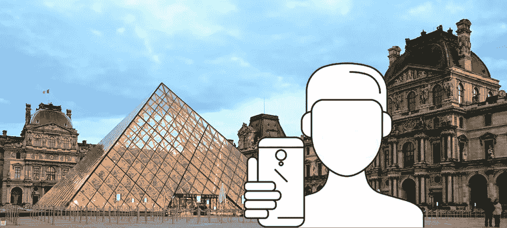
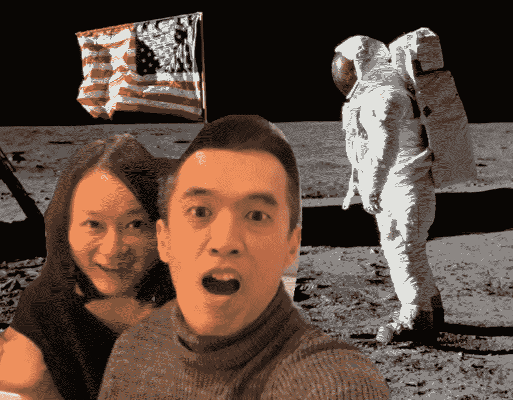
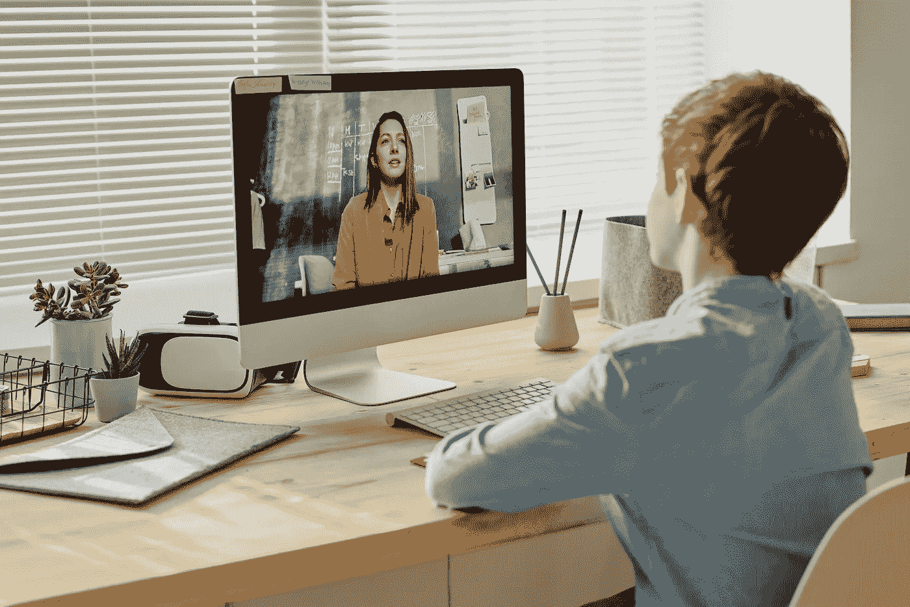

# 具有身体分割技术的网络摄像机中的虚拟背景

> 原文：<https://towardsdatascience.com/virtual-background-in-webcam-with-body-segmentation-technique-fc8106ca3038?source=collection_archive---------14----------------------->

## 网络摄像头背景变化不仅限于现在缩放，我只是用 tensorflow.js body-pix 模型在浏览器里做了一下



来源:[bensonruan.com](https://bensonruan.com/selfie-anywhere-person-segmentation-with-bodypix/)

你有没有过这样的时刻，当你在社交媒体上浏览那些漂亮的旅行自拍时，你会自言自语:“我希望我能在那里”？你猜怎么着，我们今天要让它成真。利用最新的人物分割技术，我们可以在像素级上将身体部分与背景分开。

非常类似于视频会议软件 Zoom 的改变背景功能，可以把你身后凌乱的房间隐藏起来，把你运送到一个荒岛或者宁静的海滩。

在这篇文章中，我将向你展示如何构建一个随处自拍应用程序，它可以通过实时改变自拍的背景，让你置身于那些美丽的旅行场景中。不需要 Photoshop，也不需要绿屏。让我们找点乐子，倒数“3，2，1…说茄子”！



自己试试吧，演示在下面的链接里:

[](https://bensonruan.com/selfie-anywhere-person-segmentation-with-bodypix/) [## 使用 BodyPix - Benson 技术进行随处自拍-人物分割

### 你有没有过这样的时刻，当你在社交媒体上浏览那些漂亮的旅行自拍时，你会自言自语:“我希望我…

bensonruan.com](https://bensonruan.com/selfie-anywhere-person-segmentation-with-bodypix/) 

# 履行

你在上面拍了一些自拍照，然后给你的朋友看了吗？我希望你喜欢它，这个应用程序利用了一种叫做**身体分割**的先进技术，它可以识别图像或视频流中的人，并从背景中分割出前景身体。

今年早些时候，谷歌发布了 [BodyPix](https://github.com/tensorflow/tfjs-models/tree/master/body-pix) ，这是一个开源的机器学习模型，允许在浏览器中使用 [TensorFlow.js](https://js.tensorflow.org/) 进行人和身体部位分割。我对这项技术感到惊讶，并产生了构建上述自拍随处应用程序的想法。下面请跟随我了解我是如何实现它的。

## #步骤 1:包含 tfjs 和 body-pix

首先，简单的在 html 文件的<头>部分包含脚本`Tensorflow.js`及其`body-pix`模型。

```
<script src="[https://cdn.jsdelivr.net/npm/@tensorflow/tfjs@1.2](https://cdn.jsdelivr.net/npm/@tensorflow/tfjs@1.2)"></script><script src="[https://cdn.jsdelivr.net/npm/@tensorflow-models/body-pix@2.0](https://cdn.jsdelivr.net/npm/@tensorflow-models/body-pix@2.0)"></script>
```

或者您可以通过 npm 安装它，以便在 TypeScript / ES6 项目中使用

```
npm install @tensorflow-models/body-pix
```

## #步骤 2:将网络摄像头传输到浏览器

为了让你的网络摄像头进入浏览器，我使用了 JavaScript 库`navigator.mediaDevices.getUserMedia`。要了解更多细节，请参考我以前的文章:

[](https://medium.com/swlh/how-to-access-webcam-and-take-picture-with-javascript-b9116a983d78) [## 如何使用 JavaScript 访问网络摄像头并拍照

### 介绍网络摄像头-简易 npm 模块

medium.com](https://medium.com/swlh/how-to-access-webcam-and-take-picture-with-javascript-b9116a983d78) 

## #步骤 3:加载 BodyPix 模型

为了进行分割，我们首先需要通过调用`bodyPix.load(modelConfig)`的 API 来加载预先训练好的 BodyPix 模型。BodyPix 附带了几个不同版本的模型，具有不同的性能特征，在模型大小和预测时间与准确性之间进行权衡。

默认情况下，BodyPix 加载一个带有`0.75`乘法器的 MobileNetV1 架构。对于配有中端/低端 GPU 的计算机，建议这样做。对于移动设备，建议使用带有`0.50`乘数的型号。ResNet 体系结构推荐用于具有更强大 GPU 的计算机。

```
**bodyPix.load**({
    architecture: 'MobileNetV1',
    outputStride: 16,
    multiplier: 0.75,
    quantBytes: 2
})
```

## #第四步:身体分割

接下来，我们通过调用`net.estimatePersonSegmentation(video, outputStride, segmentationThreshold)`的 API，开始通过 body-pix 模型馈送网络摄像机流以执行人物分割。它将图像分割成像素，这些像素是和不是人的一部分。它返回一个二进制数组，对于作为人的一部分的像素为 1，否则为 0。数组大小对应于图像中的像素数。

```
**net.segmentPerson**(webcamElement,  {
    flipHorizontal: true,
    internalResolution: 'medium',
    segmentationThreshold: 0.5
  })
  **.then(personSegmentation** => {
    if(personSegmentation!=null){
        drawBody(personSegmentation);
    }
});
cameraFrame = requestAnimFrame(detectBody);
```

`flipHorizontal`默认为假。如果分割&姿态应该水平翻转/镜像。对于默认水平翻转的视频(即网络摄像头)，此选项应设置为 true，并且您希望分段&姿势以正确的方向返回。

`segmentationThreshold`用于确定像素分数的最小值，该值必须被视为一个人的一部分。本质上，较高的值将在人的周围创建更紧密的裁剪，但是可能导致作为人的一部分的一些像素被从返回的分段掩码中排除。

它返回一个用`SemanticPersonSegmentation`对象解析的`Promise`。图像中的多个人被合并到一个二元蒙版中。除了`width`、`height`和`data`字段，它还返回一个包含所有人姿势的字段`allPoses`。所有人的数据数组，包含 307200 个值，640x480 图像的每个像素一个值。

```
{
  width: 640,
  height: 480,
  data: Uint8Array(307200) [0, 0, 0, 0, 0, 0, 0, 0, 0, 0, 0, 0, 0, 1, 0, 0, 1, …],
  allPoses: [{"score": 0.4, "keypoints": […]}, …]
}
```

## #第五步:去除背景

在上面的函数中，我们用二进制数组来表示像素是否属于人体，现在我们可以用它来去除背景，只在画布上画出人体。在 ImageData 对象中，每个像素保存红色、绿色、蓝色和 alpha(透明度)的值，移除背景的技巧是将像素的`transparency`值设置为 0。

```
const canvasPerson = document.getElementById("canvasPerson");
let contextPerson = canvasPerson.getContext('2d');

function drawBody(personSegmentation)
{
    contextPerson.drawImage(camera, 0, 0, camera.width, camera.height);
    var imageData = contextPerson.getImageData(0,0, camera.width, camera.height);
    var pixel = imageData.data;
    for (var p = 0; p<pixel.length; p+=4)
    {
      **if (personSegmentation.data[p/4] == 0) {
          pixel[p+3] = 0;
      }**
    }
    contextPerson.imageSmoothingEnabled = true;
    contextPerson.putImageData(imageData,0,0);
}
```

## #第六步:在背景图片上覆盖画布

一旦我们有了只包含透明背景的身体的画布，那么我们只需要将它覆盖在令人惊叹的自然场景的背景图像上。

```
<video id="webcam" autoplay playsinline width="640" height="480"></video>
<div id="selfie-container">
    **<div id="background-container"></div>**
    <canvas id="canvasPerson" width="640" height="480"></canvas>
</div>
```

在下面应用 css 样式

```
#background-container {
    height: 100vh;
    width: 100vw;
    **background-image: url(../images/greatwall.jpg);**
    background-position: center center;
    background-repeat: no-repeat;
    background-size: cover;
    background-color: transparent;
}

#canvasPerson{
 **background-color: transparent;**
 position: absolute;
 width: 100vw;
 height: auto;
 z-index: 9999;
 margin: auto;
 top: 0;
 bottom: 0;
 left: 0;
 right: 0;
 margin-left: auto;
 margin-right: auto;
 -moz-transform: scale(-1, 1);
 -webkit-transform: scale(-1, 1);
 -o-transform: scale(-1, 1);
 transform: scale(-1, 1);
 filter: FlipH;
}
```

## #第七步:截图

为了拍照，我使用了第三方 JavaScript 库 [html2canvas.js](https://html2canvas.hertzen.com/) 。它允许你直接在用户浏览器上截取网页或部分网页的“截图”。

```
$("#take-photo").click(function () {
    beforeTakePhoto();
    var captureElement= document.getElementById('selfie-container');
    var appendElement= document.getElementById('webcam-container');
    **html2canvas(captureElement)**.then(function(canvas) {
        canvas.id='captureCanvas';
        appendElement.appendChild(canvas);
        document.querySelector('#download-photo').href = canvas.toDataURL('image/png');
        afterTakePhoto();
    });
});
```

代码就这么多了！除此之外，只是使演示看起来不错。选择一个壮观的场景，摆好你最喜欢的姿势，微笑吧！

# GitHub 知识库

您可以通过下面的链接下载上述演示的完整代码:

[](https://github.com/bensonruan/Selfie-Anywhere) [## 本森阮/自拍-任何地方

### 实例分割将人体与背景分离。通过改变，让自己置身于美丽的自然风景中…

github.com](https://github.com/bensonruan/Selfie-Anywhere) 

# 结论



来自 [Pexels](https://www.pexels.com/photo/photo-of-child-sitting-by-the-table-while-looking-at-the-imac-4145153/?utm_content=attributionCopyText&utm_medium=referral&utm_source=pexels) 的[茱莉亚·M·卡梅隆](https://www.pexels.com/@julia-m-cameron?utm_content=attributionCopyText&utm_medium=referral&utm_source=pexels)的照片

实例分割技术的进步现在显示出从自动驾驶汽车到医疗诊断等许多领域的前景。有了深度学习神经网络，模型现在变得越来越准确。我希望这篇文章只是你学习更多图像分割和计算机视觉的旅程的开始。

感谢您的阅读。如果你喜欢这篇文章，请在脸书或推特上分享。如果你有任何问题，请在评论中告诉我。在 [GitHub](https://github.com/bensonruan/) 和 [Linkedin](https://www.linkedin.com/in/benson-ruan/) 上关注我。