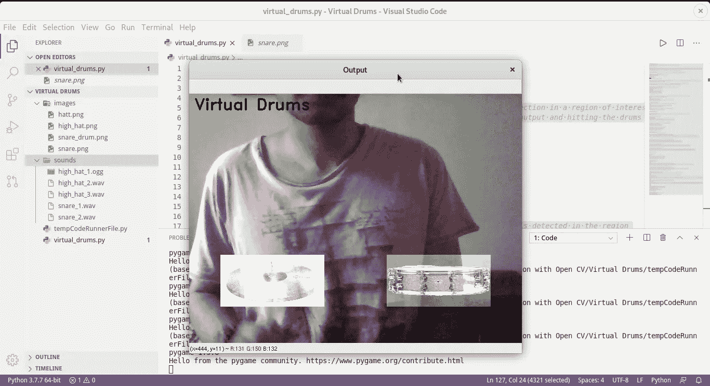

# 使用 OpenCV 的虚拟鼓组

> 原文：<https://towardsdatascience.com/virtual-drum-set-using-opencv-ebcb1553c778?source=collection_archive---------48----------------------->

## 学习使用 OpenCV 和 Python 的计算机视觉概念构建虚拟架子鼓

如果你是计算机视觉的新手，或者你有强烈的打鼓冲动，但没有鼓，那么你来对地方了！

在本教程中，我们将使用 OpenCV 的计算机视觉的基本概念建立一个虚拟鼓组。如果你是 OpenCV 的初学者，这将是一个很好的尝试教程。



虚拟鼓在行动

我们将从头开始构建项目，最终你会有一个很酷的项目来炫耀！

所有的源代码都可以在[这个 GitHub 资源库](https://github.com/navendu-pottekkat/virtual-drums)中找到。首先，在您的本地机器上派生并克隆[存储库](https://github.com/navendu-pottekkat/virtual-drums)。

`git clone link_to_your_forked_repo`

# 装置

[你的设备应该安装 Python 3.6+](https://www.python.org/downloads/) 。

导航到您的分叉目录(您下载的文件夹)。

通过在终端中运行以下命令，可以在您的环境中安装项目所需的包。

`pip install -r requirements.txt`

# 运行文件

在项目文件夹中运行以下命令。

`python virtual_drums.py`

您将在屏幕上看到添加了鼓的网络摄像头的输出。你可以用一根绿色的棍子敲鼓(钢笔或铅笔都可以)。

需要绿色棒，因为我们使用了一个检测窗口来检测绿色。

在遮光罩下，当窗口(图像中有鼓的部分)检测到绿色物体时，它会将其解释为鼓被击打并播放节拍。

我们现在来看看实现这一点的代码。

# 代码

在您喜欢的文本编辑器中打开`virtual_drums.py`文件。

您可以继续构建您自己的文件，或者编辑您下载的文件。我们现在来看看这一切是如何工作的！

我们从导入必要的库开始。如果没有运行`pip install -r requirements.txt`，你需要在你的环境中安装这些

```
# Importing the necessary libraries
import numpy as np
import time
import cv2
from pygame import mixer
```

接下来，我们定义一个函数，当在窗口上检测到绿色对象时播放鼓声。

如果检测到的颜色在我们设定的范围内，我们就播放声音。

```
# This function plays the corresponding drum beat if a green color object is detected in the region
def play_beat(detected,sound):# Checks if the detected green color is greater that a preset value 
 play = (detected) > hat_thickness[0]*hat_thickness[1]*0.8# If it is detected play the corresponding drum beat
 if play and sound==1:
 drum_snare.play()

 elif play and sound==2:
 drum_hat.play()
 time.sleep(0.001)
```

接下来，我们定义一个函数来检测绿色是否出现在我们的窗口中。

```
# This function is used to check if green color is present in the small region
def detect_in_region(frame,sound):

	# Converting to HSV
	hsv = cv2.cvtColor(frame, cv2.COLOR_BGR2HSV)

	# Creating mask
	mask = cv2.inRange(hsv, greenLower, greenUpper)

	# Calculating the number of green pixels
	detected = np.sum(mask)

	# Call the function to play the drum beat
	play_beat(detected,sound)

	return mask
```

接下来，我们导入我们的鼓点并存储它。

然后，我们设置应该检测的绿色的上限和下限。你可以把它改变到你想要的颜色的极限。

然后，我们启动网络摄像头并从中读取输入。

```
# A flag variable to choose whether to show the region that is being detected
verbose = False

# Importing drum beats
mixer.init()
drum_hat = mixer.Sound('./sounds/high_hat_1.ogg')
drum_snare = mixer.Sound('./sounds/snare_1.wav')

# Set HSV range for detecting green color 
greenLower = (25,52,72)
greenUpper = (102,255,255)

# Obtain input from the webcam 
camera = cv2.VideoCapture(0)
ret,frame = camera.read()
H,W = frame.shape[:2]

kernel = np.ones((7,7),np.uint8)
```

我们将导入要添加到视频输出中的鼓的图像。在这个例子中，我下载并添加了一顶高帽和一个小鼓。

```
# Read the image of High Hat and the Snare drumhat = cv2.resize(cv2.imread('./images/high_hat.png'),(200,100),interpolation=cv2.INTER_CUBIC)snare = cv2.resize(cv2.imread('./images/snare_drum.png'),(200,100),interpolation=cv2.INTER_CUBIC)
```

我们现在将设置应该检测绿色的区域或窗口。在本例中，我们有两个鼓，因此我们创建了两个窗口。

```
# Set the region area for detecting green color 
hat_center = [np.shape(frame)[1]*2//8,np.shape(frame)[0]*6//8]
snare_center = [np.shape(frame)[1]*6//8,np.shape(frame)[0]*6//8]

hat_thickness = [200,100]
hat_top = [hat_center[0]-hat_thickness[0]//2,hat_center[1]-hat_thickness[1]//2]
hat_btm = [hat_center[0]+hat_thickness[0]//2,hat_center[1]+hat_thickness[1]//2]

snare_thickness = [200,100]
snare_top = [snare_center[0]-snare_thickness[0]//2,snare_center[1]-snare_thickness[1]//2]
snare_btm = [snare_center[0]+snare_thickness[0]//2,snare_center[1]+snare_thickness[1]//2]

time.sleep(1)
```

然后，我们运行一个无限循环，当我们按下键盘上的“Q”时，这个循环就会中断。

我们调用函数在屏幕上显示鼓声，并调用函数检测是否有绿色物体击中窗口。

最后，我们必须在按“Q”退出后清理打开的窗口。

```
while True:

	# Select the current frame
	ret, frame = camera.read()
	frame = cv2.flip(frame,1)

	if not(ret):
	    break

	# Select region corresponding to the Snare drum
	snare_region = np.copy(frame[snare_top[1]:snare_btm[1],snare_top[0]:snare_btm[0]])
	mask = detect_in_region(snare_region,1)

	# Select region corresponding to the High Hat
	hat_region = np.copy(frame[hat_top[1]:hat_btm[1],hat_top[0]:hat_btm[0]])
	mask = detect_in_region(hat_region,2)

	# Output project title
	cv2.putText(frame,'Virtual Drums',(10,30),2,1,(20,20,20),2)

	# If flag is selected, display the region under detection
	if verbose:
		frame[snare_top[1]:snare_btm[1],snare_top[0]:snare_btm[0]] = cv2.bitwise_and(frame[snare_top[1]:snare_btm[1],snare_top[0]:snare_btm[0]],frame[snare_top[1]:snare_btm[1],snare_top[0]:snare_btm[0]], mask=mask[snare_top[1]:snare_btm[1],snare_top[0]:snare_btm[0]])
		frame[hat_top[1]:hat_btm[1],hat_top[0]:hat_btm[0]] = cv2.bitwise_and(frame[hat_top[1]:hat_btm[1],hat_top[0]:hat_btm[0]],frame[hat_top[1]:hat_btm[1],hat_top[0]:hat_btm[0]],mask=mask[hat_top[1]:hat_btm[1],hat_top[0]:hat_btm[0]])

	# If flag is not selected, display the drums
	else:
		frame[snare_top[1]:snare_btm[1],snare_top[0]:snare_btm[0]] = cv2.addWeighted(snare, 1, frame[snare_top[1]:snare_btm[1],snare_top[0]:snare_btm[0]], 1, 0)
		frame[hat_top[1]:hat_btm[1],hat_top[0]:hat_btm[0]] = cv2.addWeighted(hat, 1, frame[hat_top[1]:hat_btm[1],hat_top[0]:hat_btm[0]], 1, 0)

	cv2.imshow('Output',frame)
	key = cv2.waitKey(1) & 0xFF
	# 'Q' to exit
	if key == ord("q"):
		break# Clean up the open windows
camera.release()
cv2.destroyAllWindows()
```

就是这样！现在你可以用你的虚拟架子鼓演奏了。尝试更换鼓或将更多鼓添加到项目中。

您可以利用这些知识，通过 OpenCV 构建自己的计算机视觉应用程序。

编码快乐！