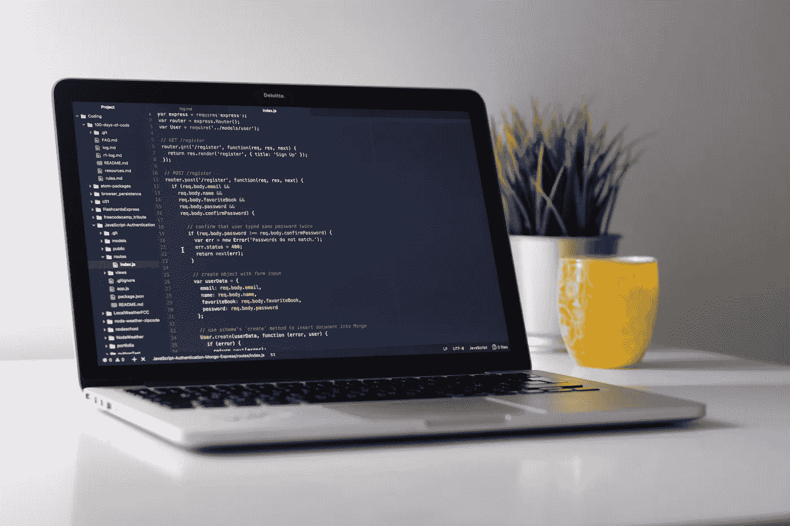
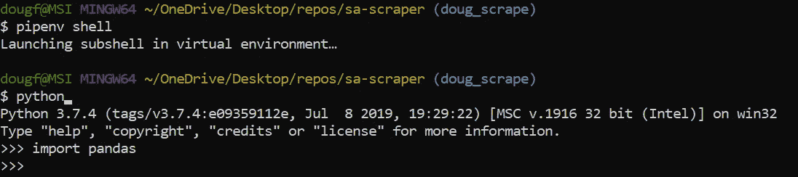
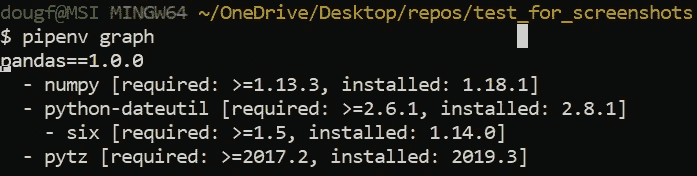
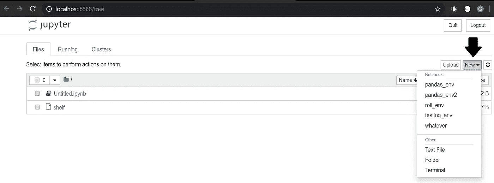
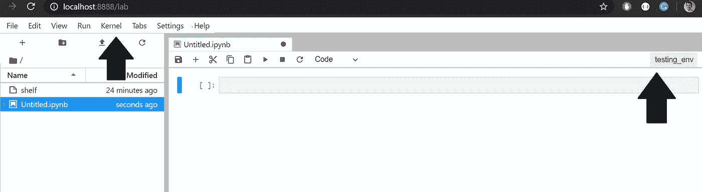
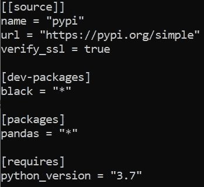

# 数据科学的虚拟环境:使用 Pipenv 运行 Python 和 Jupyter

> 原文：<https://towardsdatascience.com/virtual-environments-for-data-science-running-python-and-jupyter-with-pipenv-c6cb6c44a405?source=collection_archive---------8----------------------->

## 为 Python 设置虚拟环境。

作者: [Edward Krueger](https://www.linkedin.com/in/edkrueger/) 数据科学家兼讲师和 [Douglas Franklin](https://www.linkedin.com/in/douglas-franklin-1a3a2aa3/) 助教兼技术作家。

*在这篇文章中，我们将谈论虚拟环境以及它们为什么有用。您将学习如何在 Pipenv for Python 中设置虚拟环境。您还将学习如何在 Pipenv 环境之外运行 Jupyter 内核！*



照片由 [Unsplash](https://unsplash.com/s/photos/computer?utm_source=unsplash&utm_medium=referral&utm_content=creditCopyText) 上的 [Clément H](https://unsplash.com/@clemhlrdt?utm_source=unsplash&utm_medium=referral&utm_content=creditCopyText) 拍摄

# 为什么环境对数据科学至关重要

环境是开发人员工作、学习和创造的空间。例如，如果您计划运行 Python 代码，您必须安装一些本地软件来练习 Python。这种设置被称为编程环境。这些环境包含开发人员创建和测试代码所需的特定工具。例如，一个环境可能包含 Python 和一些包。一旦环境设置正确，开发人员就可以畅通无阻地工作，并与其他人无缝地共享环境规范。

由于缺乏对虚拟环境的了解或经验，新开发人员通常在系统级别安装所有东西。用 pip 安装的软件包被放置在系统级。对每个项目都这样做的结果是一个臃肿且难以管理的单一 Python 环境。

有效的环境管理可以节省时间，并允许开发人员创建一个独立的软件产品，以便合作者或贡献者可以重新创建您的环境并运行您的代码。

Pipenv 将软件包管理和虚拟环境控制结合到一个工具中，用于安装、删除、跟踪和记录您的依赖关系；以及创建、使用和管理您的虚拟环境。Pipenv 本质上是将 pip 和 virtualenv 包装在一个产品中。

我们在开发过程中都遇到过这种错误。

```
ModuleNotFoundError: No module named 'pandas'
```

该错误意味着 Python 找不到该模块(也称为依赖项或包)。你肯定你在某个地方安装了熊猫，但是它在哪里呢？

Python 虚拟环境的主要目的是为 Python 项目创建一个**隔离的**环境。适当的隔离意味着每个项目都可以有自己的依赖项，而不管其他项目有什么依赖项。通过对环境和依赖关系的适当维护，可以避免上述错误和许多其他错误。健康的环境管理实践减少了项目之间的依赖版本冲突，并防止基础开发环境被包所膨胀。

# 数据科学和部署问题

数据科学家通常是跨学科的，没有受过正式的教育，无法与他人合作，将项目推向生产。因此，通常缺乏良好的环境和模块管理技能。这可能会导致代码可复制性的问题，或者推进或共享项目的困难。可再现的数据科学项目是那些允许其他人在您的分析基础上重新创建和构建，并重用和修改您的代码的项目。

卫生环境管理实践减少了项目之间的依赖版本冲突，并防止基础开发环境变得臃肿和不可管理，从而帮助用户创建可重复的项目。


由 [xkcd](https://xkcd.com/) 提供

# Pipenv:更好的工作流程

Pipenv 将包管理和虚拟环境控制结合到一个工具中，使其成为数据科学家和开发人员的绝佳工具。

当您使用 Pipenv 开始一个项目时，该工具会自动创建一个虚拟环境、一个 Pipfile 和一个 Pipfile.lock。当您使用 Pipenv 安装时，Pipfile 会自动使用新的依赖项进行更新。

为了管理复杂的依赖关系，Pipenv 在一个名为 Pipfile.lock 的文件中保存了我们项目的依赖关系树；例如，依赖于其他旧版本依赖项的旧版本依赖项。Pipfile.lock 还验证生产中使用的依赖项版本是否正确。

最后，使用 Pipenv，您向其他人展示了一种安装项目依赖项以及测试和开发需求的标准化方法。

Pipenv 是一个环境管理器和包管理器。这意味着 Pipenv 可以用 Python 创建一个环境，然后用`pipenv install`将包下载并安装到一个环境中。

此命令将依赖 Pipfile 来创建 Pipfile 存在的环境；如果没有，Pipenv 将为这个环境创建一个 Pipfile。

附加到该命令的包将被添加到 Pipfile 中。

```
pipenv install pandas matplotlib keras
```

# Pipenv 工作流:终端

设置您的第一个 Pipenv:安装 Python、Pipenv 和 Pandas

1.  **安装**[Python](https://www.python.org/downloads/release/python-374/)**3.7**
2.  **打开端子**安装** Pipenv**

```
pip install pipenv
```

**3.**创建**一个新目录，并导航至该目录。**

```
mkdir pipenv_test
cd pipenv_test
```

**4.**通过运行以下命令为环境安装** pandas 和 NumPy:**

```
pipenv install pandas numpy
```

**注意，Pipenv 将为这个项目创建一个虚拟环境、一个 Pipfile 和一个 Pipfile.lock。**

**可以用`uninstall`关键字类似地删除包。**

```
pipenv uninstall pandas
```

**5.**通过以下方式激活**项目的虚拟环境:**

```
pipenv shell
```

# **测试导入**

**完成上述操作后，您现在应该能够运行:**

```
pipenv shell
```

**接下来，使用以下命令打开 Python 解释器:**

```
python
```

**然后在 Python 解释器中:**

```
import pandas
```

****

**成功进口熊猫**

**如果成功的话，你正在改进你的开发工作流程！**

**如果出现任何问题，请确保在运行`python`之前已经运行了`pipenv shell`，并通过运行以下命令来验证环境中是否存在依赖项。**

```
pipenv graph
```

****

**Pipenv 依赖关系树**

# **Pipenv 工作流:Jupyter**

**设置您的第一个 Pipenv:安装 Pipenv、Python 和 Jupyter**

1.  ****安装**[Python](https://www.python.org/downloads/release/python-374/)****3.7******

******注:** 3.8 与 Jupyter 在创作时是不兼容的****

****2.打开一个终端，在你的机器上安装 Jupyter Lab。****

```
**pip install jupyterlab**
```

******3。用以下工具安装**管道:****

```
**pip install pipenv**
```

****4.**创建**一个新目录，并导航至该目录。****

```
**mkdir pipenv_test
cd pipenv_test**
```

****5.**通过运行以下命令为环境安装** Ipykernel 和 Numpy:****

```
**pipenv install ipykernel numpy**
```

****注意，Pipenv 将为这个项目创建一个虚拟环境和一个 Pipfile。****

****6.**激活**项目的虚拟环境:****

```
**pipenv shell**
```

****7.**连接**环境到内核:****

```
**python -m ipykernel install --user --display-name pipenv_test --name pipenv_test**
```

****完成上述操作后，您现在应该能够运行:****

```
**jupyter notebook**
```

****或者您更喜欢实验室用户界面和附加功能。****

```
**jupyter lab**
```

****在 **Jupyter Notebook 中，**选择“新建”查看下拉列表，查看可用内核列表。请注意，上面第 3 步中创建的“example_env”是内核的名称。****

********

****在笔记本中选择一个内核****

****在 **Jupyter Lab 中，**你必须点击右上角的内核框来访问内核列表。或者，您可以单击“内核”选项卡，然后选择“更改内核”来访问同一个下拉菜单。****

********

****在实验室中选择内核****

# ****测试导入****

****在一个新的。ipynb 文件，尝试在单元格中运行以下代码。****

```
**import pandas**
```

****如果成功的话，你正在改进你的开发工作流程！****

****如果出现任何问题，请确保您选择了正确的内核，在运行`jupyter lab`或`jupyter notebook`以及连接内核之前，您已经运行了`pipenv shell`。同样，您可以通过运行。****

```
**pipenv graph**
```

********

****Pipenv 依赖关系树****

# ****环境管理:****

****Pipenv 可用于指定 Python 版本和包版本。****

```
**pipenv install django=1.11.10**
```

****Python 规范:****

```
**pipenv --python <path>
#or
pipenv --python python3**
```

****Pipenv 可以从 **requirements.txt** 文件构建:****

```
**$ pipenv install -r requirements.txt**
```

****并且一个 **requirements.txt** 文件可以用包 pipenv-to-requirements 从 Pipfile 中创建。****

```
**pipenv install pipenv_to_requirements**
```

****然后运行:****

```
**pipenv run pipenv_to_requirements**
```

****这将在当前目录中生成 requirements.txt 和 requirements-dev.txt(如果适用)。****

# ****开发依赖性****

****Pipfile 将依赖项组织成两类，开发包和包。通过附加一个 dev 标志，可以将一个包指定为一个开发依赖项(不在生产中使用)。****

```
**pipenv install black --dev**
```

********

****管道文件结构****

# ****删除环境****

****使用`pipenv —-rm` 命令可以轻松删除环境。要再次创建环境，使用命令`pipenv install`。****

****项目目录中的文件将保留。如果您希望删除它们，请删除整个目录。****

# ****结论****

****当您想要重现代码时，将所有的包安装在一个环境中会成为一个问题。想象一下，当项目只需要 6 个包时，导出一个列出 200 个包的 requirements.txt 文件。****

****Pipenv 将软件包管理和虚拟环境控制结合到一个工具中，用于安装、删除、跟踪和记录您的依赖关系；以及创建、使用和管理您的虚拟环境。****

****将 [Pipfiles](https://github.com/pypa/pipfile) 添加到您的 Git 存储库中很好，这样其他用户就可以克隆存储库并在他们的系统上安装 [Pipenv](http://docs.pipenv.org/) ，然后键入:****

```
**pipenv install**
```

****[Pipenv](http://docs.pipenv.org/) 然后定位 [Pipfiles](https://github.com/pypa/pipfile) ，创建一个新的虚拟环境，并安装必要的包。****

****Pipenv 之所以伟大是因为。****

*   ****虚拟环境可以很容易地从 Pipfile 中重建****
*   ****虚拟环境可轻松部署到服务器上****
*   ****Pipenv 使卫生包装和环境管理变得容易****
*   ****适当管理的环境使协作者能够轻松地与您的代码交互并运行您的代码****

****有关更多信息，请查看虚拟环境的 Pipenv 文档[说明。](https://pipenv-fork.readthedocs.io/en/latest/install.html#installing-packages-for-your-project)****