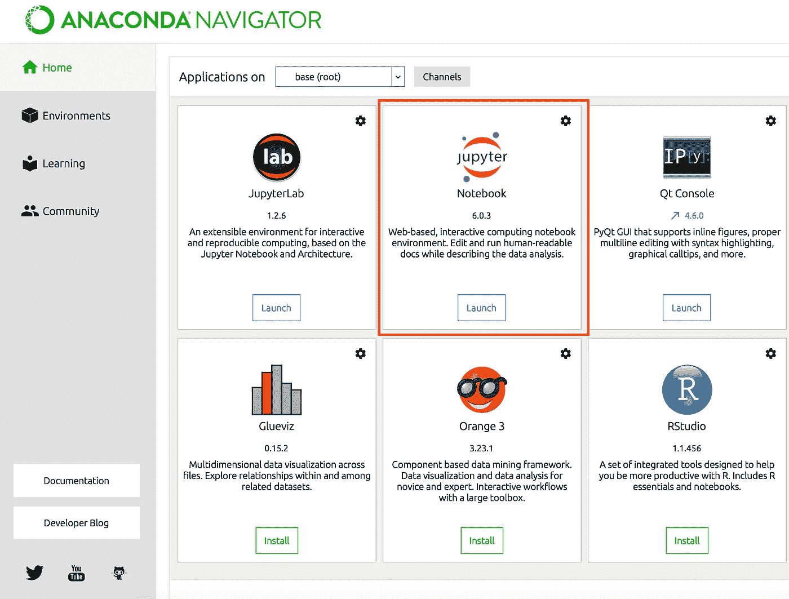
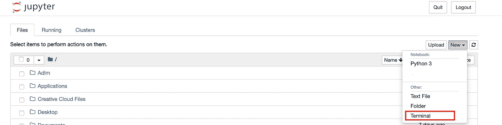
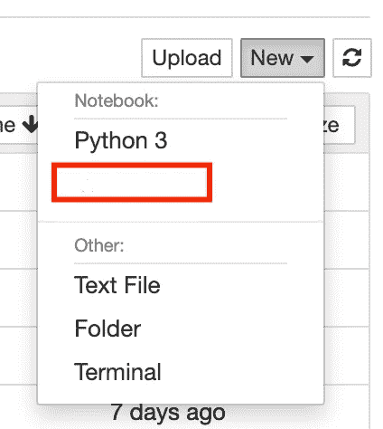
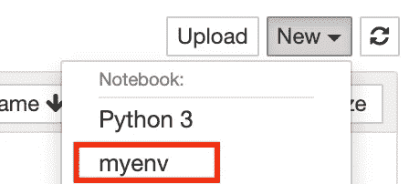

# Anaconda Jupyter 笔记本中的虚拟环境—简易指南

> 原文：<https://towardsdatascience.com/virtual-environments-in-anaconda-jupyter-notebook-f92cda7184fa?source=collection_archive---------11----------------------->

## 数据科学

## 在您的笔记本电脑中创建第一个 virtualenv 的简单步骤



# 为什么需要虚拟环境？

Python 有自己独特的下载、存储和解析包(或[模块](https://en.wikipedia.org/wiki/Modular_programming))的方式。虽然这有它的优点，但是有一些*有趣的*关于包存储和解决的决定，这导致了一些问题，特别是关于包如何和在哪里存储。

# 什么是虚拟环境？

Python 虚拟环境的主要目的是为 Python 项目创建一个隔离的环境。这意味着每个项目都可以有自己的依赖项，而不管其他项目有什么依赖项。

最棒的是，您可以拥有的环境数量没有限制，因为它们只是包含几个脚本的目录。另外，它们很容易创建。

让我们直接进入您的 Jupyter 笔记本主页，转到新的下拉菜单，然后选择终端



开始编写以下命令

```
conda create -n myenv python=3.7
```

欢迎您更改您想要的 python 版本和环境名称。

然后按回车键。

Python 将要求安装如下默认包:

> 将下载以下软件包:
> 
> 包|构建
> —————|———
> certificate-2020 . 4 . 5 . 1 | py37 _ 0 155 KB
> python-3 . 7 . 7 | HC 70 fcce _ 0 _ cpython 19.8 MB
> setup tools-46 . 1 . 3 | py37 _ 0 520 KB
> ———————
> 
> 将安装以下新软件包:
> 
> ca-certificates pkgs/main/OS x-64::ca-certificates-2020 . 1 . 1–0
> certify pkgs/main/OS x-64::certify-2020 . 4 . 5 . 1-py37 _ 0
> libc xx pkgs/main/OS x-64::libc xx-4 . 0 . 1-hcfea 43d _ 1
> libcxxabi pkgs/main/OS x-64::libc xxabi-4 .
> 
> 继续吗？

点击“y”

Python 会告诉你如何在需要的时候激活你的环境。

> #要激活此环境，请使用
> #
> # $ conda activate myenv
> #
> #要停用活动环境，请使用
> #
> # $ conda deactivate

让我们从编码开始

```
conda activate myenv
```

您会注意到环境的名称将出现在下一行代码的旁边，如(myenv)

现在，让我们来看看在这种环境下我们需要一个特定的内核。



我们希望能够在 Jupyter 笔记本主页的下拉菜单中点击并选择我们的环境。

让我们从安装 ipykernel 库开始

```
pip install ipykernel
```

下一步，我们将编写以下代码:

```
ipython kernel install — user — name=myenv
```

您应该会收到一条消息

> 将 kernelspec myenv 安装在/Users/yasserimam/Library/Jupyter/kernels/myenv 中

现在你可以回到你的 Jupyter 笔记本主页，你会发现内核。



快乐编码:)