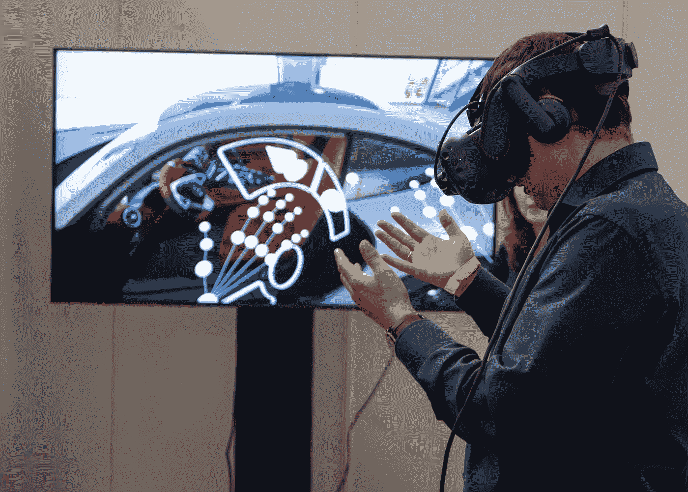
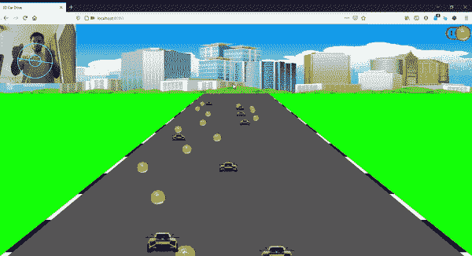
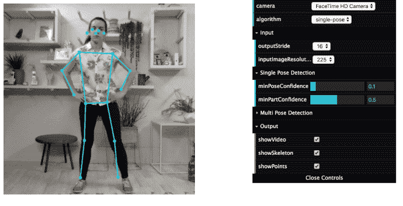
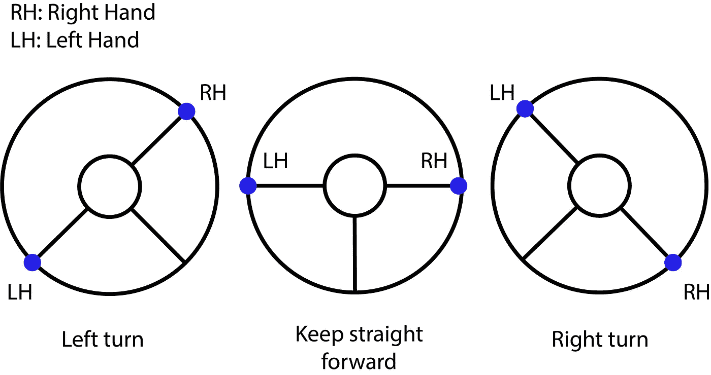
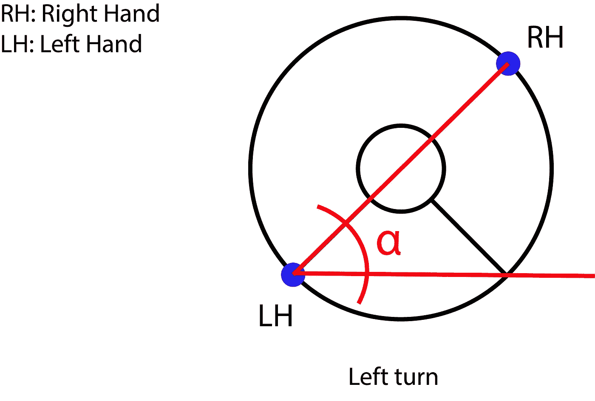
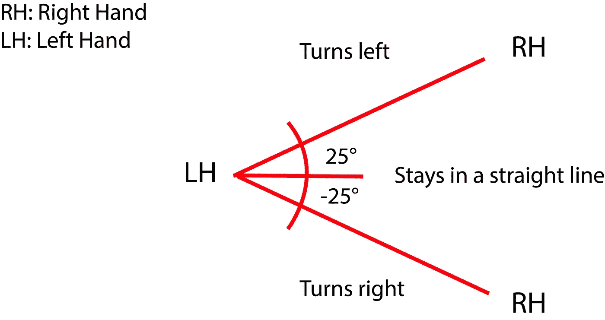

# 使用 JavaScript 和 PoseNet 的虚拟方向盘

> 原文：<https://towardsdatascience.com/virtual-steering-wheel-with-javascript-and-posenet-12439712a68?source=collection_archive---------34----------------------->

****的力量深度学习*** *架构和方便的****tensor flow . js****库允许我们创建有趣的应用程序，改变我们与计算机的交互方式。在这种情况下，我们使用姿势估计神经网络来基于手腕的位置创建一个* ***虚拟方向盘*** *。**

**

*XR Expo 在 [Unsplash](https://unsplash.com?utm_source=medium&utm_medium=referral) 上拍摄的照片*

# *介绍*

*在这个项目中，我将展示一个 web 应用程序和深度学习模型之间的集成示例，以将应用程序控制从鼠标和键盘转移到人体。*

*在这种情况下，我创建了一个虚拟方向盘来在高速公路上驾驶车辆。*

**

*视频截图来自 [Github 自述](https://github.com/MCarlomagno/CarDrivingResNet/blob/master/README.md) |作者 gif*

# *它是如何工作的*

## *摘要*

*利用手腕的坐标，我们可以计算它们之间的线段，然后计算它与水平轴形成的角度，如果这个角度大于 25°或小于-25°，那么车辆将分别向左或向右转弯。*

## *利用 PoseNet CNN 检测手的位置*

*PoseNet 包包含一个独立的机器学习模型，用于使用 **TensorFlow.js** 在浏览器中运行**实时姿态估计**。*

*PoseNet 可以用于估计**单个姿态**或**多个姿态**，这意味着有一个版本的算法只能检测图像/视频中的**一个人**，还有一个版本可以检测图像/视频中的**多人**。在这种情况下，我们将使用单人算法。*

**

*图片由 [Dan 在浏览器中用 TensorFlow.js](https://www.danioved.com/) 从[实时人体姿态估计中移除](https://medium.com/tensorflow/real-time-human-pose-estimation-in-the-browser-with-tensorflow-js-7dd0bc881cd5)*

*该模型接收来自摄像机的图像，并因此返回身体每个部分的位置及其坐标的数组。*

*在我们的例子中，我们只需要手腕的位置来驾驶汽车和绘制“方向盘”。*

*正如我们在代码中看到的，结果给了我们坐标与手在***【x，y】***变量中的位置。*

*[更多关于波森特](https://github.com/tensorflow/tfjs-models/tree/master/posenet)的信息。*

## *用代数来模拟方向盘*

*让我们开始思考，如果车辆应该向左、**向右**转向**或保持直线行驶**，需要考虑哪些条件。*

*当我们想到方向盘时，很容易想象在每种情况下方向盘的位置是什么样子。*

**

*三种可能状态的表示|作者图片*

*一旦我们看到图像，我们可以看到手与水平轴之间的线段所形成的**角度是检测实际状态的一个很好的方法，例如，如果右手在左手上方(形成一个正角度)，那么车辆应该左转。***

*我们也可以使用垂直距离，但这不是最通用的，因为它与人相对于摄像机的位置成比例。*

**

*其中α (alpha)是作者用手形成的线段和横轴|图像之间的角度*

## *改变状态的角度限制*

*一旦我们确定改变状态的条件是基于角度，我们必须确定从一个状态改变到另一个状态的极限。*

*经过一些实验后，我发现(-25，25)是一个很好的范围，可以确定车辆是左转、右转还是保持直线行驶。*

**

*状态变化的角度限制，avobe 25 左转，25°以下右转，在[-25，25 ]范围内保持直线|图片由作者提供*

## *计算角度*

*使用一些代数，我们可以很容易地获得手形成的线段和横轴之间的角度，如下所示。*

*一旦我们有了角度，我们就可以更新应用程序状态来改变汽车控制的方向。*

*这段代码可能不是最理想的，但是这里的想法是展示它是如何工作的*

# *结论*

*这只是一个简单的例子，说明我们可以在浏览器中使用这些机器学习库做什么，但它增加了各种各样新的酷功能和与网页交互的方式。*

*如果您对这项技术的其他好的用途有想法，我邀请您开发并展示它们。*

*我们建造的一切我们认为有价值的东西都值得展示😉*

> ***Github 回购:**[https://github.com/MCarlomagno/CarDrivingResNet](https://github.com/MCarlomagno/CarDrivingResNet)*