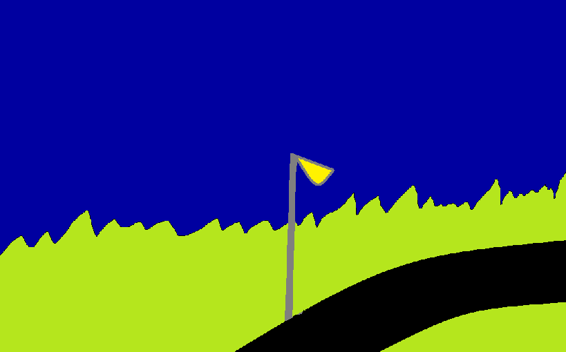
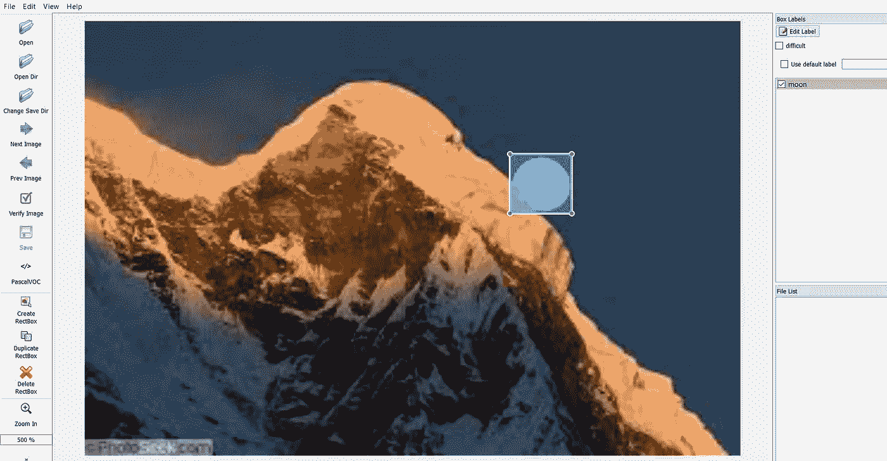
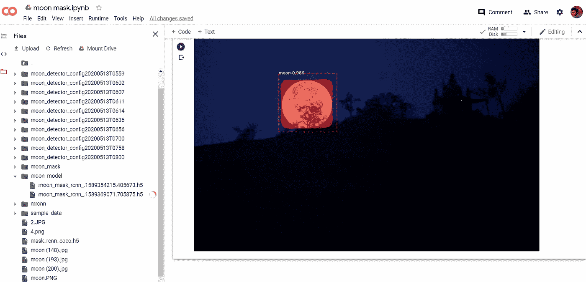
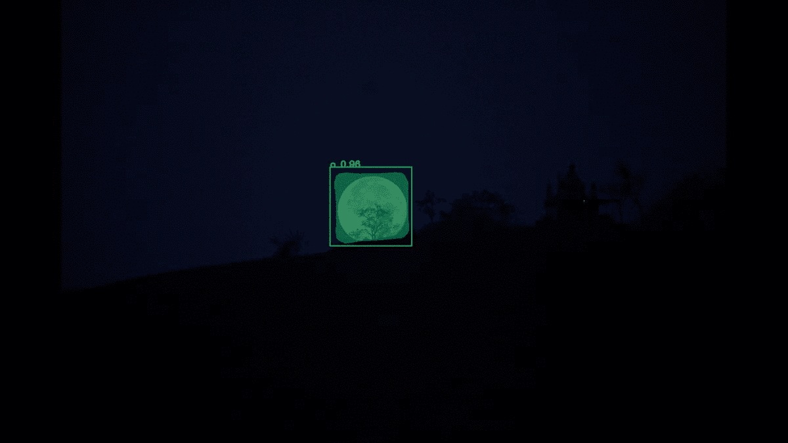

# 基于视觉的月球跟踪器

> 原文：<https://towardsdatascience.com/vision-based-moon-tracker-a39ab03b14?source=collection_archive---------67----------------------->

> 帮助你基于*Mask-RCNN*创建**月球追踪器(图片&视频)的完整指南。改变数据集，标记你选择的物体，你就可以创建你自己的物体跟踪器了！没有必要为你的第一个定制的追踪器四处游荡。**



一帧一帧的月球追踪器(*图片作者*)

# (追踪器的)为什么部分

> 我们都或多或少地被月亮的美丽所吸引。夜空中最大最亮的物体。

有很多**app**可以追踪月球的运动。关于月亮，没有什么是不可预测的。从这个角度来看，月球是简易追踪器的理想选择。

但是，现在从更广泛的意义上来说，一个智能物体追踪器可以安装在一个固定的位置，或者安装在一个移动的车辆甚至是卫星上。您相机的**视野**可能不同。如果物体移动，那么理想情况下，您的算法应该向摄像设备发出准确的 PTZ 命令(*方向和移动速率*)来跟踪感兴趣的物体。很复杂。

现在让我们简化一下。

从算法的角度来看，有两件事很重要:

1.  *(运动)物体随时间(实时)检测和定位的精度。*
2.  *速度/帧率处理。否则，当你发现的时候，物体可能已经到达了你(相机)够不到的地方。*

# 我们要做什么部分

由于这更多的是一篇技术文章，我只是分享这个项目的关键，来帮助你一步一步地创建一个**月球追踪器**(或者你选择的任何定制对象)。假设你有 mask-RCNN 的基础知识，即使你没有，你仍然可以遵循这个。

基于 Mask-RCNN 的简单 [**月球跟踪器**](https://github.com/praveenkottayi/moon-tracker) 。

# 现在，怎么做的部分

# **第一步:设置环境并加载必要的软件包。**

使用 Google [colab](http://colab.research.google.com) 是可选的。这是一个很好的选择:

1.  *如果数据不敏感*
2.  *如果你有很多数据*
3.  *如果你没有本地 GPU*

```
**from** **google.colab** **import** drive
drive.mount('/content/drive/')**import** **os**
os.chdir("drive/My Drive/Colab Notebooks/moon-tracker/")---------------------------------------------------------**from** **mrcnn.config** **import** Config
**from** **mrcnn** **import** model **as** modellib
**from** **mrcnn** **import** visualize
**import** **mrcnn**
**from** **mrcnn.utils** **import** Dataset
**from** **mrcnn.model** **import** MaskRCNN
**import** **numpy** **as** **np**
**from** **numpy** **import** zeros
**from** **numpy** **import** asarray
**import** **colorsys**
**import** **argparse**
**import** **imutils**
**import** **random**
**import** **cv2**
**import** **os**
**import** **time**
**from** **matplotlib** **import** pyplot
**from** **matplotlib.patches** **import** Rectangle
**from** **keras.models** **import** load_model
%matplotlib inline
**from** **os** **import** listdir
**from** **xml.etree** **import** ElementTree
```

您可以选择将数据保存在驱动器上，然后像上面一样装载到您的环境中。此外，您可以选择在会议期间直接上传，但只有在会议结束后才能上传。

# **第二步:准备好你的训练和测试数据集。**

*即您的图像和相应的对象遮罩。*

好吧，如果你没有，为了创建掩码并把它作为一个 XML 文件，你可以使用 Labellmg。


(*图片作者*)



(*图片作者*)

*训练和测试集的读取是基于你保存和生成 XML 文件的方式。参考代码，如果你喜欢下面的结构。*

## 月球追踪器

## — — — —月亮 _ 面具 _ 完整

## — — — — — —图片(所有图片 jpg/png 等)

## — — — — — —注释(图像遮罩的 XML 文件)

```
**class** **MoonDataset**(Dataset):
    *# load the dataset definitions*
    **def** load_dataset(self, dataset_dir, is_train=**True**):

        *# Add classes. We have only one class to add.*
        self.add_class("dataset", 1, "moon")        

        *####################################################################*
        *# define data locations for images and annotations*
        images_dir = 'moon_mask_full/images/'
        annotations_dir = 'moon_mask_full/annotations/'
        *####################################################################*

        annot_list = []
        **for** annot **in** listdir(annotations_dir):
              annot_list.append(annot.split('.')[0])

        *# Iterate through all files in the folder to* 
        *#add class, images and annotaions* 
        **for** filename **in** listdir(images_dir):

            *# extract image id for all formats like jpg / png / jpeg* 
            image_id =    filename.split('.')[0]    
            *#print(image_id)*

            *# There can be a chance that you don't created xml file for all the images.* 
            *# To filter images which have corresponding mask XML file.*

            **if** image_id != '' **and** image_id **in** annot_list:
              *# setting image file*
              img_path = images_dir + filename
              *#print(img_path)*
              *# setting annotations file*
              ann_path = annotations_dir + image_id + '.xml'
              *#print(ann_path)*
              *# adding images and annotations to dataset*
              self.add_image('dataset', image_id=image_id, path=img_path, annotation=ann_path)

    *# extract bounding boxes from an annotation file*
    **def** extract_boxes(self, filename):

        *# load and parse the file*
        tree = ElementTree.parse(filename)
        *# get the root of the document*
        root = tree.getroot()
        *# extract each bounding box*
        boxes = list()
        **for** box **in** root.findall('.//bndbox'):
            xmin = int(box.find('xmin').text)
            ymin = int(box.find('ymin').text)
            xmax = int(box.find('xmax').text)
            ymax = int(box.find('ymax').text)
            coors = [xmin, ymin, xmax, ymax]
            boxes.append(coors)

        *# extract image dimensions*
        width = int(root.find('.//size/width').text)
        height = int(root.find('.//size/height').text)

        *#print(boxes, width, height)*
        **return** boxes, width, height

    *# load the masks for an image*
    *"""Generate instance masks for an image.*
 *Returns:*
 *masks: A bool array of shape [height, width, instance count] with*
 *one mask per instance.*
 *class_ids: a 1D array of class IDs of the instance masks.*
 *"""*
    **def** load_mask(self, image_id):
        *# get details of image*
        info = self.image_info[image_id]
        *#print(info)*
        *# define anntation  file location*
        path = info['annotation']

        *# load XML*
        boxes, w, h = self.extract_boxes(path)

        *# create one array for all masks, each on a different channel*
        masks = zeros([h, w, len(boxes)], dtype='uint8')

        *# create masks*
        class_ids = list()
        **for** i **in** range(len(boxes)):
            box = boxes[i]
            row_s, row_e = box[1], box[3]
            col_s, col_e = box[0], box[2]
            masks[row_s:row_e, col_s:col_e, i] = 1
            class_ids.append(self.class_names.index('moon'))
        **return** masks, asarray(class_ids, dtype='int32')

    *# load an image reference*
    *"""Return the path of the image."""*
    **def** image_reference(self, image_id):
        info = self.image_info[image_id]
        *#print(info)*
        **return** info['path']
```

# **第三步:下载 COCO weights '*mask _ rcnn _ COCO . H5*'并保存在主文件夹中。**

链接:[https://github.com/matterport/Mask_RCNN/releases](https://github.com/matterport/Mask_RCNN/releases)

```
*#load the weights for COCO*
model.load_weights('mask_rcnn_coco.h5', 
                   by_name=**True**, 
                   exclude=["mrcnn_class_logits", "mrcnn_bbox_fc",  "mrcnn_bbox", "mrcnn_mask"])
```

# **步骤 4:调整训练和学习参数，以微调模型。**

使用配置、learning_rate、epoch 和 layers ('all '、' 3+'、' 4+'、' heads ')来获得更好的准确性。

```
**class** **moon_detector_Config**(Config):
    *# give the configuration a recognizable name*
    NAME = "moon_detector_Config"

    *# set the number of GPUs to use along with the number of images*
    *# per GPU*
    GPU_COUNT = 1
    IMAGES_PER_GPU = 1

    *# number of classes (we would normally add +1 for the background)*
     *# moon + BG*
    NUM_CLASSES = 1+1

    *# Number of training steps per epoch*
    STEPS_PER_EPOCH = 50

    *# Learning rate*
    LEARNING_RATE=0.001

    *# Skip detections with < 90% confidence*
    DETECTION_MIN_CONFIDENCE = 0.95

    *# setting Max ground truth instances*
    MAX_GT_INSTANCES=1   

    *# Maximum instances in a frame. Only one moon possible.* 
    *# But can have different number based on the object example cat, dog, bus, car etc.*
    DETECTION_MAX_INSTANCES = 1config = moon_detector_Config()config.display()
--------------------------------------------------------------------Configurations:
BACKBONE                       resnet101
BACKBONE_STRIDES               [4, 8, 16, 32, 64]
BATCH_SIZE                     1
BBOX_STD_DEV                   [0.1 0.1 0.2 0.2]
COMPUTE_BACKBONE_SHAPE         None
DETECTION_MAX_INSTANCES        1
DETECTION_MIN_CONFIDENCE       0.95
DETECTION_NMS_THRESHOLD        0.3
FPN_CLASSIF_FC_LAYERS_SIZE     1024
GPU_COUNT                      1
GRADIENT_CLIP_NORM             5.0
IMAGES_PER_GPU                 1
IMAGE_CHANNEL_COUNT            3
IMAGE_MAX_DIM                  1024
IMAGE_META_SIZE                14
IMAGE_MIN_DIM                  800
IMAGE_MIN_SCALE                0
IMAGE_RESIZE_MODE              square
IMAGE_SHAPE                    [1024 1024    3]
LEARNING_MOMENTUM              0.9
LEARNING_RATE                  0.001
LOSS_WEIGHTS                   {'rpn_class_loss': 1.0, 'mrcnn_class_loss': 1.0, 'mrcnn_mask_loss': 1.0, 'mrcnn_bbox_loss': 1.0, 'rpn_bbox_loss': 1.0}
MASK_POOL_SIZE                 14
MASK_SHAPE                     [28, 28]
MAX_GT_INSTANCES               1
MEAN_PIXEL                     [123.7 116.8 103.9]
MINI_MASK_SHAPE                (56, 56)
NAME                           moon_detector_Config
NUM_CLASSES                    2
POOL_SIZE                      7
POST_NMS_ROIS_INFERENCE        1000
POST_NMS_ROIS_TRAINING         2000
PRE_NMS_LIMIT                  6000
ROI_POSITIVE_RATIO             0.33
RPN_ANCHOR_RATIOS              [0.5, 1, 2]
RPN_ANCHOR_SCALES              (32, 64, 128, 256, 512)
RPN_ANCHOR_STRIDE              1
RPN_BBOX_STD_DEV               [0.1 0.1 0.2 0.2]
RPN_NMS_THRESHOLD              0.7
RPN_TRAIN_ANCHORS_PER_IMAGE    256
STEPS_PER_EPOCH                50
TOP_DOWN_PYRAMID_SIZE          256
TRAIN_BN                       False
TRAIN_ROIS_PER_IMAGE           200
USE_MINI_MASK                  True
USE_RPN_ROIS                   True
VALIDATION_STEPS               50
WEIGHT_DECAY                   0.0001
```

**加载数据集**

```
*# prepare train set*
train_set = MoonDataset()
train_set.load_dataset( 'train_data_path/')
train_set.prepare()
print('Train: **%d**' % len(train_set.image_ids))
*# prepare test/val set*
test_set = MoonDataset()
test_set.load_dataset('test_data_path/')
test_set.prepare()
print('Test: **%d**' % len(test_set.image_ids))
```

**加载基础模型**

```
print("Loading Mask R-CNN model...")
model = modellib.MaskRCNN(mode="training", config=config, model_dir='./')
```

**调整 learning_rate、epoch 和 layers 并训练**

层从['全部'，' 3+'，' 4+'，'头']中选择

范围[5–50]内的纪元

```
*## train heads with higher lr to speedup the learning*
model.train(train_set, test_set, learning_rate=config.LEARNING_RATE, epochs=50, layers='3+' )
history = model.keras_model.history.history
```

**为将来保存模型**

```
model_path =  ' path to your model' + 'name' + '.h5' 
model.keras_model.save_weights(model_path)
```

# **5。测试新的一组图像**

```
*# Load pretrained moon mask* 

model_path = 'moon_model/moon_mask_rcnn_125.h5' # the model you created**from** **keras.preprocessing.image** **import** load_img
**from** **keras.preprocessing.image** **import** img_to_array*#Loading the model in the inference mode*
model = modellib.MaskRCNN(mode="inference", config=config, model_dir='./')
*# loading the trained weights o the custom dataset*
model.load_weights(model_path, by_name=**True**)input_path = "test_images/"

**for** i **in** os.listdir(input_path):

    img = load_img(input_path + i)
    img = img_to_array(img)
    *# detecting objects in the image*
    result= model.detect([img])

    *# Run object detection*
    results = model.detect([img], verbose=1)
    *# Display results*

    r = results[0]
    visualize.display_instances(img, r['rois'], r['masks'], r['class_ids'], 
                                test_set.class_names, r['scores'], 
                                title="Predictions")
```



输出。(*图片作者*)

# **步骤 6:通过添加更多相关的掩模图像来微调模型，调整*步骤 4* 中的参数。**

# 第七步:视频月亮追踪器

为了在视频中做同样的事情，在 Opencv 中使用视频的逐帧提取，并在每一帧中应用模型。

```
**import** **cv2**
**import** **numpy** **as** **np**

**def** random_colors(N):
    np.random.seed(1)
    colors = [tuple(255 * np.random.rand(3)) **for** _ **in** range(N)]
    **return** colors

**def** apply_mask(image, mask, color, alpha=0.5):
    *"""apply mask to image"""*
    **for** n, c **in** enumerate(color):
        image[:, :, n] = np.where(
            mask == 1,
            image[:, :, n] * (1 - alpha) + alpha * c,
            image[:, :, n]
        )
    **return** image

**def** display_instances(image, boxes, masks, ids, names, scores):
    *"""*
 *take the image and results and apply the mask, box, and Label*
 *"""*
    n_instances = boxes.shape[0]
    colors = random_colors(n_instances)

    **if** **not** n_instances:
        print('NO INSTANCES TO DISPLAY')
    **else**:
        **assert** boxes.shape[0] == masks.shape[-1] == ids.shape[0]

    **for** i, color **in** enumerate(colors):
        **if** **not** np.any(boxes[i]):
            **continue**

        y1, x1, y2, x2 = boxes[i]
        label = names[ids[i]]
        score = scores[i] **if** scores **is** **not** **None** **else** **None**
        caption = '**{}** **{:.2f}**'.format(label, score) **if** score **else** label
        mask = masks[:, :, i]

        image = apply_mask(image, mask, color)
        image = cv2.rectangle(image, (x1, y1), (x2, y2), color, 2)
        image = cv2.putText(
            image, caption, (x1, y1), cv2.FONT_HERSHEY_COMPLEX, 0.7, color, 2
        )

    **return** image
```

**设置路径和文件夹名称。**

```
**import** **os**
**import** **sys**

batch_size = 1

ROOT_DIR = os.getcwd()
MODEL_DIR = os.path.join(ROOT_DIR, "logs")
VIDEO_DIR = os.path.join(ROOT_DIR, "video_moon/")
VIDEO_SAVE_DIR = os.path.join(VIDEO_DIR, "frames_object_detection/")
MODEL_PATH = os.path.join(ROOT_DIR, "moon_model/moon_mask_rcnn_125.h5")
model.load_weights(MODEL_PATH, by_name=**True**)
class_names = 'moon'
```

获取视频并使用我们的模型逐帧分析。

```
capture = cv2.VideoCapture(os.path.join(VIDEO_DIR, 'moon_zoom.mp4'))
**try**:
    **if** **not** os.path.exists(VIDEO_SAVE_DIR):
        os.makedirs(VIDEO_SAVE_DIR)
**except** **OSError**:
    print ('Error: Creating directory of data')
frames = []
frame_count = 0
*# these 2 lines can be removed if you dont have a 1080p camera.*
capture.set(cv2.CAP_PROP_FRAME_WIDTH, 1920)
capture.set(cv2.CAP_PROP_FRAME_HEIGHT, 1080)

**while** **True**:
    ret, frame = capture.read()
    *# Bail out when the video file ends*
    **if** **not** ret:
        **break**

    *# Save each frame of the video to a list*
    frame_count += 1
    frames.append(frame)
    print('frame_count :**{0}**'.format(frame_count))
    **if** len(frames) == batch_size:
        results = model.detect(frames, verbose=0)
        print('Predicted')
        **for** i, item **in** enumerate(zip(frames, results)):
            frame = item[0]
            r = item[1]
            frame = display_instances(
                frame, r['rois'], r['masks'], r['class_ids'], class_names, r['scores']
            )
            name = '**{0}**.jpg'.format(frame_count + i - batch_size)
            name = os.path.join(VIDEO_SAVE_DIR, name)
            cv2.imwrite(name, frame)
            print('writing to file:**{0}**'.format(name))
        *# Clear the frames array to start the next batch*
        frames = []

capture.release()
```

这是我们首尾相连的**月球追踪器**整装待发。请试验代码并创建自己版本的 ***对象跟踪器*** 。



放大。(*图片作者*)

干杯！！！

[Github 链接。](https://github.com/praveenkottayi/moon-tracker)

在下面的链接中可以找到**月球追踪器**的整个进化过程。

[](https://medium.com/@praveenkottayi/i-had-a-dream-not-as-big-as-martin-luther-king-jr-but-a-little-one-34dc2cdbb1d9) [## 我有一个梦想，没有马丁·路德·金那么大，但是很小

### 但是这个小家伙帮助我塑造了我的职业生涯。带我探索图像处理领域，让我进入了一个顶级的…

medium.com](https://medium.com/@praveenkottayi/i-had-a-dream-not-as-big-as-martin-luther-king-jr-but-a-little-one-34dc2cdbb1d9) 

参考:

[](https://github.com/matterport/Mask_RCNN) [## matterport/Mask_RCNN

### 这是 Mask R-CNN 在 Python 3、Keras 和 TensorFlow 上的实现。该模型生成边界框和…

github.com](https://github.com/matterport/Mask_RCNN) [](https://github.com/Tony607/colab-mask-rcnn/blob/master/Colab_Mask_R_CNN_Demo.ipynb) [## Tony607/colab-mask-rcnn

### permalink dissolve GitHub 是超过 5000 万开发人员的家园，他们一起工作来托管和审查代码，管理…

github.com](https://github.com/Tony607/colab-mask-rcnn/blob/master/Colab_Mask_R_CNN_Demo.ipynb) [](/object-detection-using-mask-r-cnn-on-a-custom-dataset-4f79ab692f6d) [## 在定制数据集上使用掩模 R-CNN 的对象检测

### 在本文中，我们将实现 Mask R-CNN 来检测自定义数据集中的对象

towardsdatascience.com](/object-detection-using-mask-r-cnn-on-a-custom-dataset-4f79ab692f6d)