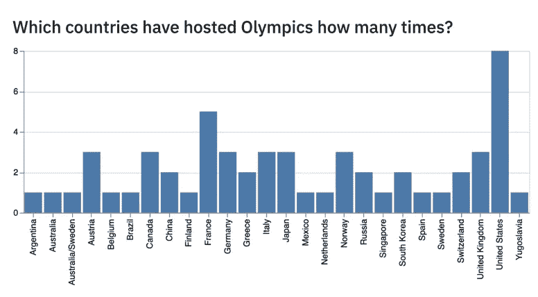
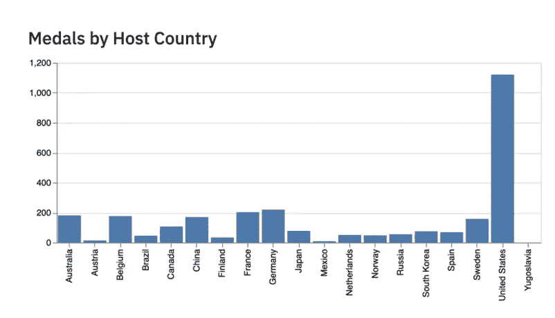
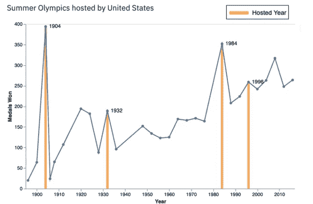
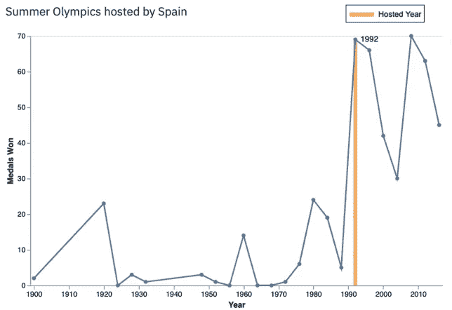
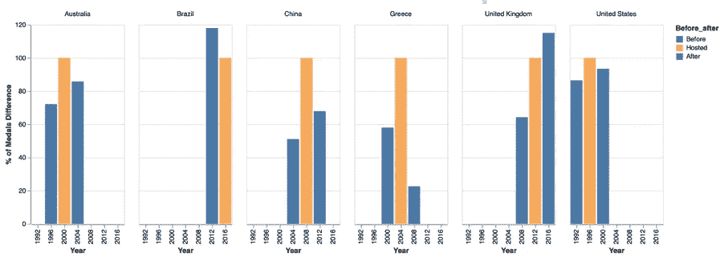
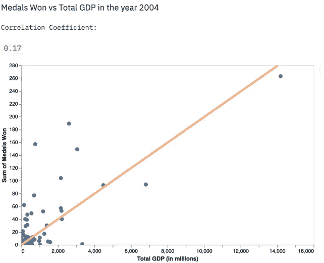
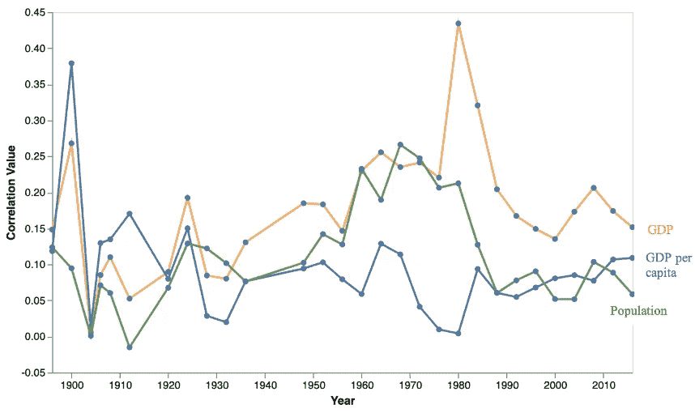
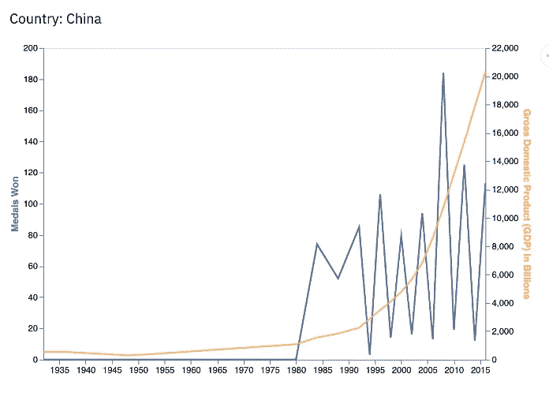

# 奥运数据的可视化分析

> 原文：<https://towardsdatascience.com/visual-analysis-of-olympics-data-16273f7c6cf2?source=collection_archive---------10----------------------->

## 赢得奥运奖牌的不同因素是如何发挥作用的？

*照片由* [布莱恩·特纳](https://unsplash.com/@bt_optics)**T5[Unsplash](https://unsplash.com/)拍摄。**

奥运会是全世界公认的著名体育平台，与 19 世纪后期有所区别。然而，它的起源可以追溯到大约 3000 年前的希腊帝国，当时只有短跑比赛，在希腊的奥林匹亚城举行，只有自由出生的希腊人才能参加(Young & Abraham，2020)。从那时起，它就一直在发展，现在已经成为全世界所有运动员在超过 28 个单项体育比赛中展示自己能力的中心。目前，它每两年在不同的国家举行，名称为夏季奥运会和冬季奥运会，都有自己的一套游戏(杨和亚伯拉罕，2020)。它已经成为一个反映个人选手力量的地方，并成为他们所代表的国家的骄傲。

# 动机和研究问题

奥运会有着丰富的历史，从 1896 年跨越到 2018 年，已经成为历史的一部分。因此，这是一个有趣的话题，看看历史事件是如何影响奥运会的细节，以及它是如何改变至今。因此，本报告试图围绕以下问题展开，并酌情与历史事件联系起来:

1.主办国对奥运会获得的奖牌有什么影响？

2.各国在奥运会上的表现受本国经济因素影响吗？

3.奥运夺冠的年龄在变吗？

# 文献评论

主办国在任何体育活动中的优势是众所周知的，因为参与者将熟悉该领域，并且也有来自主场观众的巨大支持。主办国预计将赢得 3 倍于他们在客场比赛时赢得的奖牌(Clarke，2000)。主办国和共产主义背景也会对奖牌数产生积极影响(卞，2005)。

研究发现，一个国家的社会经济变量，如 GDP，在很大程度上影响着该国在奥运会上的表现。一个国家的人口和国内生产总值与奥运会奖牌数有一定的相关性(卞，2005)。

年龄因素也是体育运动中的一个重要因素，即使在相同年龄的运动员中，相对年龄效应(RAE)也是决定谁获胜的因素(Fletcher & Sarkar，2012)。RAE 指出，在成熟度、经验和早期专业化方面，一名运动员比另一名年轻近一岁的运动员更有优势(Neill，Cotton，Cuadros & Connor，2016)。

奥林匹克已经成为历史的一部分，影响着历史，也受到历史的影响。奥林匹克运动会在历史上产生了重大的社会和政治影响，如让妇女参加体育运动，反对种族问题，促进民权，统一国家，甚至成为不同国家展示权力的工具(奥康奈尔)。同样，种族隔离、恐怖主义、世界大战和冷战等国家的政治也在历史的不同时期影响了奥林匹克运动(Dwyer & McMaster，2018)。

# 方法

为了回答这些问题，使用了三个数据集，即“120 年奥林匹克历史:运动员和成绩[1]”，“Gapminder 人均国内生产总值，不变购买力平价美元- v25[2]”和“Gapminder 总人口 v6[3]”。奥运会数据集包括参与者的姓名、人口统计数据、他们参加了哪项运动以及参加了哪届奥运会。Gapminder 的人均国内生产总值数据集包括从 1960 年到 2040 年预测的各国国内生产总值，其人口数据集包括从 1800 年到 2019 年以及从那时起到 2100 年预测的世界所有国家的人口。还创建了一个自定义数据集，将奥运会数据集中提到的城市映射到国家名称。

可视化是用 Tableau 和 Python 创建的。最初的数据清理是在 Excel 上完成的，可视化特定数据操作是根据需要在 Tableau 和 Python 上进行的。

# 调查结果和讨论

## 东道国效应

图 1 显示了一个国家举办奥运会的次数。美国是举办次数最多的国家，共举办了 8 次，其次是法国，共举办了 5 次。

*图 1-举办过奥运会的国家，*作者图片

图 2 显示了举办奥运会的国家赢得的奖牌总数，显示美国赢得了最多的奖牌，然后是德国，接下来是法国。这意味着举办奥运会次数越多的国家获得的奖牌越多。主办国赢得更多奖牌的原因是由于主场优势，群众支持和更容易的资格标准，因此更多的参与(Clarke，2000)。

图 2 显示了举办奥运会的国家赢得的奖牌总数，显示美国赢得了最多的奖牌，然后是德国，接下来是法国。这意味着举办奥运会次数越多的国家获得的奖牌越多。主办国赢得更多奖牌的原因是由于主场优势，群众支持和更容易的资格标准，因此更多的参与(Clarke，2000)。

*图 2-主办国获得的奖牌，*作者提供的图片

现在让我们来看看不同主办国获得的奖牌数是如何变化的。首先，看看美国获得的奖牌(图 3-4)，我们可以看到它在举办奥运会时获得的奖牌数一直在增加。注意图表中从 1976 年到 1984 年的急剧增长。美国曾通过抵制 1980 年在俄罗斯举行的奥运会来抗议俄罗斯入侵阿富汗，因此那一年的数据无法获得。紧接着在 1984 年，俄罗斯抵制了 1984 年在美国举行的奥运会，因此美国赢得了更多的奖牌。

*图 3-美国夏季奥运会奖牌数，*作者图片

*图 4-美国冬奥会奖牌数，*作者图片

在某些情况下，主办国在主办后的历届奥运会中都占据优势，如西班牙(图 5)，该国在 1992 年主办夏季奥运会时奖牌数大幅增加(从 5 枚增至 69 枚)，并在随后几年赢得了更多奖牌。

*图 5-西班牙夏季奥运会奖牌数，*作者图片

日本(1964 年)、韩国(1998 年)、墨西哥(1968 年)和挪威(1994 年)等其他国家也表现出类似的趋势，它们在举办奥运会后平均奖牌数都有所增加。而芬兰(1952 年)、加拿大(1976 年)、俄罗斯(1980 年)等国，虽然在举办时获得了较多的奖牌，但却无法在连年增加奖牌(参见附录一)。

*图 6-奥运会举办前、举办时和举办后的中奖百分比(举办时为 100%)，作者提供的*图片

澳大利亚(2000 年)、中国(2008 年)和希腊(2004 年)、英国(2012 年)和美国(1996 年)等国家在主办国时赢得的奖牌数比主办国多 10-20%(图 6)。只有巴西(2016 年)在举办奥运会时没有获得更多奖牌(比英国 2012 年奥运会时少了 20%)，而希腊在 2008 年希腊奥运会后只获得了 20%的奖牌。

## 经济效益

最基本和最重要的经济预测指标，国内生产总值(GDP)可以用来评价一个国家在奥运会上的表现(Bernard & Busse，2000)。GDP 的一个衍生指标是人均 GDP，这个指标也可以用来衡量一个国家的个人收入。GDP 和人均 GDP 绘制在图 7-8 中，以查看它们与奖金的关系。观察到该图在人均国内生产总值图中更为分散(图 7)，相关系数仅为 0.1，而总国内生产总值的相关系数为 0.17(图 8)，这意味着对于 2004 年奥运会(和其他奥运会-附录二)，获得的奖牌数是国内生产总值的一个因素。

*图 7-2004 年奥运会赢得的奖牌与人均 GDP 的对比，*作者提供的图片

*图 8-2004 年奥运会赢得的奖牌与国内生产总值的对比，*作者提供的图片

分析总人口、GDP 和总 GDP 的相关性，以了解它们与奖牌数的关系(图 9)，GDP 总是与奖牌数有更好的相关性。这并不奇怪，因为仅仅拥有更好的经济并不能保证获得奥运奖牌。它还需要一个大的群体池，从中可以选择最佳的参与者，就像从一个大的样本空间中选择一样。

*图 9-国内生产总值、人均国内生产总值和人口与年份的关系，*图片由作者提供

图 9 还显示了人口和人均国内生产总值的相关值逐年上升和下降。从 1896 年到 1936 年的早期阶段表明，人均 GDP 最高的国家赢得奖牌的机会更大。这可能是因为富裕国家只参加奥运会。这种情况在第二次世界大战后一直到 1988 年都有所改变，相比之下，人口与奖牌数的相关性更强。这一时期，美苏冷战，共产主义崛起。在中国)，以及运动员使用药物的普遍程度。奥运会是各国展示实力的好舞台。那些能够从更多的人口中选拔出优秀运动员、保持运动员工资和训练的国家赢得了更多的奖牌。给奥运选手发工资的概念也是那个时候开始的。1991 年苏联解体和德国统一后不久，展示实力的竞争就平息了。所以，在最近几年里，人口的作用与人均 GDP 的相关性已经非常小了(小于 0.1)。

图 10-11 显示了中国和图瓦卢获得的奖牌数量和 GDP 总量。

*图 10-中国获得的奖牌(GDP 最高)，*作者图片

*图 11-图瓦卢获得奖牌(GDP 最低)，*作者图片

如果我们看看 GDP 排名前几名和后几名的国家(附录二)，我们会发现 GDP 最低的国家没有奖牌，而排名前几名的国家都获得了 50 多枚奖牌，最高的是美国，获得了 264 枚奖牌。所有这些都暗示了奖牌总数与一个国家在奥运会上的 GDP 总量有关。

## 奥运夺冠的年龄在变吗？

图 12 显示了奥运会开始以来奖牌获得者的平均年龄。平均年龄在 20 世纪初很高(大约 27-28 岁)，直到 1948 年有一些波动。到 90 年代，这个数字下降到 24-25，到 2016 年奥运会，这个数字上升到 26-27。

*图 12-奥运会奖牌获得者的平均年龄，*作者图片

现在，让我们来看看自现代奥运会开始以来一直延续的运动的年龄是如何变化的。

*图 13-1896 年至 1948 年间获奖者的年龄，*作者图片

*图 14-1948 年至 1984 年获奖者年龄，*作者图片

*图 15-1988 年至 2016 年获奖者年龄，*作者图片

图 13 显示，获奖者的年龄在不稳定时期有很大的变化，在下降时期略有下降(图 14)，最后在现代时期(图 15)，它已经变得最少。赢得某项运动的最佳年龄似乎在变窄。附录三显示了从 1988 年到 2016 年所有运动项目的变化。

# 结论

很明显，主办国总是有更好的机会在奥运会上赢得奖牌；他们至少可以多赢得 10-20%的奖牌。从经济效应来看，尽管一个国家的人口和人均 GDP 影响了过去赢得的奖牌数，但该国的 GDP 总量对决定近年来的奖牌数更为重要。由于年龄因素，赢得奖牌的运动员的年龄范围逐年缩小，每项运动的最佳年龄可以在最近几年确定。因此，来自高 GDP 主办国的运动员很有可能在奥运会上赢得奖牌，因为他们的年龄范围处于这项运动的最佳年龄范围内。

# 推荐

这项研究是对在奥运会中发挥作用的因素的高层次分析。有许多领域可以对每个因素进行更深入的分析。可以考虑的一些问题如下:

1.**东道国效应** -东道国的一名参赛选手能获得奖牌的概率有多大？有什么类型的运动是主办国更有机会获胜的？

2.**经济效应** -有什么运动是 GDP 低的国家赢得最多的吗？经济的上升/下降会影响一个国家的奥运奖金吗？如果会，这种影响会在几年后显现？

3.**年龄效应**——相对年龄效应会影响奥运奖金吗？每项运动的最佳年龄是多少岁？随着时间的推移，每个运动员的表现如何提高/降低？

此外，查看奥运会官方网站[4]中的奖牌数，并与本报告中使用的奥运会历史数据集进行比较，存在差异，因此数据集需要修改。

# 参考

Mahtani，K.R .，Protheroe，j .，Slight，S.P .，Demarzo，M.M.P .，Blakeman，t .，Barton，C. A .，Brijnath，b .，Roberts，N. (2012)。2012 年伦敦奥运会能“激励一代人”去做更多的体育运动吗？系统综述概述。检索自[https://bmjopen.bmj.com/content/3/1/e002058.full](https://bmjopen.bmj.com/content/3/1/e002058.full)

克拉克(2000 年 6 月)。奥运会主场优势*。第五届澳大利亚体育数学和计算机会议论文集。澳大利亚悉尼科技大学*(第 76–85 页)。检索自 https://research bank . swinburne . edu . au/file/3 bbcf 005-ec1e-4d ef-9602-f 7 DD 18 d0a 711/1/PDF % 20% 28 published % 20 version % 29 . PDF

弗莱彻博士和萨卡尔博士(2012 年)。奥运冠军心理弹性的基础理论。*运动与锻炼心理学，* 13(5)，669–678 页。检索自

[https://www . science direct . com/science/article/ABS/pii/s 1469029212000544](https://www.sciencedirect.com/science/article/abs/pii/S1469029212000544)

卞，x(2005)。预测奥运奖牌数:经济发展对奥运表现的影响。 *The park place economist，* 13(1)，37–44*。*检索自[https://www . research gate . net/profile/Xun _ Bian/publication/28328103 _ Predicting _ Olympic _ Medal _ Counts _ the _ Effects _ of _ Economic _ Development _ on _ Olympic _ Performance/links/5525 b 9850 cf 24 b 822 b 4058 f 9/Predicting-Olympic-Medal-Counts-the-the-Effects-of-of-Economic-Development-on-Olympic-Performance . pdf](https://www.researchgate.net/profile/Xun_Bian/publication/28328103_Predicting_Olympic_Medal_Counts_the_Effects_of_Economic_Development_on_Olympic_Performance/links/5525b9850cf24b822b4058f9/Predicting-Olympic-Medal-Counts-the-Effects-of-Economic-Development-on-Olympic-Performance.pdf)

改变历史的 13 个奥运时刻。检索自[https://www . rd . com/culture/13-Olympic-moments-that-changed-history/](https://www.rd.com/culture/13-olympic-moments-that-changed-history/)

Dwyer，B. B .，& McMaster，A. (2018)。奥运史上有 18 次政治压倒了体育。检索自[https://www . global citizen . org/en/content/history-political-activism-Olympics-Rio/](https://www.globalcitizen.org/en/content/history-political-activism-olympics-rio/)

伯纳德和布塞(2000 年)。谁赢得了奥运会:经济发展和奖牌总数(编号 w7998)。美国国家经济研究局。从 https://www.nber.org/papers/w7998.pdf[取回](https://www.nber.org/papers/w7998.pdf)

K. S .奥尼尔，Cotton，W. G .，Cuadros，J. P .，& O'Connor，D. (2016)。奥林匹克运动员相对年龄效应的调查。*人才发展&卓越*，8(1)，27–39。检索自[https://www . research gate . net/profile/Juan _ cuadros 2/publication/317582562 _ An _ Investigation _ of _ the _ Relative _ Age _ Effect _ inter _ Olympic _ Athletes/links/5cb4a 254299 BF 12097682856/An-Investigation-of-the-Relative-Age-Effect-inter-Olympic-Athletes . pdf](https://www.researchgate.net/profile/Juan_Cuadros2/publication/317582562_An_Investigation_of_the_Relative_Age_Effect_amongst_Olympic_Athletes/links/5cb4a254299bf12097682856/An-Investigation-of-the-Relative-Age-Effect-amongst-Olympic-Athletes.pdf)

杨，哥伦比亚特区，亚伯拉罕，H. M. (2020)。*奥运会*。从 https://www.britannica.com/sports/Olympic-Games[取回](https://www.britannica.com/sports/Olympic-Games)

*奥林匹克运动——高峰年龄如何变化？*。检索自[https://www . the stats zone . com/archive/Olympic-sports-how-peak-age-vary-13812](https://www.thestatszone.com/archive/olympic-sports-how-does-peak-age-vary-13812)

金钱能买到奖牌吗？GDP 对奥运成功的影响分析。检索自 https://www . yellow finbi . com/blog/2012/08/YF community news-does-money-buy-metals-analyzing-the-affect-of-GDP-on-Olympic-success-117473

d .托什科夫(2016)。*奥运奖牌，经济实力，人口规模*。从 http://re-design.dimiter.eu/?p=868[取回](http://re-design.dimiter.eu/?p=868)

**使用的数据集:**

[1][https://www . ka ggle . com/hee soo 37/120 年奥运历史-运动员-成绩](https://www.kaggle.com/heesoo37/120-years-of-olympic-history-athletes-and-results)

[https://www.gapminder.org/data/documentation/gd001/](https://www.gapminder.org/data/documentation/gd001/)

[https://gapm.io/d_popv6](https://gapm.io/d_popv6)

[https://www.olympic.org/](https://www.olympic.org/)

**Github 回购:**

 [## abhi 1 Gautam/奥林匹克-数据-可视化

### 这份报告包括我最近做的奥运数据可视化项目的项目文件和报告…

github.com](https://github.com/abhi1gautam/Olympics-Data-Visualization)