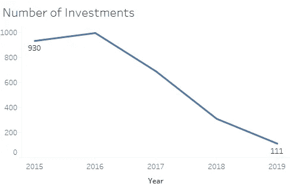
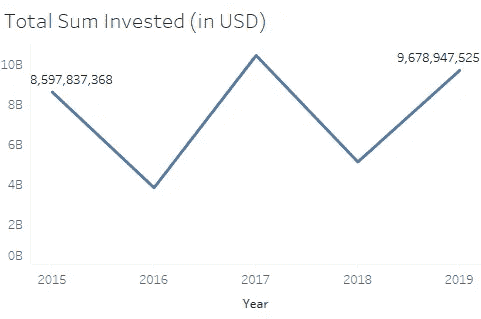
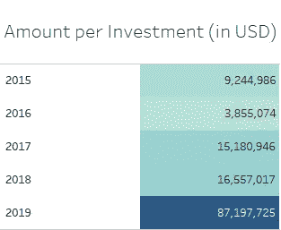
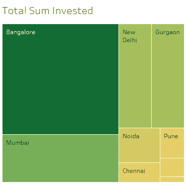
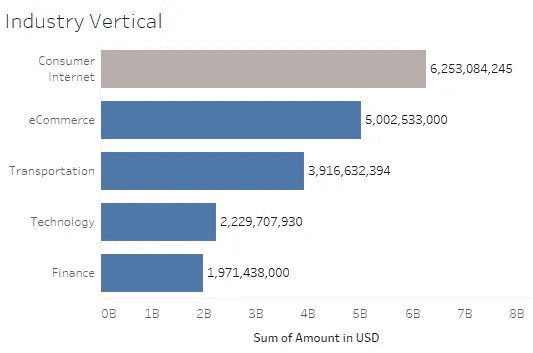
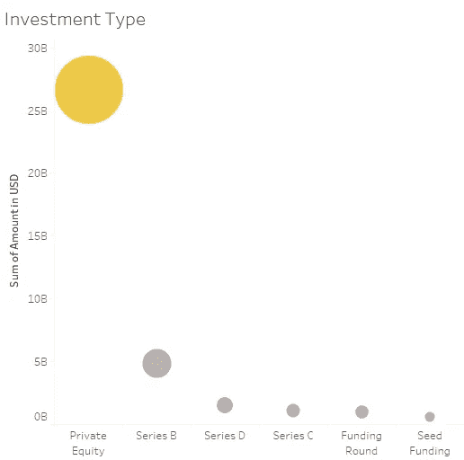
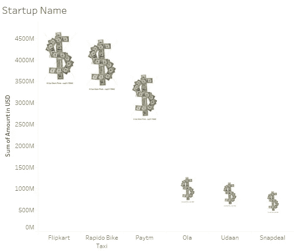

# 印度创业融资数据集的可视化探索

> 原文：<https://towardsdatascience.com/visual-exploration-of-the-indian-startup-funding-data-set-4947971b561?source=collection_archive---------38----------------------->

## 对印度启动资金数据集进行可视化探索性数据分析，以发现令人兴奋的趋势并回答预期的问题

在 [Unsplash](https://unsplash.com/s/photos/startup-business?utm_source=unsplash&utm_medium=referral&utm_content=creditCopyText) 上由 [Franck V.](https://unsplash.com/@franckinjapan?utm_source=unsplash&utm_medium=referral&utm_content=creditCopyText) 拍摄的照片

印度拥有世界上最大的创业生态系统之一，预计年增长率为 10-12%。印度有大约 20，000 家初创公司，其中大约 4，750 家是技术领先的初创公司。仅在 2016 年就有 1，400 家新的科技初创公司诞生，这意味着每天都有 3-4 家科技初创公司诞生(根据 given [来源](https://www.startupindia.gov.in/content/sih/en/startup-scheme/International/indian-startup-ecosystem.html))。考虑到所有这些因素，分析启动资金变得很有趣。

数据取自 [Kaggle](https://www.kaggle.com/sudalairajkumar/indian-startup-funding) ，拥有 2015 年至 2019 年印度创业公司的融资信息。它包括投资日期、创业所在城市、投资者姓名和投资额(美元)等栏目。

1.  **年度明智分析**

图一

> 一项精确的观察表明，这些年来投资数量急剧下降。

图 2

> 与之前的图表(图 1)相比，投资总额反而以更随机的方式变化

现在，通过比较两个图(图 1 和图 2)进一步深入投资，我们可以观察到每笔投资的*金额有所增加。*

图 3

> 这可能表明，投资者在过去几年里变得更加专一，并试图更多地投资于表现出更强竞争力的公司

2.**城市**

图 4

> 初创公司和投资者最青睐的只是少数几个城市

班加罗尔、孟买、新德里、古尔冈、诺伊达、浦那和钦奈是最受青睐的城市。该名单包括印度的主要大都市，这可能是一个迹象，表明重要的城市为创业公司提供了更好的生态系统和设施。此外，这个数字也证实了班加罗尔是印度主要创业中心的事实。

**3。行业垂直**

图 5

> 图表显示了根据投资总额排名的前 5 个行业

就投资而言，消费互联网、电子商务、交通、技术和金融是五个最受青睐的行业。

**4。投资类型**

所做的投资可以分为不同的类别，如 A 轮、B 轮、C 轮、种子基金、股权等。

图 6

> 作为私募股权的投资远远高于所有其他形式的投资

**5。投资额最高的创业公司**

图 7

> 获得最高资助的创业公司

Flipkart、Rapido 和 Paytm 是特定时期内获得资金最多的初创公司。

现在，我们已经对数据做了一些分析，是时候回答一些可能的问题了。

***资金生态系统如何随时间变化？***

每笔投资的金额逐年递增，这表明投资者有兴趣为有望表现更好或过去有良好记录的初创企业提供更多支持(图 1、2 和 3)。

***城市在资助中扮演重要角色吗？***

是的。毫无疑问，它扮演着重要的角色(图 4)。由于设施和更好的创业生态系统，大都市最受青睐。班加罗尔似乎拥有印度最好的创业生态系统。

***哪些行业最受投资人资金青睐？***

就投资而言，消费互联网、电子商务、交通、技术和金融是五个最受青睐的行业(图 5)。

# 结论

至此，我们已经做了一些基本分析，并试图回答几个问题。我们还发现了印度创业行业在城市、行业垂直等方面的一些有趣的模式和趋势。通过将这些数据与关于印度创业生态系统的外部知识相结合，可以进行进一步的分析，从而获得更好的见解和趋势。

***注*** :所有的视觉效果都是用 tableau 制作的。[文档的链接](https://public.tableau.com/views/IndianStartupFunding_15864952396040/Sheet1?:display_count=y&publish=yes&:origin=viz_share_link)