# 新冠肺炎:新加坡首批 100 名完全康复患者的视觉笔记

> 原文：<https://towardsdatascience.com/visual-notes-from-singapores-first-100-fully-recovered-covid-19-patients-aad7f2e1d0a0?source=collection_archive---------3----------------------->

确定你感染了新冠肺炎病毒需要多长时间？如果真的感染了，你需要多长时间才能摆脱这种新型冠状病毒？这些都是很难回答的问题，但下面是新加坡首批 100 例完全康复的病例可以告诉我们的。


已经创建了几个优秀的仪表板来跟踪新加坡[新冠肺炎](https://en.wikipedia.org/wiki/Coronavirus_disease_2019)疫情的进展(点击[此处](https://co.vid19.sg/)、[此处](https://experience.arcgis.com/experience/7e30edc490a5441a874f9efe67bd8b89)、[此处](https://infographics.channelnewsasia.com/covid-19/coronavirus-singapore-clusters.html?cid=covid19_desktop-banner_19022020_cna)和[此处](https://www.straitstimes.com/multimedia/graphics/2020/02/spore-virus-cases/index.html?shell))，试图复制这些资源更好的团队所做的事情是没有意义的。

在这篇文章中，我将着重探讨每个人心中的两个问题:

*   Q1:如果我的新冠肺炎病毒检测呈阳性，完全康复需要多长时间？

在这一点上没有全球标准，受影响的国家对新冠肺炎患者何时获准出院采取了不同的指导方针。

**在新加坡，新冠肺炎患者只有在至少相隔 24 小时的两次拭子检测** [**结果均为阴性**](https://www.moh.gov.sg/covid-19/faqs) **后，才被视为完全康复。只有到那时，他们才能出院。这样做是为了确保病人回到社区后不会传染给其他人。**

换句话说，仅从新冠肺炎症状中康复并不能被视为完全康复，也不能证明你有资格从新加坡医院出院。

到目前为止，这个城市国家的第一批 100 名完全康复的新冠肺炎病例中的患者需要 1 到 31 天才能出院，如果我们从他们被正式确认感染的那一天开始计算的话。该确认出院窗口的中位天数为 11 天。

*   Q2:如果我有症状，我要等多久才能确定是新冠肺炎病毒？

这是两个问题中较难回答的一个，因为我们对新冠肺炎的知识存在空白，而且病例复杂，要么没有症状，要么与 14 天潜伏期的标准不符。在新加坡，首批 100 例完全康复病例中的绝大多数患者在报告出现发烧、喉咙痛和呼吸困难等症状的 14 天内得到确诊。

但是 8 名患者没有症状，8 例患者在确诊前花了 15 天或更长时间。对于这些不寻常的病例，以及世界各地报道的类似病例，目前还没有结论性的解释。

显然，这不是医学研究，我也不是流行病学家。但是我特别注意使用清晰、明确、非危言耸听的标签/定义。

我在这里的目标是试图以一种清晰易懂的方式呈现公共数据中的潜在趋势，同时坦率地承认数据集的局限性和我缺乏该领域的专业知识。

[新加坡因其对新冠肺炎疫情的早期处理而赢得赞誉，但有迹象表明，这种早期的成功无意中在一些居民中滋生了自满情绪。在疫情已经全球化的时候，考虑到新加坡的高人口密度，这种自满情绪将被证明是代价高昂的。](https://www.npr.org/sections/goatsandsoda/2020/03/12/814522489/singapore-wins-praise-for-its-covid-19-strategy-the-u-s-does-not)

从我过去做记者的经验来看，当你试图让他们参与到“大局”的解释中时，大多数人都不理会。但如果对他们个人福祉的影响说得更清楚，他们可能会更关注一点。

这就是我希望通过这篇文章达到的目的。

# 1.数据、定义和说明

在我们进入图表之前，重要的是首先要了解公共数据集的局限性，避免匆忙得出结论。新加坡当局发布的信息虽然详细，但主要是为了让公众每天了解情况。该数据集不包含关于患者的详细医疗信息，这些信息将为全面的研究提供信息。

因此，我避开了像“潜伏期”和“恢复期”这样的标签，它们在医学研究中有特定的含义，最好留给专家来处理。

## **1.1 数据来源**

我从新加坡卫生部发布的每日新闻稿中手动收集了第一批 100 例完全康复病例的数据集。你可以在这里下载数据集[的副本，或者通过](https://www.dropbox.com/s/lszzgmcsfojczek/covid100_recovered.csv?dl=0) [Github repo](https://github.com/chuachinhon/covid_sg) 下载这篇文章。

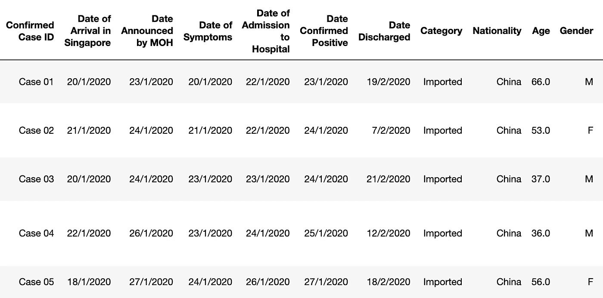

根据记录，新加坡前 100 名完全康复的患者是:病例 01–34、36–40、43–81、83–89、91–93、95–96、98、102、106–107、110–112、138、148 和 151。

新加坡第一个完全康复的患者是病例 07，一名 35 岁的中国大陆公民，于 2 月 04 日出院，他于 2020 年 1 月 27 日被确认为新冠肺炎阳性。

加入样本的第 100 例出院患者是病例 102，一名 41 岁的菲律宾妇女，于 2020 年 3 月 14 日出院。据新加坡卫生部称，包括 102 号病例在内的八名无关患者于 3 月 14 日出院。**恢复的患者 103、135、146、150 和 160 未被添加到该数据集。**

出于实际原因，我选择了前 100 个恢复的案例。显然，新加坡的新冠肺炎病例总数仍在增长，而且趋势会随着数字的变化而变化。所以请记住，这只是初步的探索。我会在适当的时候更新或写一篇新帖。

非新加坡读者注意:CSV 文件中的日期是按照新加坡的标准以日/月/年格式记录的。

## 1.2 定义

不幸的是，这篇文章中使用的两个定义都很笨拙，但我选择尽可能明确，以便我们专注于有限的公开数据实际上说了什么，而不是走上过度解释我们认为数据在说什么的道路。

例证:公开数据不包含患者首次接触病毒的时间，也不包含他们在医院期间的日常状况。新加坡当局也没有透露患者在医院从症状中恢复需要多长时间，以及他或她等待拭子检测结果的时间。

因此，在这篇文章中采用“潜伏期”和“恢复期”这样的短语是很有问题的，因为它们有特定的医学定义，而新加坡的公共数据不一定涉及这些定义。

## **定义#1:确认-卸货窗口**

在本帖中，我将使用“确认-出院窗口”一词来简写新加坡卫生部宣布的患者新冠肺炎感染确认日期和他/她的正式出院日期之间的**天数。这些日期是公开记录的，没有争议。**

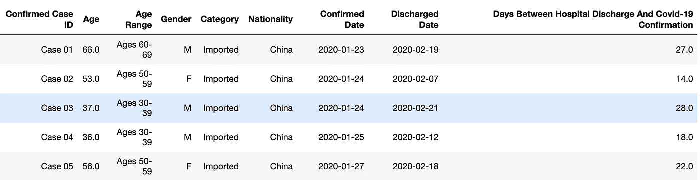

从确认日期开始计时为我们在快速变化的环境中进行比较提供了一致的基线。在疫情爆发的早期，你会预计到患者入院和新冠肺炎检测结果之间会有明显的差距。但是随着[更新的检测试剂盒的出现，](https://www.channelnewsasia.com/news/singapore/covid19-new-test-kits-swab-three-hours-12505658)这个等待时间将会大大缩短。

## 定义#2:症状-确认窗口

鉴于全球在获得医疗设施和新冠肺炎检测试剂盒方面的差异，预确认阶段是一个棘手的领域。在新加坡，卫生部还发布了每个新冠肺炎病例的一些关键日期，包括抵达新加坡的日期(对于输入病例)，以及自行前往诊所或医院的日期(如果适用)。

因此，从接触新冠肺炎病毒到官方确认感染之间的不确定期可以用多种方式来定义，这取决于如何组合可用的日期。

为了避免问题过于复杂，我将使用一个简单的预确认阶段定义为“**症状-确认窗口”，即从报告症状开始到正式确认新冠肺炎感染之间的天数。**

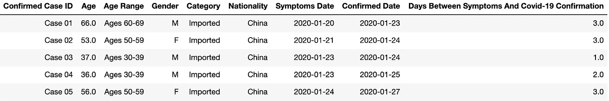

可以肯定的是，人们对患者报告的症状发作日期的真实性存在一些怀疑，尤其是在压力和社会耻辱的时期。但这是新加坡数据中最可靠的“开始日期”。我选择不使用住院和自行就诊的日期，因为这些情况下的诊断尚未披露。

# 2.新加坡首批 100 名完全康复患者的人口统计分析

我不打算复制已经存在的优秀的新冠肺炎仪表板。但是一些按人口统计分类的图表对本文的分析仍然有用。为此，我在 fluore 上创建了一个交互式图表，可以快速完成工作。你可以在这里访问它[。](https://public.flourish.studio/visualisation/1506209/)

在这 100 个样本中，我们有 23 个输入病例和 77 个本地传播病例。康复的病人中有 40 名是女性，其余的是男性。

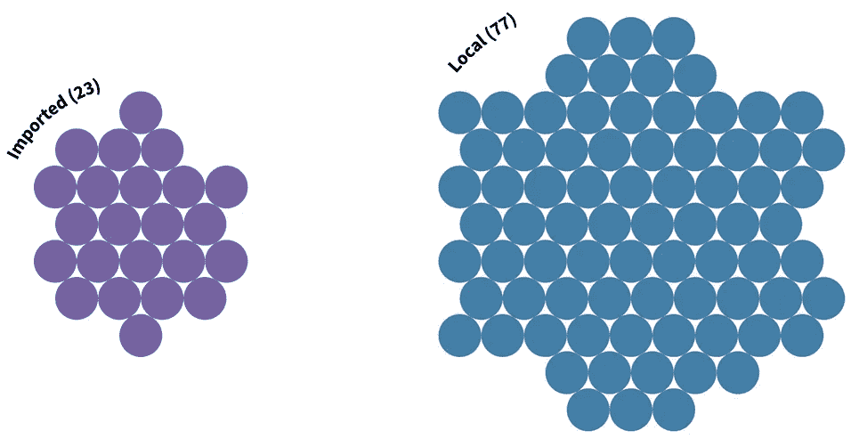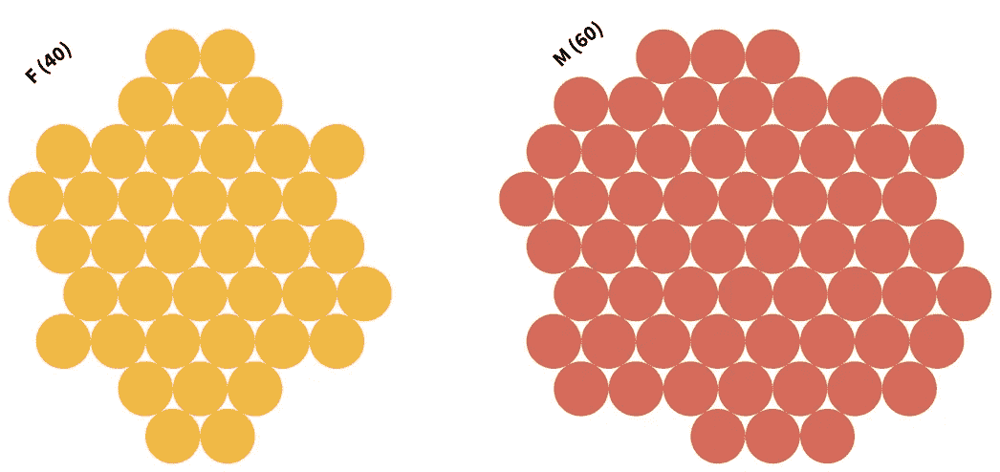

就国籍而言，如果我们单独考虑新加坡永久居民，我们有八个群体。有:

*   67 名新加坡人
*   19 名中国大陆公民
*   6 新加坡减贫战略
*   4 名孟加拉人
*   印度尼西亚、日本、马来西亚和菲律宾国民各 1 名

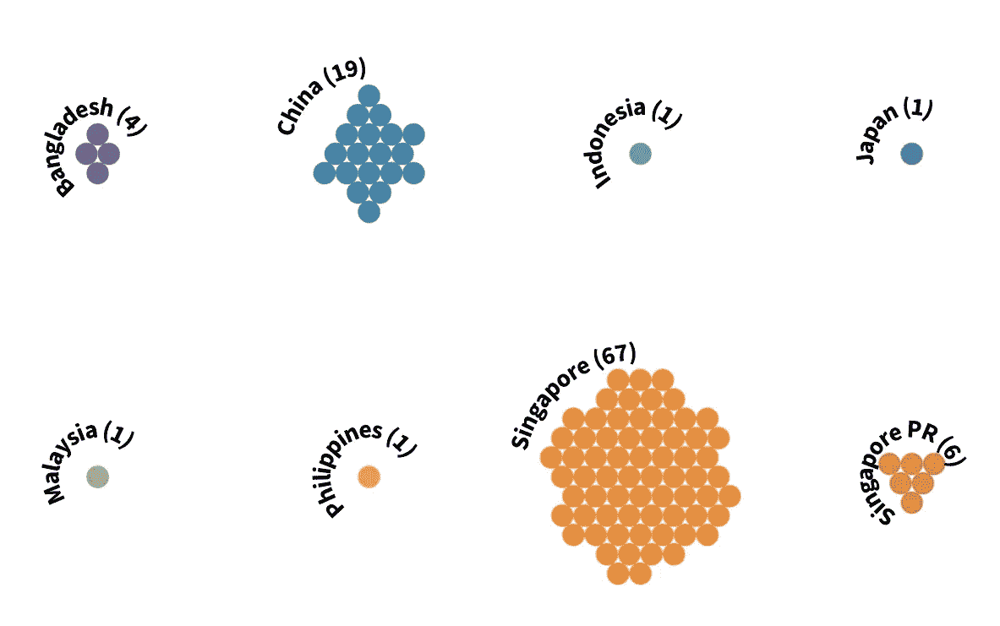

就年龄而言，首批 100 名完全康复的患者(75 名)年龄在 30 至 59 岁之间。拥有最多新冠肺炎患者的单一年龄范围是 30-39 岁，有 28 人(18 名男性和 10 名女性)。

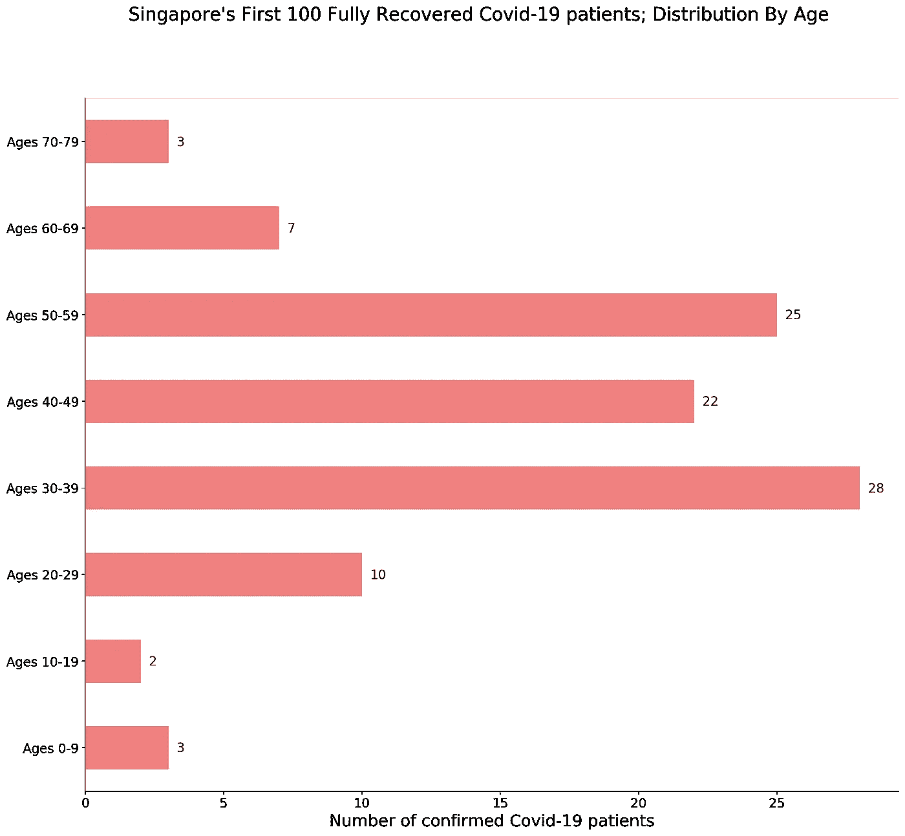

# **3。如果你的新冠肺炎病毒检测呈阳性，完全康复需要多长时间？**

3 月 12 日，在 T2 一次罕见的电视讲话中，新加坡总理李显龙表示，新加坡 80%的新冠肺炎患者“只有轻微症状”。他没有解释他所说的“温和”具体指的是什么。

但是如果你已经感染了新冠肺炎病毒，从症状中恢复只是痛苦的一部分。

**在新加坡首批 100 例完全康复的病例中，大多数患者，无论老少，都需要长期住院，因为需要额外的时间来确保他们停止传播高传染性的新冠肺炎病毒。**

```
Average number of days between hospital discharge and Covid-19 confirmation:  12.29
Median number of days between hospital discharge and Covid-19 confirmation:  11.0
Minimum number of days between hospital discharge and Covid-19 confirmation:  1
Maximum number of days between hospital discharge and Covid-19 confirmation:  31
```

这是一个很重要的区别，因为错误地认为新冠肺炎“只是一场重感冒”(i [t 不是](https://www.bloomberg.com/news/articles/2020-03-11/fauci-warns-coronavirus-far-more-lethal-than-seasonal-flu?utm_source=facebook&utm_campaign=socialflow-organic&utm_medium=social&utm_content=business&cmpid=socialflow-facebook-business&fbclid=IwAR3YRD_F5LBtI9zeogyP0XdIgtuIUSIW2aQBIn05y8J1M9JdQyjPFA7a8MM))可以很快康复，是新加坡和其他地方许多人自满的核心。

新加坡前 100 例恢复病例的数据显示**确认出院窗口的中位天数为 11 天。**三分之一(33)的患者从确诊感染时起需要 15 天或更长时间才能出院。只有 8 名患者在确诊感染后 3 天或更短时间内出院。

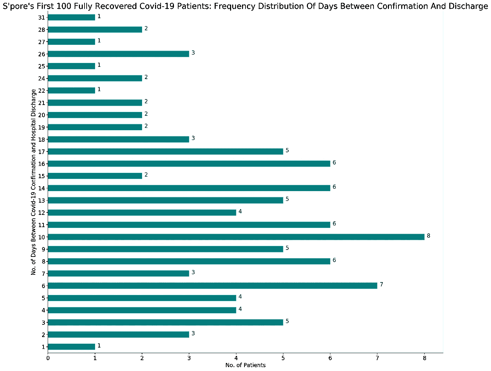

上图还显示了卫生当局为何对新冠肺炎新增病例数量的大幅上升感到担忧。如果新感染病例激增，确保大量患者安全返回社区所需的大量时间和资源可能会让一个国家的医疗系统不堪重负。

**简而言之，这不仅仅关乎你个人从新冠肺炎感染中康复的能力。**这种担忧本质上是更广泛和系统性的，也就是说，是对医疗系统处理可能持续数周具有传染性的患者突然激增的能力的担忧。

## 3.1 确认-卸货窗口:甘特图可视化

甘特图通常用于说明项目进度。但在这种情况下，它在显示每个病人的确认出院窗口方面工作得很好。你可以在这里下载一份互动图[(是 html 文件；中不允许交互式图表的直接嵌入)。只需将鼠标悬停在每个条形上，即可查看特定案例的元数据，以及他/她从确认到完全恢复所用的天数。](https://www.dropbox.com/s/s5hx02zgfqdj8bc/discharge_overview.html)

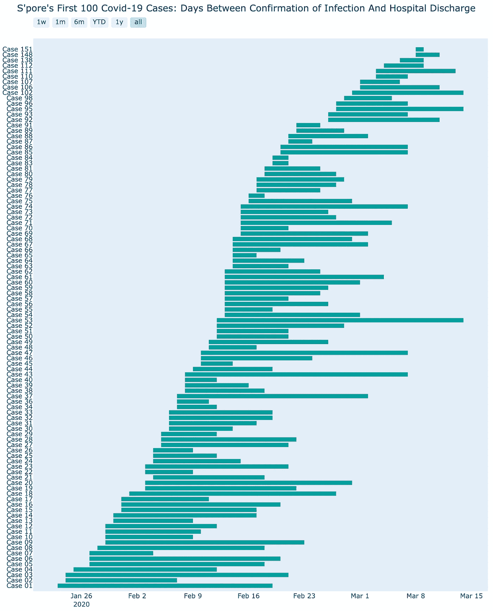

这里下载互动版

甘特图有助于概览，并允许您快速挑选出不寻常的情况:

## 3.1.1 哪些案例完全恢复所需的时间最少？

第 151 号案件，在官方确认和释放之间只有一天的时间，这可能是最不寻常的。

新加坡卫生部的官方新闻稿似乎暗示，这名 51 岁的新加坡男子在 2 月 4 日首次报告出现症状后，已自行从新冠肺炎康复。3 月 8 日，一项血清测试的结果证实他有“早期新冠肺炎感染”。一天后，他于 3 月 9 日出院。

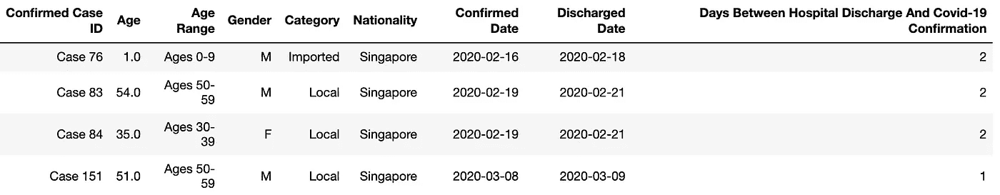

病例 76、83 和 84 在被正式确认感染后仅用了两天就出院了。案例 83 和 84 是美奂大道群的一部分，而美奂大道群又与另外两个教堂群相关联。

患者 76 是 2 月 9 日从疫情中心武汉撤离的新加坡人之一。他在登机前没有表现出任何症状，并在抵达新加坡时被隔离，作为这个城市国家遏制措施的一部分。他仅在 2 月 16 日的新冠肺炎病毒检测中呈阳性。

尚不清楚为什么这些病例在如此短的时间内就完全康复了。

## 3.1.2 哪种情况需要最长时间才能完全恢复？

病例 53 保持着迄今为止的记录，从确认感染到最终出院用了 31 天。这名 54 岁的新加坡男子是新冠肺炎一个教会的成员，该教会与当地的一个教会“上帝恩典会”有联系。他于 2 月 10 日首次报告出现症状，两天后被检测出新冠肺炎病毒阳性。

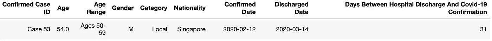

然而，尚不清楚他从新冠肺炎症状中恢复的天数与他完成拭子检测所需的时间之间的差距。新加坡的公开数据不包含新冠肺炎治疗期间患者状况的详细信息。

# **4。不同性别和年龄的患者恢复速度不同吗？**

一项针对中国 1000 名新冠肺炎患者的 T4 研究发现，女性更有可能存活。谢天谢地，新加坡还没有出现与新冠肺炎相关的死亡病例。但在新加坡首批 100 名完全康复的患者中，男性和女性完全康复的速度是否不同？

## 4.1 男性和女性的确认-恢复窗口有何不同

在新加坡首批 100 名完全康复的新冠肺炎患者中，有 60 名男性和 40 名女性。但是下面的箱线图显示，两种性别完全康复的平均天数相同——11 天。

样本量小可能是一个因素，当我们有大量完全康复的患者时，观察事情如何变化将是有趣的。如果你对箱线图不熟悉，看看这个解释者[这里](/understanding-boxplots-5e2df7bcbd51)。

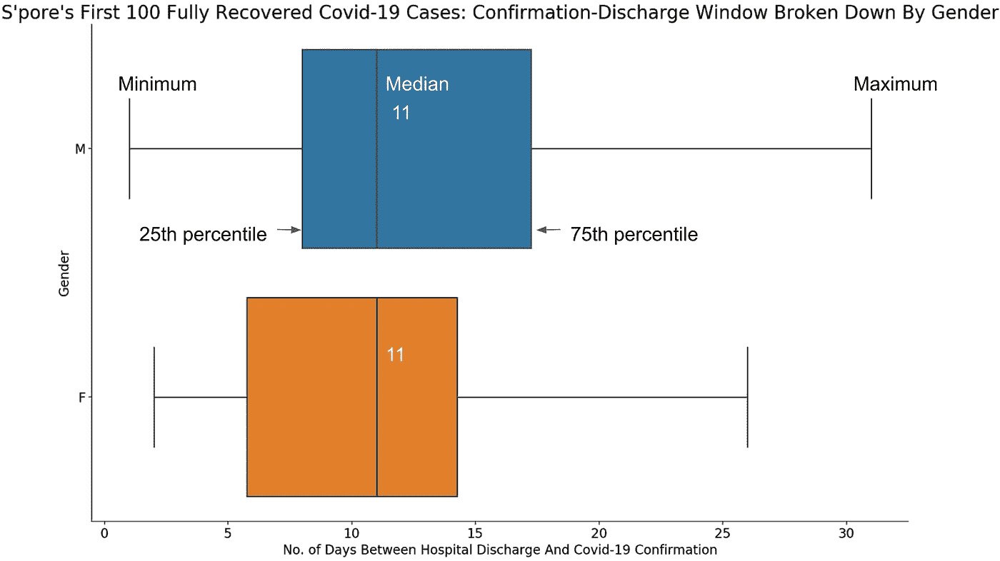

## 4.2 不同年龄组的确认-恢复窗口有何不同

我们大多数人可能会认为年龄会影响完全康复所需的时间，但来自新加坡前 100 例新冠肺炎病例的数据带来了一些惊喜:

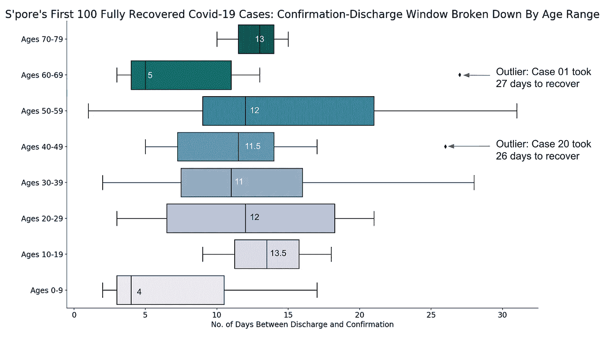

除了年龄最小的 9 岁以下的患者，他们的确认出院窗口中位数为 4 天，我们没有看到年轻患者完全康复的速度明显快于年长患者。

事实上，10-19 岁、20-29 岁和 40-49 岁年龄组完全康复所需的中位天数比所有 100 名康复患者 11 天的总中位天数要长。

乍一看这很令人惊讶，但当你回到完全康复的定义时就不那么令人惊讶了——这是指患者必须证明他们已经停止传播病毒，而不仅仅是从症状中恢复过来。换句话说，即使年轻患者从症状中恢复得更快，不同年龄组之间脱离新冠肺炎所需的中位时间可能不会有太大差异。当然，这需要专家在一项更大的研究中进行验证。

60-69 岁年龄组的数据极不寻常。该年龄段的中位确诊-出院窗口为 5 天，有一个异常值，即病例 01，在确诊感染和出院之间用了 27 天(总中位值的 2.5 倍)。考虑到这次初步探索的样本量很小，我将暂时避免对此进行过度解读。

盒子情节的互动版本可以在[这里](https://public.flourish.studio/visualisation/1518465/)获得。将鼠标悬停在数据点上可查看每个病例的详细元数据，或将鼠标悬停在方框上可查看特定年龄范围内患者恢复期的四分位数分布。

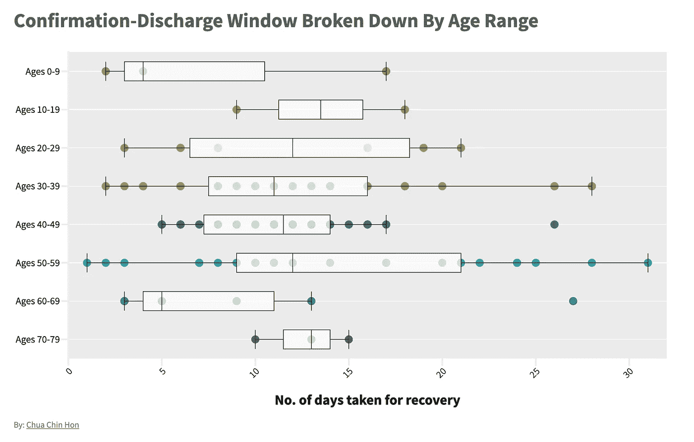

此图表的互动版本可在[此处](https://public.flourish.studio/visualisation/1518465/)获得

# 5.确定我是否感染了新冠肺炎病毒需要多长时间？

鉴于全球在获得医疗设施和新冠肺炎检测试剂盒方面的差异，这是一个棘手的领域。新加坡卫生部网站上的官方常见问题称“潜伏期长达 14 天”，引用了中国新冠肺炎病例的数据。

这与新加坡前 100 例完全康复病例的数据分析相吻合，在新加坡，只有 8 名患者从出现症状起超过 14 天才检测出新冠肺炎阳性:

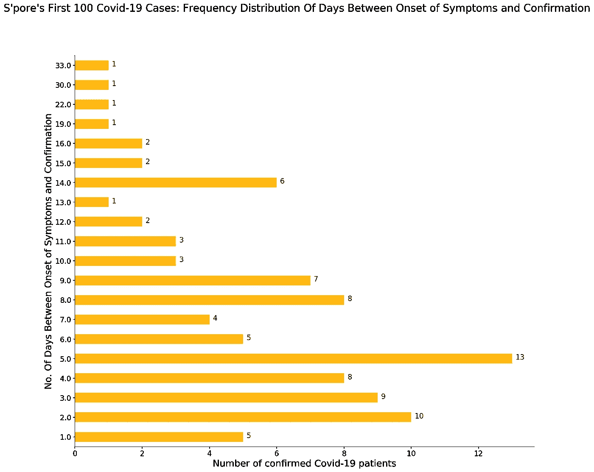

8 名患者没有症状，92 名有症状的患者中有一半以上在 7 天或更短时间内被确认为新冠肺炎阳性。总体而言，从出现症状到确认感染的中间天数为 6 天。

```
Average number of days between symptoms and confirmation:  7.434782608695652
Median number of days between symptoms and confirmation:  6.0
Minimum number of between symptoms and confirmation:  1.0
Maximum number of days between symptoms and confirmation:  33.0
```

## 5.1 症状的甘特图可视化-确认窗口

重复使用甘特图，我们可以再次判断出哪些病例花费了异常长的时间来确认感染。案例 151、91 和 83 立即成为非常复杂的案例。你可以在这里下载一份互动图表[。](https://www.dropbox.com/s/uj51tqn7qmc3rrs/symptoms_overview.html?dl=0)

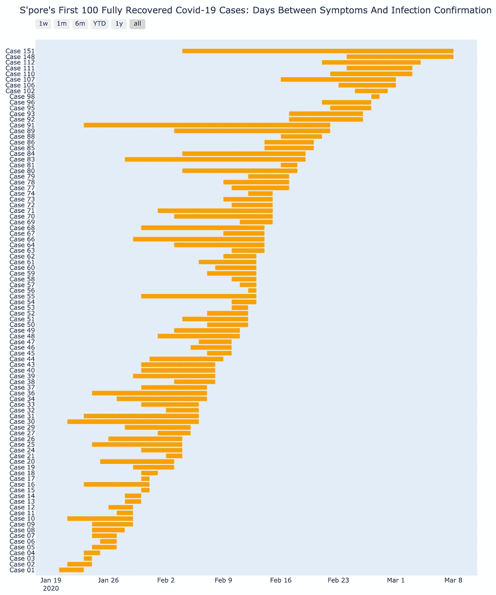

点击下载互动图表

我们之前简要讨论过的病例 151，从出现症状到确认感染之间名义上有 33 天的间隔。但是现实要复杂得多，正如我们在 3 月 9 日卫生部的新闻发布会上看到的。

他于 2 月 4 日开始出现症状，但在 3 月 8 日进行了血清学测试，以确认他患有早期的**新冠肺炎**感染。当局没有说明他被感染的确切时间，也没有说明血清学检测是否能辨别出之前感染的日期。151 号病例一天后于 3 月 9 日出院。

病例 151 不是报告症状的患者中唯一的异常值。在我们的 100 例康复病例样本中，其他 7 例患者——病例 30、66、68、83、84、89 和 91——从出现症状到确诊新冠肺炎病毒超过 14 天。它们都是本地传播的病例:

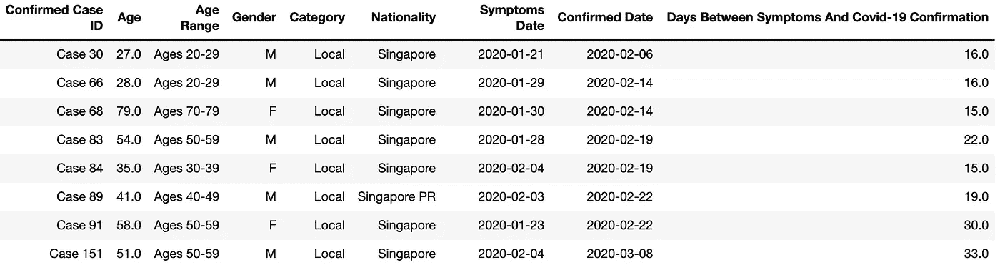

根据[2 月 25 日](https://www.moh.gov.sg/news-highlights/details/five-more-cases-discharged-one-new-case-of-covid-19-infection-confirmed)卫生部发布的日期为【2 月 1 日、6 日和 10 日】的新闻稿，91 号病例在报告症状出现和确诊之间间隔了 30 天，于 1 月 23 日首次报告身体不适，并在三个不同的时间到诊所寻求治疗。

卫生部当时没有说这位 58 岁妇女的诊断是什么。她于 2 月 18 日被转介到国家传染病中心(NCID ),此前她被确定为病例 66 的接触者，该病例是上帝教会恩典大会群集的主要病例。2 月 22 日下午，91 号病例的新冠肺炎病毒检测结果呈阳性。

圣保罗卫生官员解释说，91 号病例之所以被遗漏，是因为她的病情和旅行史当时不符合他们对疑似病例的定义，并补充说，他们此后收紧了对没有去过新冠肺炎热带地区旅行史的疑似病例的标准。

这些异常病例出现在数据集中反映了新加坡积极的接触者追踪制度。在其他资源更紧张的国家，或者政府采取更宽松措施的国家，他们可能没有被发现。

尚不清楚这些不寻常病例在未被发现时的传染性有多大。在遏制疫情的努力中，它们无疑是最复杂的挑战之一。

## 5.2 无症状的新冠肺炎患者人数

另一方面，在首批 100 名康复患者中，有 8 名患者(6 名男性，2 名女性)在新冠肺炎病毒检测呈阳性之前没有任何症状。它们是:第 22、23、28、65、75、76、87 和 138 号案件。

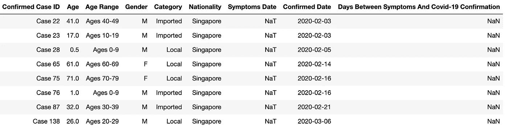

其中四名患者——病例 22、23、76 和 87——是新加坡人，分别于 1 月 30 日和 2 月 9 日乘坐两个航班从武汉撤离。他们登机时没有报告任何症状，但在抵达时被隔离，然后作为额外的预防措施进行了新冠肺炎测试。他们随后的冠状病毒检测呈阳性。

这四例本地传播病例没有症状出现的详细信息，是新加坡已知新冠肺炎聚集性病例的一部分。但卫生部的新闻稿没有解释为什么这些患者在确认感染前没有任何症状。

第 138 号患者是另一个高度复杂的病例——他于**3 月 6 日检测呈阳性，此前他已经接受了为期三周的隔离，并被允许离开家。这名 26 岁的男子与新加坡当地教会的两个群体有关联，在阳性检测后，他不得不被召回接受进一步调查。他于 3 月 9 日被解除警报并出院。关于这个案子的更多信息可以在媒体报道中找到[这里](https://sg.news.yahoo.com/moh-clarifies-about-man-who-was-confirmed-covid-19-case-after-ending-quarantine-153635795.html)和[这里](https://www.todayonline.com/singapore/gym-safra-punggol-closed-after-user-has-covid-19-gym-employees-stay-home-notice)。**

我不会进一步细分症状确认期的数据，因为我不清楚在这种情况下性别和年龄会比一个人最近的社会活动更重要。可能有更科学的方法来研究这个棘手的感染前确认阶段，这最好留给专家来做。

本帖中图表的笔记本和数据在我的 Github [repo](https://github.com/chuachinhon/covid_sg) 中。如果你发现了错误或者对这个来自新加坡的小数据集做了一些有趣的事情，请告诉我。在以下时间 Ping 我:

推特:[蔡展鸿](https://medium.com/u/b3d8090c0aee?source=post_page-----aad7f2e1d0a0--------------------------------)

领英:[www.linkedin.com/in/chuachinhon](http://www.linkedin.com/in/chuachinhon)

***编者按:*** [*走向数据科学*](http://towardsdatascience.com/) *是一份以数据科学和机器学习研究为主的中型刊物。我们不是健康专家或流行病学家，本文的观点不应被解释为专业建议。想了解更多关于疫情冠状病毒的信息，可以点击* [*这里*](https://www.who.int/emergencies/diseases/novel-coronavirus-2019/situation-reports) *。*