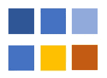
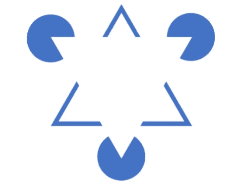
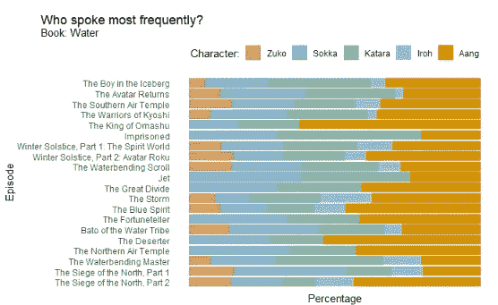
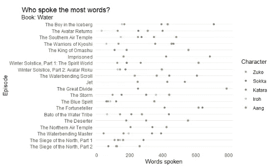
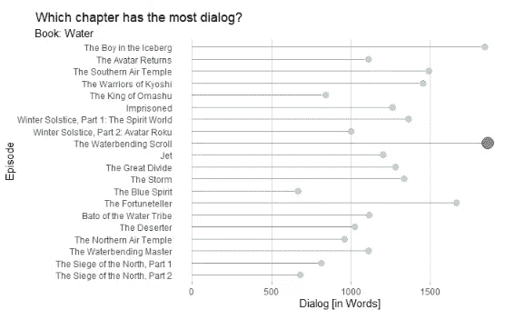

# 视知觉

> 原文：<https://towardsdatascience.com/visual-perception-how-we-perceive-graphical-information-de5f30516009?source=collection_archive---------38----------------------->

## 数据可视化基础

[斯蒂夫·约翰森](https://unsplash.com/@steve_j?utm_source=medium&utm_medium=referral)在 [Unsplash](https://unsplash.com?utm_source=medium&utm_medium=referral) 上拍照

我们为什么要可视化数据？

它帮助我们理解*巨大的*数据量，把它压缩成一个简单的，容易理解的可视化。它帮助我们找到隐藏的模式或看到数据本身的潜在问题，如果没有好的图表，这些问题可能不会很明显。

我们的大脑专门尽可能高效地感知我们周围的物质世界。证据还表明，不管我们的环境或文化如何，我们都发展了相同的视觉系统。这表明视觉系统的发展不仅仅基于我们的环境，而是数百万年进化的结果。这与白板理论(Ware 2021)相矛盾。抱歉，约翰·洛克。我们的视觉系统分割任务，因此有专门的区域负责分割(早期快速处理)、边缘方向检测或颜色和光感知。我们能够轻松地提取特征并找到模式。

有趣的是，在更高层次的视觉感知(视觉认知)上，我们的大脑能够突出颜色和形状，以专注于某些方面。如果我们在一张公路地图上搜索红色的公路，我们可以利用我们的视觉认知来突出红色的公路，并将其他颜色放在背景中。(Ware 2021)

我们可以说两种类型的视觉化。感官或任意。感官表征无需训练就能理解，而且通常理解得很快，跨文化。任意可视化不是那么容易理解的，需要学习。例如，一个任意的可视化系统是一个电路图、一张地图或一个建筑的蓝图。为了理解这些可视化的信息，你需要接受某种形式的培训。尽可能集中在一个感觉系统上是有意义的，只有在必要的时候才使用任意的系统。这样你就有最好的机会让你的听众理解你。只要确保你所使用的系统在目标受众中已经建立。(Ware 2021)

Colin Ware 在他的书《信息可视化，设计感知》中写下了很多指导方针。以下是我认为重要的几个:

*   考虑人类的感官能力，以帮助重要的数据元素
*   重要的数据应该用视觉上更加清晰的图形元素来表示
*   更大的数字量应该用更明显的图形元素来表示。
*   图形符号系统应该标准化

## 视觉变量

法国制图师 Jacques Bertin(1918–2010)是第一个在他的书“ *Sémiologie graphique* ”中描述视觉变量的人。他认为视觉变量有七个主要类别:位置、大小、形状、价值、颜色、方向和纹理。(罗斯 2017)

一个物体的**大小**可以用来传达一个特征的重要性。描述某物有多大或多小。在 3D 中，它表达了亲密感。请记住，较大的物体会吸引更多的注意力。

大小，作者图片

一个对象的**形状**可用于将其与其他对象分开，或者[将多个具有相同分类属性的对象组合在一起。](https://ch.mathworks.com/help/examples/stats/win64/CreateScatterPlotsUsingGroupedDataExample_01.png)

形状，作者的图像

**颜色值**，分别表示颜色的深浅程度，反映了特征的重要性。它可以用来可视化连续变量。请注意，较深的颜色被理解为“更多的…”。

颜色值，按作者分类的图像

符号的**方向**可用于显示方向或对对象进行分组。

方向，作者的图像

**纹理**可用于区分类别或替代颜色。在地图中，纹理用于分隔不同的区域。例如森林和田野。

纹理，作者提供的图像

**色调**用于分类数据或突出重要的东西。某些颜色更占主导地位，会吸引人们的注意力。此外，确保在可视化中使用色盲友好的颜色。(蓝黄色是好的)

颜色色调，作者提供的图像

物体的**位置**也很重要。更高或更靠近观察者可以传达这个物体更重要，更值得你注意。

## 颜色

对我来说，在我的图形中摆弄颜色是最有趣的。它们只是用一些漂亮的颜色看起来更令人愉快。有几件事要记住:

*   颜色传达一种感觉(情绪)
*   色盲:考虑一组黄蓝方向的颜色
*   连续变量的颜色值(颜色的明度或暗度)和离散变量的单独颜色(分类数据)。

连续变量(上图)和离散变量(下图)的颜色，按作者分类

## 格式塔理论原则

> 整体不同于部分之和~库尔特·科夫卡

格式塔原理描述了人类对相似物体进行分组、寻找模式以及从缺失部分进行简化或推断的能力。访问[这里](https://www.britannica.com/science/Gestalt-psychology)了解更多格式塔心理学。该理论由五个定律组成，下面简要介绍:

**相似度**

彼此相似的项目往往被视为一组或单个对象。下图中的正方形和圆形不被视为单一对象，而是被视为行。

相似性，作者图片

**prgnanz**

> …论点是 Wertheimer 对组织中的*普拉南斯*(“精确”)的概念；当事物被整体把握时，最少的能量被用于思考。对韦特海默来说，真理是由经验的整体结构决定的，而不是由个人的感觉或知觉决定的。(心理学杂志)

视觉效果越简洁，观察者就能越快、越少地捕捉到其中显示的信息。

**接近度**

距离较近的物体被视为一个整体，而不是单个的。下面的方块被认为是 4 个垂直的行。

邻近定律，作者图像

**连续性**

眼睛沿着它能找到的最平滑的路径前进。你注意到眼睛是如何更好地跟随亮点的吗？

连续性，作者的图像

**关闭**

组合在一起的物体被视为一个整体。我们忽略线条，填充缺失的部分。你看到白色三角形了吗？

闭合定律，作者的图像

## 应用

我应用了一些讨论过的理论来可视化来自 [tidytuesday](https://github.com/rfordatascience/tidytuesday/tree/master/data/2020) 的化身数据集的信息。这些图形是用 r 中的 ggplot2 制作的，你可以在我的 [GitHub](https://github.com/roman-studer/fhnw-ds-hs2020-gdv_data_visualization) 上找到代码。

这种堆积百分比条形图和散点图使用可视变量“色调”,以便可以清楚地识别字符。“色值”是用来强调主角的。通过对行进行排序，也可以使用“位置”。

堆积百分比条形图

在这个散点图中，垂直网格被移除。这些点现在清楚地分配给一集，并显示为行。这里使用了格式塔理论的邻近定律。

散点图

大小可以用来引起对某个数据点的注意。这有助于更快地检测出具有最高值(深蓝色)的行。如果不突出显示该值，将很难找到最高值。

棒棒糖图表

## 来源

“格式塔心理学|定义、创始人、原则和例子”。*大英百科全书*。[https://www.britannica.com/science/Gestalt-psychology](https://www.britannica.com/science/Gestalt-psychology)(7。2020 年啤酒节)。

“心理学”。*大英百科全书*。【https://www.britannica.com/science/Pragnanz】T2(7。2020 年啤酒节)。

罗思罗伯特。2017.“视觉变量”。在，1–11。

罗纳德·萨尤尼。“格式塔原则(视频)”。*可汗学院*。[https://www . khanacademy . org/test-prep/mcat/processing-the-environment/sensory-perception/v/gestalt-principles](https://www.khanacademy.org/test-prep/mcat/processing-the-environment/sensory-perception/v/gestalt-principles)(6 .2020 年啤酒节)。

威尔科林。2021.“信息可视化”。在*信息可视化*中，Elsevier，I .[https://linking hub . Elsevier . com/retrieve/pii/b 978012812875601001 x](https://linkinghub.elsevier.com/retrieve/pii/B978012812875601001X)(7。2020 年啤酒节)。

Wilke，Claus O. *数据可视化基础*。[https://clauswilke.com/dataviz/color-basics.html](https://clauswilke.com/dataviz/color-basics.html)(6。2020 年啤酒节)。