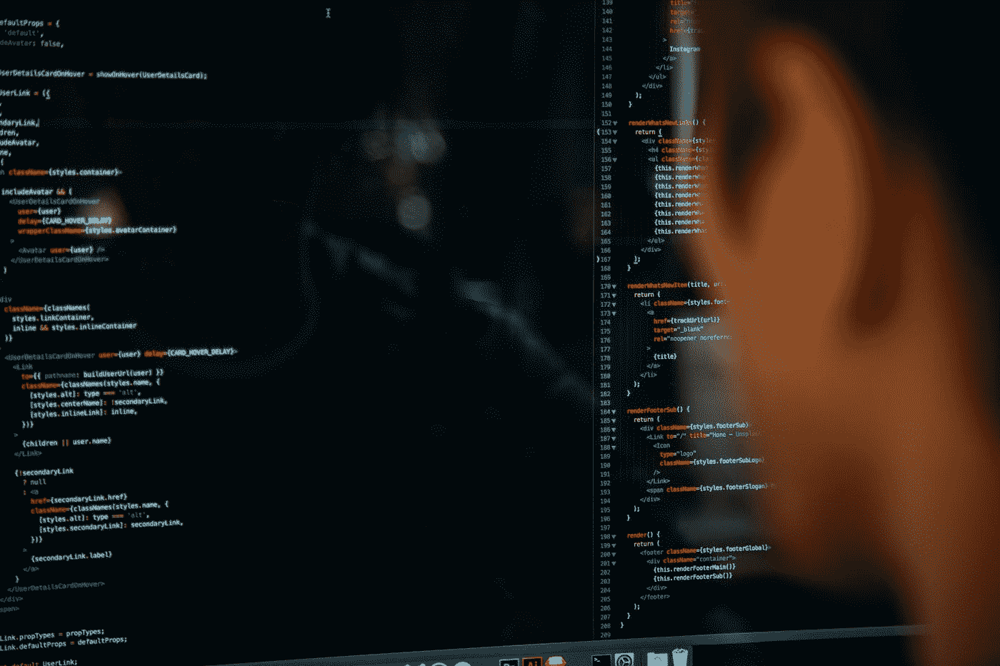
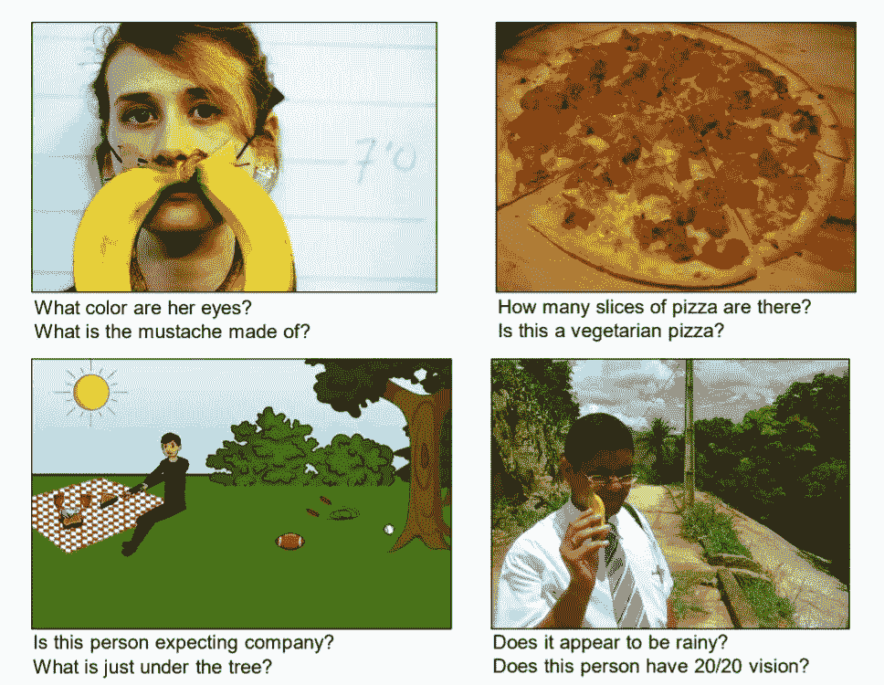
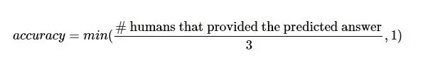
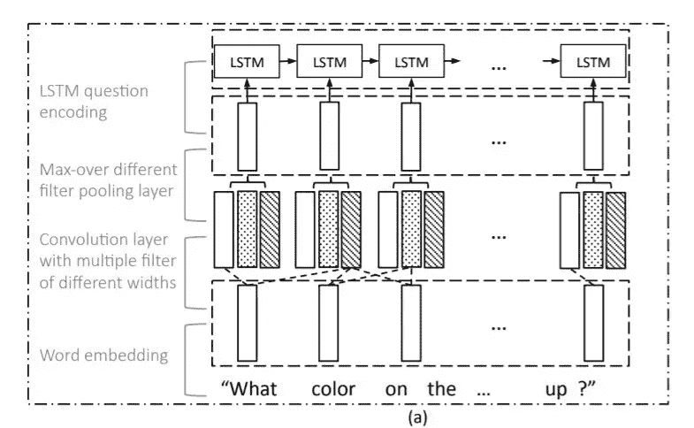
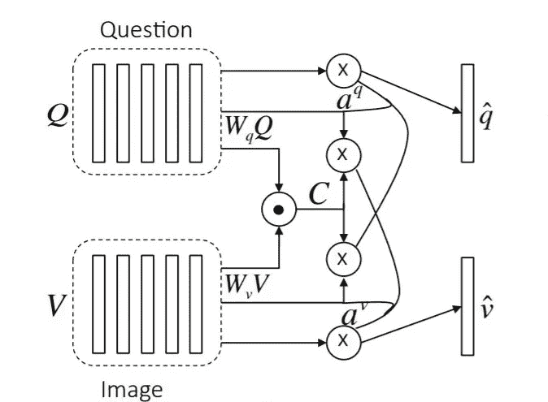
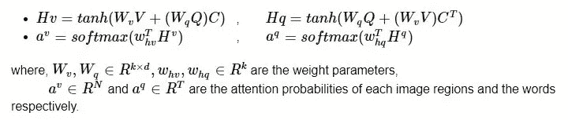
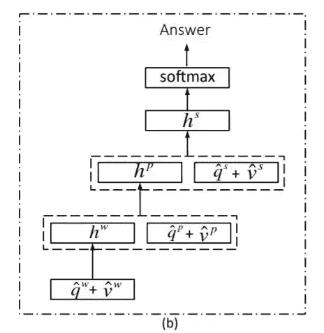
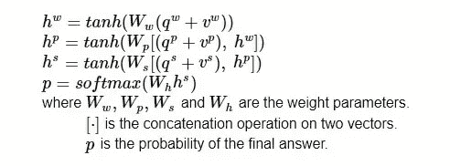

# 具有深度学习的视觉问答

> 原文：<https://towardsdatascience.com/visual-question-answering-with-deep-learning-2e5e7cbfdcd4?source=collection_archive---------18----------------------->

## 本博客包含在 Keras/Tensorflow 中实现“面向视觉问答的分层问题-图像共同关注”论文。

查尔斯·德鲁维奥在 [Unsplash](https://unsplash.com?utm_source=medium&utm_medium=referral) 上拍摄的照片

目录:

1.  [简介](#1719)
2.  [商业问题](#2c5f)
3.  [了解数据](#51eb)
4.  [将现实世界的问题映射到 ML/DL 问题](#cca2)
5.  [了解模型](#140c)
6.  [实施细节](#f035)
7.  [代码](#e44d)
8.  [结果](#5371)
9.  [结论和未来工作](#8324)
10.  [参考文献](#c49d)

# 1.简介:

视觉问答是一个关于建立一个人工智能系统来回答用自然语言提出的关于图像的问题的研究领域。

解决这一任务的系统展示了对图像的更一般的理解:它必须能够回答关于图像的完全不同的问题，有时甚至可以处理图像的不同部分。

让我们看几个例子:

来源:原文 [VQA 论文](http://arxiv.org/pdf/1512.02167.pdf)

对于所有的图像，我们的人工智能系统应该能够定位问题中提到的主题并检测到它，并且应该有一些常识来回答它。

例如，在第一张图片中，对于问题“*胡子是由什么组成的？“我们的人工智能系统应该能够判断出所指的对象是女性的脸，更具体地说是她嘴唇周围的区域，并且应该能够检测到香蕉。*

# 2.业务问题:

作为人类，我们很容易看到一幅图像，并利用我们的常识回答关于它的任何问题。然而，也有这样的情况，例如，视力受损的用户或智力分析师，他们想要主动地引出给定图像的视觉信息。

因此，我们建立了一个人工智能系统，它将图像和关于图像的自由形式、开放式或自然语言问题作为输入，并产生自然语言答案作为输出。

系统会在以下几个方面回答类似人类的问题:

1.  它将从输入(分别是图像和问题)中学习视觉和文本知识
2.  合并两个数据流
3.  使用这些高级知识来得出答案

# 3.理解数据:

VQA 是一个包含关于图像的开放式问题的数据集。这些问题需要了解视觉、语言和常识知识才能回答。

*   82，783 张图像(可可列车图像)
*   每张图片至少 3 个问题(平均 5.4 个问题)(443，757 个问题)
*   每个问题 10 个真实答案(443，7570 个答案)来自不同的员工

# 4.将现实世界的问题映射到 ML/DL 问题:

*   **机器学习问题的类型:**我们将手头的问题提出为 K 类分类问题；其中 K 是数据集中一组固定答案类型的数量。
*   **性能指标:**我们通过正确回答问题的数量来评估我们的人工智能系统。使用以下精度指标:

*   **约束:**没有严格的延迟要求。

# 5.了解模型:

让我们试着去理解[《视觉问答的分层问题-图像共同关注》](https://arxiv.org/pdf/1606.00061)一文中提出的方法。

## 论文概述:

来源:[https://arxiv.org/pdf/1606.00061](https://arxiv.org/pdf/1606.00061)

在此之前，所有关于 VQA 的论文主要集中在视觉注意力上。本文建议也关注问题注意。具体而言，本文提出了一种新颖的 VQA 多模态注意力模型，该模型具有以下两个独特的特征:

1.  **共同注意:**本文提出了一种新的机制，它联合推理视觉注意和问题注意，称为**共同注意**。更具体地，图像表示用于引导问题注意力，问题表示用于引导图像注意力。
2.  **问题层次:**构建一个层次结构，在三个层次上共同关注图像和问题:(a)单词层，(b)短语层，和(c)问题层。

a) **在单词级**，通过嵌入矩阵将单词嵌入到向量空间中。

b) **在短语级**，一维卷积神经网络被用于具有不同支持的时间过滤器的单词表示，以捕获包含在单个词、双词和三词中的信息，然后通过将它们汇集成单个短语级表示来组合各种 n 元词响应。

c) **在问题级**，使用递归神经网络对整个问题进行编码。

对于这个层次结构中问题表示的每个级别，构建联合问题和图像共同关注图，然后递归地组合这些图以最终预测答案的分布。

## 方法:

该论文提出了两种共同注意机制，这两种机制在图像和问题注意图的生成顺序上有所不同。第一种机制称为**并行共同注意**，它同时产生图像和问题注意。第二种机制叫做**交替共同注意**，它依次在生成图像和问题注意之间交替。这些共同关注机制在问题层级的所有三个级别上执行。

*在这篇博客中，我们将讨论并行共同注意模型*的实现。

## 平行共同关注:

来源:[https://arxiv.org/pdf/1606.00061](https://arxiv.org/pdf/1606.00061)

平行共同注意同时注意图像和问题。通过计算所有图像位置和问题位置对处的图像和问题特征之间的相似性来连接图像和问题。具体来说，给定一个图像特征图 *V∈ R* ^(d×N)和问题表示 *Q∈ R^(* d×T)，我们计算一个叫做亲和矩阵 *C∈ R^(* T×N)的东西如下:

考虑到这个相似性矩阵 C 作为一个特征，图像和问题注意力图以下面的方式被预测:

基于上述关注权重，图像和问题关注向量被计算为图像特征和问题特征的加权和，即，

并行的共同关注在层次结构的每一层完成，导致 **vʳ** 和 **qʳ** 其中 *r ∈ {w，p，s}* 。

然后，来自所有三个级别的共同参与的图像和问题特征被递归地组合，以最终预测答案。

来源:[https://arxiv.org/pdf/1606.00061](https://arxiv.org/pdf/1606.00061)

# 6.实施细节:

*   我们不直接使用图像作为模型的输入。将图像缩放到 224× 224，然后提取 VGGNet19 的最后一个 CONV 层的激活。形状[512 x 7 x 7]的这些激活被用作图像的输入特征。
*   我们使用 KERAS 标记器来提取问题特征。
*   最终的输入特征是:a)形状[49，512]的图像特征和 b)形状[22，]的问题特征，其中 22 是预处理后问题的序列长度。
*   我们使用基本学习率为 1e-4 的 ADAM 优化器。
*   我们将批量大小设置为 300，训练 60 个时期。
*   我们在每一层都使用正则化。

# 7.代码:

## 建筑:

## 自定义图层:

一些自定义层用于定义上面的模型。下面是自定义层的代码:

# 8.结果:

该论文在 VQA 2.0 数据集上的准确率为 54%。我的实现准确率是 49.28%。

下面是工作模型的演示视频:

# 9.结论和未来工作:

我们仅用了 60 个历元就达到了接近报道的论文精度的精度。为了获得与论文相同的准确性，我们可以尝试为更大的时期训练模型，并具有学习率衰减。

将图像缩放到 448× 448，然后从 VGGNet19 的最后一个 CONV 层中提取[512 x 14 x14]激活作为图像特征，也可以提高性能。

仅此而已。谢谢你阅读我的博客。如果你有任何想法，请留下评论、反馈和建议。

我的 GitHub repo 上的完整代码， [*这里*](https://github.com/arya46/VQA_HieCoAtt) 。

你可以在领英上找到我，[T5 这里 。](http://www.linkedin.com/in/tulrose)

# 10.参考资料:

*   贾森·卢，，德鲁夫·巴特拉和德维·帕里克，[用于视觉问题回答的分层问题-图像共同注意](https://arxiv.org/pdf/1606.00061.pdf) (2016)
*   [https://github.com/ritvikshrivastava/ADL_VQA_Tensorflow2](https://github.com/ritvikshrivastava/ADL_VQA_Tensorflow2)
*   [https://www.appliedaicourse.com/](https://www.appliedaicourse.com/)

[回到榜首^](#67a5)