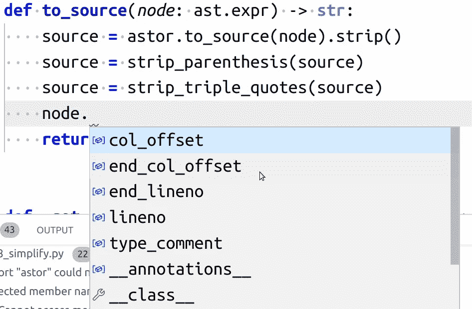

# Visual Studio 代码— Python 编辑器回顾

> 原文：<https://towardsdatascience.com/visual-studio-code-python-editors-in-review-e5e4f269b4e4?source=collection_archive---------24----------------------->

## 我想我坠入爱河了😍


Visual Studio 代码 1.50.1。截图由马丁·托马斯拍摄。

[Visual Studio Code](https://en.wikipedia.org/wiki/Visual_Studio_Code) 是微软编写的免费编辑器。它的第一个版本是在 2015 年，男孩做了一个起飞。它在 StackOverflow 上有[超过 28k 个问题，根据](https://stackoverflow.com/questions/tagged/visual-studio-code) [2019 Jetbrains 调查](https://www.jetbrains.com/lp/devecosystem-2019/python/)它是第二个最常用的 Python 编辑器，根据 [2019 StackOverflow 调查](https://insights.stackoverflow.com/survey/2019#technology-_-most-popular-development-environments)它是最受欢迎的编辑器。VS 代码有自己的 [marketplace](https://marketplace.visualstudio.com/vscode) ，在 [Windows](https://code.visualstudio.com/docs/setup/windows) 、 [Linux](https://code.visualstudio.com/docs/setup/linux#_debian-and-ubuntu-based-distributions) 和 [Mac](https://code.visualstudio.com/docs/setup/mac) 上运行。微软已经创建了一个强大的语言服务器，名为 [Pylance](https://marketplace.visualstudio.com/items?itemName=ms-python.vscode-pylance) ，你肯定也想读一些关于它的东西…但是让我们先从基础开始。

当你第一次启动 VS Code 时，它会提供给你几个可能有用的插件。我直接安装了 Python 集成和 Sublime 文本键绑定。当我写快捷方式时，请特别记住键绑定部分。

# 速度

VS 代码启动需要一秒多一点的时间。这意味着它比 PyCharm 快得多，但比 Sublime Text 慢。VS 代码存储一切，即使你不打`Ctrl+S`。这意味着你可以随时关闭编辑器。下次打开它时，它会告诉您还有未保存的更改😍

# 用户界面

在上面的截图中，你可以看到我通常打开的内容:

*   在**编辑器**中你可以阅读代码。当然还有语法高亮和行号。
*   在**浏览器**中你可以看到工作区的文件。
*   **活动栏**位于浏览器的左侧。在这里，您可以将浏览器切换到搜索工具、版本控制系统(VCS)集成、调试器等等。这是我一开始不喜欢 VS 代码的主要原因。但是，您可以简单地隐藏它😍
*   在代码的右边，有一个代码的**小地图**。这有助于跳到奇怪的部分。

# 命令选项板

[命令面板](https://code.visualstudio.com/docs/getstarted/userinterface#_command-palette)是实现编辑器任何功能的途径。不再在深度嵌套菜单中搜索❤️

您可以使用组合键`Ctrl` + `Shift` + `P`打开命令面板。看起来是这样的:


截图由作者拍摄

虽然我不太清楚为什么，但我更喜欢 Sublime Text 的命令面板，而不是 PyCharm 的命令面板。对我来说，感觉崇高文本的模糊搜索是最好的。视觉上，VS 代码做得真的很好。

# 可定制的快捷方式！

VS 代码有一个默认键绑定的官方备忘单( [source](https://code.visualstudio.com/shortcuts/keyboard-shortcuts-linux.pdf) )，我已经提到过你可以使用其他编辑器的默认键绑定。这是整洁的，但我希望能够定制它完全符合我的需要。

当然，你可以这样做！VS 代码甚至为你提供了一个非常好的界面，它承认你可能想要不同的动作，这取决于具体的情况/编程语言。


VS 代码的快捷编辑器。截图由作者拍摄。

## 选项卡交互

你可以用`Ctrl+W`关闭标签页，就像在 Chrome 中一样。您可以使用`Alt+1`切换到第一个选项卡，使用`Alt+2`切换到第二个选项卡，…

你可以用`Ctrl+N`打开一个新文件——就像你在 Chrome 中打开一个新窗口一样。

## 跳转到行

`Ctrl+G`跳到一行。这在你调试的时候非常方便。

## 转到文件

`Ctrl+P`转到当前工作区中的任何文件。再次用模糊搜索🎉

## 查找/全部替换

`Ctrl+F`找东西，`Ctrl+H`替换。也可以用 regex！绝对是我不想错过的功能。这与多光标结合起来非常酷！(`Ctrl+Shift+L`)

## 禅宗模式

`Shift+Shift+P`并搜索“禅”。在这种模式下，你有代码。没有小地图，没有文件浏览器，没有页脚。如果你想向另一个开发者展示一些东西，这是很有帮助的。你可以调整在禅模式下显示什么。比如我还是想看行号。

## 17 种快捷方式

[艾米·j·安德鲁斯](https://medium.com/u/ad8929e1cacb?source=post_page-----e5e4f269b4e4--------------------------------)写了这篇很棒的文章，里面有 17 条捷径:

[](https://medium.com/javascript-in-plain-english/17-useful-visual-studio-code-shortcuts-to-boost-your-coding-speed-68e46705d542) [## 17 个有用的 Visual Studio 代码快捷方式来提高您的编码速度

### 这是世界上最好的代码编辑器中最酷的特性

medium.com](https://medium.com/javascript-in-plain-english/17-useful-visual-studio-code-shortcuts-to-boost-your-coding-speed-68e46705d542) 

# 自动完成

VS Code + [pylance](https://marketplace.visualstudio.com/items?itemName=ms-python.vscode-pylance) 提供了惊人的自动补全功能💘请注意，你需要告诉它一点你在做什么。使用类型注释来帮助 VS 代码来帮助你。对了，[型标注很牛逼](https://medium.com/analytics-vidhya/type-annotations-in-python-3-8-3b401384403d)！



带有 pylance 的 VS 代码的自动完成示例。截图由作者拍摄。

# 签名提示

我有时想得到一个关于函数签名的提示。在 VS 代码中，你只需将鼠标悬停在名字上就可以得到它。该框包含文档字符串😍


悬停在名称上时的函数签名提示。截图由作者拍摄。

# 跳到定义

点击您感兴趣的内容，然后按下`F11`。就是这样。它工作了。并且运行得非常好，非常流畅！你可以用任何东西做到这一点:函数，变量，第三方的东西，核心库的东西。

# 排除故障

Visual Studio 代码的调试界面是轻量级的，并且在大多数情况下都有您需要的功能:(1)您可以在想要设置断点的地方单击。(2)您可以通过单击活动栏中的播放按钮来启动调试器。在这里，您还可以看到所有变量的当前值。(3)继续、单步执行、单步进入、单步退出、重启和停止调试器。(4)观察终端中的输出。


截图由作者拍摄

# WSL2 集成

这个插件太神奇了，它值得拥有自己的部分:

[](https://code.visualstudio.com/blogs/2019/09/03/wsl2) [## 将 WSL 2 与 Visual Studio 代码一起使用

### Matt Hernandez，2019 年 9 月 3 日@ fiveisprime 距离 Windows 的最初测试版已经过去了几个月…

code.visualstudio.com](https://code.visualstudio.com/blogs/2019/09/03/wsl2) 

# 差异工具

Visual Studio 代码集成了一个相当不错的比较工具。您可以从控制台使用

```
code --diff file1 file2
```

Windows 用户:你也可以从 WSL2 中的 Ubuntu 控制台执行这个！

# 单元测试集成

打`Ctrl+Shift+P`和`Configure Tests`:


作者图片

然后，您将能够在 VS 代码中单击一个测试来运行测试😍


# 自定义

Visual Studio 代码提供了许多自定义方式。你有数百种设置、颜色主题和插件。

## 主题

`Ctrl+Shift+P`，搜索“主题”:


深色和浅色主题，包括日光化和 Textmate😍截图由作者拍摄。

## 设置


截图由作者拍摄

你也可以通过一个`settings.json`文件定制东西。这里有一些我喜欢的设置，使用的是 [Ubuntu Mono](https://github.com/powerline/fonts/tree/master/UbuntuMono) 字体:

```
{
    "editor.renderWhitespace": "all",
    "editor.fontFamily": "Ubuntu Mono",
    "workbench.colorTheme": "textmate",
    "python.formatting.provider": "black",
    "python.languageServer": "Pylance",
    "python.analysis.typeCheckingMode": "basic",
    "python.defaultInterpreterPath": "/home/moose/.pyenv/shims/python",
    "zenMode.hideLineNumbers": false,
    "zenMode.hideStatusBar": false,
    "python.analysis.extraPaths": [
        "/home/moose/.pyenv/versions/3.8.6/lib/python3.8/site-packages"
    ],
    "workbench.colorCustomizations": {
        "terminal.background": "#373633",
        "terminal.foreground": "#dfdbd2",
    },
    "terminal.integrated.fontFamily": "Ubuntu Mono derivative Powerline"
}
```

## 工作区

您可以在您的[工作区设置](https://code.visualstudio.com/docs/getstarted/settings)中定制忽略哪些文件/文件夹。例如，创建一个`.vscode/settings.json`，并为 Python 项目添加以下内容:

```
{
    "files.watcherExclude": {
        "**/.pytest_cache/**": true
    },
    "files.exclude": {
        "**/.mypy_cache": true,
        "**/.pytest_cache": true,
        "**/*.egg-info": true,
        "**/mypy-report": true
    }
}
```

# 插件

最后，是时候谈谈[市场](https://marketplace.visualstudio.com/vscode)了，尤其是 pylance！

## 挂架

[Pylance](https://marketplace.visualstudio.com/items?itemName=ms-python.vscode-pylance) 是一个 Python 语言的服务器。作为用户，你不用太担心。把它想象成一个插件，它给你自动完成、签名帮助、类型检查等等。如果你[使用类型注释](https://medium.com/analytics-vidhya/type-annotations-in-python-3-8-3b401384403d)，那就更棒了。

作为一个想知道事情如何在引擎盖下工作的开发人员，我必须感谢微软的这个好设计。他们去掉了一个困难的部分，这样一个单独的团队就可以处理它了。理论上，这可以集成到其他编辑器/ide/服务中。实际上，[许可证禁止](https://github.com/microsoft/pylance-release/issues/4#issuecomment-654083567)。此外，定义这样一个[语言服务器接口](https://code.visualstudio.com/api/language-extensions/language-server-extension-guide)允许开发者为其他语言创建语言服务器🌟拥有这个接口是好的软件架构的标志。


我必须在用户设置中启用 pylance 的“基本”类型检查模式(Ctrl+Shift+P)。截图由作者拍摄。

## 彩虹括号

[彩虹括号](https://marketplace.visualstudio.com/items?itemName=2gua.rainbow-brackets)颜色嵌套括号:


用彩色括号更容易读，不是吗？

## 路径智能感知

[路径智能感知](https://marketplace.visualstudio.com/items?itemName=christian-kohler.path-intellisense)在编辑器中自动完成路径:


截图由作者拍摄

## 吉特朗斯

[GitLens](https://marketplace.visualstudio.com/items?itemName=eamodio.gitlens) 显示 git 历史信息:


你注意到灰色的文字了吗？这是编辑器(me)的名称，是编辑完成的时间和提交消息的第一行。截图由作者拍摄

如果您将鼠标悬停在消息上，您可以跳转到打开图形比较的提交😍


之前突出显示的提交的图形差异。截图由作者拍摄。

## AWS 工具包

[AWS 工具包](https://marketplace.visualstudio.com/items?itemName=AmazonWebServices.aws-toolkit-vscode)插件将关于 S3 桶、Lambdas、Cloudwatch 日志等信息添加到你的活动栏:


截图由作者拍摄

## 荣誉奖

*   [**SQLTools**](https://marketplace.visualstudio.com/items?itemName=mtxr.sqltools) :从 VS 代码内部运行 DB 查询
*   [**现场分享**](https://marketplace.visualstudio.com/items?itemName=MS-vsliveshare.vsliveshare) :电晕时代的结对编程支持。不过，到目前为止，我还没有试过这个插件。

# 对比:vs 代码 VS 崇高文本 vs PyCharm

与 Sublime Text 相比，VS Code 最初给我的感觉更重一些。然而，这可能仅仅是因为我大约从 2010 年开始使用 Sublime Text(我在 2014 年购买了许可证)。在一个工具上有 10 年的经验意味着你已经很习惯这个工具了。除了 Sublime 的速度惊人之外，我看不出它比 VS Code 有什么优势。

相比 PyCharm Professional，VS Code 感觉轻量级多了。速度更快，界面更干净。我不是绝对确定，但是 pylance 也可能比 PyCharm 的自动完成要好。PyCharm 的优势在于边缘情况:数据库工具窗口、SciView，可能还有一些调试特性，当然还有[代码检查](https://www.jetbrains.com/help/pycharm/code-inspection.html)。

# 摘要

微软在 VS 代码方面做得非常出色:它速度快，可定制，有必要的功能，一个市场，合理的默认值，干净的界面，支持 Windows/Mac/Linux，并且是免费的。太棒了。我喜欢！💜

# 下一步是什么

在这个“Python 初学者”系列中，我们已经解释了[如何在 Windows 上使用 Python 和 wsl 2](https://medium.com/python-in-plain-english/a-beginners-guide-to-python-development-on-windows-10-e9d80601f483)，[如何在 Windows 上使用 Python 和 Anaconda](https://medium.com/python-in-plain-english/how-to-start-python-development-on-windows-10-anaconda-edition-cc91c2d57a1d) 。本文将 Visual Studio 代码作为初学者和专业人员的良好 IDE。

接下来，我们应该编写一个 hello world 应用程序。我乐于接受各种想法😁