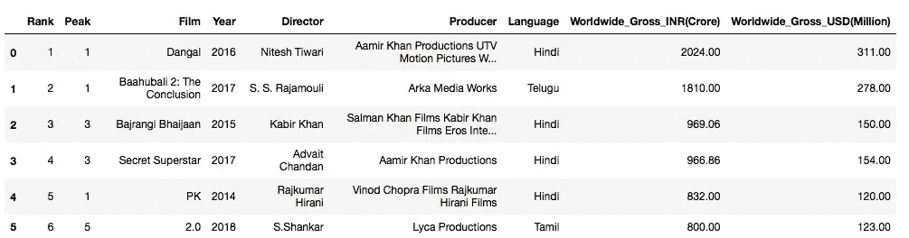
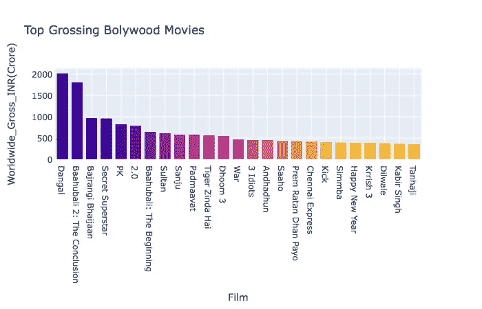
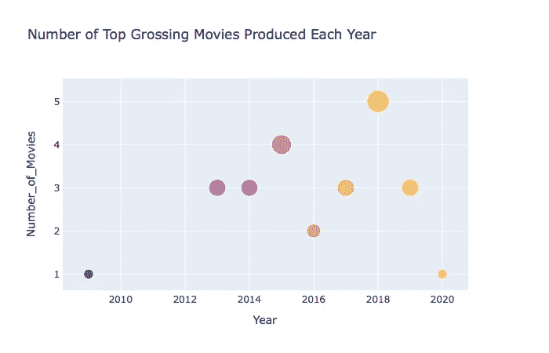
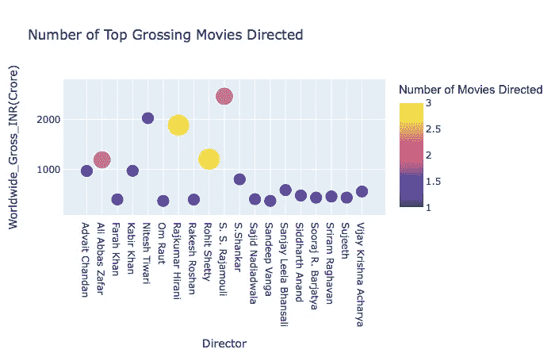
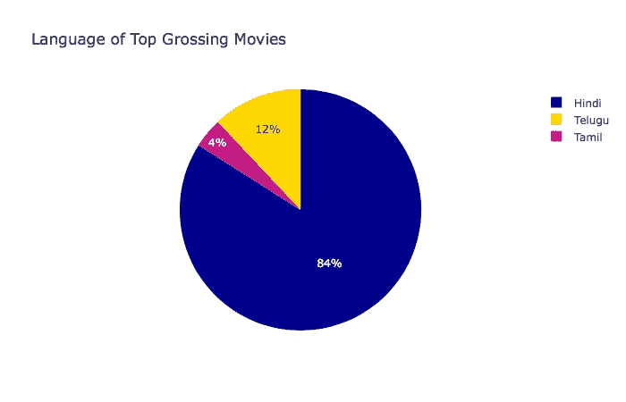

# 宝莱坞的数据可视化:第二部分

> 原文：<https://towardsdatascience.com/visualisation-of-bollywood-2c973328ddc9?source=collection_archive---------51----------------------->

## 角。2～使用 Plotly Express 显示数据


Kushagra Kevat 在 [Unsplash](https://unsplash.com?utm_source=medium&utm_medium=referral) 上拍摄的照片

这篇文章将是我收集的数据的可视化表示，正如我在[的上一篇文章](/data-visualisation-of-bollywood-365fd57ff1d3)中所写的。

对于这种可视化，我将使用 pandas 和 plotly express 库，它们通过以下方式导入到 Jupyter 笔记本中:

```
import pandas as pd
import plotly.express as px
```

然后，使用 pd.read_csv 函数，读取包含所需数据的 csv 文件的组件。

```
movies = pd.read_csv('Bollywood_movies.csv')
```

*注意:当我将从 BeautifulSoup 收集的数据保存到 excel 表格中后，我在将其导出到 csv 文件之前做了一些清理和排序工作。*

当被调用时，表看起来像这样。



由于数据相对较小(9 列和 25 个条目)，这在某种程度上限制了我可以进行的可视化，对此我进行了探索:

*   每年发行多少部票房最高的电影？
*   有没有导演过不止一部票房最高的电影？
*   哪种语言更受青睐？

## 1.世界电影总量比较



如这个柱状图所示，宝莱坞票房最高的电影是在₹2,000·克罗尔(大约 3.11 亿美元)附近上映的[摔跤吧！爸爸](https://www.google.com/url?sa=t&rct=j&q=&esrc=s&source=web&cd=&cad=rja&uact=8&ved=2ahUKEwjQxLKX8LzqAhUYWX0KHTH0B5sQFjASegQICRAB&url=https%3A%2F%2Fwww.imdb.com%2Ftitle%2Ftt5074352%2F&usg=AOvVaw0drHy3fAZ1iKSgUOehIcgv)，紧随其后的是在₹1,800·克罗尔上映的[巴胡巴利 2](https://www.google.com/url?sa=t&rct=j&q=&esrc=s&source=web&cd=&cad=rja&uact=8&ved=2ahUKEwj208S08bzqAhXESH0KHceWCNgQFjAKegQIAhAB&url=https%3A%2F%2Fwww.imdb.com%2Ftitle%2Ftt4849438%2F&usg=AOvVaw2lzWv70G_ixCoDMeqE7KEl)(2.78 亿美元)。丹格尔的收入比票房第三的电影《Bajrangi Bhaijaan》多 50%。

虽然数字很大，但这并不令人惊讶，因为 Dangal 有一个精彩的故事线，对每个人和任何看过它的人都是鼓舞人心的(这没有任何偏见)。

它在 2016 年的发行不仅在印度，而且在世界各地都很受欢迎。那段时间我在中国学习，我记得我的一个密友告诉我，她和她妈妈一起看了这部电影(她妈妈在一个月内看了 3 遍)！

## 2.年度图表

每年都有令人惊叹的电影问世，但我想确定哪一年票房最高的电影数量最多。



分析图表，很明显 2018 年是一年！5 部票房最高的电影都是在同一年导演和制作的！

## 3.哪个导演的点击率最高？

为了做到这一点，我制作了一个图表，显示了导演的名字与他们所有电影的总票房。我调整了点的大小，以代表他们从列表中执导的电影数量。



巴胡巴利系列的导演 S.S .拉贾穆利总共有两部电影，总票房最高(₹2460·克罗斯/3.79 亿美元)。可以注意到，尼特什·提瓦瑞只导演了一部电影，但票房却是最高的……你能猜出是哪部电影吗？

你猜对了，丹格尔。

## 4.语言偏好

在 25 部电影中，大部分是印地语，3 部是泰卢固语，1 部是泰米尔语。



同样，这并不令人惊讶，因为印度电影业(宝莱坞)是迄今为止最大的，其次是泰米尔工业(Kollywood)和泰卢固语工业(Tollywood)。

虽然用其他地区语言制作的电影没有得到应有的认可，但这些电影已经被翻译成尽可能多的流行印度语言。

也许未来几年趋势会改变…让我们看看吧！

## 5.最后的想法

既然你已经读完了整篇文章，为什么不看一部列出的电影来奖励自己呢？

你值得拥有；)

检查我的 [GitHub](https://github.com/anagha-sridhar/bollywood-analysis) 的所有代码。