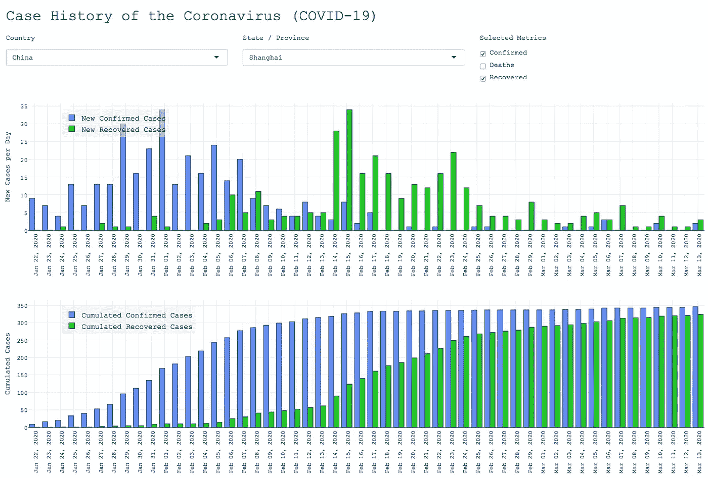
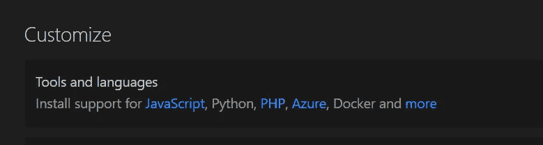
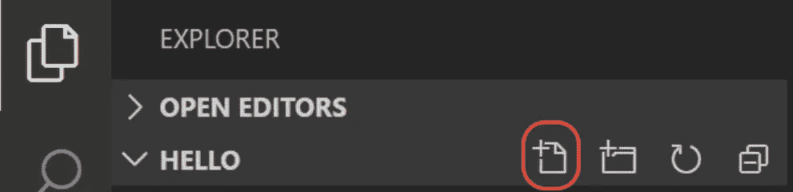
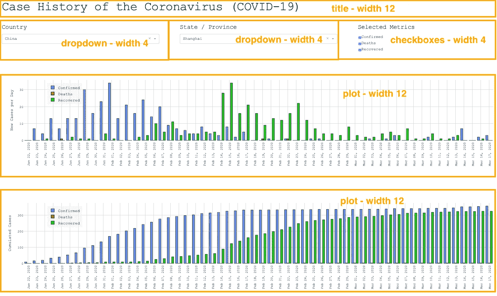

# 使用 Python、Dash 和 Plotly 可视化新冠肺炎案例数据

> 原文：<https://towardsdatascience.com/visualise-covid-19-case-data-using-python-dash-and-plotly-e58feb34f70f?source=collection_archive---------8----------------------->

## 立即创建您自己的仪表板 Web 应用程序！

这篇文章不是关于新冠肺炎，而是关于如何使用 **Python & Dash** 创建一个**有用的** web 应用程序。它旨在作为一个简单的指南，帮助&掌握这项技术，并让**自己动手**！

*我写了很多关于如何使用 R & Shiny* *执行这个任务的* [*相同的文章，并有意想要比较这两个软件栈。在这里我用 Python-Dash 的方式解释一下，不过我计划在* ***的另一篇*** *中做一个* ***的专用比较*** *的解决方案。*](/create-a-coronavirus-app-using-r-shiny-and-plotly-6a6abf66091d)



要了解最终的应用程序是什么样子，请测试该应用程序:

> [https://go.aws/2xsdb7q](https://go.aws/2xsdb7q)

下面的**分步指南**解释了如何创建这个 web 应用程序，包括交互情节。软件栈基于 **Python & Dash** ，并且是开源的。总共只有大约 130 行代码。

顺便说一句，本文底部提供了一个链接，链接到 **GitHub** **代码**库供下载。

# 目标

目标是创建一个 **web 应用程序**，它在应用程序启动时更新新冠肺炎案例数据，并在仪表板上显示数据。特点:

*   冠状病毒官方可用数据的下载和解析。
*   下拉菜单选择国家和州。
*   显示所选国家新的和累积的病例统计数据的两个图。可以选择确诊病例、痊愈病例、死亡病例。

# 任务

1.  设置 Python 和 Visual Studio 代码。
2.  设置 Python 项目及其文件夹结构。
3.  实现加载和预处理数据的逻辑。
4.  使用 Dash & Plotly 创建用户界面。
5.  添加服务器逻辑。
6.  [可选]将应用程序上传到云。

# 设置 Python 和 Visual Studio 代码

首先，从[https://www.python.org/downloads/](https://www.python.org/downloads/)下载 **Python** 的最新稳定版，启动安装程序并通过。

对于代码编辑器的选择，有很多可能性。 **Visual Studio 代码**是一个有效选项。要安装它，从[https://code.visualstudio.com/download](https://code.visualstudio.com/download)下载安装程序，运行它，完成安装。

# 设置 Python 项目及其文件夹结构

Python 中的包管理有多种解决方案: *pip* 、 *pipenv* 、 *(ana)conda* 和*虚拟环境*。如需快速解释，请参见本文[中的帖子](/guide-of-choosing-package-management-tool-for-data-science-project-809a093efd46)。我们在这里使用 [*虚拟环境*](https://docs.python.org/3/tutorial/venv.html) 。

仍然在命令行上，移动到应用程序应该位于的目录。然后创建一个新的 app 目录和一个**虚拟环境**:

```
cd <folder-with-my-apps>   # Put here the folder of your choice.
mkdir corona-app           # Create a dedicated app directory.
cd corona-app              
virtualenv venv            # Create the virtual environment 'venv'.
```

接下来，激活虚拟环境。在 ***macOS*** 和 ***Linux*** 上，做:

```
source venv/bin/activate
```

在 ***窗口的*** 上，输入:

```
venv\Scripts\activate
```

要将软件包安装到新环境中，请键入:

```
pip install dash      # Installs <plotly>, too.
pip install pandas
```

现在打开 Visual Studio 代码。在欢迎屏幕的右上角(自定义->工具和语言)，您可以选择 Python 来安装对 Python 的**语言支持:**



仍在欢迎屏幕上，点击左侧的“*打开文件夹……”*，并选择您之前创建的文件夹( *corona-app* ):


关于设置和定制 VS 代码的更多细节，请看这个专门的[教程](https://code.visualstudio.com/docs/python/python-tutorial)。下一步是创建文件 *app.py* ，其中将包含我们需要的所有 app 代码。点击文件浏览器上的加号按钮，输入文件名。



现在我们可以开始编码了！

# 实现加载和预处理数据的逻辑

在 Visual Studio 代码中，如果文件尚未打开，请单击文件名“app.py”。键入下面几行来加载我们需要的库:

```
import dash
import dash_core_components as dcc
import dash_html_components as html
import plotly.graph_objects as go
from dash.dependencies import Input, Output
import pandas as pd
```

接下来，定义一个 *baseURL* ，我们从其中下载国家和地区的冠状病毒病例数据。**数据**位于**约翰霍普金斯系统科学与工程中心(JHU/CSSE)** 的服务器上。函数 *loadData* 处理下载和一些基本的转换，如下所述。

```
baseURL = "https://raw.githubusercontent.com/CSSEGISandData/COVID-19/master/csse_covid_19_data/csse_covid_19_time_series/"def loadData(fileName, columnName):
    data = pd.read_csv(baseURL + fileName) \
             .drop(['Lat', 'Long'], axis=1) \
             .melt(id_vars=['Province/State', 'Country/Region'], 
                 var_name='date', value_name=columnName) \
             .astype({'date':'datetime64[ns]', columnName:'Int64'}, 
                 errors='ignore')
    data['Province/State'].fillna('<all>', inplace=True)
    data[columnName].fillna(0, inplace=True)
    return data
```

*read_csv* 从网上下载文件，转换成 [*熊猫*](https://pandas.pydata.org/) *数据帧*。地理坐标被*删除；* *熔化*将*数据帧*从*宽*转换为*长*格式。然后， *astype* 确保类型正确。最后，如果没有区域可用，方法 *fillna* 插入文本 *< all >* 或者为包含累积案例号的列插入 0。

最后一个转换是将相应的列转换成*日期*类型。

通过多次调用函数 *loadData* ，我们**加载一个清理过的数据帧****【确诊病例】****【痊愈病例】** **和死亡病例**。函数 *merge* 连接这 3 个数据集，得到一个包含所有数据的数据集:

```
allData = 
  loadData(
    "time_series_covid19_confirmed_global.csv", "CumConfirmed") \
  .merge(loadData(
    "time_series_covid19_deaths_global.csv", "CumDeaths")) \
  .merge(loadData(
    "time_series_covid19_recovered_global.csv", "CumRecovered"))
```

对于用户界面的初始化，我们需要国家名称。我们从大的*数据帧*中提取它们，使用:

```
countries = allData['Country/Region'].unique()
countries.sort()
```

现在我们已经完成了数据加载。让我们转到 UI 部分！

> [更新 2020-3-27]:服务器上的文件名在 3 月 23 日更改了，所以我必须在这里也更新它们。

# 使用 Dash & Plotly 创建用户界面

首先，我们初始化一个外部样式表的路径和一个自定义字体(匹配这个应用程序的 [R-Shiny 版本):](/create-a-coronavirus-app-using-r-shiny-and-plotly-6a6abf66091d)

```
external_stylesheets=['https://codepen.io/chriddyp/pen/bWLwgP.css']tickFont = {'size':12, 'color':"rgb(30,30,30)", \
            'family':"Courier New, monospace"}
```

使用上面定义的样式表初始化 *Dash* 应用程序:

```
app = dash.Dash(__name__, external_stylesheets=external_stylesheets)app.layout = html.Div(
    style={ 'font-family':"Courier New, monospace" }, children=[
        ## ...
    ]
])
```

虽然标题和两个情节遍布整个屏幕宽度，但三个控件仅占三分之一。根据**引导网格系统，**这转化为三个*列*，每个列的宽度为 4，总计为 12。



我们现在输入以下代码块来定义包含控件的列，而不是三个点(见最后一个代码块):

```
 html.H1('Case History of the Coronavirus (COVID-19)'),
        html.Div(className="row", children=[
            html.Div(className="four columns", children=
                html.H5('Country'),
                dcc.Dropdown( 
                    id='country',
                    options=[{'label':c, 'value':c} \
                        for c in countries],
                    value='Italy'
                )
            ]),
            html.Div(className="four columns", children=[
                html.H5('State / Province'),
                dcc.Dropdown(
                    id='state'
                )
            ]),
            html.Div(className="four columns", children=[
                html.H5('Selected Metrics'),
                dcc.Checklist(
                    id='metrics',
                    options=[{'label':m, 'value':m} for m in \
                        ['Confirmed', 'Deaths', 'Recovered']],
                    value=['Confirmed', 'Deaths']
                )
            ])
        ]),
```

我们定义的**控件**是:

*   国家*下拉列表*，其中填充了唯一的国家。
*   州/省*下拉菜单*。至今未初始化。
*   指标*清单*，填有 3 个指标名称。

对于两个条形图，我们使用交互式版本的 *Plotly* ( [文档](https://plot.ly/python/))，并更改配置以隐藏大量控件。代码也是*子数组*的一部分:

```
 dcc.Graph(
        id="plot_new_metrics",
        config={ 'displayModeBar': False }
    ),
    dcc.Graph(
        id="plot_cum_metrics", 
        config={ 'displayModeBar': False }
    )
```

# 添加服务器逻辑

与 [R-Shiny 软件栈](https://medium.com/@meinhard.ploner/create-a-coronavirus-app-using-r-shiny-and-plotly-6a6abf66091d)相比，Python-Dash 没有简单的解决方案来生成表达式(=数据！)无功。下一个函数返回指定国家和州的所有数据。该函数将在我们的代码中使用两次(每个图一次)，因此如果计算不会发生两次，这将是一个优势:

```
def nonreactive_data(country, state):
    data = allData.loc[allData['Country/Region'] == country] \
                  .drop('Country/Region', axis=1)
    if state == '<all>':
        data = data.drop('Province/State', axis=1) \
                   .groupby("date") \
                   .sum() \
                   .reset_index()
    else:
       data = data.loc[data['Province/State'] == state]
    newCases = data.select_dtypes(include='Int64').diff().fillna(0)
    newCases.columns = [column.replace('Cum', 'New') 
                        for column in newCases.columns]
    data = data.join(newCases)
    data['dateStr'] = data['date'].dt.strftime('%b %d, %Y')
    return data
```

除了过滤国家和州的总体*数据帧*之外，如果用户为有州的国家(如美国)选择 *<【全部】>* ，该函数还会聚合数据(使用 *groupby* 和 *sum* )。进一步的**差异从累积的统计数据中计算**并保存到新列中，前缀为“*New”*而不是*“Cum”。*

下一个块定义了一个**函数来创建条形图**，它将用于两个图。

```
colors = { 'Deaths':'rgb(200,30,30)', \
           'Recovered':'rgb(30,200,30)', \ 
           'Confirmed':'rgb(100,140,240)' }def barchart(data, metrics, prefix="", yaxisTitle=""):
    figure = go.Figure(data=[
        go.Bar(
            name=metric, x=data.date, y=data[prefix + metric],
            marker_line_color='rgb(0,0,0)', marker_line_width=1,
            marker_color=colors[metric]
        ) for metric in metrics
    ])
    figure.update_layout( 
              barmode='group', legend=dict(x=.05, y=0.95), 
              plot_bgcolor='#FFFFFF', font=tickFont) \
          .update_xaxes( 
              title="", tickangle=-90, type='category',  
              showgrid=True, gridcolor='#DDDDDD', 
              tickfont=tickFont, ticktext=data.dateStr,                     
              tickvals=data.date) \
          .update_yaxes(
              title=yaxisTitle, showgrid=True, gridcolor='#DDDDDD')
    return figure
```

该函数的顶部循环遍历指标以添加条形。底部设置条形图模式(“组”)，并对图例、轴和标签进行一些调整和样式设置。最重要的是，我们想在 x 轴的每个刻度上显示日期。

## 反应图

虽然到目前为止 Dash 还不支持反应式表达式，但是反应式 UI 元素是支持的。如果*输入*值之一改变 ( *国家*、*状态、*或*指标*)，则以下**回调**被触发。在这种情况下，后续函数被调用并更新*输出* ( *图*)中定义的变量。

为了完成该任务，该函数通过调用适当的函数“*条形图*”来加载清理后的数据并呈现图表。

```
[@app](http://twitter.com/app).callback(
    Output('plot_new_metrics', 'figure'), 
    [Input('country', 'value'), Input('state', 'value'), 
     Input('metrics', 'value')]
)
def update_plot_new_metrics(country, state, metrics):
    data = nonreactive_data(country, state)
    return barchart(data, metrics, prefix="New", 
        yaxisTitle="New Cases per Day")[@app](http://twitter.com/app).callback(
    Output('plot_cum_metrics', 'figure'), 
    [Input('country', 'value'), Input('state', 'value'), 
     Input('metrics', 'value')]
)
def update_plot_cum_metrics(country, state, metrics):
    data = nonreactive_data(country, state)
    return barchart(data, metrics, prefix="Cum", 
        yaxisTitle="Cumulated Cases")
```

## 反应式下拉菜单

最后但同样重要的是，当用户改变选择的国家时，下拉菜单**中显示的**州/省**必须适应**。 *update_states* 提取唯一状态列表，添加 *< all >* ，返回整个列表并更新所选值。

```
[@app](http://twitter.com/app).callback(
    [Output('state', 'options'), Output('state', 'value')],
    [Input('country', 'value')]
)
def update_states(country):
    states = list(allData.loc[allData['Country/Region'] == country]
        ['Province/State'].unique()
    )
    states.insert(0, '<all>')
    states.sort()
    state_options = [{'label':s, 'value':s} for s in states]
    state_value = state_options[0]['value']
    return state_options, state_value
```

搞定了。

现在，您只需按下 VS 代码右上角的绿色“运行”按钮，就可以运行该应用程序。玩得开心:)

# GitHub 代码

以上所有代码都可以在*GitHub:*[https://github.com/ploner/coronavirus-py](https://github.com/ploner/coronavirus-py)上找到

# [可选]将应用程序上传到云

在网络服务器上发布应用程序非常容易，尤其是像 [**Heroku**](https://www.heroku.com/) 这样的免费服务。

**步骤**是:

*   在 *app.py* 文件中添加下面一行:

```
server = app.server
```

*   在 Heroku 上创建一个帐户。
*   安装 Heroku CLI(命令行界面)。
*   遵循 https://dash.plot.ly/deployment—[—“Heroku 示例”部分的说明。基本上，你通过 *pip* 安装 *gunicorn* ，创建*。git 忽略*、 *ProcFile* 和 *requirements.txt* ，使用 *git* 一起提交给 *Heroku* 。](https://dash.plot.ly/deployment)

## 最后的想法

这是我在 Medium 上的第二篇文章，与我的第一篇高度相关:

> 用 R，闪亮的& Plotly 在一眨眼的时间内可视化新冠肺炎案例数据

如果你领导着一个**数据科学团队**，并且你的成员也**精通 R 和 Python** ，那么**比较 Shiny 和 Dash** 可能就在你的任务清单上。让我知道你是如何做决定的。

## 如果你喜欢这个故事，你可能也会喜欢我在《走向数据科学》上发表的关于新冠肺炎、分析和机器学习的两个中型故事之一:

[](/forget-daily-statistics-of-the-coronavirus-7e9bbb7349bd) [## 厌倦了被告知新冠肺炎方向每两天改变？

### 忘记每日统计，遵循正确的 KPI！

towardsdatascience.com](/forget-daily-statistics-of-the-coronavirus-7e9bbb7349bd) [](/which-countries-react-similar-to-covid-19-machine-learning-provides-the-answer-5971ec2f6f31) [## 哪些国家的反应与新冠肺炎相似？机器学习提供了答案

### 看看你的国家(或美国的州)和它的同行相比表现如何。了解聚类分析的实际应用——使用 UMAP…

towardsdatascience.com](/which-countries-react-similar-to-covid-19-machine-learning-provides-the-answer-5971ec2f6f31)