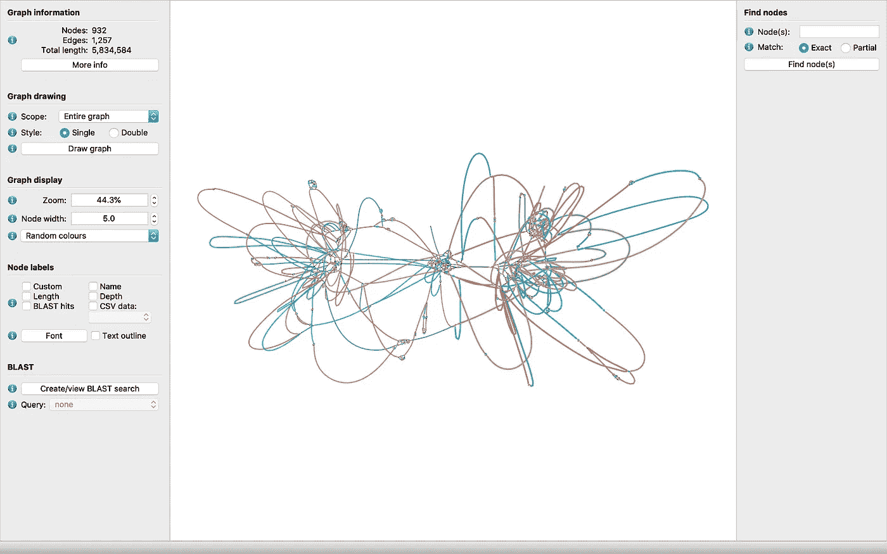
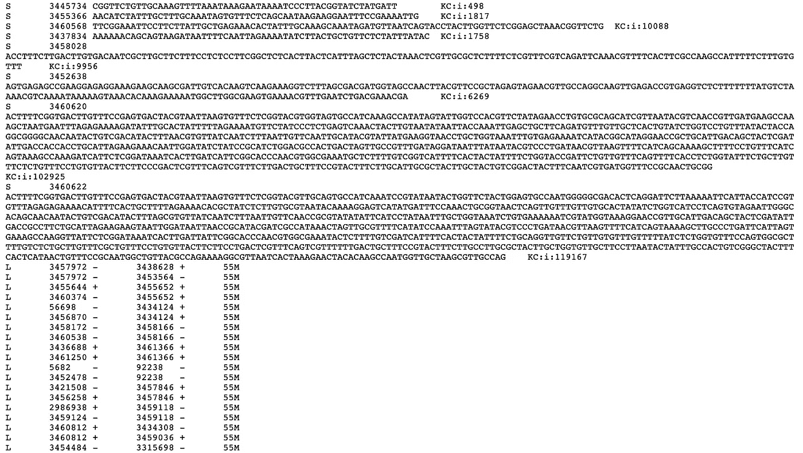
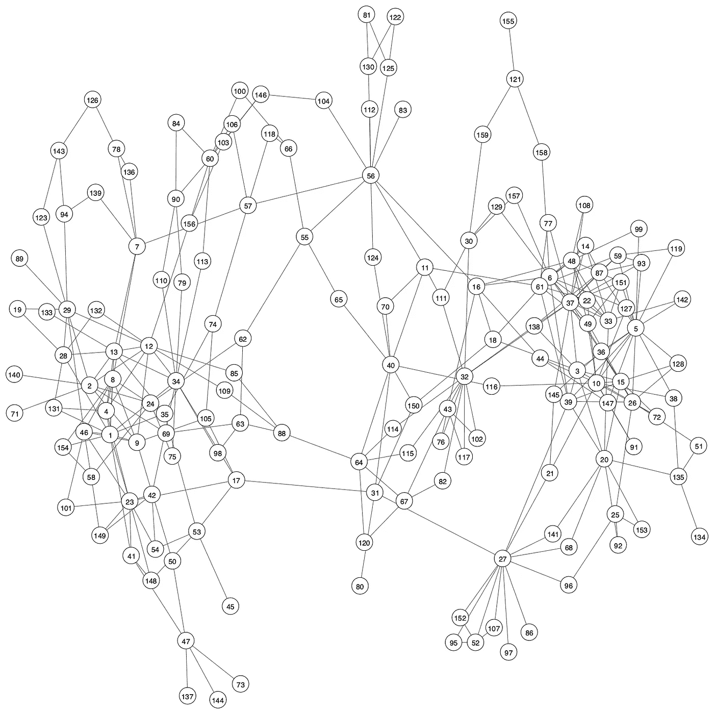
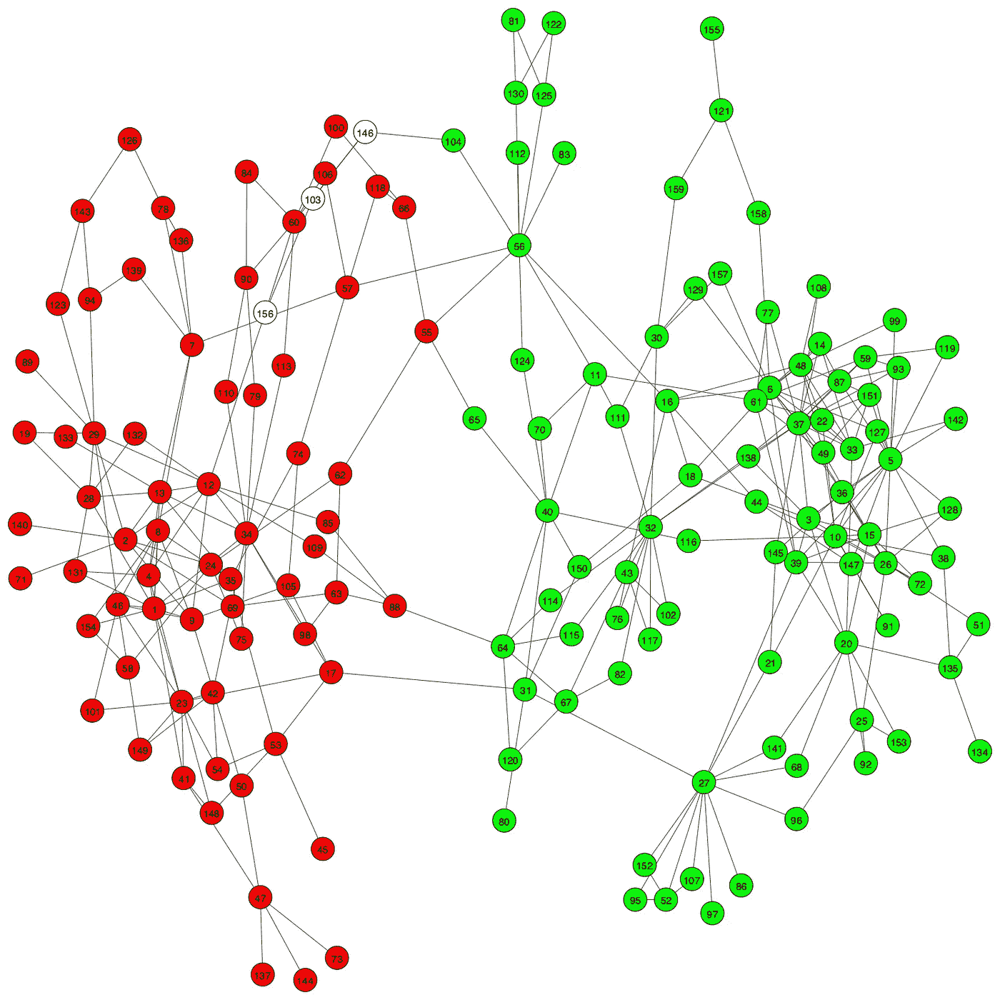
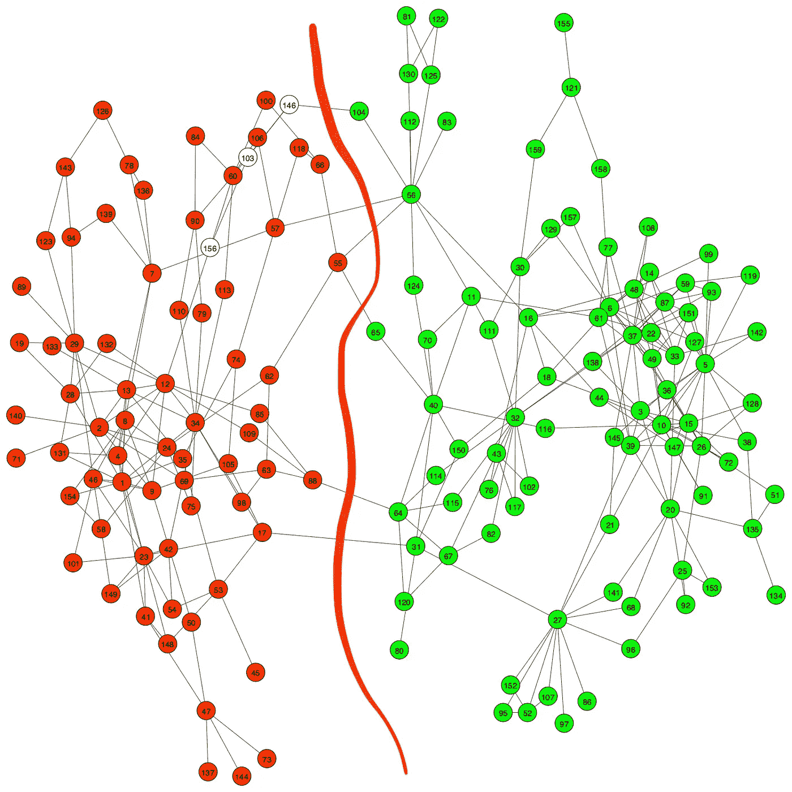

# 可视化装配图

> 原文：<https://towardsdatascience.com/visualising-assembly-graphs-fb631f46bbd1?source=collection_archive---------19----------------------->

## 用于宏基因组宁滨分析的可视化装配图

我研究元基因组组装图已经有一段时间了，我遇到了许多有趣的事情。在这篇文章中，我将与您分享我对宏基因组组装图和从这些图中获得的宁滨重叠群的一些观察。假设你对基因组组装有了基本的了解(如果没有你可以看我之前的文章[基因组组装——基因组分析的圣杯](/genome-assembly-the-holy-grail-of-genome-analysis-fae8fc9ef09c))，让我们开始吧。

# 什么是装配图？

装配图用于表示一个基因组(或元基因组)的最终装配。简而言之，汇编器根据读数和它们的重叠信息构建这个汇编图。最后，组装器解析组装图中的路径，并输出非分支路径作为重叠群。

下面给出了从名为 [**绷带**](https://rrwick.github.io/Bandage/) 的工具中获得的装配图的可视化部分。



图一。使用绷带显示 [**ES+metaSPAdes**](https://github.com/Vini2/GraphBin/tree/master/test_data/ES_metaSPAdes) 数据集。

# 装配图是如何表示的？

用于表示装配图的最常见的文件格式是 [**GFA(图形片段装配)**](http://gfa-spec.github.io/GFA-spec/GFA1.html) 格式。GFA 文件由一组序列和制表符分隔的重叠序列对组成。你可以从 http://gfa-spec.github.io/GFA-spec/GFA1.html 了解更多关于这种格式的信息。



图二。GFA 样本文件的一部分

如图 2 所示，序列从“ **S** 开始表示，序列之间的重叠(或连接)从“ **L** 开始表示。加号(+)和减号(-)表示重叠中考虑的是原始序列还是其反向互补序列。链环中用字母“ **M** 表示的数值是指搭接长度。在这个样本文件中，重叠长度是 55 个碱基对。

# 如何可视化装配图？

由于我们正在讨论的组装图已经是一个“**图**，我们可以将序列建模为顶点，将重叠/链接建模为边。

*   顶点→序列
*   边缘→序列之间的重叠

现在让我们使用 **python-igraph** 可视化一个样本装配图。你可以从我的[上一篇文章](/visualising-graph-data-with-python-igraph-b3cc81a495cf)中读到更多关于使用 python-igraph 可视化图形数据的内容。为了便于解释，我不考虑链接信息中的加号和减号。简单地说，我将想象一个无向图。

# 可视化样本图

我们将考虑由来自两种细菌物种的读数组成的数据集；*粪肠球菌*和*金黄色葡萄球菌*。我们将它称为 **ES** 数据集。我已经使用 [**metaSPAdes**](https://genome.cshlp.org/content/27/5/824) 组装器组装了这个数据集，以获得重叠群。这个重叠群数据集被称为 **ES+metaSPAdes** ，可以从链接[找到这里的](https://github.com/Vini2/GraphBin/tree/master/test_data/ES_metaSPAdes)为[***contigs . fasta***](https://github.com/Vini2/GraphBin/blob/master/test_data/ES_metaSPAdes/contigs.fasta)。装配图文件可以找到[***assembly _ graph _ with _ scaffolds . GFA***](https://github.com/Vini2/GraphBin/blob/master/test_data/ES_metaSPAdes/assembly_graph_with_scaffolds.gfa)。

***注:*** metaSPAdes 将每个重叠群表示为一组片段，组装图文件包含这些片段的详细信息以及这些片段之间的链接。因此，当获得重叠群之间的链接时，您必须扫描 [***重叠群.路径***](https://github.com/Vini2/GraphBin/blob/master/test_data/ES_metaSPAdes/contigs.paths) 文件和[***assembly _ graph _ with _ scaffolds . GFA***](https://github.com/Vini2/GraphBin/blob/master/test_data/ES_metaSPAdes/assembly_graph_with_scaffolds.gfa)***文件*** 中每个重叠群的前缀和后缀，以确定重叠重叠群的前缀或后缀。

ES+metaSPAdes 数据集的可视化如下所示。



图三。装配图的可视化

# 比对参考基因组

我们可以将重叠群与参考基因组进行比对，以确定每个重叠群属于哪个基因组。为此，我们可以使用 [BWA-MEM](https://github.com/lh3/bwa) 。下面给出了一个运行 BWA-MEM 的示例命令。

```
bwa mem <**path to reference genome**> <**path to contig file**> > <**output path**>alignment.sam
```

对于每个重叠群，导致最长比对长度的参考基因组可以被认为是重叠群的来源。

在确定重叠群的基本事实后，我们可以标记顶点(重叠群)并将这些数据可视化，如图 4 所示。



图 4。重叠群基础真相物种的可视化。红色重叠群属于粪肠球菌，绿色重叠群属于金黄色葡萄球菌。不考虑白色节点。

# 从这些集会中我们能得出什么结论？

如图 5 所示，我们可以看到，两个物种的重叠群倾向于在组装图中形成两个独立的区域。



图五。这两个物种的分离可以在装配图中看到。

此外，除了边界情况之外，属于相同物种的重叠群很可能彼此之间有重叠。我们可以在宁滨分析中利用这些数据。

# 密码

下面是一些用来生成我在本文中展示的图像的代码片段。

## 构建装配图

```
import re
from igraph import *
from collections import defaultdictpaths = {}
segment_contigs = {}
node_count = 0# Get contig paths from contigs.paths
with open(<**path to metaSPAdes contigs.paths file**>) as file:
    name = file.readline()
    path = file.readline()

    while name != "" and path != "":

        while ";" in path:
            path = path[:-2]+","+file.readline()

        start = 'NODE_'
        end = '_length_'
        contig_num = str(int(re.search('%s(.*)%s' % (start, end), name).group(1))-1)

        segments = path.rstrip().split(",")

        if contig_num not in paths:
            node_count += 1
            paths[contig_num] = [segments[0], segments[-1]]

        for segment in segments:
            if segment not in segment_contigs:
                segment_contigs[segment] = set([contig_num])
            else:
                segment_contigs[segment].add(contig_num)

        name = file.readline()
        path = file.readline() links = []
links_map = defaultdict(set)# Get contig paths from contigs.paths
with open(<**path to metaSPAdes GFA file**>) as file:
    line = file.readline()

    while line != "":

        # Identify lines with link information
        if "L" in line:
            strings = line.split("\t")
            f1, f2 = strings[1]+strings[2], strings[3]+strings[4]
            links_map[f1].add(f2)
            links_map[f2].add(f1)
            links.append(strings[1]+strings[2]+" "+strings[3]+strings[4])
        line = file.readline() # Create graph
g = Graph()# Add vertices
g.add_vertices(node_count)for i in range(len(g.vs)):
    g.vs[i]["id"]= i
    g.vs[i]["label"]= str(i+1)for i in range(len(paths)):
    segments = paths[str(i)]

    start = segments[0]
    start_rev = ""
    if start.endswith("+"):
        start_rev = start[:-1]+"-"
    else:
        start_rev = start[:-1]+"+"

    end = segments[1]
    end_rev = ""
    if end.endswith("+"):
        end_rev = end[:-1]+"-"
    else:
        end_rev = end[:-1]+"+"

    new_links = []

    if start in links_map:
        new_links.extend(list(links_map[start]))
    if start_rev in links_map:
        new_links.extend(list(links_map[start_rev]))
    if end in links_map:
        new_links.extend(list(links_map[end]))
    if end_rev in links_map:
        new_links.extend(list(links_map[end_rev]))

    for new_link in new_links:
        if new_link in segment_contigs:
            for contig in segment_contigs[new_link]:
                if i!=int(contig):
                    g.add_edge(i,int(contig))

g.simplify(multiple=True, loops=False, combine_edges=None)
```

## **使用 python-igraph 可视化初始装配图**

```
out_fig_name = "assembly_graph.png"visual_style = {}# Set bbox and margin
visual_style["bbox"] = (1500,1500)
visual_style["margin"] = 30# Set vertex colours
visual_style["vertex_color"] = 'white'# Set vertex size
visual_style["vertex_size"] = 35# Set vertex lable size
visual_style["vertex_label_size"] = 15# Don't curve the edges
visual_style["edge_curved"] = False# Set the layout
my_layout = g.layout_fruchterman_reingold()
visual_style["layout"] = my_layout# Plot the graph
plot(g, out_fig_name, **visual_style)
```

## 用 python-igraph 可视化彩色装配图

```
node_colours = []for i in range(node_count):
    if i in efaecalis_list:
        node_colours.append("red")
    elif i in saureus_list:
        node_colours.append("green")
    else:
        node_colours.append("white")out_fig_name = "coloured_assembly_graph.png"g.vs["color"] = node_coloursvisual_style = {}# Set bbox and margin
visual_style["bbox"] = (1500,1500)
visual_style["margin"] = 30# Set vertex size
visual_style["vertex_size"] = 35# Set vertex lable size
visual_style["vertex_label_size"] = 15# Don't curve the edges
visual_style["edge_curved"] = False# Set the layout
visual_style["layout"] = my_layout# Plot the graph
plot(g, out_fig_name, **visual_style)
```

# 最后的想法

我和我的实验室开发了一个名为 **GraphBin** 的工具，通过利用组装图和重叠群之间的连接性信息来细化合并的重叠群。你可以从[这里](https://github.com/Vini2/GraphBin)找到 GitHub 回购。

[](https://github.com/Vini2/GraphBin) [## Vini2/GraphBin

### GraphBin 是一个宏基因组重叠群宁滨工具，它利用了来自组装…

github.com](https://github.com/Vini2/GraphBin) 

GraphBin 发表在 OUP 生物信息学杂志上。你可以从 DOI:[10.1093/bio informatics/btaa 180](http://dx.doi.org/10.1093/bioinformatics/btaa180)中查看关于该工具的更多信息。

[](http://dx.doi.org/10.1093/bioinformatics/btaa180) [## GraphBin:使用集合图的宏基因组重叠群的精细宁滨

### 抽象动机。宏基因组学领域提供了对结构、多样性和生态学的有价值的见解。

dx.doi.org](http://dx.doi.org/10.1093/bioinformatics/btaa180) 

你也可以从下面列出的我以前的文章中读到更多关于基因组组装和宏基因组学的内容。

[](/genome-assembly-the-holy-grail-of-genome-analysis-fae8fc9ef09c) [## 基因组组装——基因组分析的圣杯

### 组装 2019 新型冠状病毒基因组

towardsdatascience.com](/genome-assembly-the-holy-grail-of-genome-analysis-fae8fc9ef09c) [](/metagenomics-who-is-there-and-what-are-they-doing-9f204342eed9) [## 宏基因组学——谁在那里，他们在做什么？

### 深入了解微生物群落的数据

towardsdatascience.com](/metagenomics-who-is-there-and-what-are-they-doing-9f204342eed9) 

希望你对我的发现感兴趣。我很想听听你的想法。

感谢您的阅读。

干杯！