# 想象 2020 年的篮球投篮——(大)基础。

> 原文：<https://towardsdatascience.com/visualising-basketball-shots-in-2020-the-big-fundamentals-c48c15fa3df8?source=collection_archive---------26----------------------->

## 使用数据可视化来理解现代篮球中投篮的来源和原因——使用简单的图形。

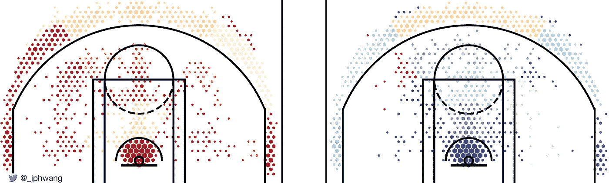

在这个博客上，我写了很多主题的数据可视化，以及如何创建这些可视化。

话虽如此，我写的关于使用视觉化的主要话题是篮球。我喜欢看篮球，并开始研究数据，以更好地了解哪些因素让某些球员变得优秀，哪些因素让他们变得糟糕，以及一名球员如何影响队友或对手。然后我研究了数据可视化，因为它帮助我*看到*数据。

鉴于没有游戏在进行(而且暂时也不会)，让我们退后一点。这篇文章从总体上谈论了联盟，以及我期望在分析中使用的基本概念。我们将使用全联盟的数据来做这件事，希望这能给我们一些共同的立足点，进行有质量的讨论。

说了这么多，让我们从头开始——从照片图表开始。

# 映射镜头

篮球是一项流畅、动态的运动。球从一边飞到另一边，从一端飞到另一端，球员们不停地在球场上跑来跑去，经常造成身体和四肢在球周围移动的模糊不清。

所有这些都是为了一个目标——投篮，把球投进篮筐(或者阻止对手这样做)。

几年前，一些非常聪明的人，如[柯克·戈德贝里](https://twitter.com/kirkgoldsberry)开始通过地理来看待篮球，以及它的投篮来自哪里。一种用于可视化篮球投篮的技术被称为 hexbin 图。

它允许法院被划分成小的、大小相等的六边形，并映射每个六边形的平均属性。下面，我根据每个区域的射击频率(统计学术语中的*频率*)来给这些六边形着色。

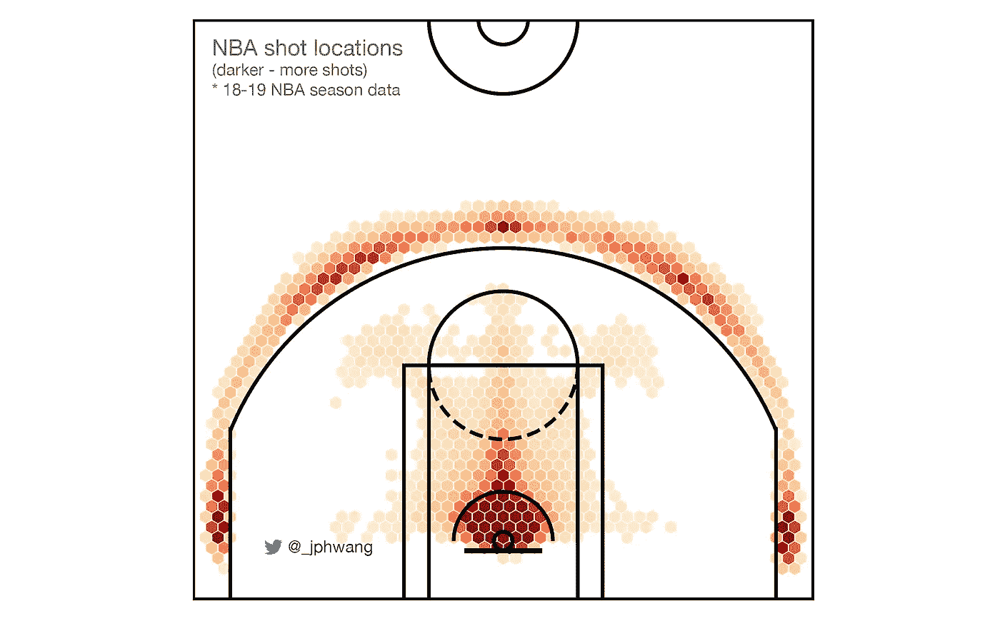

Hexbin 图表，显示拍摄频率

该图捕捉了 2018-2019 NBA 赛季期间拍摄的所有 22 万张左右的照片。投篮明显集中在限制圈内的近距离，三分线外。用离篮筐的距离来绘制投篮频率(整体)也说明了类似的问题。

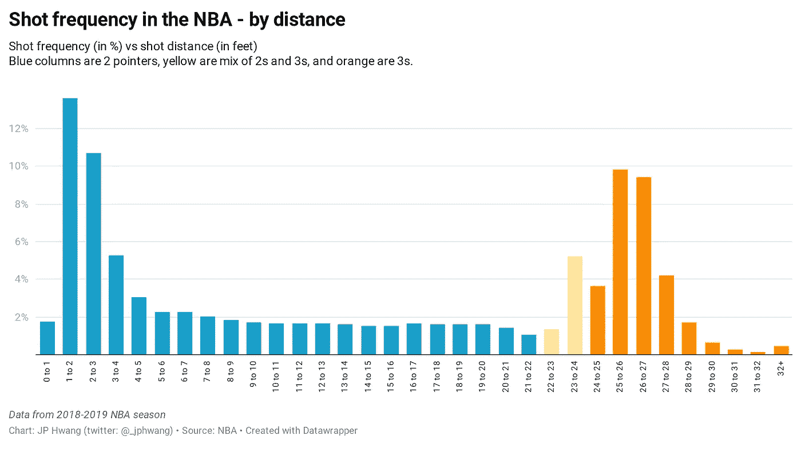

大多数照片是在 4 英尺范围内拍摄的(在限制圈内)，或者超过 23 英尺范围。乍一看，这是一个奇怪的分布，因为你可能会认为拍摄频率随着距离线性下降。然而，调查每个区域的拍摄值会告诉我们答案。

# 射击精度和价值

为了理解为什么 NBA 球员如此多的远距离投篮，我们需要了解两个关键因素，即准确性和投篮价值。很明显，随着我们远离篮筐，投篮会变得越来越不准确。(如果你不确定，去外面试着投一些 25 英尺的球，然后试着投几个 5 英尺的球，然后回来。我会等的。)

在这个范围内，射击精度会降低多少？好吧，看一看:

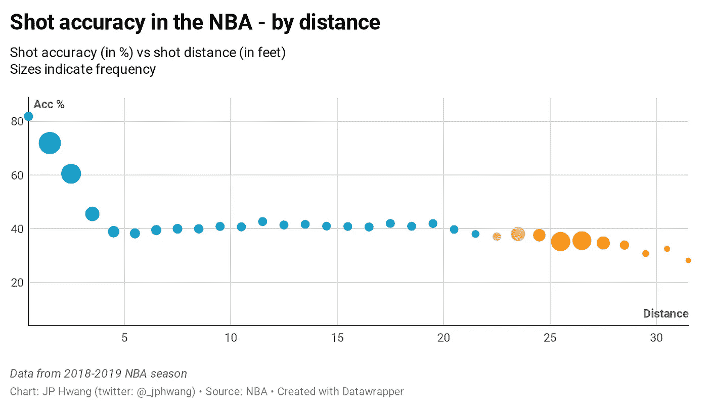

值得注意的是，NBA 球员的平均投篮命中率*在 4 英尺到 21 英尺的范围内几乎没有移动*，甚至这些天在 28-29 英尺之间的投篮命中率平均为 33.9%。相比之下，5-6 英尺范围内的投篮命中率为 38.3%。

这显然是一个平均值。它受到许多因素的影响，包括谁在投篮，防守在做什么。这张图表并不是说从 5-6 英尺的距离投篮和从 24-25 英尺的距离投篮一样困难，后者的准确率是 37.6%。较好的射手比差的射手更经常从远处投篮。但是很明显，这一比例已经达到了 50%左右的平衡。

然而，虽然每一次击球都是以彼此相似的精度进行的，但从 24-25 英尺的**击球比从 5-6 英尺的**击球得分多 50%。这是现代 NBA 的关键。

用什么方法来衡量这个奖励系统的效果？答案是预期(或平均)投篮值。

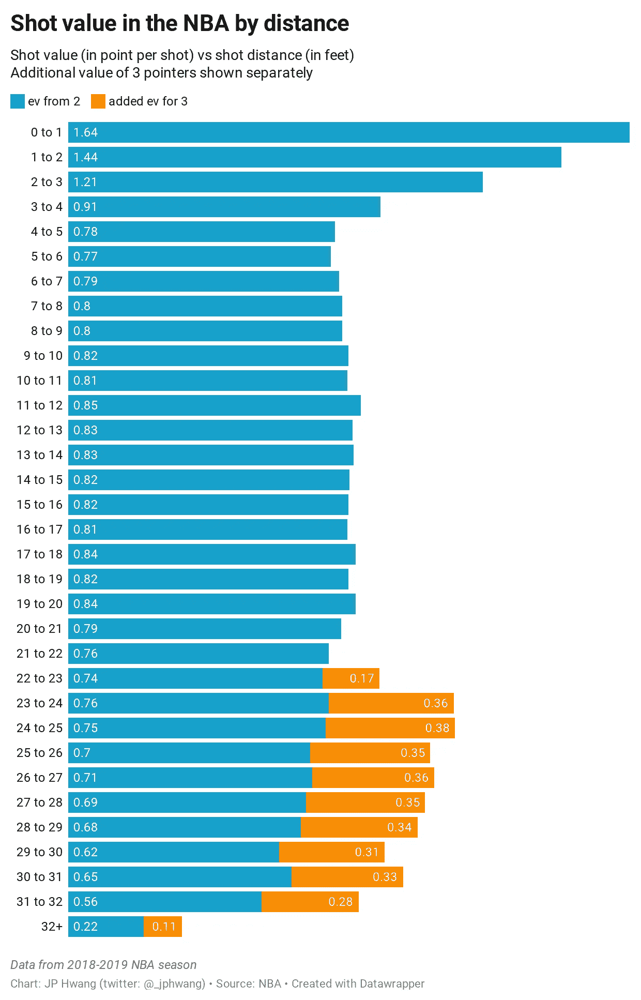

该图显示了每次发射的(统计)值；换句话说，一次投篮平均会产生多少分的*。来自额外点的附加值用橙色显示，而且是*巨大的*，如这张图表所示。*

*由于每次投篮都有额外的分数，从 24-25 英尺的距离投篮和从 2-3 英尺的距离投篮几乎一样有益。与短镜头相比，长镜头的另一个优势是*空间。在篮球场上，距离篮筐 24-25 英尺的空间比距离篮筐 2-3 英尺的空间大得多。看看这个:**

*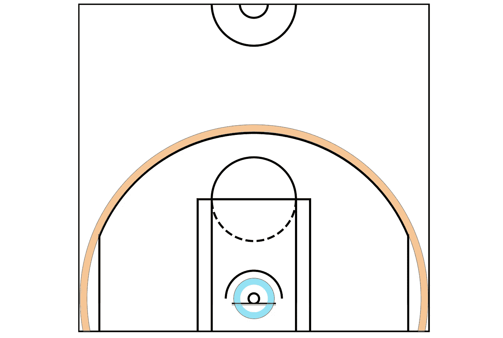*

*对手需要覆盖更大的区域来覆盖 24-25 英尺的射门(橙色)，而不是 2-3 英尺的射门(蓝色)。此外，必须覆盖这么多地面和这么远意味着*在地板上的其他地方创造了*更多的空间。内外博弈是共生互补的，善于一方为另一方开拓机会。*

# *按距离划分的总拍摄频率*

*回到统计数据，NBA 总投篮次数按距离的分布如下图。*

*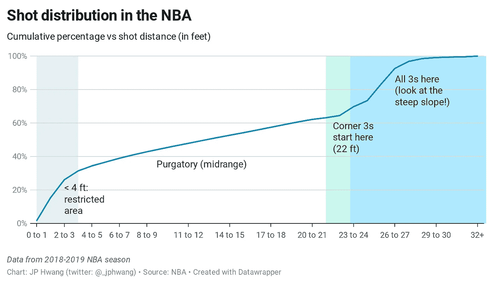*

*几乎三分之一(31%)的投篮来自 4 英尺以内，4 到 22 英尺之间也差不多，其余的来自三分线以外。*

*这也有助于我们将法庭分成几个不同的区域。还记得上面的 hexbin 图吗，把地板分成微小的六边形？我们可以将其中一些组合在一起，这样我们就可以按区域查看统计数据。这也是有价值的，因为它允许我们从非常小的样本量中平滑统计数据。(说一个球员在离篮筐 25 英尺的一个位置上有 4/10 的命中率，而在邻近的一个位置上有 6/10 的命中率是没有多大价值的——这可能只是随机的，而不是说那个球员在第二个位置上是一个更好的射手。)*

# *各个击破*

*现在，我们有足够的信息和直觉将 NBA 球场分成区域。对于不叫库里或 T2 的普通人来说，任何超过 32 英尺的东西都是绝望的发泄，所以我们将 32 英尺以上的人归为一个大区域。从那里开始，三分球分为角球，正常三分球和长三分球。中距离分为 3 组距离，留在篮筐周围投篮，把禁区直径内的一切都分组。*

*此外，我们将根据角度进一步划分大多数球场——左边、中间或右边。生成的区域绘制如下，每个区域用不同的颜色表示:*

*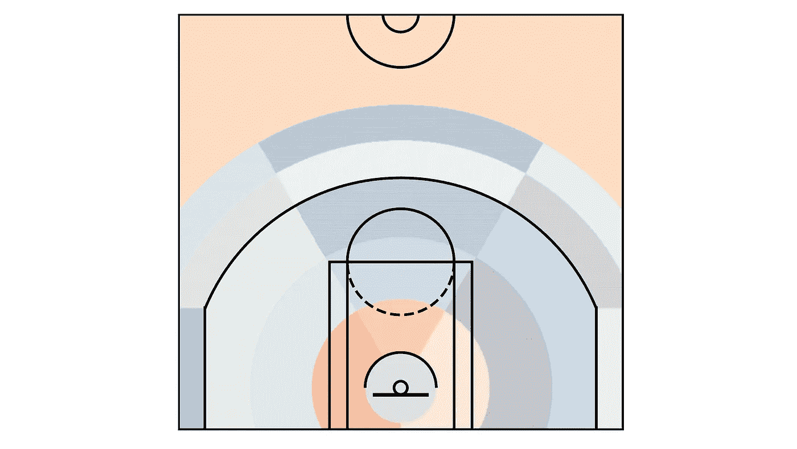*

*NBA 区域球场*

*在某些情况下，我们可能会将六边形数据与区域数据结合起来，保持六边形频率，同时通过使用区域数据来平滑投篮命中率。*

*这是很多相对抽象的讨论——这种分区实际上是如何工作的？我们将用一些实际例子来结束这篇文章。*

# *罪犯*

*在 2018-2019 常规赛中，勇士队的 FG%和积分/100 控球率最好，尼克斯队在这两个类别中都最差。让我们比较一下这两种犯罪。*

*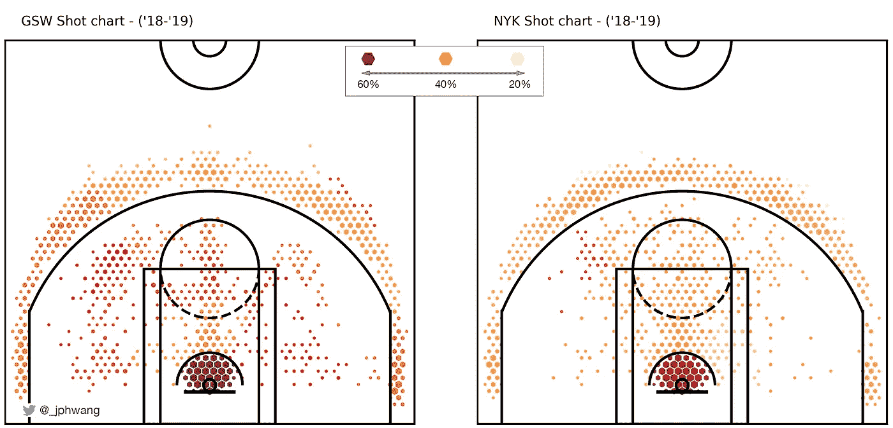*

*GSW(左)和 NYK(右)拍摄图表*

*勇士的投篮图在左边，尼克斯在右边。每个六边形的大小表示该队从那个特定的*点*(六边形)投篮的频率，颜色来自划分的整个*区*(上面的彩色区域)的平均投篮百分比。*

*这创造了一个很好的视觉效果，我们可以看到照片的具体位置，而不会被小样本可能导致的百分比大幅波动所淹没。*

*这些剧情让我们很容易的对两队进行评价。勇士队显然在任何地方都更好，从右边看非常强大(从球员的角度看是右边，所以在我们的图像中是左边)。*

*如果我挑毛病的话，这个情节的问题可能是很难看出这些颜色的相对差异，我们不知道它们与联盟平均水平相比如何(看起来像这样)。*

*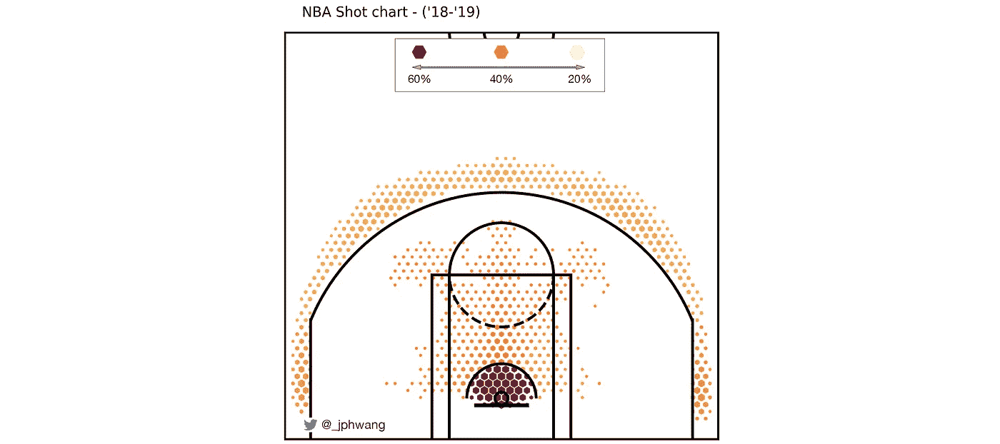*

*整个 NBA 的投篮排行榜*

*让我们来看一下相关的统计数据，用蓝色标记比平均水平差的区域，用红色标记比平均水平好的区域。).*

*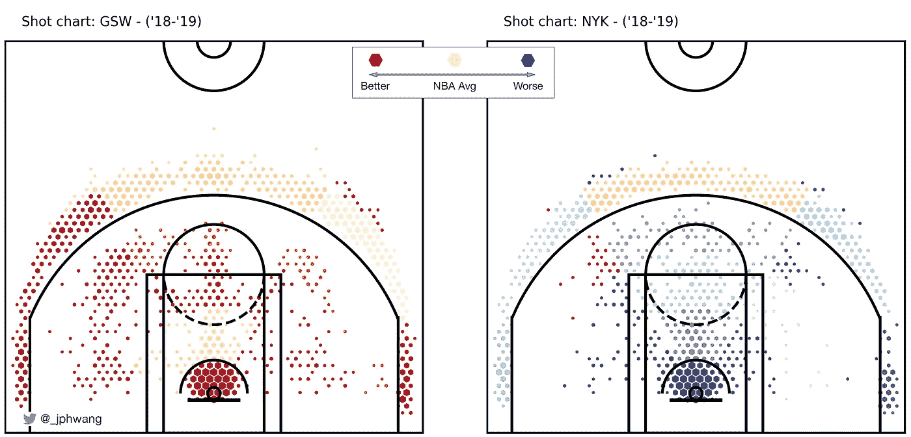*

*整个 NBA 的投篮排行榜*

*我们通过允许我们观察两个方向(消极和积极)，以及观察相对较小的数字，从本质上扩大了范围。勇士几乎在所有领域都优于联盟平均水平，右侧投篮简直就是绝对的血洗。与此同时，在右边，倒霉的尼克斯队在冰冷的蓝色海洋上打着冰桩。*

*这样看起来会好多少？*

*好吧。我希望那是有趣的。如果你是一名程序员，并且想了解更多关于我如何编写这些代码的信息，请点击这里查看我之前的文章:*

* [## 用 Plotly 实现交互式篮球数据可视化

### 用 hexbin shot 图表分析体育数据，用 Plotly 和 Plotly Express 分析气泡图(源代码&我自己的数据…

towardsdatascience.com](/interactive-basketball-data-visualizations-with-plotly-8c6916aaa59e) 

如果你喜欢这个，比如说👋/关注 [twitter](https://twitter.com/_jphwang) ，或点击此处获取更新。下次见！*