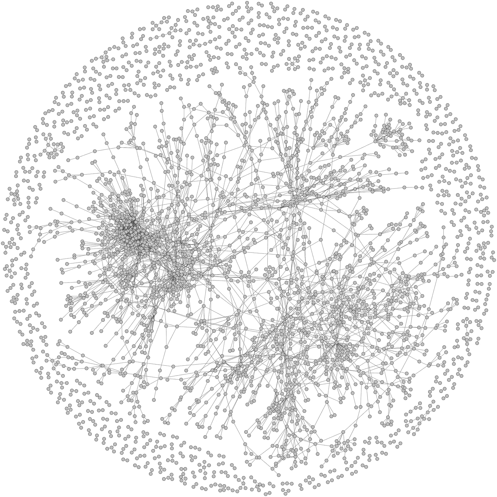
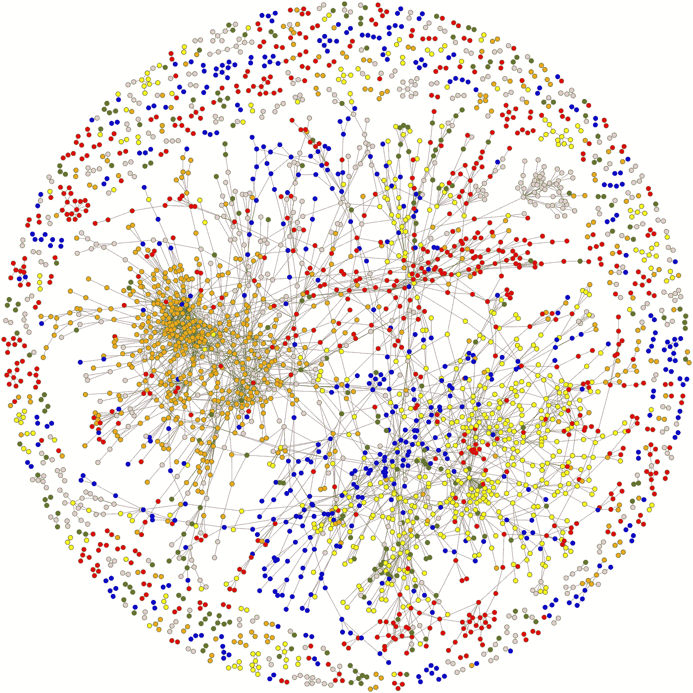
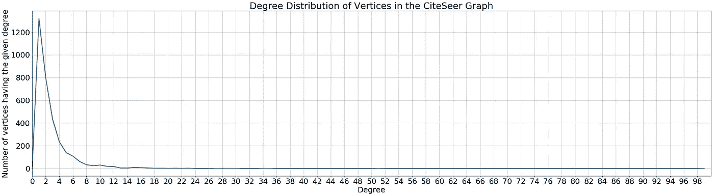

# 用 Python-igraph 可视化图形数据

> 原文：<https://towardsdatascience.com/visualising-graph-data-with-python-igraph-b3cc81a495cf?source=collection_archive---------8----------------------->

## 使用 CiteSeer 数据集介绍 python-igraph

# 图形学习和可视化

图形学习技术在数据科学家中变得流行，因为图形提供了更多的工具来表示数据点及其相互之间的关系。数据点可以用顶点来表示，这些数据点之间的关系可以用图形的边来表示。这样的数据点，以图表的形式，可以被馈送到各种算法(例如:神经网络)中，以执行不同的学习任务(例如:分类和聚类)。

数据集可能包含一堆数据点，乍看之下，我们可能无法从这些原始数据中找到任何意义。通过将这些数据点可视化为图表，我们可以很容易地找到数据集中的模式、聚类甚至异常值。图形结构可以为我们的学习过程提供有价值的信息，例如数据点和相关统计数据之间的连接/关系的性质。在这篇文章中，我将向你展示如何可视化 [**CiteSeer**](http://networkrepository.com/citeseer.php) 数据集的标签网络，并尝试看看我们是否能从可视化中看到任何模式。

# igraph 和 python-igraph

[**igraph**](https://igraph.org/redirect.html) 由一套工具组成，可以用来高效地分析网络。igraph 是免费的，可用于 Python、R、C/C++和 Mathematica。在本文中，我们将使用 Python 版本， [**python-igraph**](https://igraph.org/python/) 。你可以参考 [python-igraph 手册](https://igraph.org/python/#pymanual)了解更多细节。

# 入门指南

## 安装 python-igraph

首先，如果您还没有安装 python-igraph，那么您需要安装它。您可以使用 *pip* 。你还需要安装*cairo CFI*来绘制图表。

```
pip install python-igraph
pip install cairocffi
```

如果您使用的是 Python 包管理器，如 Anaconda 或 Miniconda，您可以使用 *conda install* 命令安装 python-igraph。

```
conda install python-igraph
conda install cairocffi
```

## CiteSeer 数据集

CiteSeer 数据集由科学出版物及其引文组成。顶点代表科学出版物，边代表引文。科学出版物被分为六个类别之一；*代理、人工智能、数据库、人机交互、机器学习和信息检索*。

首先，你必须从[http://networkrepository.com/citeseer.php](http://networkrepository.com/citeseer.php)下载带标签的数据集。你会有两个文件 **citeseer.edges** 和 **citeseer.node_labels** 。 **citeseer.edges** 文件会有边缘的形式

```
vertex_1, vertex_2, weight
```

**citeseer.node_labels** 文件会有每个顶点的标签，以

```
vertex_id, class_label
```

## 将图表形象化

我们将使用 CiteSeer 数据集构建一个无向图。一旦构建了图表，您就可以如图 1 所示对其进行可视化。



图一。CiteSeer 网络的无标号图的可视化

现在，您可以获得标签并可视化标签图，如图 2 所示。



图二。CiteSeer 网络标记图的可视化

## 分析图表

您可以观察到，有些小的子图具有相同的颜色(标签)，而某些子图的顶点具有不同的颜色(标签)。

通过分析该图获得的一些统计信息如下。

```
Number of vertices: 3264
Number of edges: 4536
Density of the graph: 0.000851796434172811Average degree: 2.7794117647058822
Maximum degree: 99
Vertex ID with the maximum degree: 2906Average number of triangles: 1.0716911764705883
Maximum number of triangles: 85
Vertex ID with the maximum number of triangles: 2906Degree having the maximum number of vertices: 1
Number of vertices having the most abundant degree: 1321Diameter of the graph: 28Assortativity of the graph: 0.04806382149471062
```

从这些结果可以看出，这是一个稀疏图，其中边的数量远远小于可能的边的最大数量(密度较小)。而且每篇文章平均至少参与两次引用(平均程度)。每一个物品至少参与一个与另外两个物品的三角连接。

大多数文章参与一次引用，有 1321 篇这样的文章(学位分布分析如图 3 所示)。此外，图的顶点具有与具有相同度数的其他顶点连接的较小趋势(较小的协调性)。



图三。CiteSeer 图中顶点的度分布

同样，您可以分析图形结构并找到其他模式。

# 密码

我已经在 Jupyter 笔记本上添加了我使用的代码，所以你可以自己尝试一下。

# 最后的想法

目前，图学习已经成为分析数据和预测模式的有力手段。目前可用的技术可以将图的每个节点嵌入到具有特征的真实向量中。此外，**图形神经网络**已经被引入，它是可以在图形结构上操作的特殊神经网络。我发现这些图形学习技术真的令人惊讶。

您可以从 [GraphViz](http://networkrepository.com/graphvis.php?d=./data/gsm50/labeled/citeseer.edges) 查看 CiteSeer 数据集的详细可视化。

如果你想阅读更多关于可视化大型图表的内容，可以看看这篇很棒的文章。

希望你喜欢我的文章，并将尝试代码。让我知道你的想法，如果我有任何错误，也请纠正我。

干杯！😃

# 参考

[1]鲁青，丽丝·格托尔。**基于链接的分类***ICML 03:第二十届机器学习国际会议论文集*。2003 年 8 月。第 496-503 页。

[2]瑞安·罗西和内斯林·艾哈迈德。**第二十九届 AAAI 人工智能会议的*记录中的具有交互式图形分析和可视化的网络数据仓库***。2015.

[3]**citeseer-labered Networks |网络数据仓库**([http://networkrepository.com/citeseer.php](http://networkrepository.com/citeseer.php))

[4] **GraphVis —交互式可视图形挖掘和机器学习|网络数据仓库**([http://networkrepository.com/graphvis.php?d=。/data/GSM 50/labered/citeseer . edges](http://networkrepository.com/graphvis.php?d=./data/gsm50/labeled/citeseer.edges)