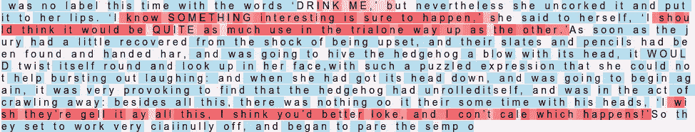
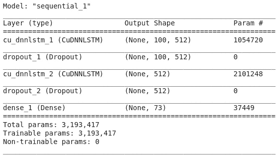
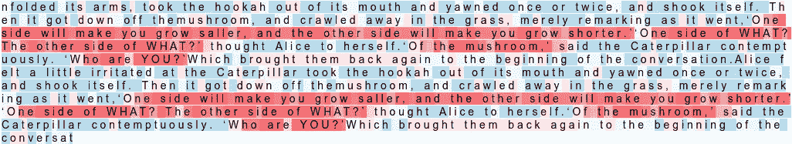
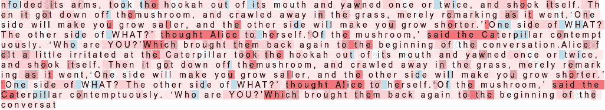
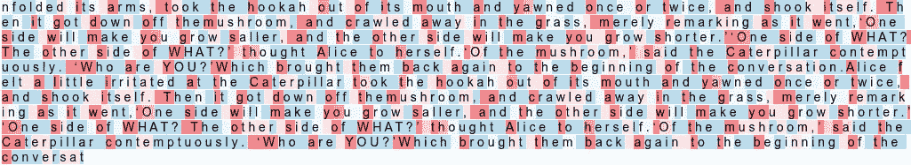

# 在 Keras 中可视化 LSTM 激活

> 原文：<https://towardsdatascience.com/visualising-lstm-activations-in-keras-b50206da96ff?source=collection_archive---------7----------------------->

## 看看每个 LSTM 细胞学到了什么

弗兰基·查马基在 [Unsplash](https://unsplash.com/s/photos/artificial-intelligence?utm_source=unsplash&utm_medium=referral&utm_content=creditCopyText) 上拍摄的照片

你有没有想过 LSTM 层学到了什么？有没有想过是否有可能看到每个细胞对最终输出的贡献。我很想尝试想象一下。在满足我好奇的神经元时，我偶然发现了安德烈·卡帕西的博客，名为[循环神经网络的不合理有效性](http://karpathy.github.io/2015/05/21/rnn-effectiveness/)。如果你想得到更深入的解释，我建议你去看看他的博客。

在本文中，我们不仅要在 [Keras](https://keras.io/) 中构建一个**文本生成**模型，还要可视化一些单元格在生成文本时所看到的内容。与 CNN 的情况一样，它学习图像的一般特征，如水平和垂直边缘、线条、补丁等。类似地，在文本生成中，LSTMs 学习诸如空格、大写字母、标点符号等特征。我们将会看到 LSTM 层中的每个细胞正在学习什么特征。

我们将使用刘易斯·卡罗尔的《爱丽丝漫游奇境记》这本书作为训练数据。该模型架构将是一个简单的架构，由两块 [LSTM](https://keras.io/layers/recurrent/#lstm) 和[脱落](https://keras.io/layers/core/#dropout)层以及最后的[密集](https://keras.io/layers/core/#dense)层组成。

> 您可以在此下载训练数据和训练模型权重

这是我们激活单细胞的样子。我希望你能辨认出上图中的图案。如果不能，你会在文末找到。

让我们深入研究代码。

## 步骤 1:导入所需的库

> 注意:我用 CuDNNLSTM 代替了 LSTM，因为它训练速度快 15 倍。CuDNNLSTM 由 CuDNN 支持，只能在 GPU 上运行。

## 第二步:读取训练数据并进行预处理

我们将使用正则表达式删除一个以上的空格。`char_to_int`和`int_to_char`只是数字到字符和字符到数字的映射。

## 步骤 3:为培训准备数据

重要的是准备好我们的数据，使每个输入都是一个字符序列，输出是后面的字符。

## 步骤 4:构建模型架构

## 第五步:训练模型

我无法一次训练我的模型 300 个纪元，因为我使用了 [Google Colab](https://colab.research.google.com/notebooks/intro.ipynb#recent=true) 来训练我的模型。我必须在 3 天内训练它，每天 100 个周期，方法是保存重量，然后从我结束训练的同一点重新加载。

如果你有一个强大的 GPU，你可以一口气训练 300 个纪元的模型。如果你没有，我会建议你使用 Colab，因为它是免费的。

您可以使用下面的代码加载模型，并从最后一点开始训练。

现在是文章最重要的部分——可视化 LSTM 激活。我们需要一些函数来让这些可视化变得可以理解。让我们开始吧。

## 步骤 6:获取中间层输出的后端函数

正如我们在上面的**步骤 4** 中看到的，第一层和第三层是 LSTM 层。我们的目标是可视化第二 LSTM 层的输出，即整个架构中的第三层。

Keras Backend 帮助我们创建一个函数，它接收输入，并从中间层向我们提供输出。我们可以用它来创建我们自己的管道函数。这里`attn_func`将返回一个大小为 512 的隐藏状态向量。这些将是 512 个单位的 LSTM 层的激活。我们可以想象这些细胞的每一次激活，以理解它们试图解释什么。要做到这一点，我们必须将它转换成一个可以表示其重要性的范围。

## 步骤 7:助手功能

这些辅助函数将帮助我们可视化字符序列及其每个激活值。我们通过`sigmoid`函数传递激活，因为我们需要一个可以表示它们对整个输出的重要性的值。`get_clr`功能有助于为给定值获得合适的颜色。

下图显示了每个值是如何用各自的颜色表示的。

从 0 到 1 的激活颜色级别

## 第八步:获得预测

`get_predictions`函数随机选择一个输入种子序列，并获得该种子序列的预测序列。`visualize`函数将预测序列、序列中每个字符的 sigmoid 值以及要可视化的单元格编号作为输入。根据输出的值，用适当的背景颜色打印字符。

对层输出应用 sigmoid 后，值在 0 到 1 的范围内。数字越接近 1，重要性越高。如果该数字更接近 0，则意味着对最终预测没有任何重大影响。这些单元格的重要性由颜色表示，其中**蓝色**表示较低的重要性，**红色**表示较高的重要性。

## 步骤 9:可视化激活

超过 90%的细胞没有显示任何可理解的模式。我手动可视化了所有的 512 个细胞，注意到其中的三个(189，435，463)显示了一些可以理解的模式。

正如您在下面看到的，189 号单元格是为引号内的文本激活的。这表明预测时单元格在寻找什么。如下所示，该单元格对引号之间的文本贡献很大。

435 号单元格是为引号中的句子后的几个单词激活的。

每个单词的第一个字符激活单元号 463。

通过更多的训练或更多的数据，可以进一步改善结果。这恰恰证明了一点，深度学习毕竟不是一个完全的黑箱。

你可以在我的 [Github 简介](https://github.com/Praneet9/Visualising-LSTM-Activations)上查看全部代码。

这是我第一次尝试写博客。我希望你能从中学到一些东西。