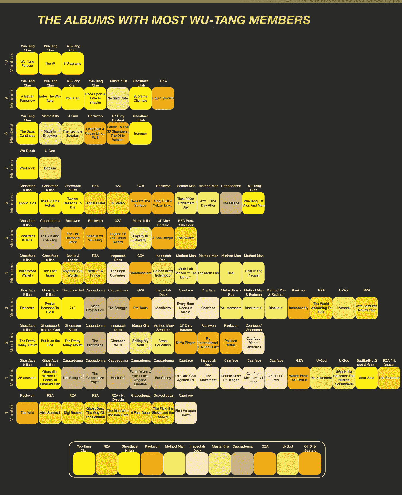
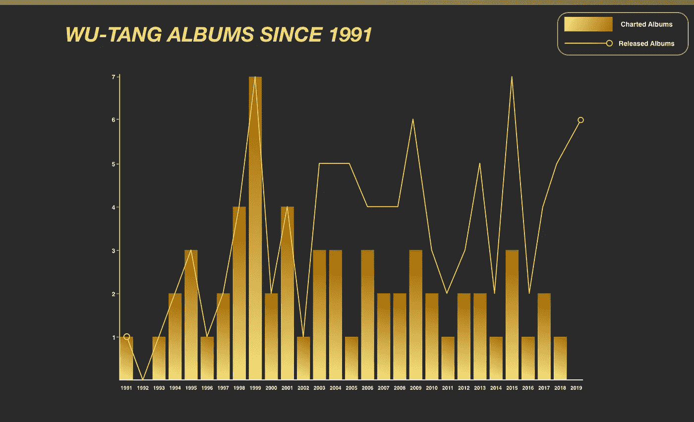
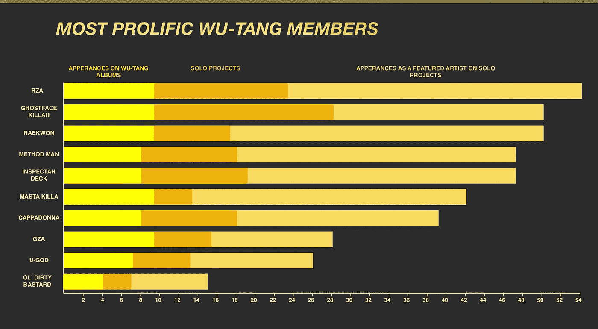
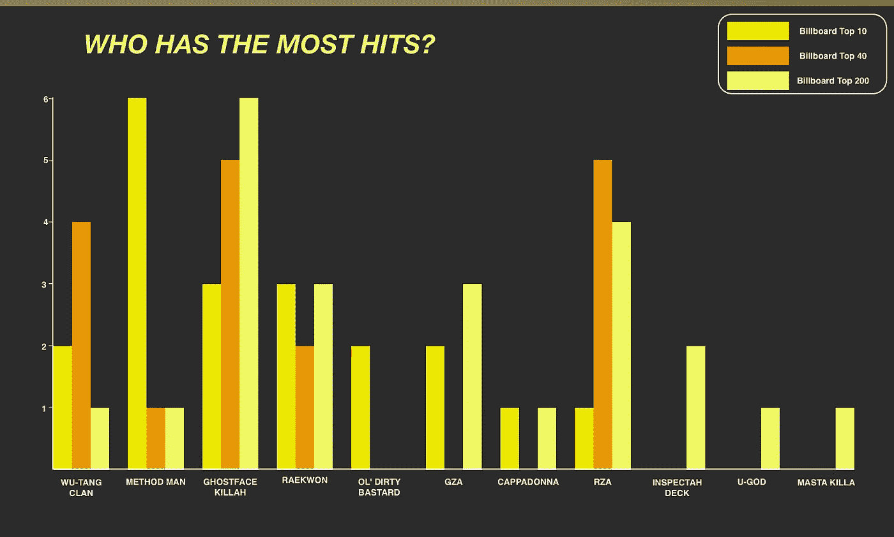
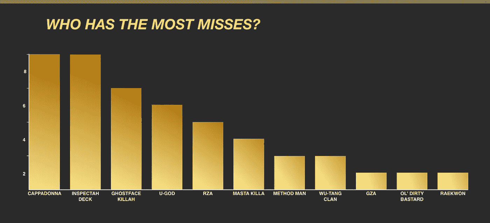

# 可视化 100 本吴唐家族相册

> 原文：<https://towardsdatascience.com/visualising-the-albums-of-wu-tang-clan-246ea75efdac?source=collection_archive---------21----------------------->

## 深入挖掘吴唐家族及其核心成员的著述。

吴唐家族有一个几乎无与伦比的大字典。他们录制了 100 张录音室专辑。这还不包括该组合大约 90 张[附属专辑的混音带或专辑。](https://en.wikipedia.org/wiki/List_of_Wu-Tang_Clan_affiliates)

但是考虑到这个组合经久不衰的人气，很难找到关于这个组合音乐的详细信息——所以我决定做点什么。

这篇文章的灵感来自于听我最喜欢的一张专辑，格斯特菲斯·基尔拉的《至尊顾客》。这张专辑基本上是一张非官方的武堂专辑，收录了武堂 10 位成员中的 9 位。唯一缺席的是《肮脏的混蛋》,他在专辑录制的大部分时间里都被监禁着。

我开始思考其他非官方的武堂专辑。GZA 的“液体剑”跃入脑海。我猜有更多，但快速谷歌搜索什么也没找到。[维基百科](https://en.wikipedia.org/wiki/Wu-Tang_Clan_anthology)丢失了详细信息。对十年前的论坛帖子的调查发现没有更多的东西。不久，我就开始搜索迪斯科舞厅，并建立自己的吴唐家族数据库。

一开始试图找出拥有最多吴唐成员的吴唐家族相册的事情越滚越大。我开始对专辑的时间线和乐队的排行榜表现感到好奇。这是首次对吴唐家谱进行深入分析。

# **武堂成员最多的专辑**

这张图显示了 100 张专辑，按照这些专辑中的武堂成员数量进行排名。

吴唐家族已经制作了 9 张录音室专辑。该组合的 10 名成员已经制作了 91 张个人专辑，或者作为个人艺术家，或者作为组合的一部分。团体项目包括 Inspectah Deck 的 Czarface、马索·曼恩和莱德曼的专辑以及 RZA 的 Gravediggaz。

# **吴唐 1991 年以来的专辑**

这张图表显示了每年发布的吴唐家族专辑的数量，以及有多少张专辑进入了公告牌前 200 名。

2019 年是自 1993 年以来，公告牌 200 强中首次没有吴唐家族相关专辑。尽管 2019 年有 6 张武堂相关专辑下跌，包括 Inspectah Deck 的 4 张专辑。首张与吴唐帮有关的专辑是 GZA 1991 年的专辑《天才的话》，比第一首吴唐帮单曲提前两年发行。

# **最多产的武堂成员**

这张图显示了最多产的吴唐成员。图表由作为个人艺术家的专辑、在吴唐专辑中的出现以及在其他成员的个人项目中的出现来分割。特色亮相包括作为说唱歌手或制作人的亮相。

RZA 参与了 100 个吴唐项目中的一半以上，总共出场 54 次。他出现在吴唐的每一张专辑，14 张他自己的个人专辑中，并在 31 张个人专辑中以制作人或说唱歌手的身份出现。Ghostface 拥有最多的个人专辑，有 19 张。

# 谁的点击率最高？

这张图显示了武堂帮的专辑在 Billboard Top 200 排行榜上的表现。这是由专辑达到前 10 名，前 40 名和前 200 名。

吴唐帮只进过两次前十。然而，他们凭借《永远的武堂》获得了公告牌排行榜第一名——这是没有武堂成员独自取得的成就。

许多武堂成员的单曲销量超过了组合的销量。马索·曼恩有 6 张专辑进入前 10 名。格斯特菲斯·基尔拉的专辑在排行榜上最多，有 14 张专辑进入前 200 名。

# **谁失手最多？**

这张图表显示了没有进入排行榜前 200 名的武堂相关专辑的数量。

Cappadonna 和 Inspectah Deck 错过了最多的 8 张非图表专辑。Inspectah Deck 的大部分失手是地下嘻哈团体 Czarface 的成员。有些专辑对不制作图表有很好的解释。《肮脏的混蛋》的遗作专辑《独一无二的儿子》没有正式发行。武堂帮的《少林往事》只有一本。这张专辑被 Martin Shkreli 以 200 万美元购得，在 Skhreli 被判证券欺诈罪后，现在属于美国联邦政府。

# 交互式列表

你可以进入下面的吴唐帮专辑互动列表。

# 方法学

专辑的数据是从 Discogs 中提取的。这些数据被导入 Google Sheets，并使用 VLOOKUP 功能进行分析，以比较艺术家在各种专辑中的角色。Google Sheets 还被用来分析每位艺人发行的唱片数量。图表表现的数据取自 Billboard。

图形首先在 Google Data Studio 中可视化，然后在 Sketch 中进一步发展。