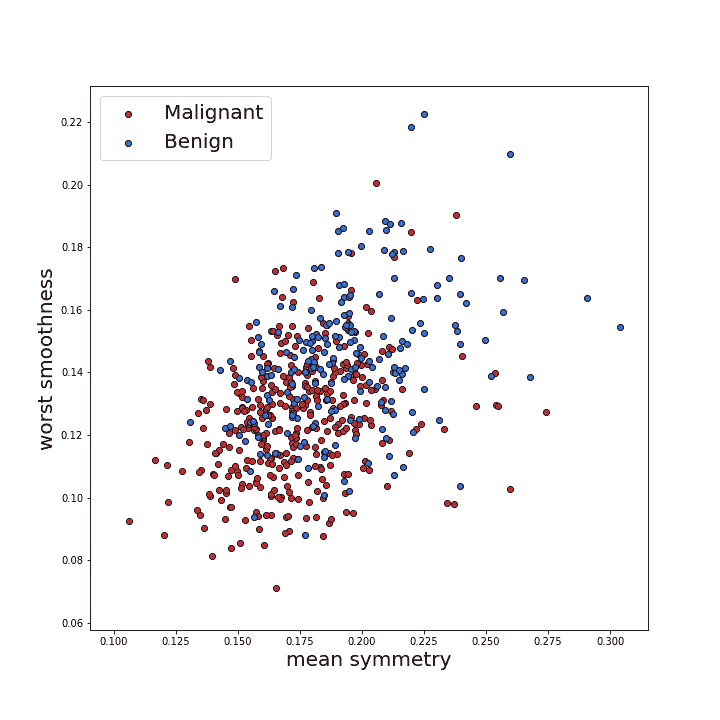
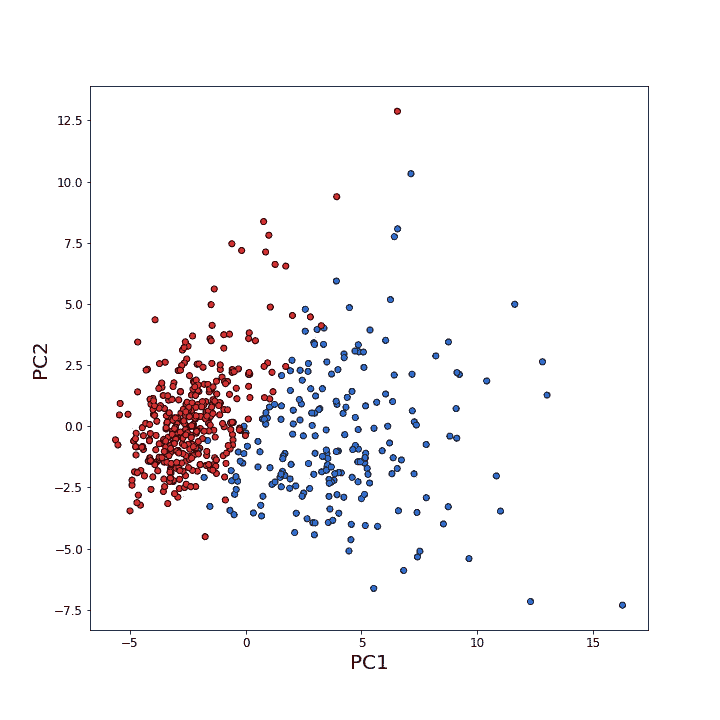
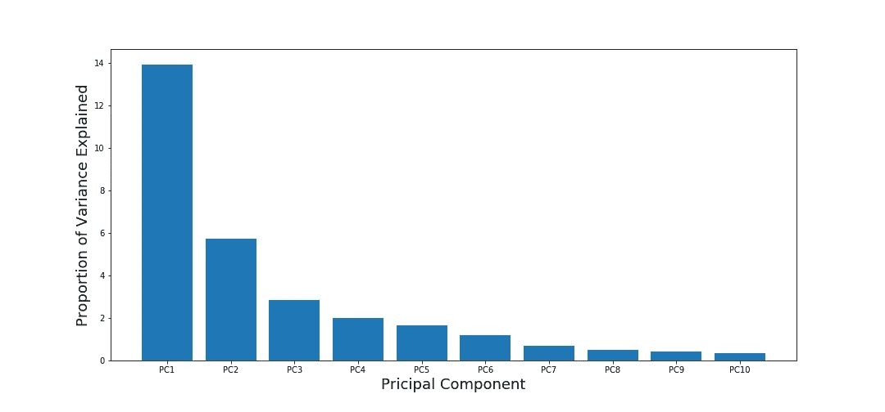
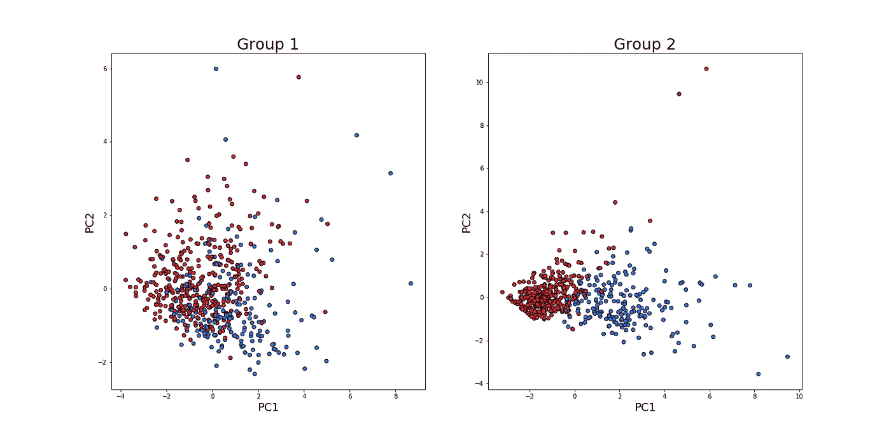

# 使用主成分分析可视化数据的分类能力

> 原文：<https://towardsdatascience.com/visualising-the-classification-power-of-data-54f5273f640?source=collection_archive---------14----------------------->

## 使用主成分分析来研究数据如何区分类(使用 Python 代码)

文章概述

主成分分析(PCA)是数据科学家使用的一个很好的工具。它可以用来降低特征空间的维数，产生不相关的特征。正如我们将看到的，它还可以帮助您深入了解数据的分类能力。我们将带您详细了解如何以这种方式使用 PCA。提供了 Python 代码片段，完整的项目可以在 [GitHub](https://github.com/conorosully/medium-articles) 上找到。

# 什么是 PCA？

我们将从复习理论开始。如果你想了解 PCA 是如何工作的[【1】](/a-one-stop-shop-for-principal-component-analysis-5582fb7e0a9c)[【2】](https://liorpachter.wordpress.com/2014/05/26/what-is-principal-component-analysis/)，我们不会进入太多细节，因为有大量的资源。重要的是要知道 PCA 是一种降维算法。这意味着它用于减少用于训练模型的特征数量。这是通过从许多特征中构造主成分(PC)来实现的。

PCs 的构造使得第一台 PC(即 PC1)尽可能解释您的功能中的大多数变化。然后 PC2 尽可能解释剩余变异中的大部分变异等等。PC1 和 PC2 通常可以解释总特征变化的很大一部分。另一种思考方式是，前两台电脑可以很好地总结这些特性。这是很重要的，因为它允许我们在二维平面上可视化数据的分类能力。

来源 1: [flaticon](https://www.flaticon.com/free-icon/analytics_777324) |来源 2: [flaticon](https://www.flaticon.com/premium-icon/analytics_500960) |来源 3: [flaticon](https://www.flaticon.com/free-icon/idea_166375)

# 资料组

好的，让我们来看一个实际的例子。我们将使用 PCA 来探索一个乳腺癌数据集[【3】](http://archive.ics.uci.edu/ml/datasets/breast+cancer+wisconsin+(diagnostic))，我们使用下面的代码导入该数据集。目标变量是乳腺癌测试的结果——恶性或良性。每次测试，都要采集许多癌细胞。然后对每个癌细胞进行 10 种不同的测量。这些指标包括像像细胞半径和细胞对称性。为了得到 30 个特性的最终列表，我们以 3 种方式汇总这些度量。也就是说，我们计算每个测量的平均值、标准误差和最大(“最差”)值。在图 1 中，我们仔细观察了其中的两个特征——细胞的*平均对称性*和*最差平滑度*。

在图 1 中，我们看到这两个特性有助于区分这两个类。也就是说，良性肿瘤往往更加对称和光滑。仍然有很多重叠，所以只使用这些特征的模型不会做得很好。我们可以创建这样的图来了解每个特征的预测能力。虽然，有 30 个特征，会有相当多的图需要分析。它们也没有告诉我们数据集作为一个整体的预测性如何。这就是 PCA 的用武之地。

图 1:使用两个特征的散点图(来源:作者)

# PCA 整个数据集

让我们从对整个数据集进行 PCA 开始。我们使用下面的代码来做到这一点。我们从缩放特征开始，因此它们都具有 0 的平均值和 1 的方差。这一点很重要，因为 PCA 通过最大化 PCs 解释的方差来工作。由于其规模的原因，一些要素往往会有较高的方差。例如，以厘米为单位测量的距离比以千米为单位测量的距离具有更高的方差。没有缩放，PCA 将被那些具有高方差的特征“压倒”。

缩放完成后，我们将拟合 PCA 模型，并将我们的特征转换到 PCs 中。由于我们有 30 个功能，我们可以有多达 30 台电脑。对于我们的观想，我们只对前两个感兴趣。您可以在图 2 中看到这一点，其中使用了 PC1 和 PC2 来创建散点图。我们现在可以看到两个不同的集群，它们比图 1 中的更清晰。

此图可用于为数据的预测力度建立直觉。在这种情况下，它表明使用整个数据集将允许我们分离恶性和良性肿瘤。然而，仍然存在一些异常值(即，不清楚地在聚类中的点)。这并不意味着我们会对这些情况做出不正确的预测。我们应该记住，不是所有的特性差异都在前两个 PC 中被捕获。基于完整特征集训练的模型可以产生更好的预测。

图 2:使用所有特征的 PCA 散点图(来源:作者)

在这一点上，我们应该提到这种方法的警告。PC1 和 PC2 可以解释要素中很大一部分差异。然而，事实并非总是如此。在某些情况下，个人电脑可以被认为是你的功能不良总结。这意味着，即使您的数据能够很好地将类分开，您也可能无法获得清晰的聚类，如图 2 所示。

我们可以使用 PCA scree 图来确定这是否是一个问题。我们使用下面的代码为这个分析创建了 scree 图，如图 3 所示。这是一个条形图，其中每个条形的高度是由相关 PC 解释的差异百分比。我们看到，PC1 和 PC2 总共只能解释大约 20%的特征差异。即使只有 20%得到解释，我们仍然得到两个不同的集群。这强调了数据的预测能力。

图 3:碎石地块(来源:作者)

# PCA —特征组

我们也可以用这个过程来比较不同组的特征。例如，假设我们有两组特征。组 1 具有基于单元对称性和平滑度特征的所有特征。然而，组 2 具有基于周长和凹度的所有特征。我们可以使用 PCA 来获得关于哪一组对于进行预测更有用的直觉。

我们首先创建两组特征。然后，我们分别对每个组进行主成分分析。这将为我们提供两组 PC，我们选择 PC1 和 PC2 来代表每组功能。这个过程的结果可以在图 4 中看到。

对于组 1，我们可以看到有一些分离，但仍有许多重叠。相反，对于组 2，有两个不同的集群。因此，从这些图中，我们可以预期第 2 组中的特征是更好的预测器。使用组 2 特征训练的模型应该比使用组 1 特征训练的模型具有更高的准确度。现在，让我们来检验这个假设。

图 4:使用特征组的 PCA 散点图(来源:作者)

我们使用下面的代码来训练使用这两组特征的逻辑回归模型。在每种情况下，我们使用 70%的数据来训练模型，剩余的 30%用于测试模型。组 1 的测试集的准确率为 74%，相比之下，组 2 的准确率为 97%。因此，第 2 组中的特征是更好的预测器，这是我们从 PCA 结果中预期的。

最后，我们将看到在开始建模之前，如何使用 PCA 来更深入地了解您的数据。这将使您了解预期的分类精度。您还将围绕哪些特征具有预测性建立直觉。在选择功能时，这可以给你带来优势。

如前所述，这种方法并不是完全可靠的。它应该与其他数据勘探图和汇总统计一起使用。对于分类问题，这些可能包括信息值和箱线图。一般来说，在开始建模之前，从尽可能多的不同角度查看数据是一个好主意。下面是另外两个你可能会感兴趣的观想教程。

 [## 发现并可视化非线性关系

### 用部分相关图(PDP)、互信息和特征重要性分析非线性关系

towardsdatascience.com](/finding-and-visualising-non-linear-relationships-4ecd63a43e7e)  [## 发现和可视化交互

### 使用特征重要性、弗里德曼的 H-统计量和 ICE 图分析相互作用

towardsdatascience.com](/finding-and-visualising-interactions-14d54a69da7c) 

我希望这篇文章对你有帮助！如果你想看更多，你可以成为我的 [**推荐会员**](https://conorosullyds.medium.com/membership) **来支持我。你可以访问 medium 上的所有文章，我可以得到你的部分费用。**

 [## 通过我的推荐链接加入 Medium 康纳·奥沙利文

### 作为一个媒体会员，你的会员费的一部分会给你阅读的作家，你可以完全接触到每一个故事…

conorosullyds.medium.com](https://conorosullyds.medium.com/membership) 

## 图像来源

所有图片都是我自己的或从[www.flaticon.com](http://www.flaticon.com/)获得。在后者的情况下，我拥有他们的[保费计划](https://support.flaticon.com/hc/en-us/articles/202798201-What-are-Flaticon-Premium-licenses-)中定义的“完全许可”。

## 参考

[1] [Matt Brems](https://medium.com/u/55680478461?source=post_page-----54f5273f640--------------------------------) ，主成分分析一站式商店(2017)，[https://towardsdatascience . com/A-一站式主成分分析商店-5582fb7e0a9c](/a-one-stop-shop-for-principal-component-analysis-5582fb7e0a9c)

[2] L. Pachter 什么是主成分分析？(2014)，[https://liorpachter . WordPress . com/2014/05/26/what-is-principal-component-analysis/](https://liorpachter.wordpress.com/2014/05/26/what-is-principal-component-analysis/)

[3] UCI，乳腺癌威斯康星州(诊断)数据集(2020 年)，[http://archive . ics . UCI . edu/ml/datasets/Breast+Cancer+Wisconsin+(诊断)](http://archive.ics.uci.edu/ml/datasets/breast+cancer+wisconsin+(diagnostic))