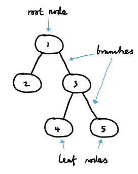
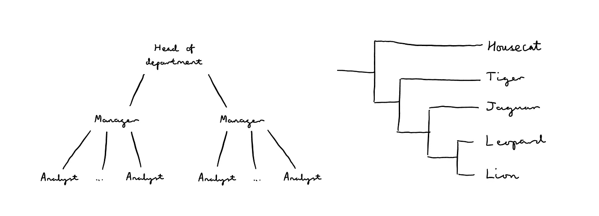
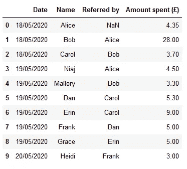
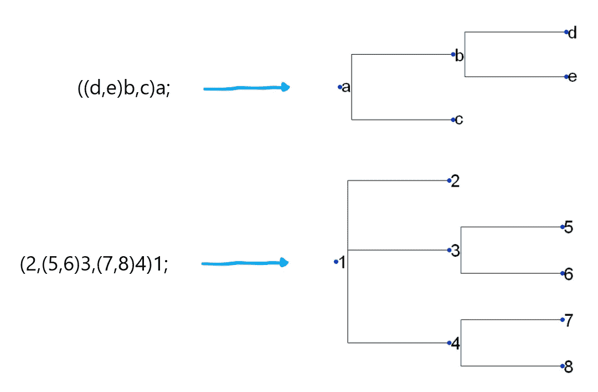
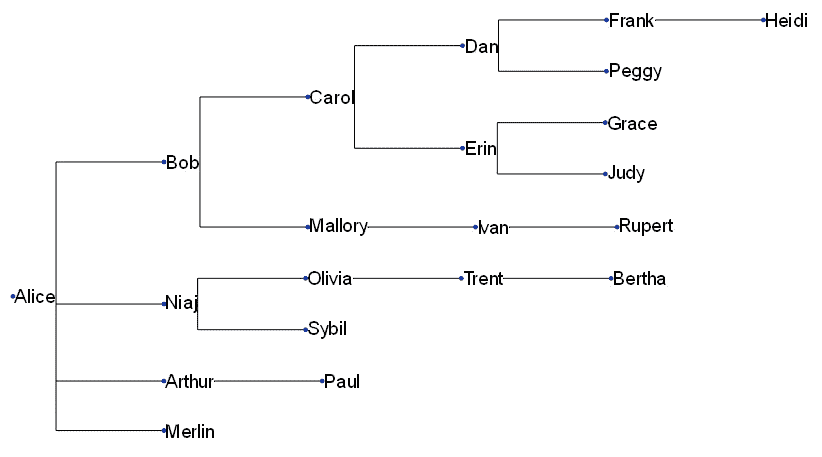
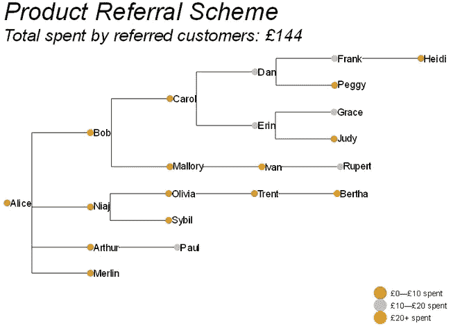

# 使用 ETE 工具包可视化树数据

> 原文：<https://towardsdatascience.com/visualising-tree-data-with-ete-toolkit-bceb1ed12776?source=collection_archive---------52----------------------->

## 交给我来帮你拓展业务

这个世界很复杂。事物以各种不同的方式联系在一起——有些关系是直观的，有些不是。因此，我们收集并用来描述世界的数据有各种各样的形状和大小。

此外，数据可视化是数据分析过程中最重要的方面之一。良好的可视化对于帮助客户和利益相关者理解数据至关重要。

结合起来，这两点意味着处理数据的人需要准备好用*最好地说明数据点之间的关系*—*对行动可能意味着什么*的方式来表示数据。今天，我们来看一个这样的表示和一个你可以用来创建它的工具。

Todd Quackenbush 在 [Unsplash](https://unsplash.com/s/photos/tree?utm_source=unsplash&utm_medium=referral&utm_content=creditCopyText) 上拍照

## **作为数据结构的树**

工作中，最近接触到了*树*。*树*是一种表示一组分层数据的方式。树中实例之间的关系很容易理解，这要归功于与我们都熟悉的植物学树的类比。当我们谈论数据结构而不是多年生植物时，根、叶和分支的概念转移得很好。

树和层次结构无处不在——常见的现实世界的例子是公司结构和进化树。

如您所见，为一组给定的层次链接数据绘制一个树相对容易。但是，当您拥有大量数据，或者您的数据在不断发展时，该怎么办呢？手动重新绘制整个过程既费时又费力…

## **ETE 工具包**

…这就是 ETE 工具包的用武之地。这是一个用于分析和可视化树木的 Python 库。它最初是由西班牙巴伦西亚 Principe Felipe 研究中心的生物信息学部门开发的，因此它能够进行各种科学分析。这也是自动化任何树数据结构可视化的一种便捷方式，我将在这里描述它的基础。查看 [ETE 工具包的图库](http://etetoolkit.org/gallery/)以了解该软件包的一些更高级的特性。

## **可视化客户转介系统**

让我们以客户推荐系统为例。您可能很熟悉这种工作方式——购买产品的客户会获得一个唯一的代码，他们可以与朋友分享该代码。如果他们的一个朋友决定也购买该产品，并在购买时引用这个独特的代码，双方都会获得奖励。这是一个双赢的场景——销售产品的公司能够通过激励他们传播信息，鼓励更多的人成为客户，将客户的利益与自己的利益结合起来——当然，客户自己也享受到了折扣。

假设每个客户最多可以推荐 5 个人。也就是说，我们目前有此数据的表格表示，如下所示:

我们有大量购买数据，包括:

*   交易日期；
*   客户名称；
*   谁推荐了客户；和
*   他们花了多少钱。

这些数据形成了一个层次结构——每个客户可以表示为树形图中的一个*节点*,推荐他们的人在树形图中位于他们之上，而他们继续推荐的人则位于他们之下。我们还可以看到，Alice 是“原始”客户，她启动了这个特定的推荐链，也就是说，Alice 是唯一没有被其他人推荐的客户。这使她成为了*的根*客户。

考虑到这一点，我们可以手动绘制一个树形图——依次遍历每个客户，找出谁应该在树中与他们相关联，并添加适当的作为*子代，*在他们下面分支。但是，当我们乐意为我们做艰苦的工作时，为什么要这样做呢？

ETE 以 *Newick 格式—* 接受输入，这是一种在数学和科学中简洁描述树形结构布局的相对标准的方式。这里有几个例子:

您可能会注意到，一组分支由一对括号表示。给定节点的分支数由括号中的逗号决定。当然，成对的括号可以嵌套起来，产生越来越复杂的结构。

我不打算在 Newick 格式的细节上花太多时间——只要知道我们可以通过将数据转换成这种格式来告诉 ETE 我们想要可视化的内容就足够了。我已经为我们写了一些代码来做到这一点，我不会在这里描述——如果你感兴趣，可以看看 GitHub 上的 Jupyter 笔记本来了解更多信息。

因此，我们的客户数据可以用 Newick 格式编写如下:

让我们看看当我们把它输入 ETE 时会得到什么:

不算太差！目前看起来很基本——但是 ETE 已经将视觉化过程中的许多复杂性去掉了。更重要的是，每当我们得到更新的数据时，我们可以简单地重新运行我们的代码！

ETE 的另一个优点是我们可以很容易地调整树的外观。让我们看看是否可以让它看起来更时髦一点…

那更好。我们仍然只是触及了 ETE 工具包的表面，但是作为一个快速的例子，这足以让我们理解一些关键的思想。

## **结论**

人类的大脑喜欢吸取视觉信息。树有一个现成的现实世界的类比，使它们直观且易于理解。这使得它们成为向非专业人士解释数据的一个很好的工具。最后总结一下——大脑有许多天生的优势和弱点。当数据以某种方式呈现给我们时，我们总是更容易消化这些数据，这种方式是*与*这些特性相适应，而不是*与*相反。

# 更多信息和积分

Andrew Hetherington 是英国伦敦的一名见习精算师和数据爱好者。

*   在 [LinkedIn](https://www.linkedin.com/in/andrewmhetherington/) 上与我联系。
*   看看我在 [GitHub](https://github.com/andrewhetherington/python-projects) 上鼓捣什么。
*   用来制作本文情节的笔记本可以在[这里](https://github.com/andrewhetherington/python-projects/blob/master/Blog%E2%80%94Visualising%20Tree%20Data/Visualising%20Tree%20Data.ipynb)找到。

Todd Quackenbush 在 [Unsplash](https://unsplash.com/s/photos/tree?utm_source=unsplash&utm_medium=referral&utm_content=creditCopyText) 上拍摄的树照片。

*ETE 3:系统发育学数据的重建、分析和可视化。*

海梅·韦尔塔-塞帕斯、弗朗索瓦·塞拉和皮尔·博克。

Mol Biol Evol 2016[doi:10.1093/mol bev/MSW 046](http://mbe.oxfordjournals.org/content/early/2016/03/21/molbev.msw046)