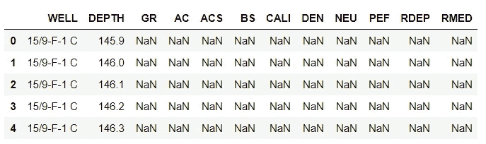
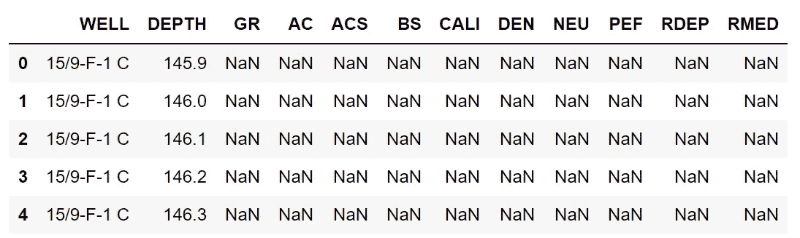
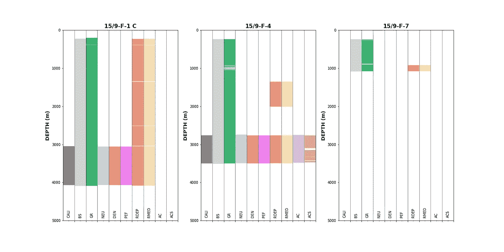

# 使用 Matplotlib 可视化油井数据覆盖范围

> 原文：<https://towardsdatascience.com/visualising-well-data-coverage-using-matplotlib-f30591c89754?source=collection_archive---------44----------------------->

## 探索数据在哪里，不在哪里


维尔莫斯·海姆在 Unsplash[拍摄的照片](https://unsplash.com?utm_source=medium&utm_medium=referral)

探索性数据分析(EDA)是数据科学不可或缺的一部分。岩石物理领域也是如此，通常被称为项目的测井质量控制或数据审查阶段。正是在这个阶段，我们开始详细检查数据，并确定我们真正拥有哪些数据，我们在哪里拥有这些数据，以及收集的数据的质量如何。

我们花了很大一部分时间(在某些情况下高达 90%！— Kohlleffel，2015 年)处理测井数据的时间都花在了试图理解数据并将其转换为适合解释的状态上。剩下的 10%是我们可以着手进行岩石物理解释的时候。这可以根据正在进行的项目的初始状态而变化。

在 QC 阶段，我们经常会发现自己有多个输入文件、随机的曲线名称、缺失的数据和没有直接用途的额外曲线。这可能会导致困惑和沮丧，尤其是在使用多种工具和老式数据集时。在我们有缺失数据的情况下，我们需要识别它并确定处理它的最佳方式。在文本编辑器中查看单个 LAS 文件可能很难做到这一点，但使用软件可以使其变得更容易。其中一种方法是使用 Python，这是一种常见且流行的编程语言。

在这篇短文中，我们将介绍如何可视化 Equinor 在 2018 年发布的 Volve 数据集的 3 个井内的数据覆盖范围。

您可以在 GitHub 上的以下链接中找到本示例的完整 Jupyter 笔记本 9**——我的**岩石物理学和 Python 系列**的 visualizing Data covere . ipynb**:

[](https://github.com/andymcdgeo/Petrophysics-Python-Series/) [## andymcdgeo/岩石物理学-Python-系列

### 本系列 Jupyter 笔记本将带您了解使用 Python 和岩石物理数据的各个方面。

github.com](https://github.com/andymcdgeo/Petrophysics-Python-Series/) 

# 加载数据和库

与任何 Python 项目一样，我们需要加载所需的数据和库。对于本文，我们将使用 pandas 和 matplotlib。

```
import pandas as pd
import matplotlib.pyplot as plt# Load in our data from a CSV file
data = pd.read_csv('Data/VolveWells.csv')
data.head()
```

这将返回:



乍一看，我们可以看到我们的数据集中有 12 列。第一列是井，随后是深度曲线，随后是每条测井曲线。

为了识别我们的数据集中有哪些井，我们可以调用`data['WELL'].unique()`，它将返回一个数组，但是我们可以通过实现一个简短的 for 循环并打印出每个值来获得更好的格式。

```
for well in data[‘WELL’].unique():
    print(well)
```

这将返回 3 口井的列表:

*   9 月 15 日-F-1 C
*   2004 年 9 月 15 日
*   2007 年 9 月 15 日

# 数据准备

为了让我们的绘图像预期的那样工作，我们需要修改数据集的列顺序。这可以通过首先按照我们想要的顺序创建一个列列表来实现。

```
plot_cols = ['WELL', 'DEPTH', 'CALI', 'BS', 'GR', 'NEU', 'DEN', 'PEF', 'RDEP', 'RMED', 'AC', 'ACS']
```

然后，我们可以用新的列顺序替换现有的数据帧:

```
data = data[plot_cols]
data.head()
```

然后我们可以调用`data.head()`来查看新的数据帧。



下一步是创建数据帧的副本。这将允许我们保留原始数据帧，以便在项目的后续工作中使用。

```
data_nan = data.copy()
```

为了使绘图按预期显示，我们需要替换数据框中的值。

在有实际值的地方，我们将根据它在数据帧中的位置给它分配一个数字。在我们有一个 NaN(不是数字)值的地方，我们要给它一个数字- 1 的值。这将允许我们在一个数字和另一个数字之间使用阴影，同时为每个井使用一个单独的子图。这使事情变得简单，并且不需要为每个井中的每条曲线创建支线图。

```
for num, col in enumerate(data_nan.columns[2:]):
    data_nan[col] = data_nan[col].notnull() * (num + 1)
    data_nan[col].replace(0, num, inplace=True)
```

分解上面这段代码:

*   `for num, col in enumerate(data_nan.columns[2:]:` 这一行将循环遍历从第 2 列开始的每一列。
    enumerate()允许我们在遍历每一列时创建一个计数器/索引值
*   `data_nan[col] = data_nan[col].notnull()*(num+1)` 这里我们把实数值转换成布尔值(真或假)。如果为真，则转换为列号加 1。当它为假时，这些值将被设置为 0。
*   `data_nan[col].replace(0, num, inplace=True)` 我们现在可以用列号替换任何 0 值。

# 绘制数据

现在我们已经到了策划阶段。为了在单独的子图中绘制每个井，我们必须按照井名对数据帧进行分组:

```
grouped = data_nan.groupby('WELL')
```

为了绘制数据，我们可以调用这段简短的代码。我添加了简短的注释来描述每个部分在做什么。

我们使用`ax.fillbetweenx()`来填充我们之前设置的每条曲线的两个值。例如，CALI 有两个值来指示数据的存在:1 表示有实数值，0 表示有 NaN 值。类似地，GR 有两个值:有实数据时为 3，有 NaN 时为 2。

```
#Setup the labels we want to display on the x-axis
labels = ['CALI', 'BS', 'GR', 'NEU', 'DEN', 'PEF', 'RDEP', 'RMED', 'AC', 'ACS']#Setup the figure and the subplots
fig, axs = plt.subplots(1, 3, figsize=(20,10))#Loop through each well and column in the grouped dataframe
for (name, df), ax in zip(grouped, axs.flat):
    ax.set_xlim(0,9)

    #Setup the depth range
    ax.set_ylim(5000, 0)

    #Create multiple fill betweens for each curve# This is between
    # the number representing null values and the number representing
    # actual values

    ax.fill_betweenx(df.DEPTH, 0, df.CALI, facecolor='grey')
    ax.fill_betweenx(df.DEPTH, 1, df.BS, facecolor='lightgrey')
    ax.fill_betweenx(df.DEPTH, 2, df.GR, facecolor='mediumseagreen')
    ax.fill_betweenx(df.DEPTH, 3, df.NEU, facecolor='lightblue')
    ax.fill_betweenx(df.DEPTH, 4, df.DEN, facecolor='lightcoral')
    ax.fill_betweenx(df.DEPTH, 5, df.PEF, facecolor='violet')
    ax.fill_betweenx(df.DEPTH, 6, df.RDEP, facecolor='darksalmon')
    ax.fill_betweenx(df.DEPTH, 7, df.RMED, facecolor='wheat')
    ax.fill_betweenx(df.DEPTH, 8, df.AC, facecolor='thistle')
    ax.fill_betweenx(df.DEPTH, 9, df.ACS, facecolor='tan')

    #Setup the grid, axis labels and ticks
    ax.grid(axis='x', alpha=0.5, color='black')
    ax.set_ylabel('DEPTH (m)', fontsize=14, fontweight='bold')

    #Position vertical lines at the boundaries between the bars
    ax.set_xticks([1,2,3,4,5,6,7,8,9,10], minor=False)

    #Position the curve names in the centre of each column
    ax.set_xticks([0.5, 1.5 ,2.5 ,3.5 ,4.5 ,5.5 ,6.5 , 7.5, 8.5, 9.5], minor=True)

    #Setup the x-axis tick labels
    ax.set_xticklabels(labels,  rotation='vertical', minor=True, verticalalignment='bottom')
    ax.set_xticklabels('', minor=False)
    ax.tick_params(axis='x', which='minor', pad=-10)

    #Assign the well name as the title to each subplot
    ax.set_title(name, fontsize=16, fontweight='bold')plt.tight_layout()
plt.subplots_adjust(hspace=0.15, wspace=0.25)
plt.show()
```

一旦我们运行上面的代码，我们会得到一个 matplotlib 图，其中有 3 个子图。每个包含每口井的数据范围。



从这个图中我们可以确定:

9 月 15 日——F-1 C

*   伽马射线和电阻率曲线中的微小间隙。由于间隙出现在两条电阻率曲线的相同位置，我们可以初步假设它们可能与套管鞋有关。需要进一步调查来证实这一点。
*   核曲线(登、NEU、PEF)和井径仪仅在一小段上运行，可能指示目的层。
*   无声学曲线(交流和交流)

**15/9-F-4**

*   包含所有可用的曲线，大部分在朝向井底的一小部分上。
*   在伽马射线(GR)和声波剪切(ACS)曲线中有多个间隙。可能与工具有关。进一步的调查会揭示原因。

**15/9-F-7**

*   在一个短而浅的剖面上出现的数据量最少。
*   仅提供钻头尺寸、伽马射线和电阻率测量值。
*   可能由工具故障或钻井时遇到的问题引起。如果有完井报告，可以通过审查这些报告来确认这些信息。

# 结论

在这篇短文中，我向您展示了如何从一个 CSV 文件中加载数据，并以一种您可以识别丢失值所在位置的方式来可视化它。在执行岩石物理解释或应用机器学习模型之前，了解哪里有或没有数据是探索数据集的关键步骤

# 参考

本例中使用的数据:
Equinor。(2018).公开所有 Volve 数据。可在:[https://www . equinor . com/en/news/14 jun 2018-discovery-volve-data . html](https://www.equinor.com/en/news/14jun2018-disclosing-volve-data.html)