# 视觉化和注意力——第一部分

> 原文：<https://towardsdatascience.com/visualization-attention-part-1-a16667295007?source=collection_archive---------36----------------------->

## [FAU 讲座笔记](https://towardsdatascience.com/tagged/fau-lecture-notes)关于深度学习

## 架构和培训可视化

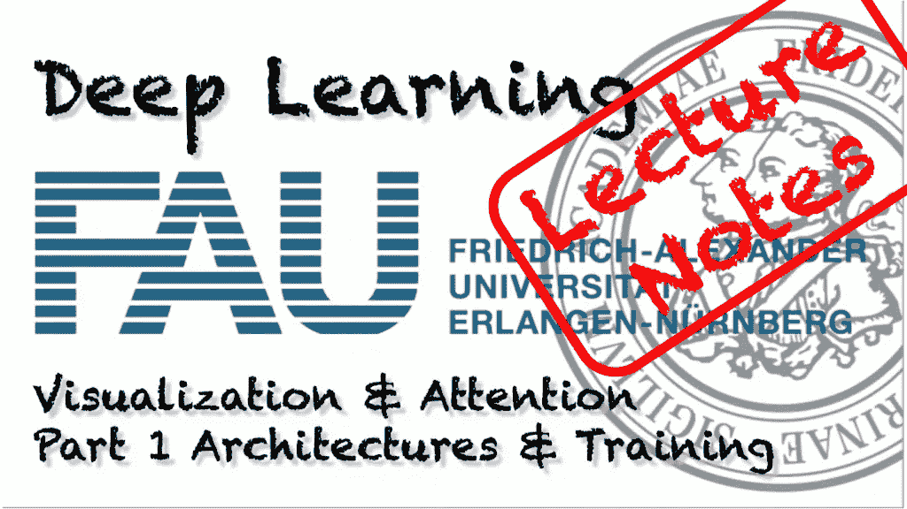

FAU 大学的深度学习。下图 [CC BY 4.0](https://creativecommons.org/licenses/by/4.0/) 来自[深度学习讲座](https://www.youtube.com/watch?v=p-_Stl0t3kU&list=PLpOGQvPCDQzvgpD3S0vTy7bJe2pf_yJFj&index=1)

**这些是 FAU 的 YouTube 讲座** [**深度学习**](https://www.youtube.com/watch?v=p-_Stl0t3kU&list=PLpOGQvPCDQzvgpD3S0vTy7bJe2pf_yJFj&index=1) **的讲义。这是与幻灯片匹配的讲座视频&的完整抄本。我们希望，你喜欢这个视频一样多。当然，这份抄本是用深度学习技术在很大程度上自动创建的，只进行了少量的手动修改。** [**自己试试吧！如果您发现错误，请告诉我们！**](http://peaks.informatik.uni-erlangen.de/autoblog/)

# 航行

[**上一讲**](/recurrent-neural-networks-part-5-885fc3357792) **/** [**观看本视频**](https://youtu.be/o9qg7BmNVSQ) **/** [**顶级**](/all-you-want-to-know-about-deep-learning-8d68dcffc258)/[**下一讲**](/visualization-attention-part-2-4b1dd17b9269)

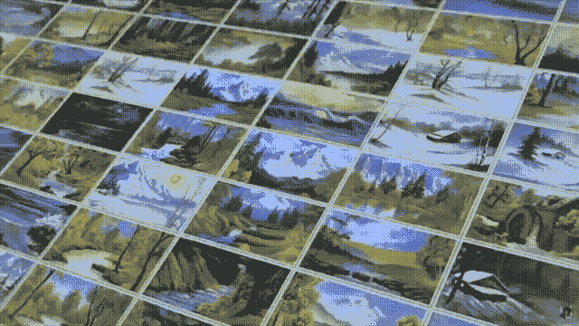

是时候用神经网络可视化来表现艺术了。用[自动博客](http://peaks.informatik.uni-erlangen.de/autoblog/movie2gif.html)创建的 GIF。来源: [YouTube](https://youtu.be/DxSv0YS0_aw)

欢迎大家参加我们的深度学习讲座！今天我们想谈谈视觉化和注意力机制。好的，让我们开始研究视觉化和注意力机制。因此，我们将首先研究动机，然后讨论网络架构可视化。最后，我们想了解一下培训和培训参数的可视化，您已经在本课中看到了。在接下来的几个视频中，我们想谈谈参数的可视化，即内部工作原理，以及我们为什么会对这样做感兴趣。最后，我们将研究注意力机制。这将是这个短片系列的第五个视频。

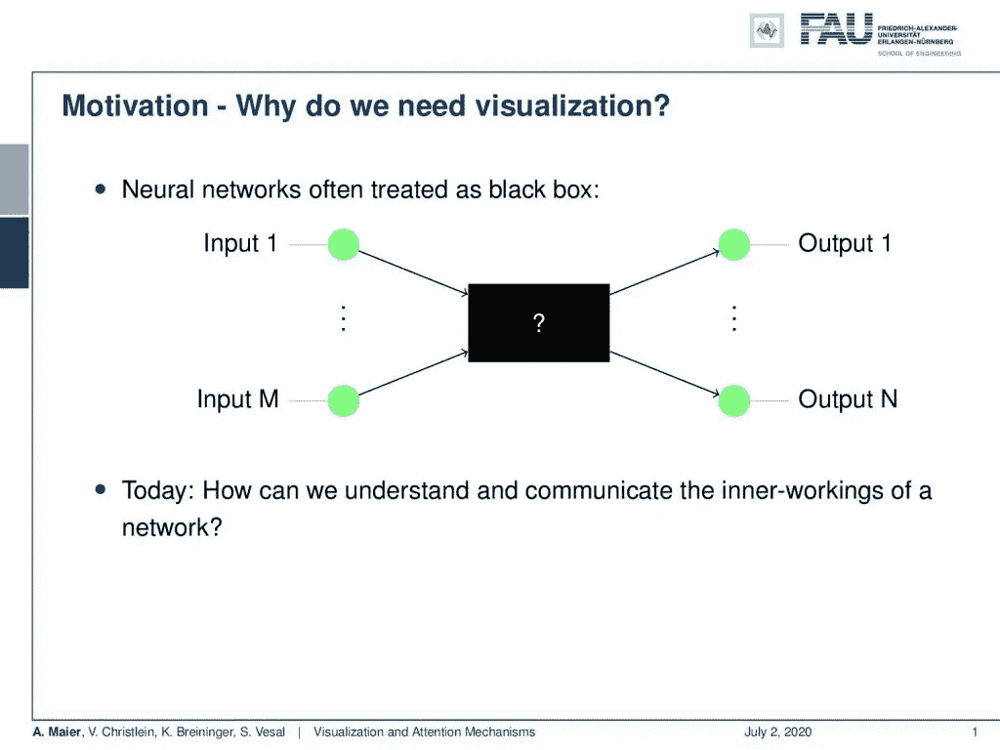

可视化有助于更好地描述和理解深层网络的黑箱本质。 [CC 下的图片来自](https://creativecommons.org/licenses/by/4.0/)[深度学习讲座](https://www.youtube.com/watch?v=p-_Stl0t3kU&list=PLpOGQvPCDQzvgpD3S0vTy7bJe2pf_yJFj&index=1)的 4.0 。

所以，让我们来谈谈动机。好吧，为什么我们要想象任何东西？当然，神经网络通常被视为黑盒。所以你有一些输入，然后发生一些事情，然后有一些输出。今天，我们想看看如何将网络的内部工作传达给其他人，如其他开发人员或科学家。你会发现这是你未来职业生涯中需要的一项重要技能。

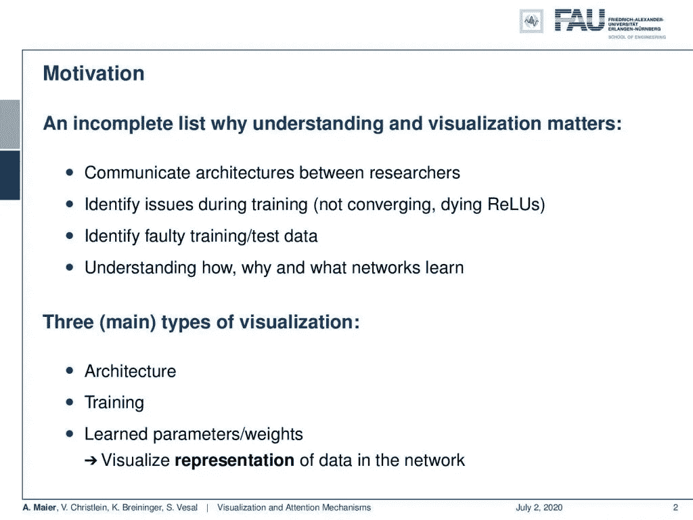

为什么我们需要可视化？来自[深度学习讲座](https://www.youtube.com/watch?v=p-_Stl0t3kU&list=PLpOGQvPCDQzvgpD3S0vTy7bJe2pf_yJFj&index=1)的 [CC BY 4.0](https://creativecommons.org/licenses/by/4.0/) 下的图片。

这是你为什么想这么做的几个原因。你想要交流架构。您希望在培训过程中发现问题，例如培训是否不一致。如果你有类似死亡的影响，你需要识别错误的训练或测试数据。你想了解网络如何学习，为什么学习，学习什么。因此，我们想在这里介绍三种主要的可视化类型。这是架构的可视化、训练的可视化、学习到的参数和权重，这对于可视化当然是重要的:网络中数据的表示。

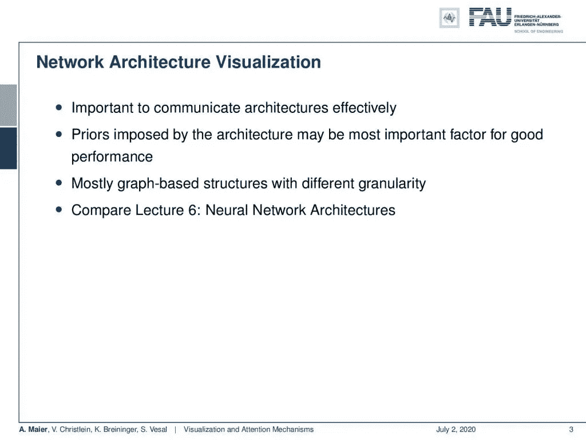

深度学习可视化方法中的一个关键方法是网络架构的显示。 [CC 下的图片来自](https://creativecommons.org/licenses/by/4.0/)[深度学习讲座](https://www.youtube.com/watch?v=p-_Stl0t3kU&list=PLpOGQvPCDQzvgpD3S0vTy7bJe2pf_yJFj&index=1)的 4.0 。

那么，让我们从网络架构可视化开始。我们本质上想要有效地交流这种特定类型的神经网络的重要性。对于一个特定网络的良好性能，我们实际上由架构强加的先验可能是至关重要的，甚至是最重要的因素。因此，这主要是通过基于图的结构以不同的粒度完成的，您将在下面看到一些示例。实际上，如果你和我们的一组关于[神经网络架构](/architectures-part-1-62c686f500c3)的演讲视频相比，我们已经经常看到这种情况了。所以基本上有三类，

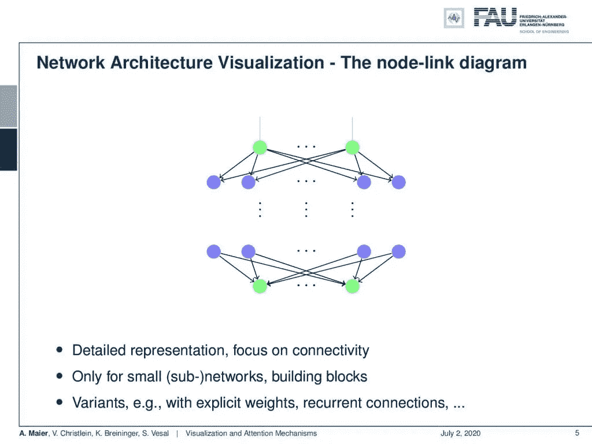

节点连接图。来自[深度学习讲座](https://www.youtube.com/watch?v=p-_Stl0t3kU&list=PLpOGQvPCDQzvgpD3S0vTy7bJe2pf_yJFj&index=1)的 4.0CC 下的图片。

这是节点连接图，基本上在神经元水平上起作用。节点是神经元，加权连接是边。你们已经看到了它们，尤其是在这个类的早期实例中，我们真正深入到节点级别。所有的联系都很重要。例如，如果您想要显示卷积层或全连接层之间的差异，它们会非常有用。因此，这对于小型子网或构建模块非常重要。存在具有显式加权递归连接的不同变体等等。

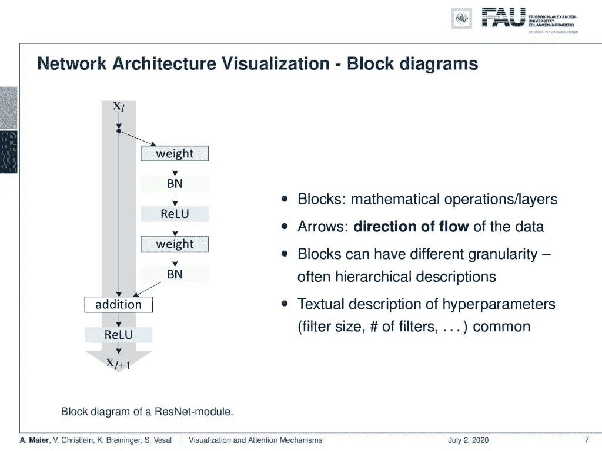

框图。 [CC 下的图片来自](https://creativecommons.org/licenses/by/4.0/)[深度学习讲座](https://www.youtube.com/watch?v=p-_Stl0t3kU&list=PLpOGQvPCDQzvgpD3S0vTy7bJe2pf_yJFj&index=1)的 4.0 。

如果你想要更大的结构，那么我们使用框图。在那里，我们有固体块。尽管实际上所有的神经元都是相互连接的，但它们通常只共享层间的单个连接。我们已经看到了很多这样的可视化。这里你可以看到框图的可视化。这里，块是一个数学运算或层。那么，你也有箭。它们显示了数据流，并且块可以具有不同的粒度。通常，他们使用分层描述。您甚至可能想要将它与前面类型的图结合使用，以便确保哪个块执行什么样的操作。当然，您需要对超参数进行文本描述。过滤器尺寸。和过滤器的数量。这通常是在标题中完成的，或者你添加一些小数字，比如实际使用了哪些过滤器，或者使用了多少激活和特征映射。

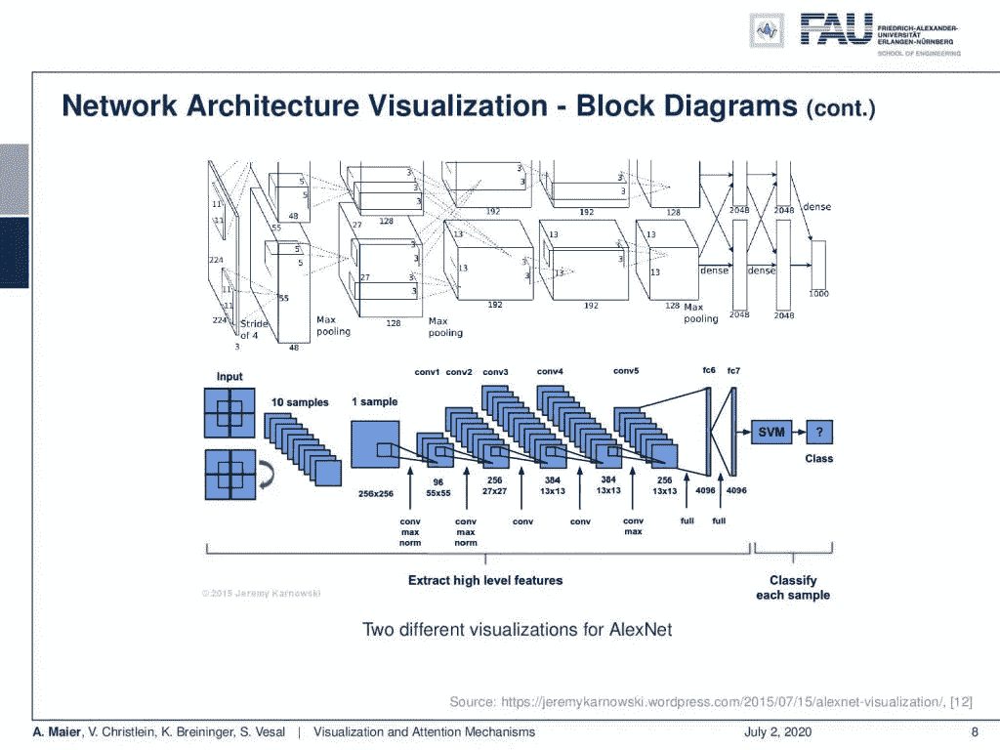

AlexNet 的两种不同的可视化。 [CC 下的图片来自](https://creativecommons.org/licenses/by/4.0/)[深度学习讲座](https://www.youtube.com/watch?v=p-_Stl0t3kU&list=PLpOGQvPCDQzvgpD3S0vTy7bJe2pf_yJFj&index=1)的 4.0 。

我们可以看到，根据你想展示的内容，有各种各样的可视化效果。这是 AlexNet 的两个可视化。最上面的一个实际上来自原始出版物，它强调了它被分成两部分，因为它运行在两个 GPU 上。然后，顶部显示的两个分支之间的连接突出显示了两个 GPU 之间的交互。现在，底层可视化更侧重于卷积神经网络结构以及汇集和卷积层。最后，您会看到连接到 SVM 分类器的完全连接的层。因此，这里更多的是关注建筑的概念，而两幅图像实际上显示的是相同的建筑。

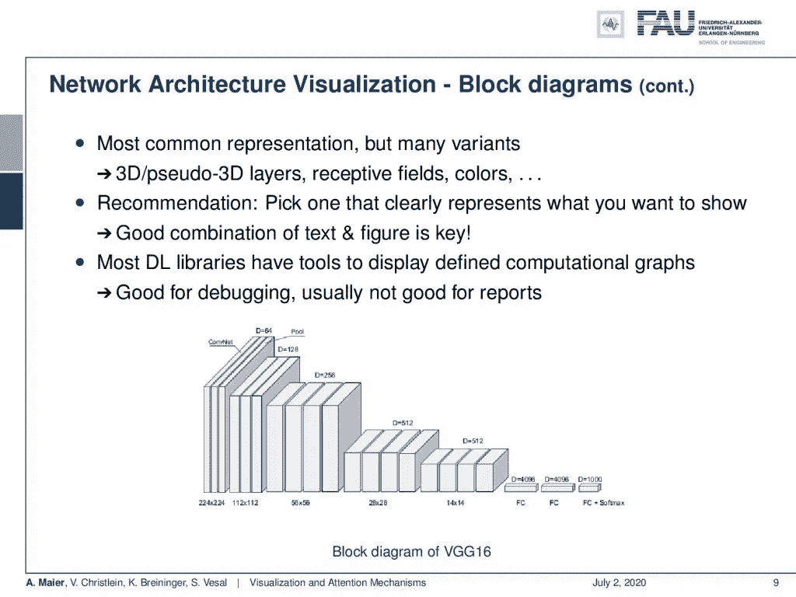

VGG 通常使用 3D 形状显示。来自[深度学习讲座](https://www.youtube.com/watch?v=p-_Stl0t3kU&list=PLpOGQvPCDQzvgpD3S0vTy7bJe2pf_yJFj&index=1)的 [CC BY 4.0](https://creativecommons.org/licenses/by/4.0/) 下的图片。

您已经看到了还有块变体。所以你可以在这里看到 VGG 的形象化，作者想要展示他们在特殊维度上的减少，同时在解释维度上的增加。所以在这里，只有三维块或立方体被用于可视化。在这里，它们传达了你想要从空间维度转换到解释领域的想法。有很多很多不同的方式来形象化事物。你应该选择一个在你看来能显示重要效果的。然后，你添加一个好的纹理描述。关键在于文字和图形的结合，这样别人才能理解你的想法。当然，库也有显示实际实现的图形结构的工具。一般来说，他们不太适合向他人传达信息。许多细节丢失，或者有时粒度级别太高，无法显示整个网络。因此，这对于调试来说通常是好的，但是对于报告或者传达你的架构的想法来说就不那么好了。

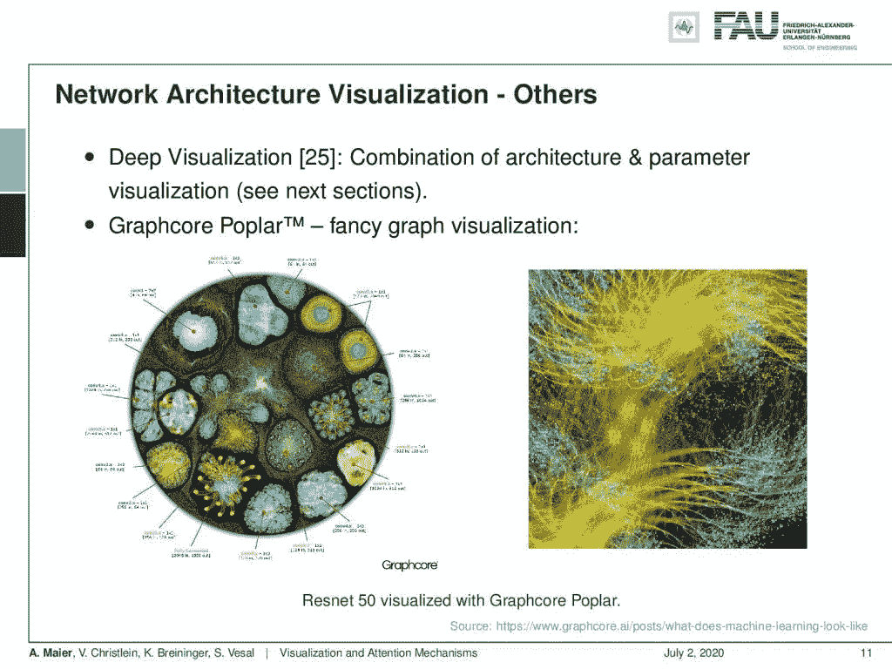

Graphcore 杨属于“其他可视化方法”一类。 [CC 下的图片来自](https://creativecommons.org/licenses/by/4.0/)[深度学习讲座](https://www.youtube.com/watch?v=p-_Stl0t3kU&list=PLpOGQvPCDQzvgpD3S0vTy7bJe2pf_yJFj&index=1)的 4.0 。

当然，还有其他的可视化策略。在这里，我们只是简单地概述一下可以做些什么。像 Graphcore Poplar 这样的东西有这种奇特的图形可视化。你可以看到这是一个架构的代表，但如果你试图在这个可视化之后实现它，它就没有那么有用了，看着它并试图理解网络的哪个部分连接到哪个部分是一件有趣的事情。你可以清楚地看到，这些层可以在这里确定。因此，不同的层和层的配置形成不同的形状。一般来说，看着这张图片，很难说好哇，这是一个 ResNet-50。我更喜欢 ResNet-50 的不同可视化，以便弄清楚这里发生了什么。

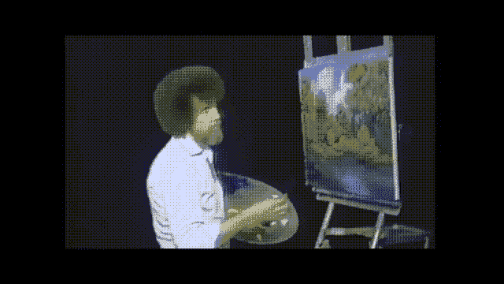

“…我知道这看起来像是我们在摧毁一切。别担心。我们不会犯错。我们有快乐的意外。”——鲍勃·罗斯。用[自动博客](http://peaks.informatik.uni-erlangen.de/autoblog/movie2gif.html)创建的 GIF。来源: [YouTube](https://youtu.be/_Tq5vXk0wTk)

好了，让我们继续谈一谈培训的可视化。这也非常重要，因为它包含许多有趣的信息，如输入数据图像、文本、参数、权重、偏差、隐藏图层数据或输出数据。

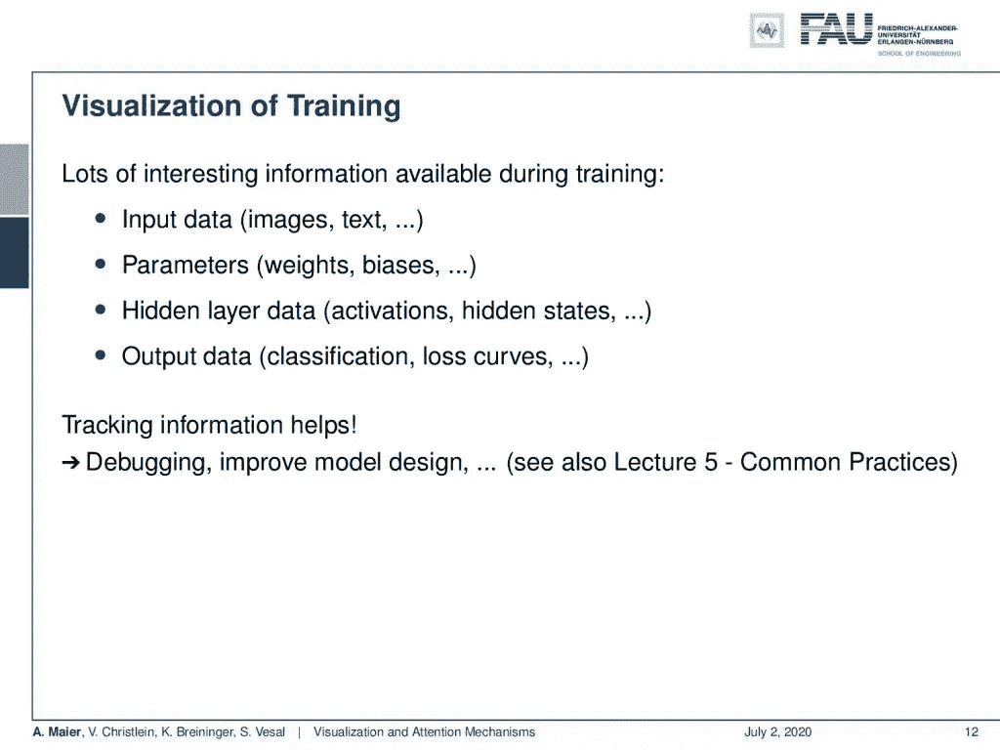

培训过程也可以可视化。 [CC 下的图片来自](https://creativecommons.org/licenses/by/4.0/)[深度学习讲座](https://www.youtube.com/watch?v=p-_Stl0t3kU&list=PLpOGQvPCDQzvgpD3S0vTy7bJe2pf_yJFj&index=1)的 4.0 。

当然，你想以某种方式跟踪训练过程中发生的事情。因此，这种跟踪特别有助于调试和改进模型设计。我们已经在关于[惯例](/common-practices-part-1-6a7c1b2eb6d4)的系列讲座视频中谈到了这些影响。

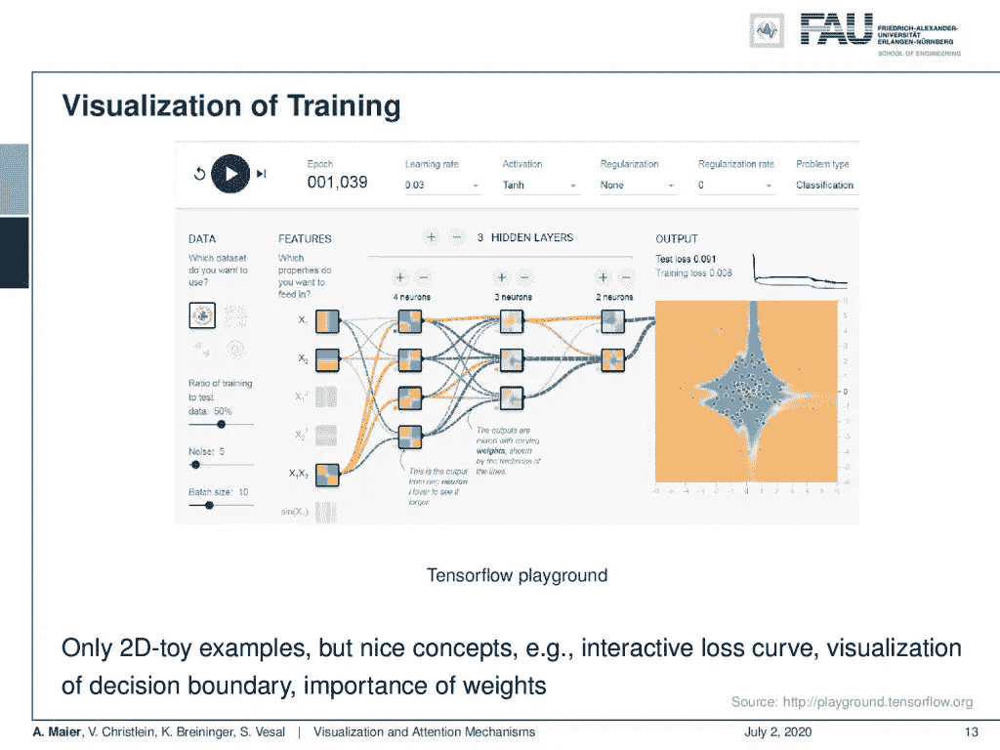

[Tensorflow 游乐场](https://playground.tensorflow.org/#activation=tanh&batchSize=10&dataset=circle&regDataset=reg-plane&learningRate=0.03&regularizationRate=0&noise=0&networkShape=4,2&seed=0.84272&showTestData=false&discretize=false&percTrainData=50&x=true&y=true&xTimesY=false&xSquared=false&ySquared=false&cosX=false&sinX=false&cosY=false&sinY=false&collectStats=false&problem=classification&initZero=false&hideText=false)就是一个玩具的例子。 [CC 下的图片来自](https://creativecommons.org/licenses/by/4.0/)[深度学习讲座](https://www.youtube.com/watch?v=p-_Stl0t3kU&list=PLpOGQvPCDQzvgpD3S0vTy7bJe2pf_yJFj&index=1)的 4.0 。

所以，这是一个非常好的可视化训练，展示在 [Tensorflow 操场](https://playground.tensorflow.org/#activation=tanh&batchSize=10&dataset=circle&regDataset=reg-plane&learningRate=0.03&regularizationRate=0&noise=0&networkShape=4,2&seed=0.84272&showTestData=false&discretize=false&percTrainData=50&x=true&y=true&xTimesY=false&xSquared=false&ySquared=false&cosX=false&sinX=false&cosY=false&sinY=false&collectStats=false&problem=classification&initZero=false&hideText=false)上。这是一个非常有趣的工具，因为在这里你不仅可以可视化连接，还可以根据输入空间可视化 2-D 输入的激活。如果你回到最初的视频，你[会看到我们实际上使用了类似的表达方式，比如当我们谈论树形结构的时候](/lecture-notes-in-deep-learning-feedforward-networks-part-1-e74db01e54a8)。在这里，你可以看到在训练迭代中，不同层中的表示是如何变化的。他们通过在输入空间中由各自的激活函数产生的分割的可视化来实现。所以，你可以看到使用全连接层和 sigmoid 激活函数的第一层。它们本质上生成输入空间的二进制分区。然后，您在层上组合层。你可以看到输入空间的这些不同部分是如何被组合起来形成一个更复杂的形状，就像你在右边看到的。这通常仅限于 2-D 玩具示例，但是理解概念并真正理解培训过程中发生的事情是非常好的。您可以运行几次迭代。你可以加速、减速、停止训练过程，然后看看在训练的不同步骤中发生了什么。所以，这很好。

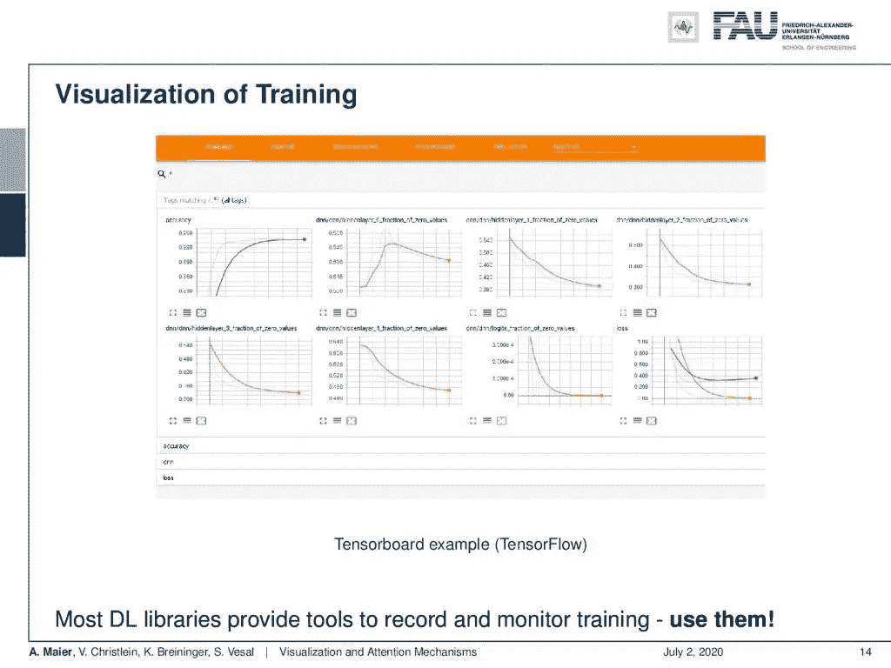

Tensorboard 是监督训练跑步的标准工具。来自[深度学习讲座](https://www.youtube.com/watch?v=p-_Stl0t3kU&list=PLpOGQvPCDQzvgpD3S0vTy7bJe2pf_yJFj&index=1)的 [CC BY 4.0](https://creativecommons.org/licenses/by/4.0/) 下的图片。

但是如果你真的想研究大问题，那么 Tensorboard 之类的东西真的很有用。在这里，您可以监控训练过程中的实际进度。这绝对是你在训练大型网络时应该使用的东西。在这里，您可以看到损失在训练中的表现，验证损失是如何变化的，等等。你可以在整个训练过程中想象这一点，你真的可以利用这一点来看看是否有收敛或检测你的训练过程中是否有什么问题。如果你已经跑了 100 圈，而你的损失没有发生，或者如果你有一个爆炸梯度之类的东西，你会立即在 Tensorboard 的可视化中看到。

在这个深度学习讲座中，更多令人兴奋的事情即将到来。 [CC 下的图片来自](https://creativecommons.org/licenses/by/4.0/)[深度学习讲座](https://www.youtube.com/watch?v=p-_Stl0t3kU&list=PLpOGQvPCDQzvgpD3S0vTy7bJe2pf_yJFj&index=1)的 4.0 。

好吧。现在，我们已经讨论了几种不同的可视化，特别是架构和培训过程。实际上，我们一直在用这个。尽管如此，我认为你应该意识到你想象事物的方式。如果你想把你的想法传达给其他人，这是非常重要的。我们将在下一个视频中谈论的实际上是可视化网络的内部工作。因此，我们将研究如何弄清楚网络内部发生了什么的技术。这些实际上是非常有趣的技术，对于调试和试图理解网络中发生的事情也非常有用。我们将在第一个视频中开始一个简短的动机和一些你应该知道的深度神经网络的弱点。非常感谢大家的收听，下期视频再见。拜拜。

如果你喜欢这篇文章，你可以在这里找到更多的文章，或者看看我们的讲座。如果你想在未来了解更多的文章、视频和研究，我也会很感激关注 [YouTube](https://www.youtube.com/c/AndreasMaierTV) 、 [Twitter](https://twitter.com/maier_ak) 、[脸书](https://www.facebook.com/andreas.maier.31337)或 [LinkedIn](https://www.linkedin.com/in/andreas-maier-a6870b1a6/) 。本文以 [Creative Commons 4.0 归属许可](https://creativecommons.org/licenses/by/4.0/deed.de)发布，如果引用，可以转载和修改。如果你有兴趣从视频讲座中获得文字记录，试试[自动博客](http://peaks.informatik.uni-erlangen.de/autoblog/)。

# 链接

[约辛斯基等人:深度可视化工具箱](http://yosinski.com/deepvis)
[奥拉等人:特征可视化](https://distill.pub/2017/feature-visualization/)
[亚当哈雷:MNIST 演示](http://scs.ryerson.ca/~aharley/vis/conv/)

# 参考

[1] Dzmitry Bahdanau, Kyunghyun Cho, and Yoshua Bengio. “Neural Machine Translation by Jointly Learning to Align and Translate”. In: 3rd International Conference on Learning Representations, ICLR 2015, San Diego, 2015.
[2] T. B. Brown, D. Mané, A. Roy, et al. “Adversarial Patch”. In: ArXiv e-prints (Dec. 2017). arXiv: 1712.09665 [cs.CV].
[3] Jianpeng Cheng, Li Dong, and Mirella Lapata. “Long Short-Term Memory-Networks for Machine Reading”. In: CoRR abs/1601.06733 (2016). arXiv: 1601.06733.
[4] Jacob Devlin, Ming-Wei Chang, Kenton Lee, et al. “BERT: Pre-training of Deep Bidirectional Transformers for Language Understanding”. In: CoRR abs/1810.04805 (2018). arXiv: 1810.04805.
[5] Neil Frazer. Neural Network Follies. 1998\. URL: [https://neil.fraser.name/writing/tank/](https://neil.fraser.name/writing/tank/) (visited on 01/07/2018).
[6] Ross B. Girshick, Jeff Donahue, Trevor Darrell, et al. “Rich feature hierarchies for accurate object detection and semantic segmentation”. In: CoRR abs/1311.2524 (2013). arXiv: 1311.2524.
[7] Alex Graves, Greg Wayne, and Ivo Danihelka. “Neural Turing Machines”. In: CoRR abs/1410.5401 (2014). arXiv: 1410.5401.
[8] Karol Gregor, Ivo Danihelka, Alex Graves, et al. “DRAW: A Recurrent Neural Network For Image Generation”. In: Proceedings of the 32nd International Conference on Machine Learning. Vol. 37\. Proceedings of Machine Learning Research. Lille, France: PMLR, July 2015, pp. 1462–1471.
[9] Nal Kalchbrenner, Lasse Espeholt, Karen Simonyan, et al. “Neural Machine Translation in Linear Time”. In: CoRR abs/1610.10099 (2016). arXiv: 1610.10099.
[10] L. N. Kanal and N. C. Randall. “Recognition System Design by Statistical Analysis”. In: Proceedings of the 1964 19th ACM National Conference. ACM ’64\. New York, NY, USA: ACM, 1964, pp. 42.501–42.5020.
[11] Andrej Karpathy. t-SNE visualization of CNN codes. URL: [http://cs.stanford.edu/people/karpathy/cnnembed/](http://cs.stanford.edu/people/karpathy/cnnembed/) (visited on 01/07/2018).
[12] Alex Krizhevsky, Ilya Sutskever, and Geoffrey E Hinton. “ImageNet Classification with Deep Convolutional Neural Networks”. In: Advances In Neural Information Processing Systems 25\. Curran Associates, Inc., 2012, pp. 1097–1105\. arXiv: 1102.0183.
[13] Thang Luong, Hieu Pham, and Christopher D. Manning. “Effective Approaches to Attention-based Neural Machine Translation”. In: Proceedings of the 2015 Conference on Empirical Methods in Natural Language Lisbon, Portugal: Association for Computational Linguistics, Sept. 2015, pp. 1412–1421.
[14] A. Mahendran and A. Vedaldi. “Understanding deep image representations by inverting them”. In: 2015 IEEE Conference on Computer Vision and Pattern Recognition (CVPR). June 2015, pp. 5188–5196.
[15] Andreas Maier, Stefan Wenhardt, Tino Haderlein, et al. “A Microphone-independent Visualization Technique for Speech Disorders”. In: Proceedings of the 10th Annual Conference of the International Speech Communication Brighton, England, 2009, pp. 951–954.
[16] Volodymyr Mnih, Nicolas Heess, Alex Graves, et al. “Recurrent Models of Visual Attention”. In: CoRR abs/1406.6247 (2014). arXiv: 1406.6247.
[17] Chris Olah, Alexander Mordvintsev, and Ludwig Schubert. “Feature Visualization”. In: Distill (2017). [https://distill.pub/2017/feature-visualization.](https://distill.pub/2017/feature-visualization.)
[18] Prajit Ramachandran, Niki Parmar, Ashish Vaswani, et al. “Stand-Alone Self-Attention in Vision Models”. In: arXiv e-prints, arXiv:1906.05909 (June 2019), arXiv:1906.05909\. arXiv: 1906.05909 [cs.CV].
[19] Mahmood Sharif, Sruti Bhagavatula, Lujo Bauer, et al. “Accessorize to a Crime: Real and Stealthy Attacks on State-of-the-Art Face Recognition”. In: Proceedings of the 2016 ACM SIGSAC Conference on Computer and Communications CCS ’16\. Vienna, Austria: ACM, 2016, pp. 1528–1540\. A.
[20] K. Simonyan, A. Vedaldi, and A. Zisserman. “Deep Inside Convolutional Networks: Visualising Image Classification Models and Saliency Maps”. In: International Conference on Learning Representations (ICLR) (workshop track). 2014.
[21] J.T. Springenberg, A. Dosovitskiy, T. Brox, et al. “Striving for Simplicity: The All Convolutional Net”. In: International Conference on Learning Representations (ICRL) (workshop track). 2015.
[22] Dmitry Ulyanov, Andrea Vedaldi, and Victor S. Lempitsky. “Deep Image Prior”. In: CoRR abs/1711.10925 (2017). arXiv: 1711.10925.
[23] Ashish Vaswani, Noam Shazeer, Niki Parmar, et al. “Attention Is All You Need”. In: CoRR abs/1706.03762 (2017). arXiv: 1706.03762.
[24] Kelvin Xu, Jimmy Ba, Ryan Kiros, et al. “Show, Attend and Tell: Neural Image Caption Generation with Visual Attention”. In: CoRR abs/1502.03044 (2015). arXiv: 1502.03044.
[25] Jason Yosinski, Jeff Clune, Anh Mai Nguyen, et al. “Understanding Neural Networks Through Deep Visualization”. In: CoRR abs/1506.06579 (2015). arXiv: 1506.06579.
[26] Matthew D. Zeiler and Rob Fergus. “Visualizing and Understanding Convolutional Networks”. In: Computer Vision — ECCV 2014: 13th European Conference, Zurich, Switzerland, Cham: Springer International Publishing, 2014, pp. 818–833.
[27] Han Zhang, Ian Goodfellow, Dimitris Metaxas, et al. “Self-Attention Generative Adversarial Networks”. In: Proceedings of the 36th International Conference on Machine Learning. Vol. 97\. Proceedings of Machine Learning Research. Long Beach, California, USA: PMLR, Sept. 2019, pp. 7354–7363\. A.