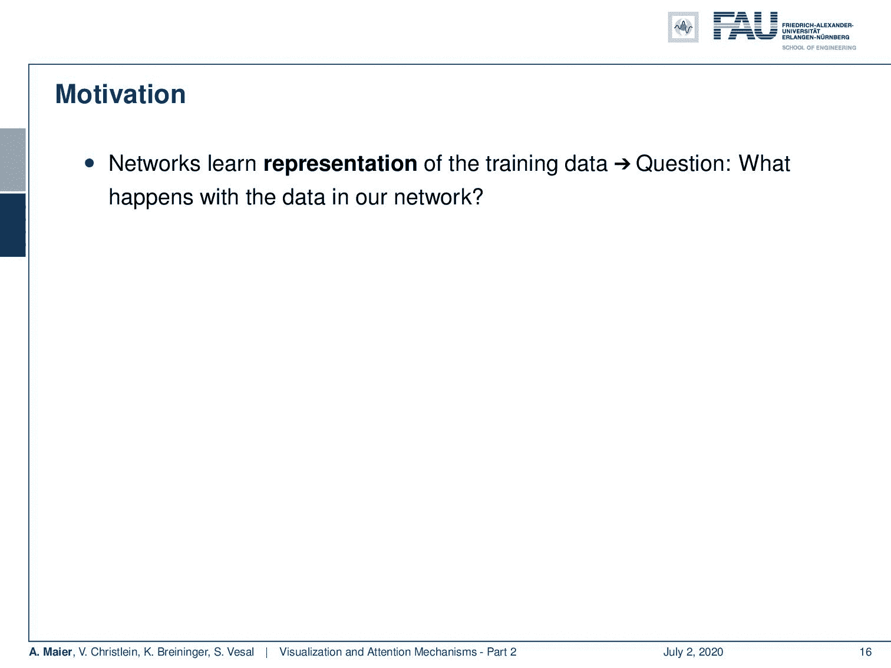
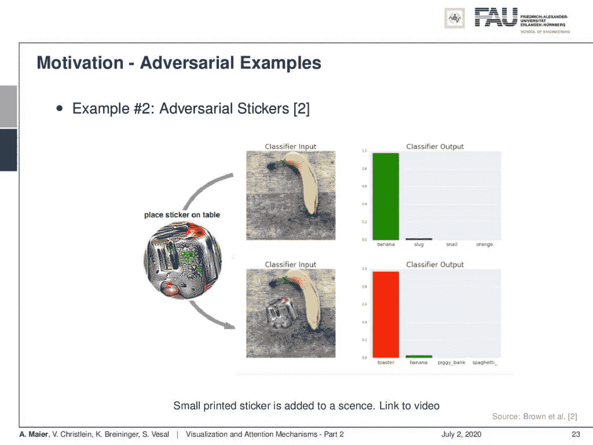
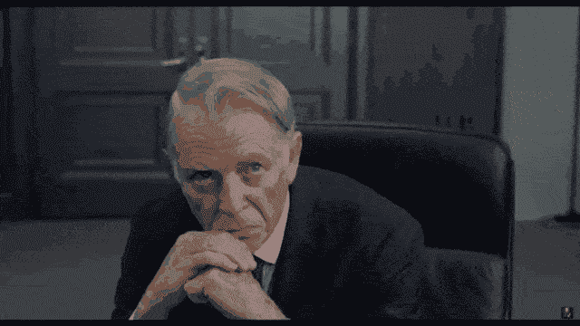

# 视觉化和注意力——第二部分

> 原文：<https://towardsdatascience.com/visualization-attention-part-2-4b1dd17b9269?source=collection_archive---------39----------------------->

## [FAU 讲座笔记](https://towardsdatascience.com/tagged/fau-lecture-notes)关于深度学习

## 混淆者和敌对攻击

FAU 大学的深度学习。下图 [CC BY 4.0](https://creativecommons.org/licenses/by/4.0/) 来自[深度学习讲座](https://www.youtube.com/watch?v=p-_Stl0t3kU&list=PLpOGQvPCDQzvgpD3S0vTy7bJe2pf_yJFj&index=1)

**这些是 FAU 的 YouTube 讲座** [**深度学习**](https://www.youtube.com/watch?v=p-_Stl0t3kU&list=PLpOGQvPCDQzvgpD3S0vTy7bJe2pf_yJFj&index=1) **的讲义。这是与幻灯片匹配的讲座视频&的完整抄本。我们希望，你喜欢这个视频一样多。当然，这份抄本是用深度学习技术在很大程度上自动创建的，只进行了少量的手动修改。** [**自己试试吧！如果您发现错误，请告诉我们！**](http://peaks.informatik.uni-erlangen.de/autoblog/)

# 航行

[**上一讲**](/visualization-attention-part-1-a16667295007) **/** [**观看本视频**](https://youtu.be/Jb4SC7Wkfa4) **/** [**顶级**](/all-you-want-to-know-about-deep-learning-8d68dcffc258) **/** [**下一讲**](/visualization-attention-part-3-84a43958e48b)

所以欢迎回到深度学习！今天，我想谈谈更多的可视化技术。但实际上，我想在接下来的几分钟里开始激发我们为什么需要可视化技术。

自主武器系统和黑匣子系统——可能会出什么问题？"各位主管，我很高兴向你们介绍执法的未来:ED 209！"。使用 [gifify](https://github.com/vvo/gifify) 创建的图像。来源: [YouTube](https://youtu.be/ZFvqDaFpXeM) (工作不安全！).

好了，我们开始吧。视觉化和注意力机制——第二部分。参数的可视化和第一件事是动机。因此，网络学习训练数据的表示，但问题当然是在我们的网络中数据发生了什么。

我们需要可视化的一些原因。 [CC 下的图片来自](https://creativecommons.org/licenses/by/4.0/)[深度学习讲座](https://www.youtube.com/watch?v=p-_Stl0t3kU&list=PLpOGQvPCDQzvgpD3S0vTy7bJe2pf_yJFj&index=1)的 4.0 。

这真的是一件很重要的事情，你真的应该关心它，因为它对调查无意和意外的行为非常有用。我在这里真正想强调的一点是对立的例子。当然，您想弄清楚为什么您的网络在实验室中表现得非常好，但在野外却失败了。所以，这也是你想要解决的一个重要问题。然后，您可以找出这种情况的潜在原因，因为如果您研究这些可视化技术，它们将帮助您识别错误类型的特征、噪声属性等。因此，我们将在接下来的视频中举几个例子。我想给你看一些轶事的例子。

“执法 Doid 系列 209 (ED 209)是一款自给自足的执法机器人。”。使用 [gifify](https://github.com/vvo/gifify) 创建的图像。来源: [YouTube](https://youtu.be/ZFvqDaFpXeM) (工作不安全！).

例如照片中坦克的识别。这实际上是一个来自谷歌开发者尼尔·弗雷泽网站的例子。我不完全确定这是真的发生了还是只是一个都市传说。所以传说是这样的:人们和五角大楼想训练一个神经网络来识别图像上的坦克。为了构建这样一个网络，你能做些什么？嗯，你去那里，然后你拍摄坦克的图像，然后你拍摄非坦克情况的图像。嗯，通常你会希望他们出现在某些场景中。所以，你去森林里拍些照片。然后，当然，你得弄几张坦克的照片。你通常在战场上看到的坦克，你知道周围有烟、泥、脏和砂砾。所以，你收集你的坦克图像，然后你可能有 200 个森林图像和 200 个坦克图像。你会回到你的实验室，然后你训练你的深度神经网络，或者如果你只有这个非常小的数据集，可能就没那么深了。你继续下去，你会得到一个几乎完美的分类率。所以，每个人都很高兴看起来你的系统运行得很好，

我们能探测到这样的坦克吗？ [CC 下的图片来自](https://creativecommons.org/licenses/by/4.0/)[深度学习讲座](https://www.youtube.com/watch?v=p-_Stl0t3kU&list=PLpOGQvPCDQzvgpD3S0vTy7bJe2pf_yJFj&index=1)的 4.0 。

这张幻灯片上有两个例子，你说“耶！我已经解决问题了！”所以，让我们建立一个真正的系统，它会警告我们有坦克。他们建立了这个系统，并意识到它在实践中根本不起作用。在这个两类问题中，他们实际上有大约 50%的识别率。这意味着这是近似随机猜测。那么，可能出了什么问题呢？如果你看这些照片，你会发现所有的森林照片基本上都是在阳光明媚的好天气拍摄的。当然，你会看到坦克是在阴天拍摄的。你知道天气条件不太好。当然，当你看到坦克时，他们会开火，周围有手榴弹，当然，这意味着会有烟雾和其他事情发生。

“ED 209 目前是为城市和平而设计的。但这仅仅是开始。在底特律老城成功服役后，我们可以预计 ED 209 将成为未来十年的热门军用产品。”使用 [gifify](https://github.com/vvo/gifify) 创建的图像。来源: [YouTube](https://youtu.be/ZFvqDaFpXeM) (工作不安全！).

所以，系统本质上学习的不是识别坦克，而是走了捷径。在这里，捷径是你尝试检测天气。因此，如果你有一个蓝天，良好的天气条件，图像中的噪声很少，那么它可能是一个非坦克图像。如果你有噪音和糟糕的照明条件，那么它可能是一个坦克图像。显然，这种分类系统对于检测坦克的任务来说，一点帮助都没有。因此，我们可以总结为网络简单地学习了数据具有相关的特征。这通常被称为混杂因素。它没有标明坦克的名称。因此，这里重要的教训是:这不是学习算法的错误，而是数据的错误。所以，当你出去收集数据时，你应该非常小心，确保你有未来应用的代表性数据。

两种疾病还是两个麦克风？ [CC 下的图片来自](https://creativecommons.org/licenses/by/4.0/)[深度学习讲座](https://www.youtube.com/watch?v=p-_Stl0t3kU&list=PLpOGQvPCDQzvgpD3S0vTy7bJe2pf_yJFj&index=1)的 4.0 。

我这里还有一个混杂因素的例子。你在这个图像中看到的是语音记录。这是一个维度标度。所以，我们在这里尝试做的是将不同的说话者映射到一个二维空间。我们将整个记录映射到一个点上。你应该看到的是 51 个点，每个人一个点。你可以看到我们有黑点和方块。现在，已经用麦克风 1 记录了正方形，用麦克风 2 记录了圆点。这些是完全相同的扬声器，甚至更糟:这些甚至是同时录制的实例，但使用了两个不同的麦克风。一个麦克风非常靠近发言者的嘴，另一个麦克风位于离发言者大约 2.5 米远的摄像机上。在这里，您可以看到麦克风特性是一个明显的混淆因素，您可以非常容易地将两组扬声器区分开来，尽管从麦克风来看，它们是完全相同的扬声器。

“麦克纳马拉博士”——“我们需要一个逮捕对象。”——“金内先生。”——“是的，先生！”——“请你去帮我们一下好吗？”“是的，先生！”使用 [gifify](https://github.com/vvo/gifify) 创建的图像。来源: [YouTube](https://youtu.be/ZFvqDaFpXeM) (工作不安全！).

现在，想象你做一些类似的事情来检测病理。你用一个话筒收集所有有病变的扬声器，用另一个话筒收集所有无病变的扬声器。那么很可能你的系统会学习识别不同的麦克风，而不是病理。当然，这不仅仅是麦克风的情况。考虑使用两种不同的扫描仪来创建医学图像，如扫描组织病理学。你有不同类型的病理，你用不同的扫描仪扫描每一种类型。也许他们只是位于两个不同的医院，因为患有疾病 A 的患者去医院 A，而患有疾病 B 的患者去医院 B。然后，这里有一个巨大的混杂因素，因为所有患有疾病 A 的患者都已被扫描仪 A 扫描过，而所有对照组或患有疾病 B 的患者都已被扫描仪 B 扫描过。因此，同样有可能的是，您将学会区分扫描仪，例如通过识别特征噪声模式而不是识别疾病。

“金内先生将帮助我们模拟一个典型的逮捕和解除武装程序。金内先生，用你的枪威胁我。”使用 [gifify](https://github.com/vvo/gifify) 创建的图像。来源: [YouTube](https://youtu.be/ZFvqDaFpXeM) (工作不安全！).

相机也是如此。您甚至可以证明，在图像取证中，如果您使用同一台数码相机拍摄图像，那么仅通过像素中的特定噪声模式，您就可以[识别特定的相机](https://engineering.purdue.edu/~prints/SURF/SURFpaperKatieBouman.pdf)。这些当然是局部的东西，很容易被深度神经网络提取出来。特别是在早期层，所以收集数据时要非常小心。你需要从多个不同的地点收集数据，确保你有代表性的数据。想象一下，你为新冠肺炎训练一个分类器，新冠肺炎患者的所有扫描都来自一个特定的区域，所有阳性样本都是用一组 3-4 个扫描仪采集的。然后你将其与非新冠肺炎患者进行比较，如果他们是在不同的扫描仪甚至不同的网站上获得的，你可能非常非常容易地引入对这些扫描仪的识别，而不是对疾病的识别。

正规化也可以解决混杂因素。来自[深度学习讲座](https://www.youtube.com/watch?v=p-_Stl0t3kU&list=PLpOGQvPCDQzvgpD3S0vTy7bJe2pf_yJFj&index=1)的 [CC BY 4.0](https://creativecommons.org/licenses/by/4.0/) 下的图片。

所以要非常小心，看看数据，试着理解是否有混杂因素的风险。当然，尽量省略。我们已经提出了一种技术来对抗混杂因素，这就是我们在[15]中所做的。在这里，想法是你积极地包括关于混杂因素的信息，并试图抑制它，在这里，为了视觉化。然后，你可以证明你确实可以消除麦克风等引入的偏置。因此，你必须意识到混淆因素，可能是传感器、照明条件、年龄、参与者的性别、温度——是的，甚至温度也可能对感觉机制产生影响。

“指向 ED 209。”“是的，先生！”使用 [gifify](https://github.com/vvo/gifify) 创建的图像。来源: [YouTube](https://youtu.be/ZFvqDaFpXeM) (工作不安全！).

所以要小心。所有这些情况都可能是混杂的，如果数据中有混杂因素，你必须对它们进行补偿，或者在数据收集中尽量避免它们。所以，请注意这些问题，它们很可能会破坏你的整个分类系统。不仔细看数据，永远搞不清问题出在哪里。

对立的例子对于人眼是不可见的，但是可能影响机器系统的分类。 [CC 下的图片来自](https://creativecommons.org/licenses/by/4.0/)[深度学习讲座](https://www.youtube.com/watch?v=p-_Stl0t3kU&list=PLpOGQvPCDQzvgpD3S0vTy7bJe2pf_yJFj&index=1)的 4.0 。

你在机器学习和深度学习系统中遇到的另一个大问题是对立例子的问题。然后，你有不直观的行为。我们在这里给你看两张图片。对于左边的图像，我们的神经网络以 57%的置信度认为这是一只熊猫。在右边这张我们看起来几乎一样的图片上，有 99.3%的把握这是一只长臂猿。这怎么可能是真的呢？这两个输入看起来几乎一样。

对抗性攻击产生专门设计的噪声模式来欺骗分类器。图片来源: [arXiv](https://arxiv.org/abs/1412.6572) 。

右图显示有人攻击了神经网络。他们在图像上引入了一种噪声模式，在每个颜色通道中只有一两个灰度值，但这种噪声模式是用深度神经网络的知识构建的。他们所做的基本上是通过引入类似随机的输入来最大限度地增加给定类别的输出。实际上，如果你了解整个网络，你可以设计这种额外的噪声模式，使错误类别的激励最大化。对于人类来说，这是绝对不可识别的。

对抗性攻击也可以使病变在医学图像中消失。来源:[模式识别实验室](https://www5.informatik.uni-erlangen.de/Forschung/Publikationen/2018/Huang18-SIO.pdf)。

其工作方式是，它在每个像素的小输入的不同层上累加，但在不同层上平均并累加。它允许我们引入一个小偏移，然后各层上的小偏移可以增加，从而实际上迫使网络做出错误的决策。所以，你可以说这个对立的例子是网络中的一种缺陷。当然，我们希望防止这种敌对的例子。实际上，我们会看到这是不可能的，因为它们是通过优化创建的。你总是会以对立的例子结束。

视错觉愚弄了人类的认知。 [CC 下的图片来自](https://creativecommons.org/licenses/by/4.0/)[深度学习讲座](https://www.youtube.com/watch?v=p-_Stl0t3kU&list=PLpOGQvPCDQzvgpD3S0vTy7bJe2pf_yJFj&index=1)的 4.0 。

那么，为什么会这样呢？我们可以说，对立的例子有点像视错觉。同样，人类的感知也不是完美无缺的。在左手边，你可以看到埃舍尔的瀑布。如果你沿着这个结构走，你会看到瀑布在滋养这个结构本身，它本质上是一个无限循环。在这里，视错觉是，如果我们观察单个部分，我们会发现它们是一致的，但当然，整个图像并不一致。尽管如此，我们看着这些零件，发现它们似乎是可信的。一个稍微好一点的对立例子可能是右边的图像。这实际上是尼普顿在意大利的洞穴。人们称这些石头形成的影子为“风琴演奏者”。如果你仔细看这个影子，它看起来像是有一个人坐在那里，像一个管风琴演奏者一样演奏着石头。因此，人类也存在视错觉，而对立的例子在深层神经网络中本质上是等价的。

攻击人脸识别系统的一个例子。 [CC 下的图片来自](https://creativecommons.org/licenses/by/4.0/)[深度学习讲座](https://www.youtube.com/watch?v=p-_Stl0t3kU&list=PLpOGQvPCDQzvgpD3S0vTy7bJe2pf_yJFj&index=1)的 4.0 。

与视错觉相反，我们可以构建这些对立的例子。我已经暗示过了。它们会导致特定的错误，这是另一个例子。这是对你在[19]中发现的最先进的人脸识别技术的攻击。他们所做的是定义了一组像素，本质上是眼镜的形状。这些眼镜现在可以调整了。因此，他们可以分配任意的颜色值，他们选择颜色值的方式会导致错误的识别。你可以展示一下瑞茜·威瑟斯彭的照片，加上这些神奇的眼镜，你会发现它们真的是五颜六色。因此，他们创造了大量的输入，他们特别加强激活，然后导致错误的分类。戴上这副特殊的眼镜，你可以看到瑞茜·威瑟斯彭现在成功地伪装成了拉塞尔·克罗。你可能会说“哇，这完全是胡说八道，这不可能！我还能看到瑞茜·威瑟斯彭！”嗯，是的。你仍然可以看到瑞茜·威瑟斯彭，因为人类的感知系统与这个为身份识别而训练的神经网络的工作方式不同。甚至还有建立在此基础上的作品。他们实际上打印了这些奇特的眼镜，他们还展示了基于摄像头的个人识别系统可以被欺骗来进行这种奇怪的攻击。

烤面包机贴纸。 [CC 下的图片来自](https://creativecommons.org/licenses/by/4.0/)[深度学习讲座](https://www.youtube.com/watch?v=p-_Stl0t3kU&list=PLpOGQvPCDQzvgpD3S0vTy7bJe2pf_yJFj&index=1)的 4.0 。

不止如此。这就是所谓的“烤面包机贴纸”。烤面包机贴纸通常用于误导在 ImageNet 上训练的网络。因此，它的设计是为了导致向“烤面包机”类别的分类。现在，如果你打印这个烤面包机贴纸，在这里，你可以看到，这是一个奇特的彩色图像。你只要把它放到场景中，烤面包机贴纸就会引起“烤面包机”这个类别的分类。它不仅仅在一个特定的架构上工作。他们实际上可以证明它可以在多种架构上工作。这个烤面包机贴纸不仅能骗过一个网络，还能骗过几个在 ImageNet 上接受过训练的网络。因此，在顶部的图像中，您可以看到网络工作正常。它对香蕉进行分类。你加上烤面包机贴纸，它就把烤面包机分类了。有趣的是，报纸甚至有一个附件，你可以下载烤面包机贴纸，自己打印出来，在你自己的 ImageNet 网络上试用。

“请放下你的武器。你有 20 秒的时间来服从。”使用 [gifify](https://github.com/vvo/gifify) 创建的图像。来源: [YouTube](https://youtu.be/ZFvqDaFpXeM) (工作不安全！).

在这个深度学习讲座中，更多令人兴奋的事情即将到来。 [CC 下的图片来自](https://creativecommons.org/licenses/by/4.0/)[深度学习讲座](https://www.youtube.com/watch?v=p-_Stl0t3kU&list=PLpOGQvPCDQzvgpD3S0vTy7bJe2pf_yJFj&index=1)的 4.0 。

好了，这基本上是动机的总结。我们看到有时在深度神经网络中会发生奇怪的事情。我们想知道它们为什么会发生，问题是什么。这可以通过可视化技术来实现。你想识别混杂因素，你想解释为什么我们的网络有效，或者为什么无效，你想增加预测的可信度。

所以下一次，我们将研究不同的可视化技术。我们将从更简单的开始，然后是基于优化和基于梯度的技术。在下一个视频中，我们将只研究基于激活的技术。非常感谢大家的收听，下期视频再见。拜拜。

“我认为你最好照他说的做，金内先生！”使用 [gifify](https://github.com/vvo/gifify) 创建的图像。来源: [YouTube](https://youtu.be/ZFvqDaFpXeM) (工作不安全！).

如果你喜欢这篇文章，你可以在这里找到[更多的文章](https://medium.com/@akmaier)，在这里找到更多关于机器学习的教育材料[，或者看看我们的](https://lme.tf.fau.de/teaching/free-deep-learning-resources/)[深度](https://www.youtube.com/watch?v=p-_Stl0t3kU&list=PLpOGQvPCDQzvgpD3S0vTy7bJe2pf_yJFj) [学习](https://www.youtube.com/watch?v=p-_Stl0t3kU&list=PLpOGQvPCDQzvgpD3S0vTy7bJe2pf_yJFj&index=1) [讲座](https://www.youtube.com/watch?v=p-_Stl0t3kU&list=PLpOGQvPCDQzvgpD3S0vTy7bJe2pf_yJFj)。如果你想在未来了解更多的文章、视频和研究，我也会很感激关注 YouTube、Twitter、脸书、LinkedIn 或 T21。本文以 [Creative Commons 4.0 归属许可](https://creativecommons.org/licenses/by/4.0/deed.de)发布，如果引用，可以转载和修改。如果你有兴趣从视频讲座中生成文字记录，试试[自动博客](http://peaks.informatik.uni-erlangen.de/autoblog/)。

“我很失望，迪克。”-“我确定这只是个小故障。”使用 [gifify](https://github.com/vvo/gifify) 创建的图像。来源: [YouTube](https://youtu.be/ZFvqDaFpXeM) (工作不安全！).

# 链接

[约辛斯基等人:深度可视化工具箱](http://yosinski.com/deepvis)
[奥拉等人:特征可视化](https://distill.pub/2017/feature-visualization/)
[亚当哈雷:MNIST 演示](http://scs.ryerson.ca/~aharley/vis/conv/)

# 参考

[1] Dzmitry Bahdanau, Kyunghyun Cho, and Yoshua Bengio. “Neural Machine Translation by Jointly Learning to Align and Translate”. In: 3rd International Conference on Learning Representations, ICLR 2015, San Diego, 2015.
[2] T. B. Brown, D. Mané, A. Roy, et al. “Adversarial Patch”. In: ArXiv e-prints (Dec. 2017). arXiv: 1712.09665 [cs.CV].
[3] Jianpeng Cheng, Li Dong, and Mirella Lapata. “Long Short-Term Memory-Networks for Machine Reading”. In: CoRR abs/1601.06733 (2016). arXiv: 1601.06733.
[4] Jacob Devlin, Ming-Wei Chang, Kenton Lee, et al. “BERT: Pre-training of Deep Bidirectional Transformers for Language Understanding”. In: CoRR abs/1810.04805 (2018). arXiv: 1810.04805.
[5] Neil Frazer. Neural Network Follies. 1998\. URL: [https://neil.fraser.name/writing/tank/](https://neil.fraser.name/writing/tank/) (visited on 01/07/2018).
[6] Ross B. Girshick, Jeff Donahue, Trevor Darrell, et al. “Rich feature hierarchies for accurate object detection and semantic segmentation”. In: CoRR abs/1311.2524 (2013). arXiv: 1311.2524.
[7] Alex Graves, Greg Wayne, and Ivo Danihelka. “Neural Turing Machines”. In: CoRR abs/1410.5401 (2014). arXiv: 1410.5401.
[8] Karol Gregor, Ivo Danihelka, Alex Graves, et al. “DRAW: A Recurrent Neural Network For Image Generation”. In: Proceedings of the 32nd International Conference on Machine Learning. Vol. 37\. Proceedings of Machine Learning Research. Lille, France: PMLR, July 2015, pp. 1462–1471.
[9] Nal Kalchbrenner, Lasse Espeholt, Karen Simonyan, et al. “Neural Machine Translation in Linear Time”. In: CoRR abs/1610.10099 (2016). arXiv: 1610.10099.
[10] L. N. Kanal and N. C. Randall. “Recognition System Design by Statistical Analysis”. In: Proceedings of the 1964 19th ACM National Conference. ACM ’64\. New York, NY, USA: ACM, 1964, pp. 42.501–42.5020.
[11] Andrej Karpathy. t-SNE visualization of CNN codes. URL: [http://cs.stanford.edu/people/karpathy/cnnembed/](http://cs.stanford.edu/people/karpathy/cnnembed/) (visited on 01/07/2018).
[12] Alex Krizhevsky, Ilya Sutskever, and Geoffrey E Hinton. “ImageNet Classification with Deep Convolutional Neural Networks”. In: Advances In Neural Information Processing Systems 25\. Curran Associates, Inc., 2012, pp. 1097–1105\. arXiv: 1102.0183.
[13] Thang Luong, Hieu Pham, and Christopher D. Manning. “Effective Approaches to Attention-based Neural Machine Translation”. In: Proceedings of the 2015 Conference on Empirical Methods in Natural Language Lisbon, Portugal: Association for Computational Linguistics, Sept. 2015, pp. 1412–1421.
[14] A. Mahendran and A. Vedaldi. “Understanding deep image representations by inverting them”. In: 2015 IEEE Conference on Computer Vision and Pattern Recognition (CVPR). June 2015, pp. 5188–5196.
[15] Andreas Maier, Stefan Wenhardt, Tino Haderlein, et al. “A Microphone-independent Visualization Technique for Speech Disorders”. In: Proceedings of the 10th Annual Conference of the International Speech Communication Brighton, England, 2009, pp. 951–954.
[16] Volodymyr Mnih, Nicolas Heess, Alex Graves, et al. “Recurrent Models of Visual Attention”. In: CoRR abs/1406.6247 (2014). arXiv: 1406.6247.
[17] Chris Olah, Alexander Mordvintsev, and Ludwig Schubert. “Feature Visualization”. In: Distill (2017). [https://distill.pub/2017/feature-visualization.](https://distill.pub/2017/feature-visualization.)
[18] Prajit Ramachandran, Niki Parmar, Ashish Vaswani, et al. “Stand-Alone Self-Attention in Vision Models”. In: arXiv e-prints, arXiv:1906.05909 (June 2019), arXiv:1906.05909\. arXiv: 1906.05909 [cs.CV].
[19] Mahmood Sharif, Sruti Bhagavatula, Lujo Bauer, et al. “Accessorize to a Crime: Real and Stealthy Attacks on State-of-the-Art Face Recognition”. In: Proceedings of the 2016 ACM SIGSAC Conference on Computer and Communications CCS ’16\. Vienna, Austria: ACM, 2016, pp. 1528–1540\. A.
[20] K. Simonyan, A. Vedaldi, and A. Zisserman. “Deep Inside Convolutional Networks: Visualising Image Classification Models and Saliency Maps”. In: International Conference on Learning Representations (ICLR) (workshop track). 2014.
[21] J.T. Springenberg, A. Dosovitskiy, T. Brox, et al. “Striving for Simplicity: The All Convolutional Net”. In: International Conference on Learning Representations (ICRL) (workshop track). 2015.
[22] Dmitry Ulyanov, Andrea Vedaldi, and Victor S. Lempitsky. “Deep Image Prior”. In: CoRR abs/1711.10925 (2017). arXiv: 1711.10925.
[23] Ashish Vaswani, Noam Shazeer, Niki Parmar, et al. “Attention Is All You Need”. In: CoRR abs/1706.03762 (2017). arXiv: 1706.03762.
[24] Kelvin Xu, Jimmy Ba, Ryan Kiros, et al. “Show, Attend and Tell: Neural Image Caption Generation with Visual Attention”. In: CoRR abs/1502.03044 (2015). arXiv: 1502.03044.
[25] Jason Yosinski, Jeff Clune, Anh Mai Nguyen, et al. “Understanding Neural Networks Through Deep Visualization”. In: CoRR abs/1506.06579 (2015). arXiv: 1506.06579.
[26] Matthew D. Zeiler and Rob Fergus. “Visualizing and Understanding Convolutional Networks”. In: Computer Vision — ECCV 2014: 13th European Conference, Zurich, Switzerland, Cham: Springer International Publishing, 2014, pp. 818–833.
[27] Han Zhang, Ian Goodfellow, Dimitris Metaxas, et al. “Self-Attention Generative Adversarial Networks”. In: Proceedings of the 36th International Conference on Machine Learning. Vol. 97\. Proceedings of Machine Learning Research. Long Beach, California, USA: PMLR, Sept. 2019, pp. 7354–7363\. A.