# 视觉化和注意力——第三部分

> 原文：<https://towardsdatascience.com/visualization-attention-part-3-84a43958e48b?source=collection_archive---------48----------------------->

## [FAU 讲座笔记](https://towardsdatascience.com/tagged/fau-lecture-notes)关于深度学习

## 直接可视化方法

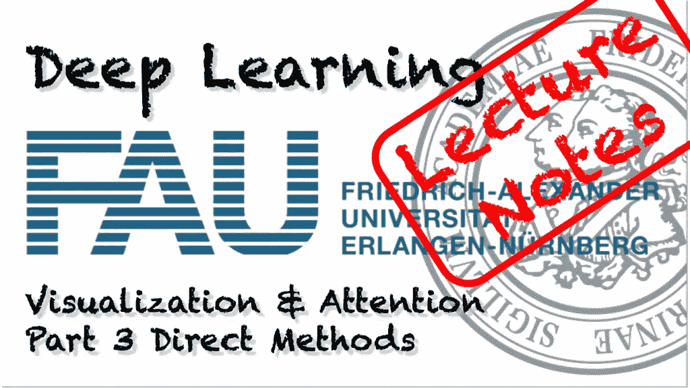

FAU 大学的深度学习。下图 [CC BY 4.0](https://creativecommons.org/licenses/by/4.0/) 来自[深度学习讲座](https://www.youtube.com/watch?v=p-_Stl0t3kU&list=PLpOGQvPCDQzvgpD3S0vTy7bJe2pf_yJFj&index=1)

**这些是 FAU 的 YouTube 讲座** [**深度学习**](https://www.youtube.com/watch?v=p-_Stl0t3kU&list=PLpOGQvPCDQzvgpD3S0vTy7bJe2pf_yJFj&index=1) **的讲义。这是与幻灯片匹配的讲座视频&的完整抄本。我们希望，你喜欢这个视频一样多。当然，这份抄本是用深度学习技术在很大程度上自动创建的，只进行了少量的手动修改。** [**自己试试吧！如果您发现错误，请告诉我们！**](http://peaks.informatik.uni-erlangen.de/autoblog/)

# 航行

[**上一讲**](/visualization-attention-part-2-4b1dd17b9269) **/** [**观看本视频**](https://youtu.be/x7pG9q1W1vc) **/** [**顶级**](/all-you-want-to-know-about-deep-learning-8d68dcffc258) **/** [**下一讲**](/visualization-attention-part-4-a1cfefce8bd3)

欢迎回到深度学习！所以，今天我想谈谈实际的可视化技术，它可以让你理解深层神经网络内部发生的事情。

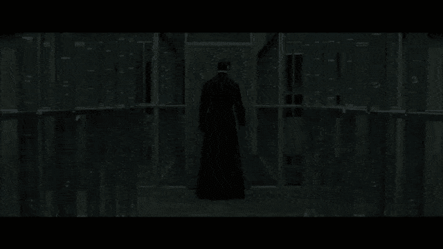

让我们弄清楚深层网络内部发生了什么！使用 [gifify](https://github.com/vvo/gifify) 创建的图像。来源: [YouTube](https://youtu.be/cHZl2naX1Xk) 。

好吧。所以，让我们试着弄清楚网络内部发生了什么。我们将从简单的参数可视化开始。这基本上是最简单的技术。我们已经在之前的视频中处理过了。

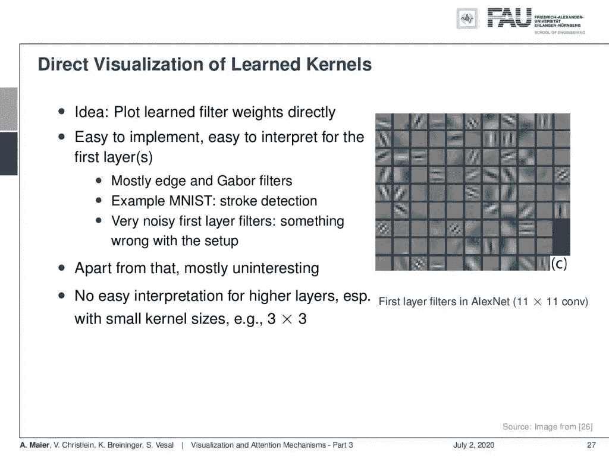

可视化学习参数的一个简单技术是查看训练过的内核。 [CC 下的图片来自](https://creativecommons.org/licenses/by/4.0/)[深度学习讲座](https://www.youtube.com/watch?v=p-_Stl0t3kU&list=PLpOGQvPCDQzvgpD3S0vTy7bJe2pf_yJFj&index=1)的 4.0 。

因此，我们的想法是，您可以直接绘制已学习的滤波器权重。很容易实现。对于第一层也很容易解读。在这里，你可以看到 AlexNet 中第一层过滤器的一些例子。如果你看到非常嘈杂的第一层，那么你可能已经猜到有问题了。例如，您正在获取特定传感器的噪声特性。除此之外，它基本上没什么意思，因为你可以看到它们是 edge 和 Gabor 滤波器的形状，但它不会告诉你网络的后面部分到底发生了什么。如果你有小内核，那么你大概还能解读它们。但是如果你更深入，你将不得不理解在第一层已经发生了什么。因此，它们以某种方式叠加在一起，你无法理解在更深的层次里到底发生了什么。

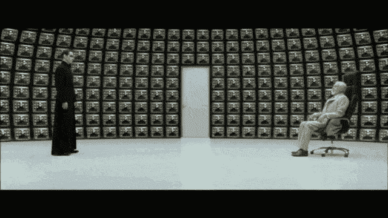

“你有许多问题，尽管这个过程已经改变了你的意识，你仍然是不可改变的人类。所以，我的回答有些你会懂，有些你不会。”使用 [gifify](https://github.com/vvo/gifify) 创建的图像。来源: [YouTube](https://youtu.be/cHZl2naX1Xk) 。

所以，我们需要一些不同的想法。一个想法是我们想象激活。内核很难解释。因此，我们观察由内核产生的激活，因为它们告诉我们网络从特定的输入计算什么。如果您有强烈的反应，这可能意味着该功能是存在的。如果您的响应较弱，则该功能可能不存在。

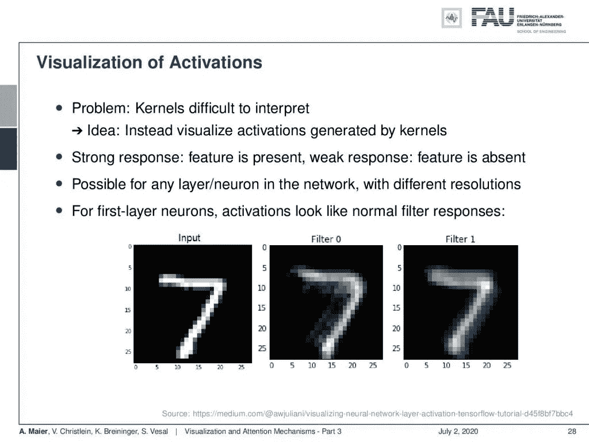

高激活表明神经元和输入之间有很强的一致性。 [CC 下的图片来自](https://creativecommons.org/licenses/by/4.0/)[深度学习讲座](https://www.youtube.com/watch?v=p-_Stl0t3kU&list=PLpOGQvPCDQzvgpD3S0vTy7bJe2pf_yJFj&index=1)的 4.0 。

那么，这看起来怎么样？对于第一层，你可以看到激活看起来像正常的滤波器响应。这是输入，然后对零进行滤波，对于一，可以看到它们以某种方式对输入进行了滤波。当然，你可以继续下去，看看更深层次的激活。然后，您已经意识到查看激活可能有些有趣，但是由于下采样，激活图通常会很快失去分辨率。所以，这意味着你会得到非常粗糙的激活图。

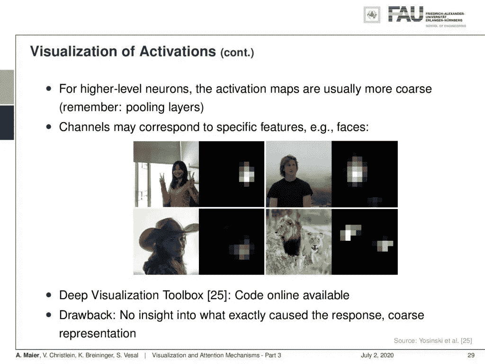

更深的激活图通常只有有限的分辨率。 [CC 下的图片来自](https://creativecommons.org/licenses/by/4.0/)[深度学习讲座](https://www.youtube.com/watch?v=p-_Stl0t3kU&list=PLpOGQvPCDQzvgpD3S0vTy7bJe2pf_yJFj&index=1)的 4.0 。

所以在这里，你看到一个可视化，可能对应于面部检测或面部特征。然后，我们可以开始推测这种特征在深层网络内部实际上代表了什么。我在[25]中有一个深度可视化工具箱，可以在网上找到。它允许你计算类似的东西。当然，缺点是，我们不能获得精确的信息，为什么特定的神经元被激活，或者为什么这个特征图是这个形状。

“一致地说，虽然你的第一个问题可能是最相关的，但你可能意识不到它也是最不相关的。”使用 [gifify](https://github.com/vvo/gifify) 创建的图像。来源: [YouTube](https://youtu.be/cHZl2naX1Xk) 。

那我们还能做什么？我们可以通过遮挡来研究特征。这里的想法是你在输入图像周围移动一个蒙版。有了这个补丁，你就可以从图像中移除信息。然后，你试着想象一个特定决定的可信度，关于这个遮挡片的不同位置。

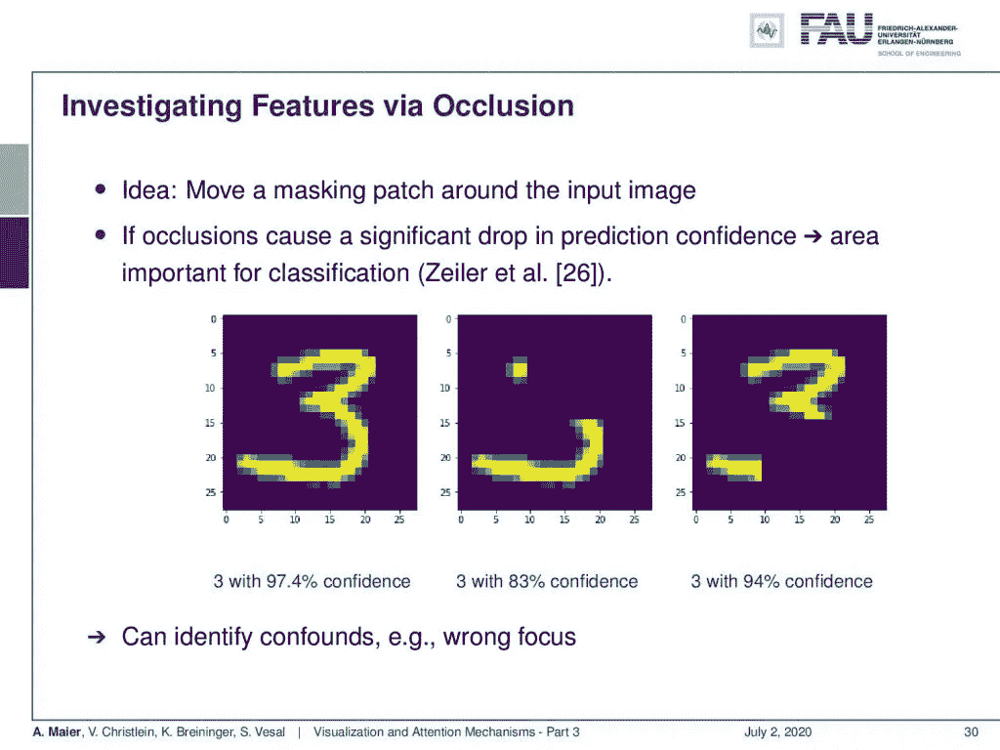

补丁闭塞是受生物神经网络中的病变研究的启发。 [CC 下的图片来自](https://creativecommons.org/licenses/by/4.0/)[深度学习讲座](https://www.youtube.com/watch?v=p-_Stl0t3kU&list=PLpOGQvPCDQzvgpD3S0vTy7bJe2pf_yJFj&index=1)的 4.0 。

然后，当然，补丁导致置信度大幅下降的区域可能是与特定分类相关的区域。我们这里有一些例子。我们用这个补丁来屏蔽左边的原始输入。两种不同版本的遮罩位于中间和右侧。然后，您可以看到数字 3 的置信度降低在中间图像中比在右侧图像中大得多。因此，我们可以尝试使用这种技术来识别混淆或错误的焦点。

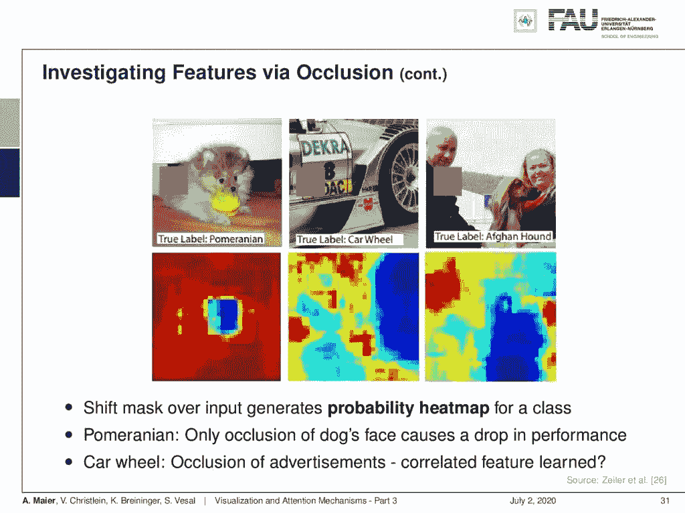

遮挡揭示了图像的哪些部分与分类相关。 [CC 下的图片来自](https://creativecommons.org/licenses/by/4.0/)[深度学习讲座](https://www.youtube.com/watch?v=p-_Stl0t3kU&list=PLpOGQvPCDQzvgpD3S0vTy7bJe2pf_yJFj&index=1)的 4.0 。

让我们再看一些例子。在这里，你可以看到左上角的博美犬图片。图像的重要部分确实位于中心。如果你开始封闭中心，博美犬的自信心也会下降。在中间一栏，你看到真正的标签汽车车轮和记录的图像。在底部，你可以看到如果你把车轮藏起来，当然，信心会下降。但是如果你开始隐藏汽车上的部分广告，信心也会下降。所以，这是一种可能是后天习得的混杂因素。车轮可以与图像的其他部分紧密搭配，甚至包括广告。在右边，你可以看到真正的阿富汗猎犬。如果你开始封闭狗，当然，信心实际上崩溃了。例如，左上方的人完全不相关。但是遮住主人或貌似主人的脸也会降低自信。所以你可能会说狗主人开始变得和他们的狗相似。不，这也是一个混杂因素！

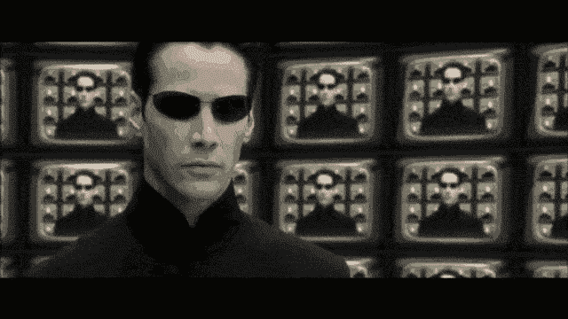

“我为什么会在这里？”——“你的生命是矩阵程序固有的不平衡方程的余数之和。你是一个异常现象的最终结果，尽管我尽了最大的努力，我还是无法从一个数学精度的和谐中消除它。”使用 [gifify](https://github.com/vvo/gifify) 创建的图像。来源: [YouTube](https://youtu.be/cHZl2naX1Xk) 。

好吧，让我们来看看第三种技术。这里，我们想要找到特定层或神经元的最大激活。这里的想法是，我们只看已经展示给网络的小块，我们通过特定神经元的激活对它们进行排序。

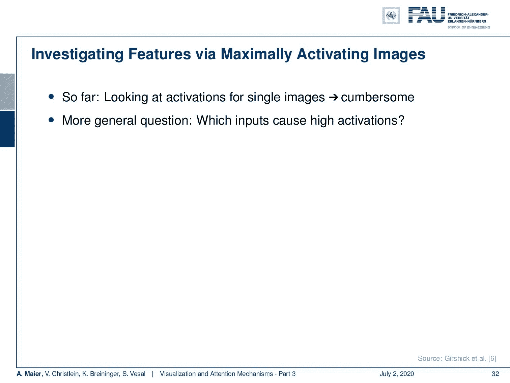

最大程度地激活面片可以找到某个层或神经元“喜欢”的图像部分。 [CC 下的图片来自](https://creativecommons.org/licenses/by/4.0/)[深度学习讲座](https://www.youtube.com/watch?v=p-_Stl0t3kU&list=PLpOGQvPCDQzvgpD3S0vTy7bJe2pf_yJFj&index=1)的 4.0 。

你可以生成这样的序列。所以，你可以看到这个特定的神经元被激活了 0.1，0.9，0.9，0.8，0.8，你可以看到这些是最大程度激活这个神经元的小块。所以，你可以争辩说:“嗯，这是一个上帝脸探测器，还是一个黑暗运动探测器。”

最大化激活补丁可能仍然难以解释。来自[深度学习讲座](https://www.youtube.com/watch?v=p-_Stl0t3kU&list=PLpOGQvPCDQzvgpD3S0vTy7bJe2pf_yJFj&index=1)的 [CC BY 4.0](https://creativecommons.org/licenses/by/4.0/) 下的图片。

所以，你很容易就能发现什么是“假朋友”。这相对容易找到，但是缺点当然是你不一定能得到语义上的意思。你可能会说这些形式是表征的基本载体。这里，我们有另一个例子，你可以说“嗯，什么样的检测器？这是一个红花番茄酱探测器。或者这是一个镜面高光的探测器？”好吧，至少你能搞清楚哪个神经元和什么样的输入有关。所以，你可以感觉到网络中正在发生什么，以及哪些东西聚集在一起。

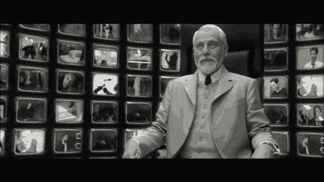

“虽然这仍然是一个竭力避免的负担，但这并不出乎意料，而且这并没有超出控制措施的范围，这种控制措施无情地将你带到了这里。”“你还没有回答我的问题。”——“非常正确。有意思。”使用 [gifify](https://github.com/vvo/gifify) 创建的图像。来源: [YouTube](https://youtu.be/cHZl2naX1Xk) 。

说到聚类:那么你实际上也可以使用输入的聚类来可视化一个特定深度网络的不同输入是多么相似。这导致了 T 随机邻域嵌入可视化技术。

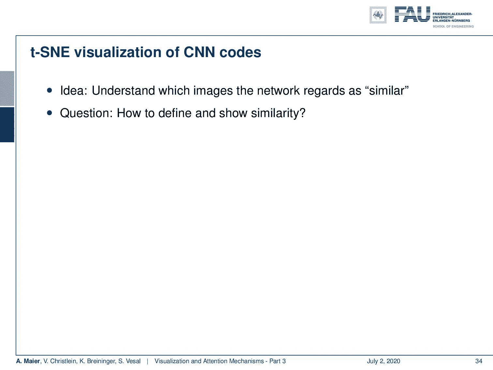

t-SNE 为特定网络创建输入图像的地图。来自[深度学习讲座](https://www.youtube.com/watch?v=p-_Stl0t3kU&list=PLpOGQvPCDQzvgpD3S0vTy7bJe2pf_yJFj&index=1)的 4.0CC 下的图片。

现在，这里的想法是，您计算最后一层的激活，并根据它们在最后一层激活中的相似性对输入进行分组。因此，你基本上执行最后一层激活的维度。这些是与分类相关的要素，可能会对训练好的网络的要素表示进行编码。然后，你实际上执行这个降维技术，并产生一个 2-D 图。

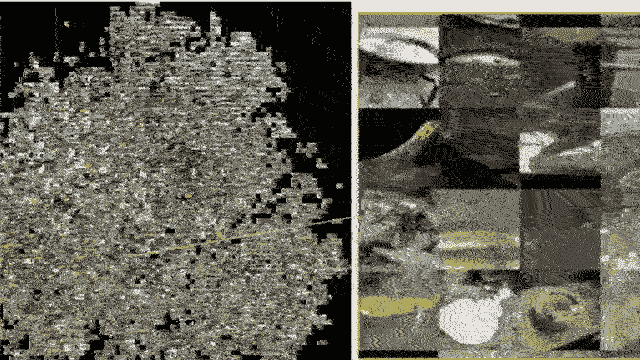

探索 SNE 霸王龙的地图。使用 [gifify](https://github.com/vvo/gifify) 创建的图像。来源: [YouTube](https://youtu.be/x7pG9q1W1vc) 。

这允许您查看您的网络认为哪些是相似的输入。所以，这当然是在二维空间中嵌入了一个非常高维的空间。当然，有很多信息损失。如果你这样做了，这个技巧还是很有趣的。如果我在这里放大不同的部分，你可以看到我们实际上在这种维度减少中形成了不同类别的集群。所以，你可以看到被神经网络相似感知的图像也位于直接邻域内。我们所做的降维揭示了内部表征。实际上，如果你看看那些街区，它们有点道理。因此，这实际上有助于我们理解和培养对我们深度神经网络正在进行的特征提取的信心。

"母体比你知道的还要古老."—“在 80 年代，我考虑如何建造这台机器，学会解决所有这些问题。”——“只有两种可能的解释:要么没人告诉我，要么没人知道。”“正是如此。”使用 [gifify](https://github.com/vvo/gifify) 创建的图像。来源: [YouTube](https://youtu.be/x7pG9q1W1vc) 。

到目前为止，没有一种技术是真正令人满意的。所以，下次在深度学习中，我们要讲更多的可视化方法。特别是，我们希望研究基于梯度的程序。所以，我们想用一种反向传播的方法来创造视觉效果。其他有趣的方法是基于优化的技术。在这里，我们实际上非常接近我们已经在对立的例子中看到的。非常感谢大家的收听，下期视频再见。拜拜。

在这个深度学习讲座中，更多令人兴奋的事情即将到来。 [CC 下的图片来自](https://creativecommons.org/licenses/by/4.0/)[深度学习讲座](https://www.youtube.com/watch?v=p-_Stl0t3kU&list=PLpOGQvPCDQzvgpD3S0vTy7bJe2pf_yJFj&index=1)的 4.0 。

如果你喜欢这篇文章，你可以在这里找到更多的文章，或者看看我们的讲座。如果你想在未来了解更多的文章、视频和研究，我也会很感激关注 [YouTube](https://www.youtube.com/c/AndreasMaierTV) 、 [Twitter](https://twitter.com/maier_ak) 、[脸书](https://www.facebook.com/andreas.maier.31337)或 [LinkedIn](https://www.linkedin.com/in/andreas-maier-a6870b1a6/) 。本文以 [Creative Commons 4.0 归属许可](https://creativecommons.org/licenses/by/4.0/deed.de)发布，如果引用，可以转载和修改。如果你有兴趣从视频讲座中获得文字记录，试试[自动博客](http://autoblog.tf.fau.de/)。

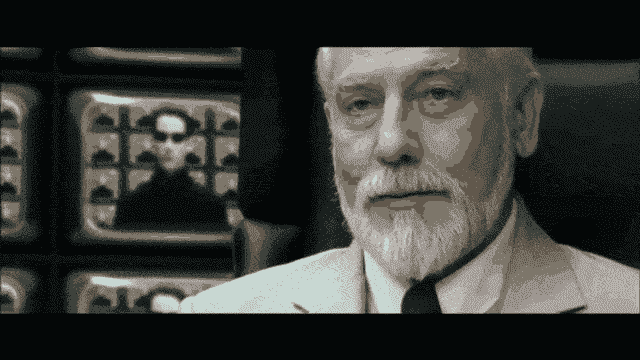

“扯淡！”—“否认是所有人类反应中最容易预测的。但请放心，这将是我们第六次销毁它，我们在这方面已经变得非常高效。”——“在那种情况下，除了人会死的事实之外，没有邪恶的概念。”使用 [gifify](https://github.com/vvo/gifify) 创建的图像。来源: [YouTube](https://youtu.be/x7pG9q1W1vc) 。

# 链接

[约辛斯基等人:深度可视化工具箱](http://yosinski.com/deepvis)
[奥拉等人:特征可视化](https://distill.pub/2017/feature-visualization/)
[亚当哈雷:MNIST 演示](http://scs.ryerson.ca/~aharley/vis/conv/)

# 参考

[1] Dzmitry Bahdanau, Kyunghyun Cho, and Yoshua Bengio. “Neural Machine Translation by Jointly Learning to Align and Translate”. In: 3rd International Conference on Learning Representations, ICLR 2015, San Diego, 2015.
[2] T. B. Brown, D. Mané, A. Roy, et al. “Adversarial Patch”. In: ArXiv e-prints (Dec. 2017). arXiv: 1712.09665 [cs.CV].
[3] Jianpeng Cheng, Li Dong, and Mirella Lapata. “Long Short-Term Memory-Networks for Machine Reading”. In: CoRR abs/1601.06733 (2016). arXiv: 1601.06733.
[4] Jacob Devlin, Ming-Wei Chang, Kenton Lee, et al. “BERT: Pre-training of Deep Bidirectional Transformers for Language Understanding”. In: CoRR abs/1810.04805 (2018). arXiv: 1810.04805.
[5] Neil Frazer. Neural Network Follies. 1998\. URL: [https://neil.fraser.name/writing/tank/](https://neil.fraser.name/writing/tank/) (visited on 01/07/2018).
[6] Ross B. Girshick, Jeff Donahue, Trevor Darrell, et al. “Rich feature hierarchies for accurate object detection and semantic segmentation”. In: CoRR abs/1311.2524 (2013). arXiv: 1311.2524.
[7] Alex Graves, Greg Wayne, and Ivo Danihelka. “Neural Turing Machines”. In: CoRR abs/1410.5401 (2014). arXiv: 1410.5401.
[8] Karol Gregor, Ivo Danihelka, Alex Graves, et al. “DRAW: A Recurrent Neural Network For Image Generation”. In: Proceedings of the 32nd International Conference on Machine Learning. Vol. 37\. Proceedings of Machine Learning Research. Lille, France: PMLR, July 2015, pp. 1462–1471.
[9] Nal Kalchbrenner, Lasse Espeholt, Karen Simonyan, et al. “Neural Machine Translation in Linear Time”. In: CoRR abs/1610.10099 (2016). arXiv: 1610.10099.
[10] L. N. Kanal and N. C. Randall. “Recognition System Design by Statistical Analysis”. In: Proceedings of the 1964 19th ACM National Conference. ACM ’64\. New York, NY, USA: ACM, 1964, pp. 42.501–42.5020.
[11] Andrej Karpathy. t-SNE visualization of CNN codes. URL: [http://cs.stanford.edu/people/karpathy/cnnembed/](http://cs.stanford.edu/people/karpathy/cnnembed/) (visited on 01/07/2018).
[12] Alex Krizhevsky, Ilya Sutskever, and Geoffrey E Hinton. “ImageNet Classification with Deep Convolutional Neural Networks”. In: Advances In Neural Information Processing Systems 25\. Curran Associates, Inc., 2012, pp. 1097–1105\. arXiv: 1102.0183.
[13] Thang Luong, Hieu Pham, and Christopher D. Manning. “Effective Approaches to Attention-based Neural Machine Translation”. In: Proceedings of the 2015 Conference on Empirical Methods in Natural Language Lisbon, Portugal: Association for Computational Linguistics, Sept. 2015, pp. 1412–1421.
[14] A. Mahendran and A. Vedaldi. “Understanding deep image representations by inverting them”. In: 2015 IEEE Conference on Computer Vision and Pattern Recognition (CVPR). June 2015, pp. 5188–5196.
[15] Andreas Maier, Stefan Wenhardt, Tino Haderlein, et al. “A Microphone-independent Visualization Technique for Speech Disorders”. In: Proceedings of the 10th Annual Conference of the International Speech Communication Brighton, England, 2009, pp. 951–954.
[16] Volodymyr Mnih, Nicolas Heess, Alex Graves, et al. “Recurrent Models of Visual Attention”. In: CoRR abs/1406.6247 (2014). arXiv: 1406.6247.
[17] Chris Olah, Alexander Mordvintsev, and Ludwig Schubert. “Feature Visualization”. In: Distill (2017). [https://distill.pub/2017/feature-visualization.](https://distill.pub/2017/feature-visualization.)
[18] Prajit Ramachandran, Niki Parmar, Ashish Vaswani, et al. “Stand-Alone Self-Attention in Vision Models”. In: arXiv e-prints, arXiv:1906.05909 (June 2019), arXiv:1906.05909\. arXiv: 1906.05909 [cs.CV].
[19] Mahmood Sharif, Sruti Bhagavatula, Lujo Bauer, et al. “Accessorize to a Crime: Real and Stealthy Attacks on State-of-the-Art Face Recognition”. In: Proceedings of the 2016 ACM SIGSAC Conference on Computer and Communications CCS ’16\. Vienna, Austria: ACM, 2016, pp. 1528–1540\. A.
[20] K. Simonyan, A. Vedaldi, and A. Zisserman. “Deep Inside Convolutional Networks: Visualising Image Classification Models and Saliency Maps”. In: International Conference on Learning Representations (ICLR) (workshop track). 2014.
[21] J.T. Springenberg, A. Dosovitskiy, T. Brox, et al. “Striving for Simplicity: The All Convolutional Net”. In: International Conference on Learning Representations (ICRL) (workshop track). 2015.
[22] Dmitry Ulyanov, Andrea Vedaldi, and Victor S. Lempitsky. “Deep Image Prior”. In: CoRR abs/1711.10925 (2017). arXiv: 1711.10925.
[23] Ashish Vaswani, Noam Shazeer, Niki Parmar, et al. “Attention Is All You Need”. In: CoRR abs/1706.03762 (2017). arXiv: 1706.03762.
[24] Kelvin Xu, Jimmy Ba, Ryan Kiros, et al. “Show, Attend and Tell: Neural Image Caption Generation with Visual Attention”. In: CoRR abs/1502.03044 (2015). arXiv: 1502.03044.
[25] Jason Yosinski, Jeff Clune, Anh Mai Nguyen, et al. “Understanding Neural Networks Through Deep Visualization”. In: CoRR abs/1506.06579 (2015). arXiv: 1506.06579.
[26] Matthew D. Zeiler and Rob Fergus. “Visualizing and Understanding Convolutional Networks”. In: Computer Vision — ECCV 2014: 13th European Conference, Zurich, Switzerland, Cham: Springer International Publishing, 2014, pp. 818–833.
[27] Han Zhang, Ian Goodfellow, Dimitris Metaxas, et al. “Self-Attention Generative Adversarial Networks”. In: Proceedings of the 36th International Conference on Machine Learning. Vol. 97\. Proceedings of Machine Learning Research. Long Beach, California, USA: PMLR, Sept. 2019, pp. 7354–7363\. A.