# 视觉化和注意力——第四部分

> 原文：<https://towardsdatascience.com/visualization-attention-part-4-a1cfefce8bd3?source=collection_archive---------46----------------------->

## [FAU 讲座笔记](https://towardsdatascience.com/tagged/fau-lecture-notes)关于深度学习

## 基于梯度和优化的方法

FAU 大学的深度学习。下图 [CC BY 4.0](https://creativecommons.org/licenses/by/4.0/) 来自[深度学习讲座](https://www.youtube.com/watch?v=p-_Stl0t3kU&list=PLpOGQvPCDQzvgpD3S0vTy7bJe2pf_yJFj&index=1)

**这些是 FAU 的 YouTube 讲座** [**深度学习**](https://www.youtube.com/watch?v=p-_Stl0t3kU&list=PLpOGQvPCDQzvgpD3S0vTy7bJe2pf_yJFj&index=1) **的讲义。这是与幻灯片匹配的讲座视频&的完整抄本。我们希望，你喜欢这个视频一样多。当然，这份抄本是用深度学习技术在很大程度上自动创建的，只进行了少量的手动修改。** [**自己试试吧！如果您发现错误，请告诉我们！**](http://autoblog.tf.fau.de/)

# 航行

[**上一讲**](/visualization-attention-part-3-84a43958e48b) **/** [**观看本视频**](https://youtu.be/pdO7cz9pWy4) **/** [**顶级**](/all-you-want-to-know-about-deep-learning-8d68dcffc258) **/** [**下一讲**](/visualization-attention-part-5-2c3c14e60548)

欢迎回到深度学习！今天，我们想深入了解可视化技术，特别是基于梯度和基于优化的过程。

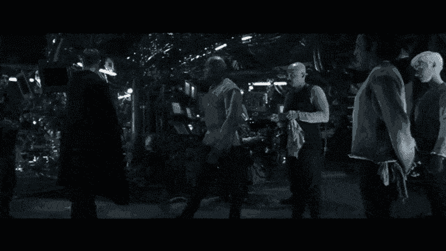

“你想知道矩阵是什么。”使用 [gifify](https://github.com/vvo/gifify) 创建的图像。来源: [YouTube](https://youtu.be/LDPVwI3KULk) 。

好吧，让我们看看我给你带来了什么。让我们先谈谈基于梯度的可视化，这里的想法是，我们想找出哪个输入像素对神经元最重要。

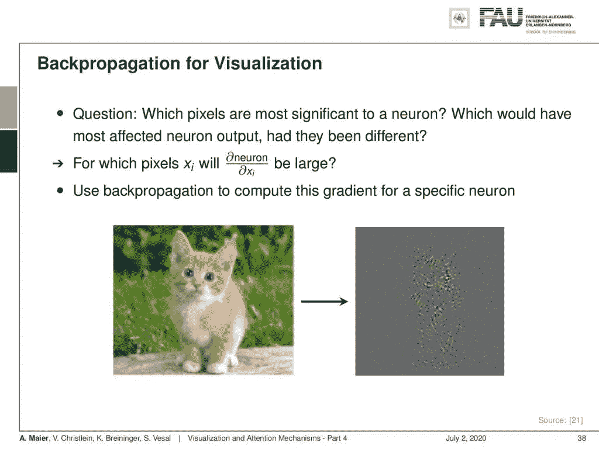

将类别“cat”反向传播到输入域。 [CC 下的图片来自](https://creativecommons.org/licenses/by/4.0/)[深度学习讲座](https://www.youtube.com/watch?v=p-_Stl0t3kU&list=PLpOGQvPCDQzvgpD3S0vTy7bJe2pf_yJFj&index=1)的 4.0 。

如果我们要改变它，什么会导致我们的神经网络的实际输出的巨大变化？我们实际上想要计算的是所考虑的神经元的偏导数，可能是对于类“猫”的输出神经元。然后，我们要计算输入的偏导数。这实质上是通过整个网络的反向传播。然后，我们可以把这种渐变想象成一种图像，就像我们在这里对猫图像所做的那样。你可以看到，当然，这是一个颜色渐变。你可以看到，这是一个有点嘈杂的图像，但你可以看到，与类“猫”相关的东西，这里显然也位于图像中猫所在的区域。

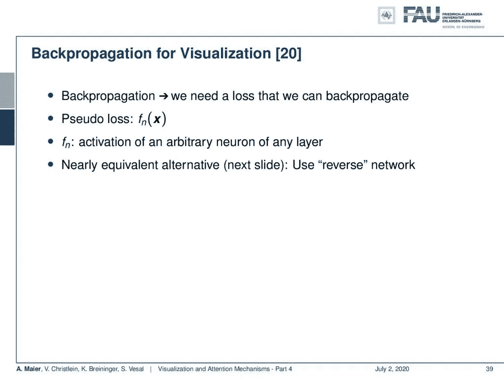

一个神经元的输出可以作为“伪损耗”。来自[深度学习讲座](https://www.youtube.com/watch?v=p-_Stl0t3kU&list=PLpOGQvPCDQzvgpD3S0vTy7bJe2pf_yJFj&index=1)的 [CC BY 4.0](https://creativecommons.org/licenses/by/4.0/) 下的图片。

我们将学习几种不同的方法来做到这一点。第一个是在[20]的基础上。对于反向传播，我们实际上需要丢失我们想要反向传播的内容。我们简单地取一个伪损失，它是任意神经元或层的激活。通常，您想要做的是在输出层获取神经元，因为它们可以与类相关联。

Deconvnet 是一种模拟通过网络的反向传递的网络。 [CC 下的图片来自](https://creativecommons.org/licenses/by/4.0/)[深度学习讲座](https://www.youtube.com/watch?v=p-_Stl0t3kU&list=PLpOGQvPCDQzvgpD3S0vTy7bJe2pf_yJFj&index=1)的 4.0 。

你还可以做的是，不使用反向传播，你可以建立一个几乎等效的替代方案，使用一种反向网络。这是来自[26]的 Deconvnet。这里，输入是经过训练的网络和一些图像。然后，您选择一个激活，并将所有其他激活设置为零。接下来，您构建一个反向网络，您可以看到这里的想法，它基本上包含与网络相同的内容，只是顺序相反，有所谓的取消轮询步骤。现在，通过这些非 pooling 步骤和逆向计算，你可以看到我们也可以产生一种梯度估计。这个的好处是，不需要任何训练。因此，您只需记录交换机中的池位置和反向网络的正向路径。实际上，除了我们将在几张幻灯片中讨论的整流线性单元之外，这与网络的反向传递相同。

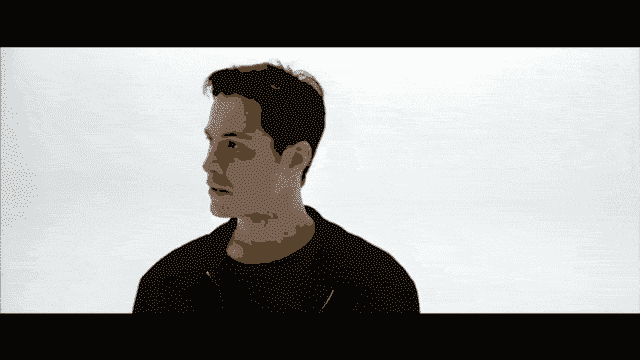

“这是构造。”使用 [gifify](https://github.com/vvo/gifify) 创建的图像。来源: [YouTube](https://youtu.be/LDPVwI3KULk) 。

在这里，我们展示了前九个激活的可视化，梯度，以及相应的补丁。例如，你可以用这个来揭示这种特征地图似乎集中在绿色斑块区域。你可能会认为这更像是一种背景特征，试图检测图像中的草地。

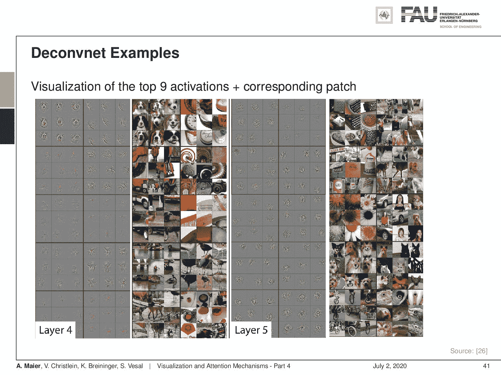

来自 Deconvnet 的示例。来自[深度学习讲座](https://www.youtube.com/watch?v=p-_Stl0t3kU&list=PLpOGQvPCDQzvgpD3S0vTy7bJe2pf_yJFj&index=1)的 [CC BY 4.0](https://creativecommons.org/licenses/by/4.0/) 下的图片。

那么，还有什么？嗯，有引导反向传播。导向反向传播是一个非常相似的概念。这里的想法是你想找到正相关的特征。所以我们寻找正梯度，因为我们假设正的特征是神经元感兴趣的特征。负梯度是神经元不感兴趣的梯度。

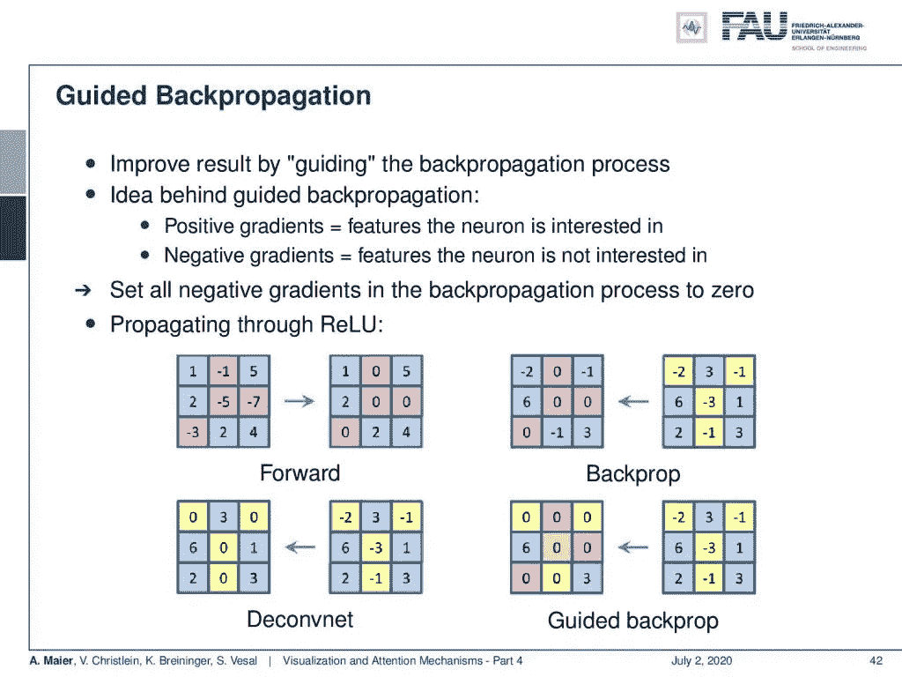

反向传播与解卷积和导向反向传播。 [CC 下的图片来自](https://creativecommons.org/licenses/by/4.0/)[深度学习讲座](https://www.youtube.com/watch?v=p-_Stl0t3kU&list=PLpOGQvPCDQzvgpD3S0vTy7bJe2pf_yJFj&index=1)的 4.0 。

因此，想法是将反向传播中的所有负梯度设置为零。我们现在可以向您展示 ReLU 在使用不同种类的梯度反向传播技术向前和向后传递时的不同过程。当然，如果你有这些输入激活，那么在 ReLU 的正向传递中，你可以简单地消除所有的负值，并把它们设置为零。现在，对于三种不同的选择，反向传播会发生什么？让我们看看典型的反向传播是怎么做的，注意这里我们用黄色显示了来自敏感度的负条目。如果您现在尝试反向传播，您必须记住正向传递中的哪些条目是负的，并再次将这些值设置为零。为了做到这一点，你保留来自前一层的敏感性的一切。现在，如果您取消配置，您不需要记住前向传递的开关，但您可以将灵敏度为负的所有条目设置为零，然后反向传递。现在这样，导向反向传播实际上两者都做了。因此它记住了前向传递，并将所有这些元素设置为零。它将灵敏度的所有元素设置为零。因此，就消除负值而言，它本质上是反向传播和去卷积的结合。你可以看到引导反向传播在整个反向传播过程中只保持很小的灵敏度。

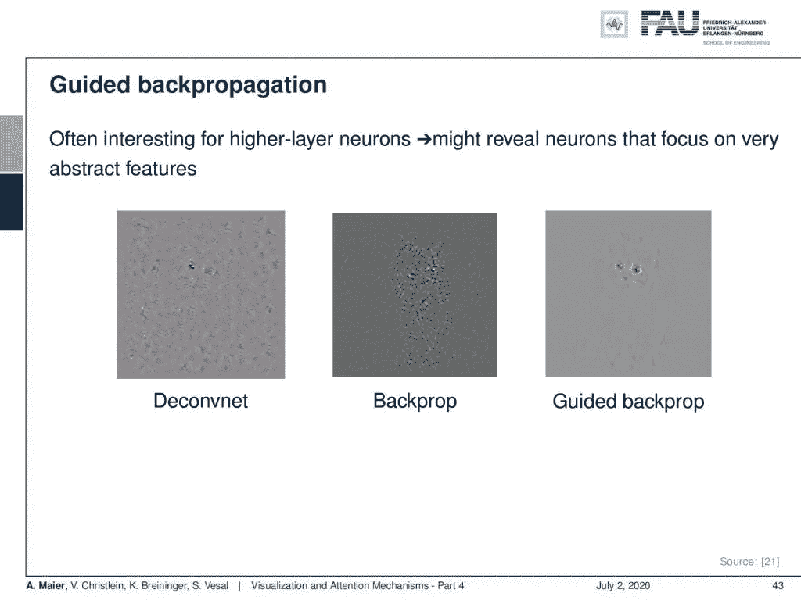

比较中的梯度估计。 [CC 下的图片来自](https://creativecommons.org/licenses/by/4.0/)[深度学习讲座](https://www.youtube.com/watch?v=p-_Stl0t3kU&list=PLpOGQvPCDQzvgpD3S0vTy7bJe2pf_yJFj&index=1)的 4.0 。

现在让我们看看不同梯度的对比。你可以看到的一件事是，在 Deconvnet 中，我们得到了相当嘈杂的激活和反向传播。我们可以看到，我们至少专注于感兴趣的对象，引导反向传播具有非常稀疏的表示，但即使在这个梯度图像中，也可以非常清楚地看到最重要的特征，如猫的眼睛等。所以，这是一个非常好的方法，可以帮助你揭示哪些神经元在特定的输入中关注什么活动。

梯度的绝对值产生显著图。来自[深度学习讲座](https://www.youtube.com/watch?v=p-_Stl0t3kU&list=PLpOGQvPCDQzvgpD3S0vTy7bJe2pf_yJFj&index=1)的 [CC BY 4.0](https://creativecommons.org/licenses/by/4.0/) 下的图片。

这最终导致显著图。在这里，你不想调查什么影响两个神经元，而是想调查像素对一个类“狗”的影响。现在，您将伪损失视为一项非标准化任务，计算图像像素的梯度，并使用绝对值。然后，我们对此进行了有趣的观察，它产生了一个显著图来定位图像中的狗，即使网络从未受过定位训练。因此，这是一种非常有趣的方法，可以帮助您识别决定性信息在图像中的实际位置。

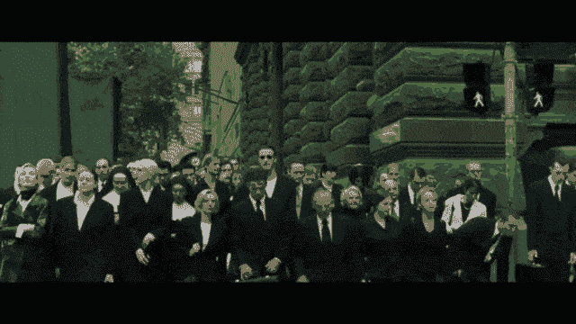

"母体是一个系统，尼欧."使用 [gifify](https://github.com/vvo/gifify) 创建的图像。来源: [YouTube](https://youtu.be/NBrEK-kp0aI) 。

还能做什么？嗯，有基于优化的参数可视化。现在，我们的想法是要走向不同的层次。因此，如果我们想要针对神经元、激活图、层、实际逻辑或本质上是 softmax 函数的类概率进行优化，我们将它们视为伪损失，以便创建最佳输入。

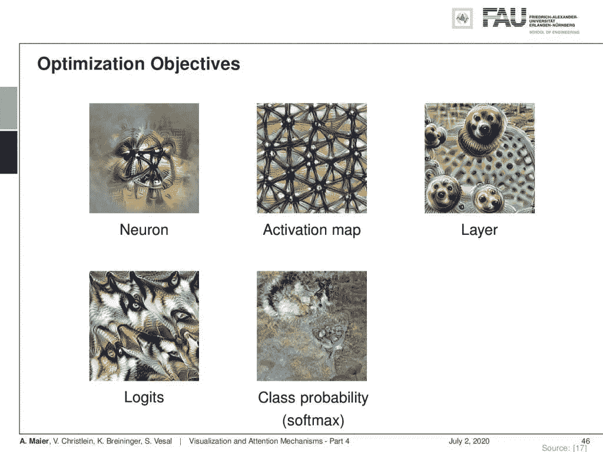

我们可以自由选择要优化的网络部分。来自[深度学习讲座](https://www.youtube.com/watch?v=p-_Stl0t3kU&list=PLpOGQvPCDQzvgpD3S0vTy7bJe2pf_yJFj&index=1)的 [CC BY 4.0](https://creativecommons.org/licenses/by/4.0/) 下的图片。

我们已经在第一个视频中看到了非常相似的东西，我们在 DeepDream 中看到了这个例子。概念主义本质上是在做一些非常相似的事情。它接受一些输入，然后改变输入，使得不同的神经元被最大限度地激活。

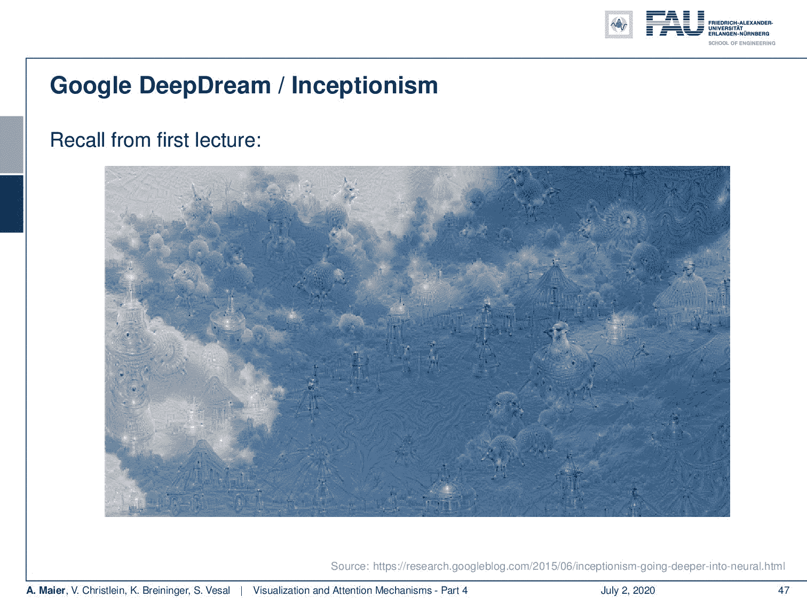

DeepDream 的《海军上将狗》等创作。 [CC 下的图片来自](https://creativecommons.org/licenses/by/4.0/)[深度学习讲座](https://www.youtube.com/watch?v=p-_Stl0t3kU&list=PLpOGQvPCDQzvgpD3S0vTy7bJe2pf_yJFj&index=1)的 4.0 。

在那里你可以看到这些神经元以某种方式编码了它喜欢识别的动物或事物的特定部分。如果你现在最大化这个特定神经元的输入，你可以看到它喜欢的形状开始出现在这个图像中。所以，这个想法是，你改变输入，使神经元被最大限度地激活。因此，我们本质上不只是计算图像的梯度，而且我们还会根据特定图层、softmax 或输出主动更改图像。当然，最初的想法是可视化。

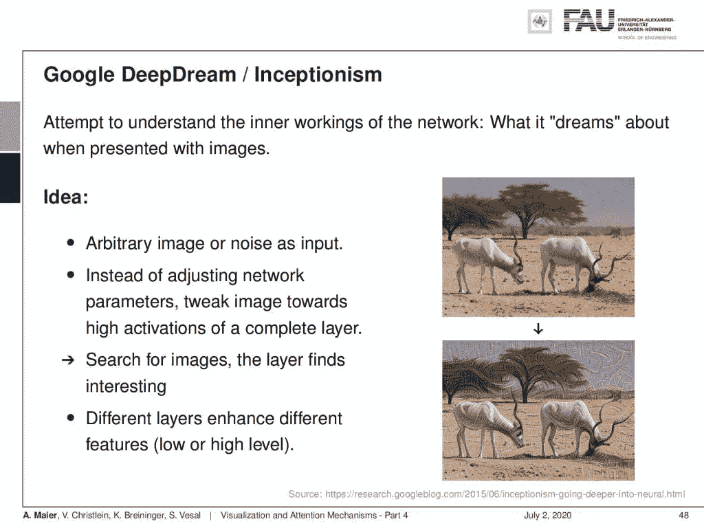

无概念主义允许向特定的神经元、层或类调整和想象。 [CC 下的图片来自](https://creativecommons.org/licenses/by/4.0/)[深度学习讲座](https://www.youtube.com/watch?v=p-_Stl0t3kU&list=PLpOGQvPCDQzvgpD3S0vTy7bJe2pf_yJFj&index=1)的 4.0 。

所以，当呈现图像时，你试图通过做梦来理解网络的内部运作。你从图像甚至噪声作为输入开始。然后，调整图像，使整个图层的激活最大化。对于不同的图层，它会突出显示图像中不同的东西。所以，我们可以创造这种观念。如果您主要激活早期层，您会看到图像内容并没有太大的变化，但您在图像中创建了那些笔刷和笔触外观。

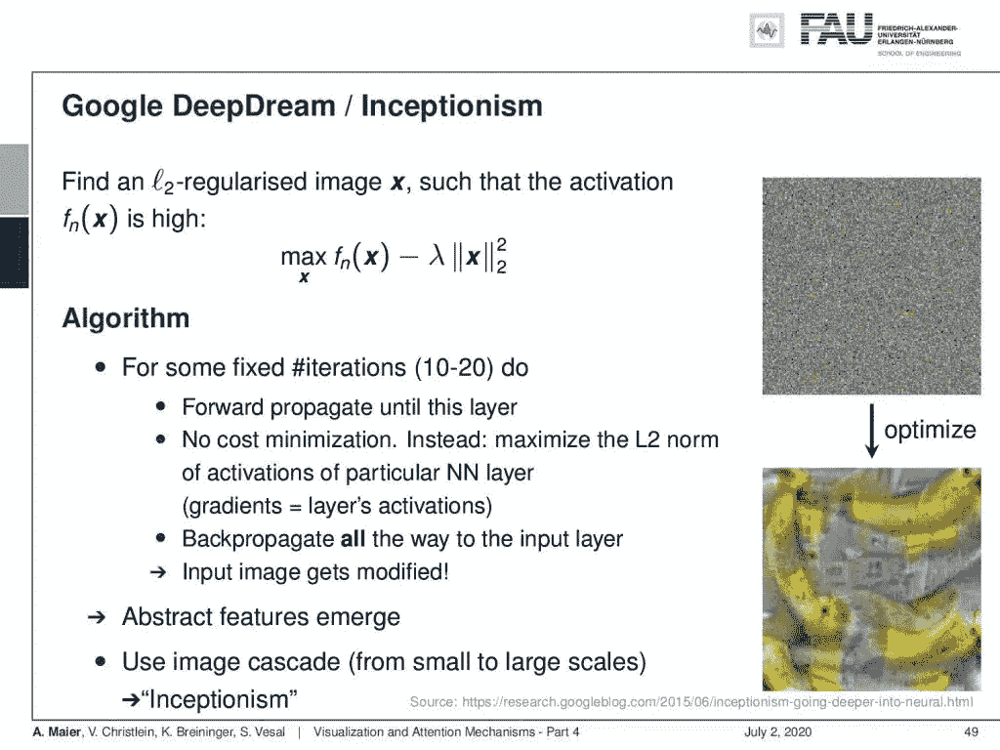

概念主义可以揭示神经元、层次和整个网络的亲缘关系。来自[深度学习讲座](https://www.youtube.com/watch?v=p-_Stl0t3kU&list=PLpOGQvPCDQzvgpD3S0vTy7bJe2pf_yJFj&index=1)的 [CC BY 4.0](https://creativecommons.org/licenses/by/4.0/) 下的图片。

现在，你甚至可以开始随机输入。那么就不仅仅是针对特定的输出优化输入了。你需要一些额外的调整。我们可以用这个小公式来证明。所以，我们现在取一些输入 **x** ，这是一个随机的图像。我们把它输入我们的网络和一个特定的神经元或输出神经元。然后，我们最大化激活，并添加一个正则化。如果我们的 **x** 偏离了一个特定的规范，这个正则化器就会惩罚。这个例子中用到的，就是 L2 范数。稍后，我们还会看到，也许其他规范也可能适用于此。我们从右上角所示的噪声输入开始。然后，您进行优化，直到找到特定神经元或层的最大激活。同时，你假设你的输入图像必须平滑，否则，你会产生非常非常嘈杂的图像。它们不太适合解释，当然，右下方的图像向你展示了一些你知道可以解释的结构。所以，你看到这些抽象的特征出现了，然后你可以把它作为一种从小到大的级联，这就产生了所谓的无概念主义。

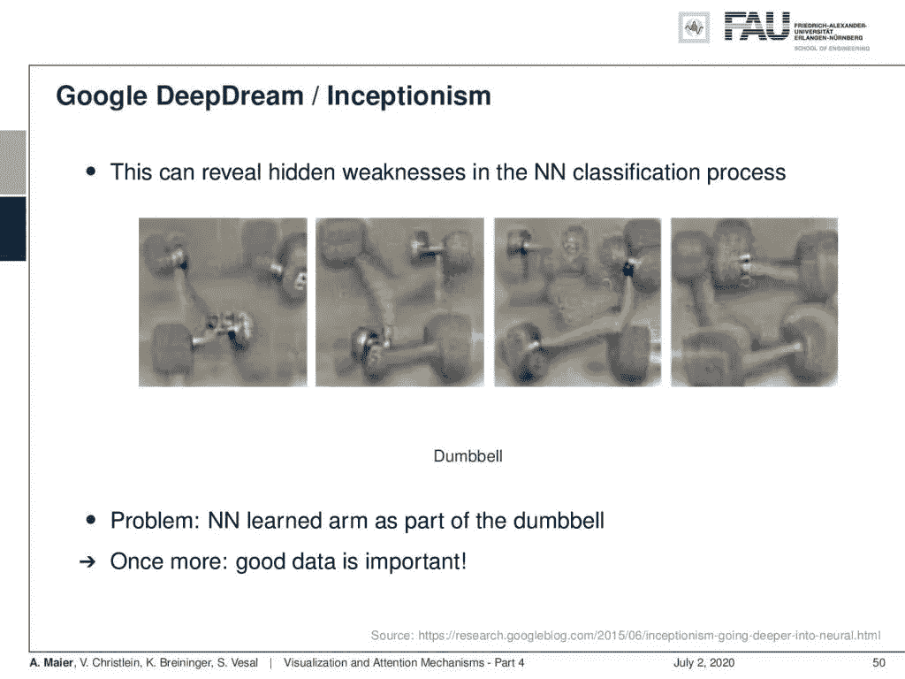

“哑铃”类的重构图像。 [CC 下的图片来自](https://creativecommons.org/licenses/by/4.0/)[深度学习讲座](https://www.youtube.com/watch?v=p-_Stl0t3kU&list=PLpOGQvPCDQzvgpD3S0vTy7bJe2pf_yJFj&index=1)的 4.0 。

在这里，我们可以利用这一点，例如，揭示神经网络分类过程中隐藏的弱点。这里，我们看到了“哑铃”类的不同实现。你可以看到，它不仅仅是图像中显示的哑铃，它还再现了拿着哑铃的手臂。因此，我们在这里可以看到，当相关的事物被呈现给网络时，它们是被学习的。所以，我们可以算出，特定类别或神经元对输入的记忆是什么。所以，我们再次认识到好的数据非常重要。

给定某一层的激活，网络的输入可以被重构。来自[深度学习讲座](https://www.youtube.com/watch?v=p-_Stl0t3kU&list=PLpOGQvPCDQzvgpD3S0vTy7bJe2pf_yJFj&index=1)的 [CC BY 4.0](https://creativecommons.org/licenses/by/4.0/) 下的图片。

这实际上引导我们到了另一步，我们可以做的是弄清楚神经网络内部发生了什么。这些是反转技术，这里的想法和我们在概念论中看到的非常相似。但是现在，我们实际上想从激活中得到实际的输入。例如，您经常听到的匿名数据的安全措施是:“让我们只激活第 5 层，并丢弃所有以前的激活和输入。我们只存储第 5 层激活，因为如果我只知道第 5 层激活，就没有办法重建原始图像。”

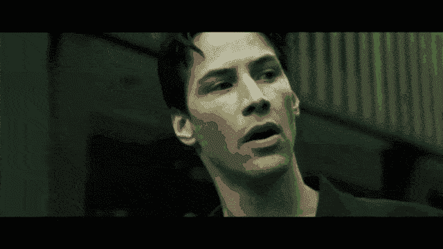

“你想告诉我什么？那我能躲过子弹吗？”-“不，尼奥”。使用 [gifify](https://github.com/vvo/gifify) 创建的图像。来源: [YouTube](https://youtu.be/NBrEK-kp0aI) 。

现在有了反演，如果你知道网络，它的过程，和特定层的特定激活，那么你可以尝试重建实际输入是什么。同样，我们在特定的层中有我们网络的输出。假设 f( **x** )是一层的输出，我们有 **y** hat。现在， **y** 这是被测网络的输出或被测层的激活。因此，我们激活了第 5 层，但我们不知道输入 **x** 是什么。因此，我们正在寻找 **x** ，并尝试最小化该函数，以便我们找到与该特定激活最匹配的 **x** 。

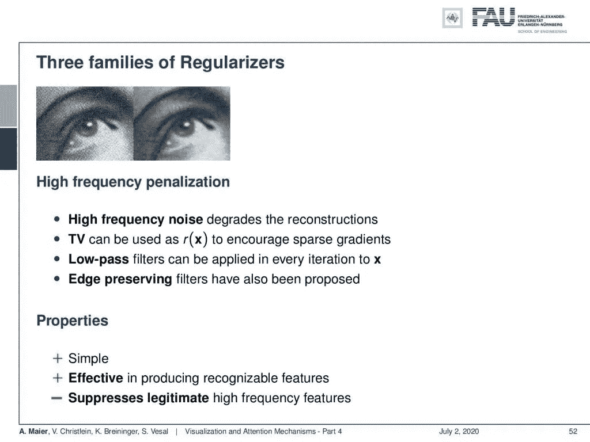

反演的不稳定性可以通过正则化来解决。来自[深度学习讲座](https://www.youtube.com/watch?v=p-_Stl0t3kU&list=PLpOGQvPCDQzvgpD3S0vTy7bJe2pf_yJFj&index=1)的 4.0CC 下的图片。

这是一个经典的反问题。为了获得更稳定的输出，您添加了一个额外的正则化器λ乘以 R( **x** )。这个正则项非常重要。因此，正则化使反演稳定，有非常常见的正则化技术，它们使用自然图像的特定属性来创建可能是自然图像的东西。当然，高频噪声会降低重建质量。这就是为什么我们使用这个额外的 L2 范数，以防止在创建的图像中出现噪声。除此之外，还可以用所谓的全变差。我们知道，自然图像通常具有稀疏的梯度，全变差是一种最小化技术，可以强制图像具有非常低的梯度。渐变本质上是边缘，在典型的图像中，只有几个边缘像素和许多更均匀的区域。因此，电视最小化产生的图像边缘很少，当然也有一点噪声。它还特别允许高分段常数跳跃，就像在真实边缘中一样。当然，您也可以使用低通滤波器和其他边缘保留滤波器。一个经典的方法是小波正则化。这很简单，也很有效，当然，它还会抑制真实边缘和其他高频信息。

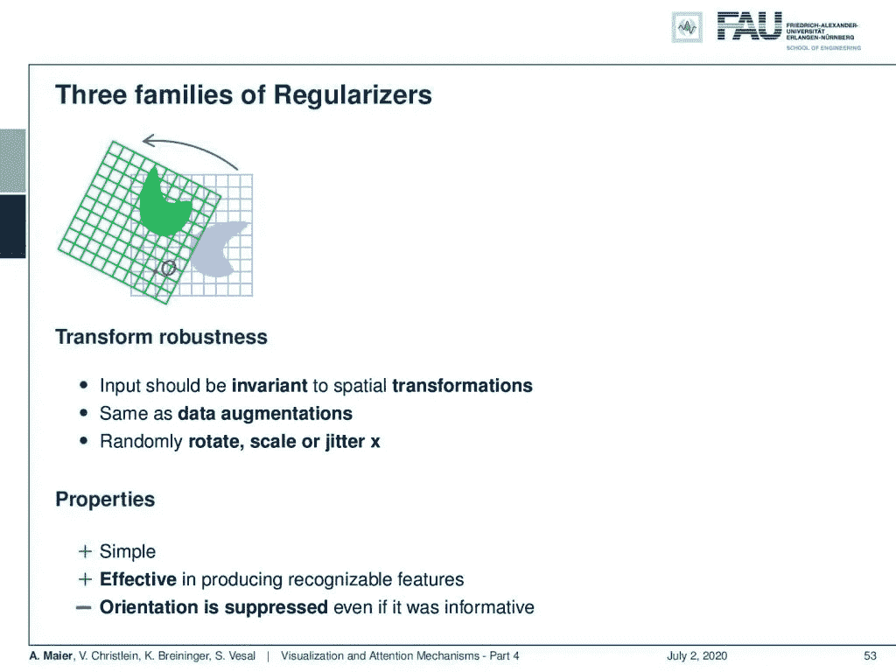

转换的显式使用也可以支持正则化。 [CC 下的图片来自](https://creativecommons.org/licenses/by/4.0/)[深度学习讲座](https://www.youtube.com/watch?v=p-_Stl0t3kU&list=PLpOGQvPCDQzvgpD3S0vTy7bJe2pf_yJFj&index=1)的 4.0 。

好吧，还能做什么？您也可以使用其他正则化，如变换鲁棒性。因此，输入实际上应该对特殊变换保持不变。这类似于数据扩充，因此，您可以随机旋转、缩放或抖动 **x** 。所以，这也很简单，而且在产生可识别的特征方面很有效。通常方向是被抑制的，即使它是信息性的。所以，我们必须小心谨慎。

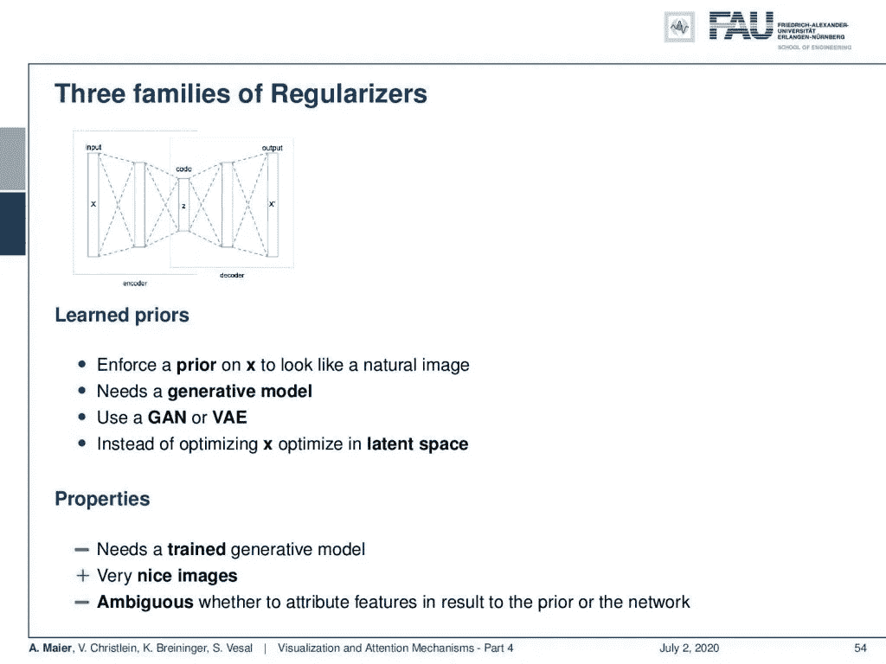

正规化也是可以学习的。来自[深度学习讲座](https://www.youtube.com/watch?v=p-_Stl0t3kU&list=PLpOGQvPCDQzvgpD3S0vTy7bJe2pf_yJFj&index=1)的 [CC BY 4.0](https://creativecommons.org/licenses/by/4.0/) 下的图片。

最后一种非常常见的正则化是你已经知道了先验知识。例如，你可以使用一个训练网络，说“我想在第 4 层有一个特定的分布。”然后，我试图生成具有非常相似特征的图像。这里，不是相对于我们知道有用的特定规范进行优化，而是假设在特定层中产生的表示对于测量图像的内容是有用的。然后，你实际上可以用它作为一种正则化来产生图像。所以当然，如果你想使用这样的东西，你需要一个训练有素的生成模型。这产生了非常好的图像，但它可能是模糊的，因为你引入结果的部分来自预先训练的网络。所以，你必须小心看待这个问题。

“我想告诉你，当你准备好的时候，你就不需要这么做了。”使用 [gifify](https://github.com/vvo/gifify) 创建的图像。来源: [YouTube](https://youtu.be/NBrEK-kp0aI) 。

所以，让我们看一些例子[14]实际上是通过反演生成的图像。这真是令人印象深刻。同样，这是一个 AlexNet 类型的网络，这里有输入，然后是反演:

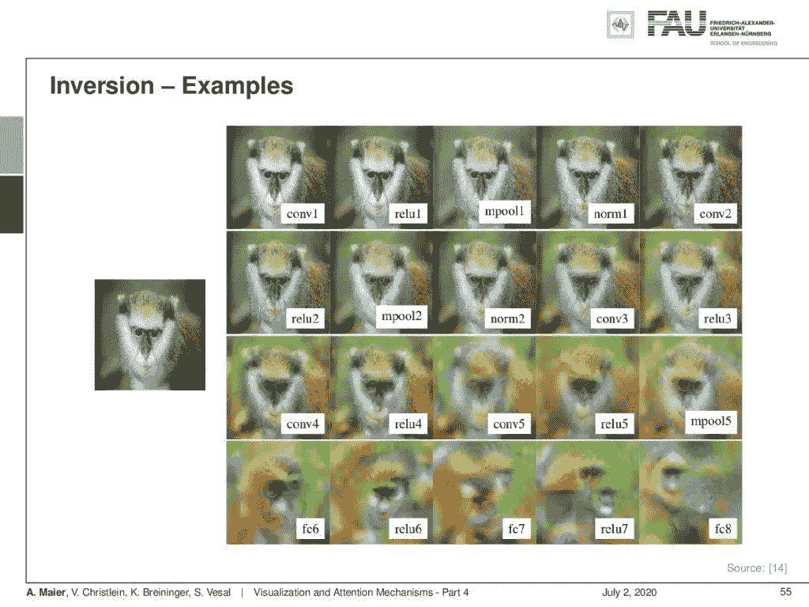

不同层的输入和反演结果。 [CC 下的图片来自](https://creativecommons.org/licenses/by/4.0/)[深度学习讲座](https://www.youtube.com/watch?v=p-_Stl0t3kU&list=PLpOGQvPCDQzvgpD3S0vTy7bJe2pf_yJFj&index=1)的 4.0 。

在 conv 第一层，你可以看到我们几乎可以准确地复制图像。ReLu 1 之后变化不大。合用——没有大的影响。然后，第二层，以此类推。可以看到，直到卷积层#4，我们非常接近真实输入。这已经经历了几个合并的步骤，但是我们仍然能够非常接近原始输入地再现输入。很有意思！然后，你会看到，我真的不得不走向第 6 层或第 7 层，直到我无法或几乎无法猜测原始输入是什么。因此，只有从第 6 层/第 7 层开始，我们才开始显著偏离原始输入。直到第 5 层，我们仍然可以很好地重建原始输入是什么。因此，如果有人告诉你，他们想通过删除前两层来匿名化数据，那么你会发现，利用这些反演技术，这可能不是一个好主意。仅仅通过查看激活和网络结构，你就有可能重建原始输入。

在这个深度学习讲座中，更多令人兴奋的事情即将到来。 [CC 下的图片来自](https://creativecommons.org/licenses/by/4.0/)[深度学习讲座](https://www.youtube.com/watch?v=p-_Stl0t3kU&list=PLpOGQvPCDQzvgpD3S0vTy7bJe2pf_yJFj&index=1)的 4.0 。

好吧。所以下一次，我们想谈谈第二个话题，这个话题和可视化有点关系。我们想谈谈注意力和注意力机制。您已经看到，通过可视化技术，我们可以以某种方式找出哪些像素与哪种分类相关。现在，我们想进一步发展这一点，并利用这一点将网络的注意力引向特定的领域。所以，这也将是一个非常有趣的视频。期待在下一个视频中见到你。拜拜。

先进的可视化技术可以帮助你避开子弹。然而，你仍然不能完全掌握网络内部发生了什么。使用 [gifify](https://github.com/vvo/gifify) 创建的图像。来源: [YouTube](https://www.youtube.com/watch?v=ggFKLxAQBbc) 。

如果你喜欢这篇文章，你可以在这里找到更多的文章，或者看看我们的讲座。如果你想在未来了解更多的文章、视频和研究，我也会很感激关注 [YouTube](https://www.youtube.com/c/AndreasMaierTV) 、 [Twitter](https://twitter.com/maier_ak) 、[脸书](https://www.facebook.com/andreas.maier.31337)或 [LinkedIn](https://www.linkedin.com/in/andreas-maier-a6870b1a6/) 。本文以 [Creative Commons 4.0 归属许可](https://creativecommons.org/licenses/by/4.0/deed.de)发布，如果引用，可以转载和修改。如果你有兴趣从视频讲座中获得文字记录，试试[自动博客](http://autoblog.tf.fau.de/)。

# 链接

[约辛斯基等人:深度可视化工具箱](http://yosinski.com/deepvis)
[奥拉等人:特征可视化](https://distill.pub/2017/feature-visualization/)
[亚当哈雷:MNIST 演示](http://scs.ryerson.ca/~aharley/vis/conv/)

# 参考

[1] Dzmitry Bahdanau, Kyunghyun Cho, and Yoshua Bengio. “Neural Machine Translation by Jointly Learning to Align and Translate”. In: 3rd International Conference on Learning Representations, ICLR 2015, San Diego, 2015.
[2] T. B. Brown, D. Mané, A. Roy, et al. “Adversarial Patch”. In: ArXiv e-prints (Dec. 2017). arXiv: 1712.09665 [cs.CV].
[3] Jianpeng Cheng, Li Dong, and Mirella Lapata. “Long Short-Term Memory-Networks for Machine Reading”. In: CoRR abs/1601.06733 (2016). arXiv: 1601.06733.
[4] Jacob Devlin, Ming-Wei Chang, Kenton Lee, et al. “BERT: Pre-training of Deep Bidirectional Transformers for Language Understanding”. In: CoRR abs/1810.04805 (2018). arXiv: 1810.04805.
[5] Neil Frazer. Neural Network Follies. 1998\. URL: [https://neil.fraser.name/writing/tank/](https://neil.fraser.name/writing/tank/) (visited on 01/07/2018).
[6] Ross B. Girshick, Jeff Donahue, Trevor Darrell, et al. “Rich feature hierarchies for accurate object detection and semantic segmentation”. In: CoRR abs/1311.2524 (2013). arXiv: 1311.2524.
[7] Alex Graves, Greg Wayne, and Ivo Danihelka. “Neural Turing Machines”. In: CoRR abs/1410.5401 (2014). arXiv: 1410.5401.
[8] Karol Gregor, Ivo Danihelka, Alex Graves, et al. “DRAW: A Recurrent Neural Network For Image Generation”. In: Proceedings of the 32nd International Conference on Machine Learning. Vol. 37\. Proceedings of Machine Learning Research. Lille, France: PMLR, July 2015, pp. 1462–1471.
[9] Nal Kalchbrenner, Lasse Espeholt, Karen Simonyan, et al. “Neural Machine Translation in Linear Time”. In: CoRR abs/1610.10099 (2016). arXiv: 1610.10099.
[10] L. N. Kanal and N. C. Randall. “Recognition System Design by Statistical Analysis”. In: Proceedings of the 1964 19th ACM National Conference. ACM ’64\. New York, NY, USA: ACM, 1964, pp. 42.501–42.5020.
[11] Andrej Karpathy. t-SNE visualization of CNN codes. URL: [http://cs.stanford.edu/people/karpathy/cnnembed/](http://cs.stanford.edu/people/karpathy/cnnembed/) (visited on 01/07/2018).
[12] Alex Krizhevsky, Ilya Sutskever, and Geoffrey E Hinton. “ImageNet Classification with Deep Convolutional Neural Networks”. In: Advances In Neural Information Processing Systems 25\. Curran Associates, Inc., 2012, pp. 1097–1105\. arXiv: 1102.0183.
[13] Thang Luong, Hieu Pham, and Christopher D. Manning. “Effective Approaches to Attention-based Neural Machine Translation”. In: Proceedings of the 2015 Conference on Empirical Methods in Natural Language Lisbon, Portugal: Association for Computational Linguistics, Sept. 2015, pp. 1412–1421.
[14] A. Mahendran and A. Vedaldi. “Understanding deep image representations by inverting them”. In: 2015 IEEE Conference on Computer Vision and Pattern Recognition (CVPR). June 2015, pp. 5188–5196.
[15] Andreas Maier, Stefan Wenhardt, Tino Haderlein, et al. “A Microphone-independent Visualization Technique for Speech Disorders”. In: Proceedings of the 10th Annual Conference of the International Speech Communication Brighton, England, 2009, pp. 951–954.
[16] Volodymyr Mnih, Nicolas Heess, Alex Graves, et al. “Recurrent Models of Visual Attention”. In: CoRR abs/1406.6247 (2014). arXiv: 1406.6247.
[17] Chris Olah, Alexander Mordvintsev, and Ludwig Schubert. “Feature Visualization”. In: Distill (2017). [https://distill.pub/2017/feature-visualization.](https://distill.pub/2017/feature-visualization.)
[18] Prajit Ramachandran, Niki Parmar, Ashish Vaswani, et al. “Stand-Alone Self-Attention in Vision Models”. In: arXiv e-prints, arXiv:1906.05909 (June 2019), arXiv:1906.05909\. arXiv: 1906.05909 [cs.CV].
[19] Mahmood Sharif, Sruti Bhagavatula, Lujo Bauer, et al. “Accessorize to a Crime: Real and Stealthy Attacks on State-of-the-Art Face Recognition”. In: Proceedings of the 2016 ACM SIGSAC Conference on Computer and Communications CCS ’16\. Vienna, Austria: ACM, 2016, pp. 1528–1540\. A.
[20] K. Simonyan, A. Vedaldi, and A. Zisserman. “Deep Inside Convolutional Networks: Visualising Image Classification Models and Saliency Maps”. In: International Conference on Learning Representations (ICLR) (workshop track). 2014.
[21] J.T. Springenberg, A. Dosovitskiy, T. Brox, et al. “Striving for Simplicity: The All Convolutional Net”. In: International Conference on Learning Representations (ICRL) (workshop track). 2015.
[22] Dmitry Ulyanov, Andrea Vedaldi, and Victor S. Lempitsky. “Deep Image Prior”. In: CoRR abs/1711.10925 (2017). arXiv: 1711.10925.
[23] Ashish Vaswani, Noam Shazeer, Niki Parmar, et al. “Attention Is All You Need”. In: CoRR abs/1706.03762 (2017). arXiv: 1706.03762.
[24] Kelvin Xu, Jimmy Ba, Ryan Kiros, et al. “Show, Attend and Tell: Neural Image Caption Generation with Visual Attention”. In: CoRR abs/1502.03044 (2015). arXiv: 1502.03044.
[25] Jason Yosinski, Jeff Clune, Anh Mai Nguyen, et al. “Understanding Neural Networks Through Deep Visualization”. In: CoRR abs/1506.06579 (2015). arXiv: 1506.06579.
[26] Matthew D. Zeiler and Rob Fergus. “Visualizing and Understanding Convolutional Networks”. In: Computer Vision — ECCV 2014: 13th European Conference, Zurich, Switzerland, Cham: Springer International Publishing, 2014, pp. 818–833.
[27] Han Zhang, Ian Goodfellow, Dimitris Metaxas, et al. “Self-Attention Generative Adversarial Networks”. In: Proceedings of the 36th International Conference on Machine Learning. Vol. 97\. Proceedings of Machine Learning Research. Long Beach, California, USA: PMLR, Sept. 2019, pp. 7354–7363\. A.