# 视觉化和注意力——第五部分

> 原文：<https://towardsdatascience.com/visualization-attention-part-5-2c3c14e60548?source=collection_archive---------42----------------------->

## [FAU 讲座笔记](https://towardsdatascience.com/tagged/fau-lecture-notes)关于深度学习

## 注意机制

FAU 大学的深度学习。下图 [CC BY 4.0](https://creativecommons.org/licenses/by/4.0/) 来自[深度学习讲座](https://www.youtube.com/watch?v=p-_Stl0t3kU&list=PLpOGQvPCDQzvgpD3S0vTy7bJe2pf_yJFj&index=1)

**这些是 FAU 的 YouTube 讲座** [**深度学习**](https://www.youtube.com/watch?v=p-_Stl0t3kU&list=PLpOGQvPCDQzvgpD3S0vTy7bJe2pf_yJFj&index=1) **的讲义。这是与幻灯片匹配的讲座视频&的完整抄本。我们希望，你喜欢这个视频一样多。当然，这份抄本是用深度学习技术在很大程度上自动创建的，只进行了少量的手动修改。** [**自己试试吧！如果您发现错误，请告诉我们！**](http://autoblog.tf.fau.de/)

# 航行

[**上一讲**](/visualization-attention-part-4-a1cfefce8bd3) **/** [**观看本视频**](https://youtu.be/ZUz_u3w-sCs) **/** [**顶级**](/all-you-want-to-know-about-deep-learning-8d68dcffc258)/[**下一讲**](/reinforcement-learning-part-1-a5518a7a0bed)

欢迎回到深度学习！今天，我想告诉你一些关于注意力机制以及如何利用它们来建立更好的深度神经网络。好，那么让我们把注意力集中在注意力和注意力机制上。

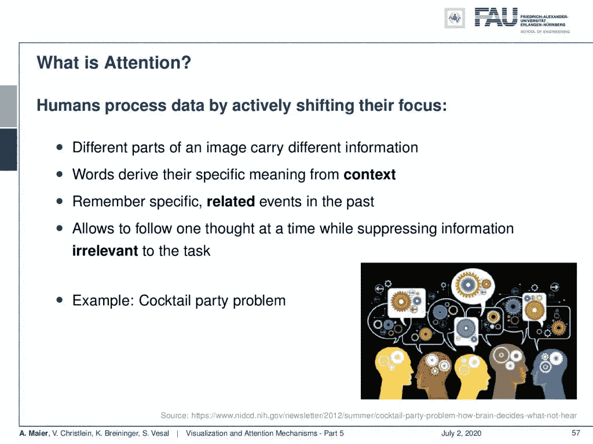

什么是注意力？ [CC 下的图片来自](https://creativecommons.org/licenses/by/4.0/)[深度学习讲座](https://www.youtube.com/watch?v=p-_Stl0t3kU&list=PLpOGQvPCDQzvgpD3S0vTy7bJe2pf_yJFj&index=1)的 4.0 。

那么，什么是注意力呢？你看，人类通过转移我们的注意力来主动处理数据。因此，我们可以专注于图像的特定部分，因为它们携带不同的信息。当然，对于某些词，比如我们只能通过上下文推导出正确的意思。所以你想转移注意力，你转移注意力的方式也可能改变解读。所以，你想记住过去特定的相关事件，以便影响某个决定。这允许我们一次跟随一个部分，同时抑制与任务无关的信息。这就是我们的想法:你只需要关注相关的信息。你能想到的一个例子是鸡尾酒会问题。我们有很多不同的人在谈论，而你只关注一个人。通过特定的方式，比如看那个人的嘴唇，你可以把注意力集中在嘴唇上。然后你也可以使用你的立体声听觉作为一种波束形成器，只听那个特定的方向。这样做，你就能集中注意力在一个人身上，这个人就是你用这种注意力机制与之交谈的人。我们非常成功地做到了这一点，因为否则，我们将完全无法举办鸡尾酒会。

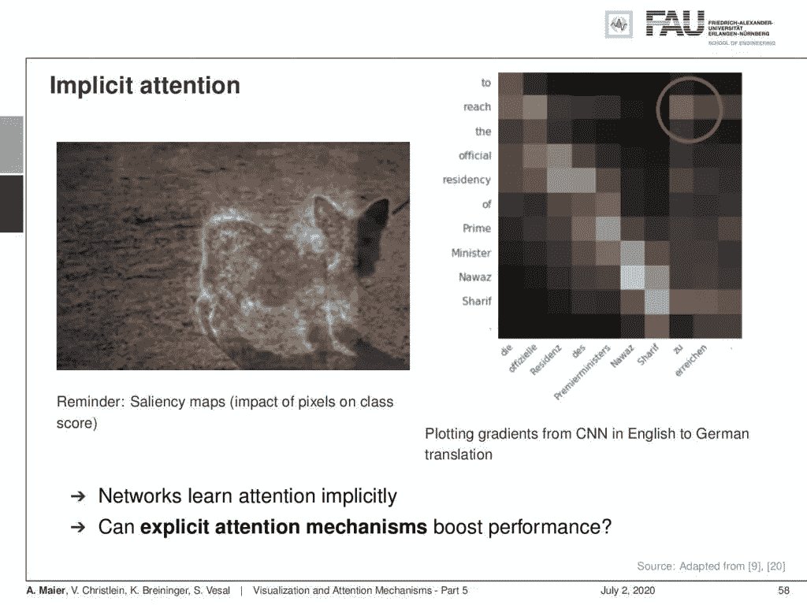

一些引起注意的想法。 [CC 下的图片来自](https://creativecommons.org/licenses/by/4.0/)[深度学习讲座](https://www.youtube.com/watch?v=p-_Stl0t3kU&list=PLpOGQvPCDQzvgpD3S0vTy7bJe2pf_yJFj&index=1)的 4.0 。

那么这个想法是什么呢？好吧，你已经在地图上看到了那些显著性。你可能会说我们只想看与我们决策相关的像素。为了做出决定，事实上，我们不会从图像开始，但我们想先谈谈序列到序列模型。在这里，您可以看到 CNN 类型的模型的梯度可视化，如果您现在开始绘制这些梯度，该模型用于从英语到德语的翻译。这基本上是我们在图像处理中已经讨论过的可视化技术。现在，您可以看到相应输出相对于特定输入的梯度。如果你这样做，你会注意到在大多数情况下，你会看到这基本上是一个线性关系。英语和德语在词汇方面有非常相似的序列。然后你会看到，以“到达纳瓦兹·谢里夫总理的官方住所”开始的序列的实际开始被翻译为“总理纳瓦兹·谢里夫·祖·埃雷钦的住所”。所以，“zu erreichen”是“to reach ”,但“to reach”在英语中是第一个，在德语中是最后一个。所以，这两者之间有很长的时间背景。这两个词实质上翻译成那两个。因此，我们可以利用梯度反向传播产生的信息来计算出输入序列的哪些部分与输出序列的哪些部分相关。现在的问题是，我们如何利用这一点来提高性能。

使用 RNNs 的机器翻译。 [CC 下的图片来自](https://creativecommons.org/licenses/by/4.0/)[深度学习讲座](https://www.youtube.com/watch?v=p-_Stl0t3kU&list=PLpOGQvPCDQzvgpD3S0vTy7bJe2pf_yJFj&index=1)的 4.0 。

让我们看一个典型的翻译模型。那么，如果你使用递归神经网络，通常在序列模型中做什么？你要做的是在编码器网络中进行前向传递。这接收一个输入序列。根据输入序列，正如我们之前讨论的，我们可以计算隐藏状态 **h** 下标 1 到 **h** 下标 T。因此，我们必须处理整个序列，以便计算 **h** 下标 T。然后， **h** 下标 T 用作解码器网络的上下文向量。所以， **h** 下标 T 本质上是这个句子的状态或实际意义的表示。然后， **h** 下标 T 被解码器网络解码成新的序列。然后，这产生了自己的隐藏状态的新序列，它们是 **s** 下标 1 到 **s** 下标 T’。所以请注意，输出当然可以是不同的长度。所以，我们有两个不同的字符串 T 和 T '。这也产生一个输出序列 **y** 下标 1 到 **y** 下标 T’。所以，这允许我们在输入和输出中模拟不同的长度，当然，在两种不同的语言中，你可能有不同数量的单词。

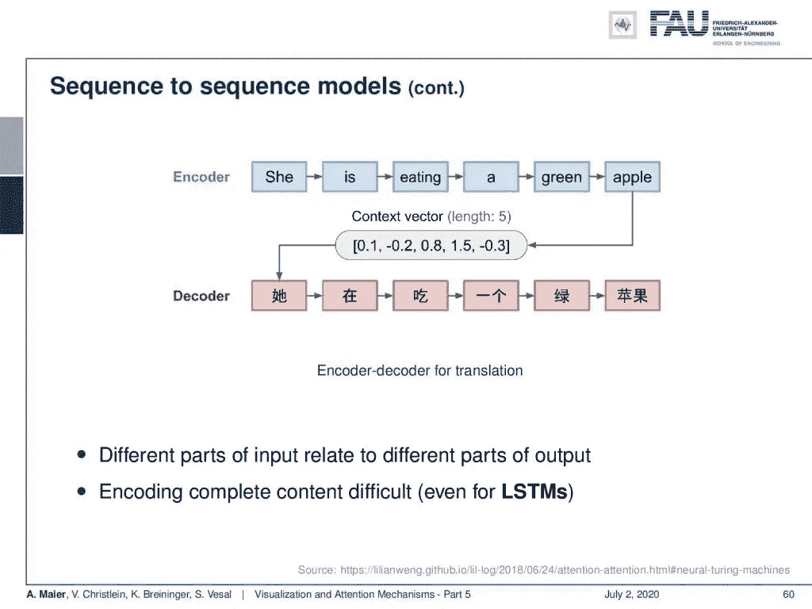

整个句子必须被编码成单个状态向量。下图 [CC BY 4.0](https://creativecommons.org/licenses/by/4.0/) 来自[深度学习讲座](https://www.youtube.com/watch?v=p-_Stl0t3kU&list=PLpOGQvPCDQzvgpD3S0vTy7bJe2pf_yJFj&index=1)。

所以，当我们真正解码的时候。然后，你看到我们必须把所有东西都编码到这个上下文向量中，这种编码可能非常困难，因为我们必须把句子的全部意思编码到一个上下文向量中。即使对 LSTMs 来说，这也可能非常困难。

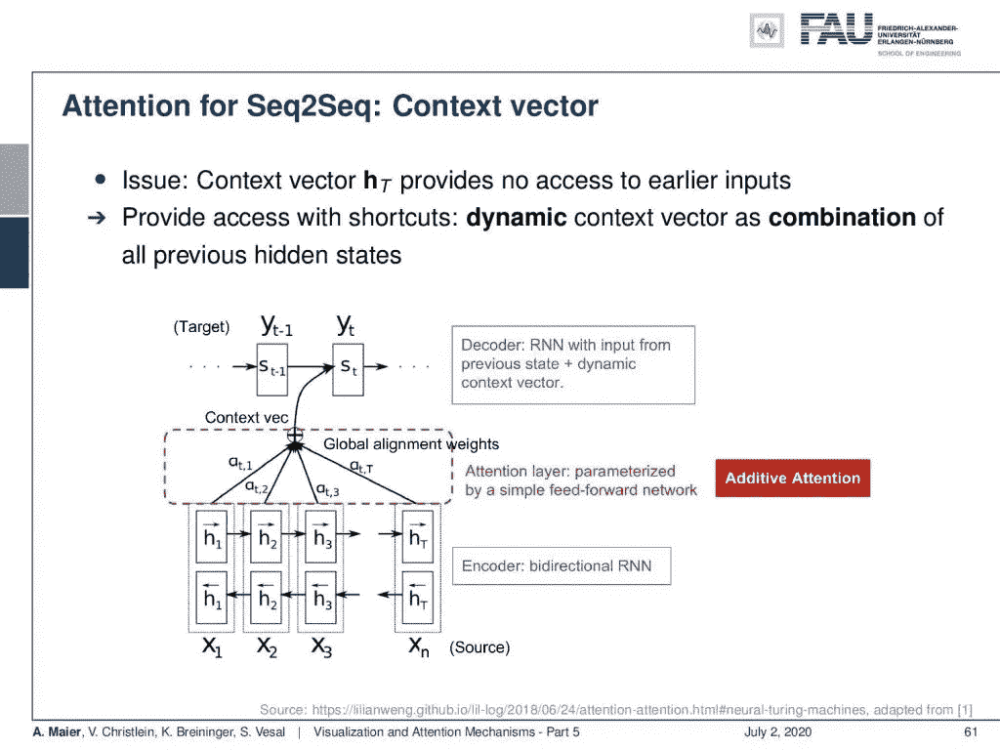

注意力允许建立一个动态的焦点模型。 [CC 下的图片来自](https://creativecommons.org/licenses/by/4.0/)[深度学习讲座](https://www.youtube.com/watch?v=p-_Stl0t3kU&list=PLpOGQvPCDQzvgpD3S0vTy7bJe2pf_yJFj&index=1)的 4.0 。

所以，现在的想法是引入注意力。注意序列到序列的建模可以用动态上下文向量来完成。现在我们有了这个上下文向量 **h** 下标 T。我们的问题是这个上下文向量 **h** 下标 T，它不允许对更早的输入进行任何访问，因为它只在序列的最末尾获得。因此，现在的想法是使用动态上下文向量作为所有先前隐藏状态的组合来提供对所有上下文的访问。

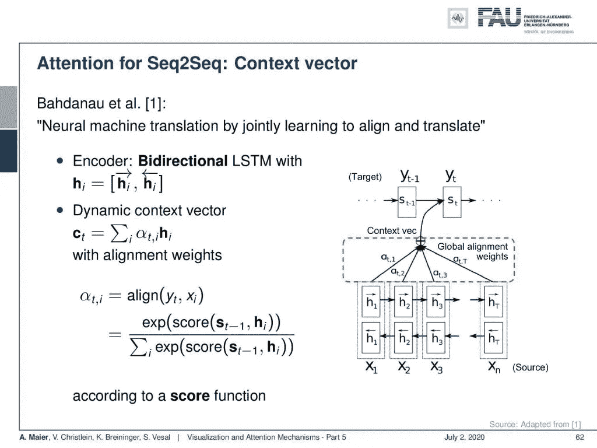

动态内容向量的构造。来自[深度学习讲座](https://www.youtube.com/watch?v=p-_Stl0t3kU&list=PLpOGQvPCDQzvgpD3S0vTy7bJe2pf_yJFj&index=1)的 [CC BY 4.0](https://creativecommons.org/licenses/by/4.0/) 下的图片。

这里，我们看到一个双向 RNN，它通过前向传递进行一次编码。所以，你从 x 下标 1 开始，创建一个隐藏状态 1，然后到 x2，依此类推。然后，你运行完全相反的序列。所以，你从 x 下标 n 开始，然后到 x 下标(n-1)来创建另一个上下文向量，这个向量完全来自对同一输入序列的反向处理。这样你就可以访问几个隐藏状态，这些隐藏状态，我们可以从两个通道中连接起来。有了这些隐藏状态，我们就可以用一些组合权重α进行线性组合。这是不同隐藏状态的加权平均值。因此，我们将它们乘以各自的α，将它们相加，并将其作为解码器 RNN 的附加动态上下文。所以，这个想法是，我们想用一个动态的过程来产生这些权重α。

好吧。那么，让我们看看我们如何实际计算这些α。在[1]中提出的想法是，你基本上试图产生对齐权重。因此，如果状态与解码中的当前观察相关，那么你想要得到高分。如果州不是那么相关，那么你想给它打低分。因此，α编码了当前状态相对于当前产生的输出的相关性。现在，你可能会说“好吧。那么，我怎样才能得到这个分数呢？”所以，当然，我们可以把它放到某个 softmax 函数里。然后，它们将在 0 和 1 之间缩放。这就解决了问题。因此，我们可以产生任何类型的相似性度量，并且我们实际上可以提出不同的方法。

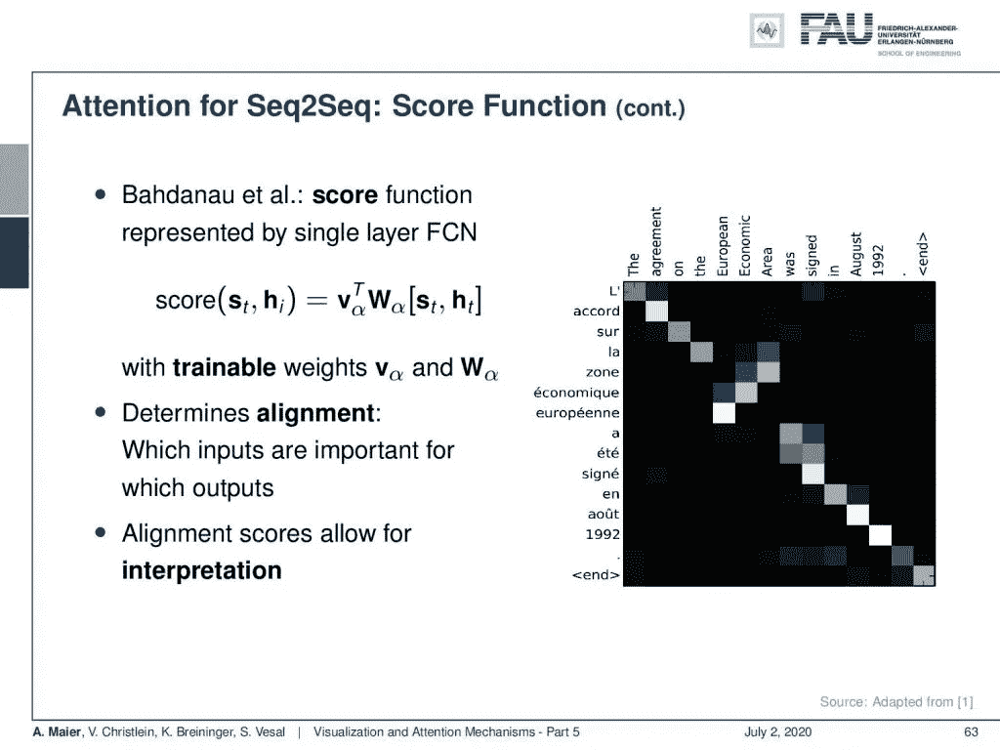

另一个翻译例子。 [CC 下的图片来自](https://creativecommons.org/licenses/by/4.0/)[深度学习讲座](https://www.youtube.com/watch?v=p-_Stl0t3kU&list=PLpOGQvPCDQzvgpD3S0vTy7bJe2pf_yJFj&index=1)的 4.0 。

他们在[1]中提出的实际上是一个得分函数。现在，得分函数由矩阵 **W** 下标α和附加向量 **v** 下标α表示。这两个是可以训练的。因此，我们本质上利用了通用函数逼近的这一特性，我们不必设置得分函数，而是简单地训练它。因此，它决定了理想的对齐方式，即哪些输入对哪些输出很重要。好的一面是，您还可以可视化特定输入的权重。所以，它也允许通过看分数来解释。我们在右边的例子中这样做。这又是一个翻译设置，我们希望将英语翻译成法语。你可以看到这些排列基本上形成了一条线。但是有一个例外。所以你看到“欧洲经济区”被解码成“欧洲经济区”。所以，你可以看到有一个序列的反转，这个序列的反转也被比对分数在注意力中捕获。这是一个很好的计算得分函数的方法。

不同的得分函数。来自[深度学习讲座](https://www.youtube.com/watch?v=p-_Stl0t3kU&list=PLpOGQvPCDQzvgpD3S0vTy7bJe2pf_yJFj&index=1)的 [CC BY 4.0](https://creativecommons.org/licenses/by/4.0/) 下的图片。

有不同的选择。例如，在[7]中，他们简单地用两个状态之间的余弦来构成分数。你可以用一些权重矩阵得到一个广义内积，你可以得到一个点积，它本质上是两个状态之间的相关性，然后你还可以得到一个比例点积，它也考虑了隐藏状态的大小。所有这些都已经被探索过了，当然，这取决于你的目的，你实际计算的是什么。但是你可以看到，我们本质上是在尝试学习一个比较函数，它告诉我们哪个状态与哪个其他状态兼容。

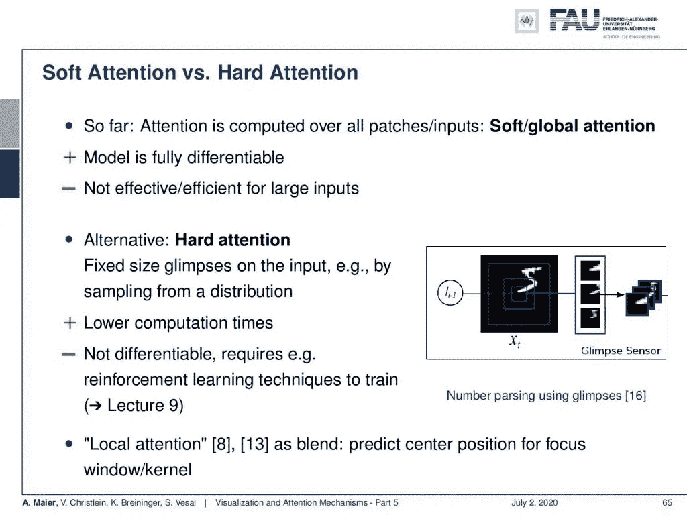

比较中的软硬注意。 [CC 下的图片来自](https://creativecommons.org/licenses/by/4.0/)[深度学习讲座](https://www.youtube.com/watch?v=p-_Stl0t3kU&list=PLpOGQvPCDQzvgpD3S0vTy7bJe2pf_yJFj&index=1)的 4.0 。

好的。注意力有不同的种类。有软注意力和硬注意力之分。因此，到目前为止，我们基本上拥有完全可区分的软/全局注意力。但是对于大量的输入来说效率不是很高。你可以通过集中注意力来缓解。在这里，您可以看到一些输入。所以，你从图像中取出小块，从分布中取样。这当然意味着更低的计算时间。但不幸的是，采样过程是不可微的。然后，你将不得不研究其他的训练技巧，比如强化学习来训练这种能力。这需要更长的计算时间。所以，这是硬注意力的某种弊端。还有像局部注意力这样的东西，这是一种混合，你可以预测焦点和窗口或内核的中心位置。所以，让我们看看我们能做些什么。

《出席秀》报纸。 [CC 下的图片来自](https://creativecommons.org/licenses/by/4.0/)[深度学习讲座](https://www.youtube.com/watch?v=p-_Stl0t3kU&list=PLpOGQvPCDQzvgpD3S0vTy7bJe2pf_yJFj&index=1)的 4.0 。

你甚至可以把注意力和图像识别结合起来。有一份报纸[24]叫做《展示-出席-讲述》。它实际上有一个想法，你想有一个自动生成的图像标题。不同的元素在它们的图像中的关系触发不同的词。因此，这意味着注意力机制被用来提高字幕质量。这是如何工作的？你现在可以看到，我们可以计算一个特定单词的注意力。

软注意的一个例子。来自[深度学习讲座](https://www.youtube.com/watch?v=p-_Stl0t3kU&list=PLpOGQvPCDQzvgpD3S0vTy7bJe2pf_yJFj&index=1)的 [CC BY 4.0](https://creativecommons.org/licenses/by/4.0/) 下的图片。

这里，你看到生成的句子是“一个女人在公园里扔飞盘”。现在，我们可以把飞盘和这张注意力地图联系起来，你可以看到我们实际上是在图像中定位飞盘。因此，这实际上是一种非常好的方式，使用 CNN 特征图来将注意力集中在相应位置的相应解码上。

软注意力和硬注意力。 [CC 下的图片来自](https://creativecommons.org/licenses/by/4.0/)[深度学习讲座](https://www.youtube.com/watch?v=p-_Stl0t3kU&list=PLpOGQvPCDQzvgpD3S0vTy7bJe2pf_yJFj&index=1)的 4.0 。

这里有一个软注意和硬注意的比较。你可以看到，注意力地图是柔和产生的，它们更模糊，也不局限于局部，而强烈的注意力只看小块。这就是我们设计它的方式，但这两种技术都允许我们生成更好的图像描述。确定性软注意可以进行端到端的训练。好吧，对于硬注意力，我们必须使用强化学习来训练。[24]表明两种注意机制产生相同的单词序列。所以，它实际上工作得很好，你有这个副产品，你现在还可以在图像中定位东西。非常有趣的方法！

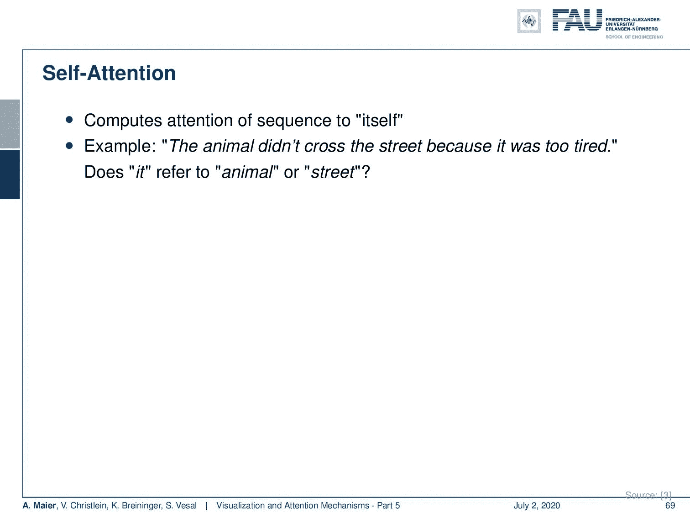

自我关注的概念。 [CC 下的图片来自](https://creativecommons.org/licenses/by/4.0/)[深度学习讲座](https://www.youtube.com/watch?v=p-_Stl0t3kU&list=PLpOGQvPCDQzvgpD3S0vTy7bJe2pf_yJFj&index=1)的 4.0 。

你也可以用一种叫做“自我关注”的东西来扩展这一点。这里的想法是计算序列对自身的关注度。所以，我们想要解决的问题是，如果你有一些输入，比如“动物没有穿过街道，因为它太累了。”，那么我们想知道“它”是指“动物”还是“街道”。现在，我们的想法是用上下文信息来丰富标记的表示。当然，这是机器阅读、问题回答、推理等的一项重要技术。我们这里有一个例子:“联邦调查局正在追捕一名逃犯。”现在，我们要做的是计算序列对自身的关注度。这允许我们将输入的每个单词与输入的其他单词相关联。所以，我们可以产生这种自我关注。

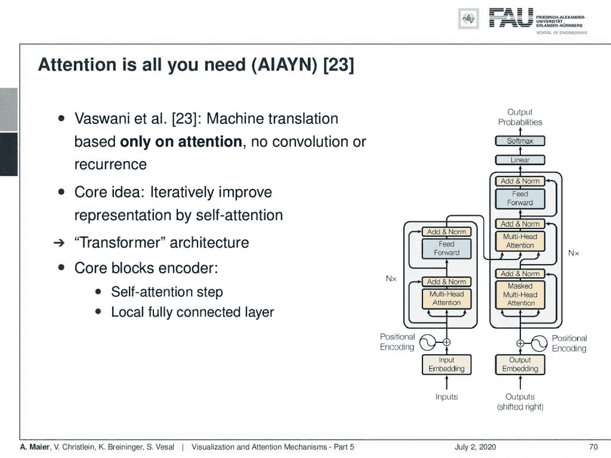

概述你所需要的就是关注建筑。来自[深度学习讲座](https://www.youtube.com/watch?v=p-_Stl0t3kU&list=PLpOGQvPCDQzvgpD3S0vTy7bJe2pf_yJFj&index=1)的 [CC BY 4.0](https://creativecommons.org/licenses/by/4.0/) 下的图片。

这为什么有用？你可以看到，你也可以用它来进行机器翻译。他们提出的网络只是基于注意力。所以，机器翻译没有卷积，也没有递归。所以，注意力是你所需要的。现在的核心思想是通过这种自我关注机制来迭代地改善表现。这就产生了一种变压器架构。它有两个核心模块和编码器，这是自我注意步骤，以及用于合并不同注意头的局部全连接层。

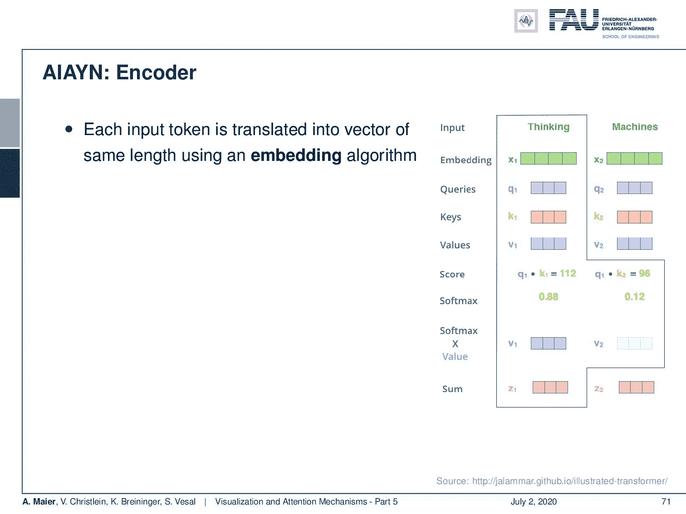

编码器使用自我关注。 [CC 下的图片来自](https://creativecommons.org/licenses/by/4.0/)[深度学习讲座](https://www.youtube.com/watch?v=p-_Stl0t3kU&list=PLpOGQvPCDQzvgpD3S0vTy7bJe2pf_yJFj&index=1)的 4.0 。

因此，让我们更详细地看看它们。当然，你需要一个编码器。我们已经看到，对于单词，我们可以使用一次热编码。这是一种非常粗糙的表示。所以，你需要注意的就是网络学习嵌入算法。因此，使用通用函数逼近器来产生嵌入，以某种方式压缩输入。然后，它计算每个标记的自我关注度。所以，你可以说你有一个查询令牌，一个描述查询的关键字，你为潜在的信息产生一个值。它们是使用可训练的权重生成的。然后，查询和键之间的对齐是一个缩放的点积，它决定了 **v** 中元素的影响。因此，我们可以将其表示为 **q** 和 **k** 的外积的 softmax，然后将其乘以向量 **v** 以产生关注值。

你需要注意的是编码器和解码器。来自[深度学习讲座](https://www.youtube.com/watch?v=p-_Stl0t3kU&list=PLpOGQvPCDQzvgpD3S0vTy7bJe2pf_yJFj&index=1)的 4.0CC 下的图片。

现在有了这种关注，我们实际上有了多头关注。所以，我们不只是计算单一的注意力，而是每个标记的不同版本的注意力。这用于表示不同的子空间。然后，使用全连接层来重新组合该本地每令牌信息。然后将其堆叠起来，并使用[23]中的几个注意模块。因此，这允许一步一步的上下文集成。他们有一个额外的定位器编码来表示词序。这是现在的输入嵌入。现在，如果你看看解码器，它基本上遵循与编码器相同的概念。有一个额外的输入/输出注意步骤，自我注意只在先前的输出上计算。

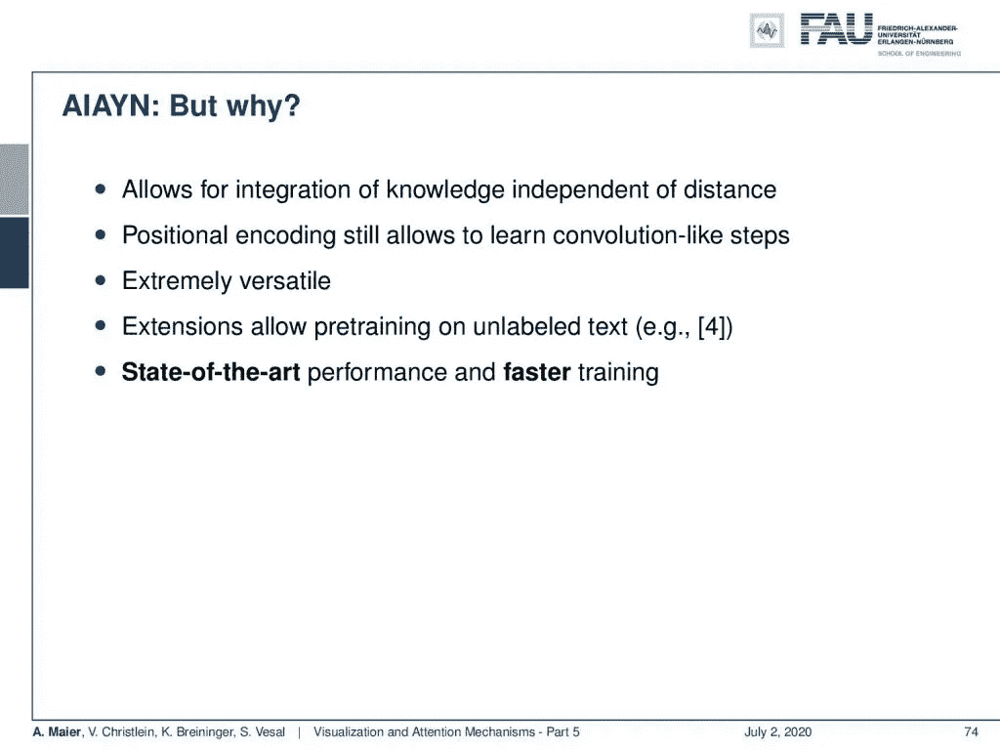

为什么要用“注意力是你所需要的全部”？来自[深度学习讲座](https://www.youtube.com/watch?v=p-_Stl0t3kU&list=PLpOGQvPCDQzvgpD3S0vTy7bJe2pf_yJFj&index=1)的 4.0CC 下的图片。

你可能会说我们为什么要这么做？嗯，它允许独立于距离的知识整合。这种位置编码仍然允许我们学习卷积一样的步骤。它非常通用，扩展甚至允许使用未标记的文本进行预训练，正如你在[4]中看到的。所以参照物就是所谓的伯特系统。BERT 完全由未标记的文本通过本质上预测文本序列而生成。对于许多不同的自然语言处理任务，BERT 嵌入已经被证明是非常强大的。一个非常流行的系统，用于在自然语言处理中生成无监督的特征表示。这些系统具有最先进的性能和更快的训练时间。

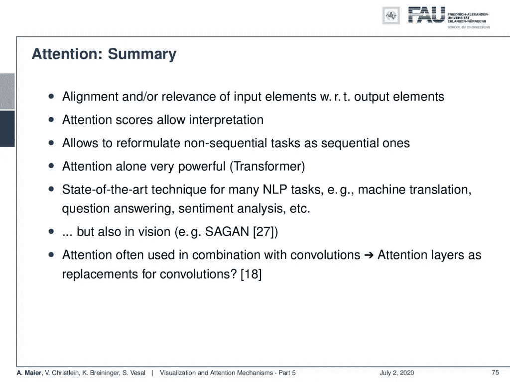

本单元总结。 [CC 下的图片来自](https://creativecommons.org/licenses/by/4.0/)[深度学习讲座](https://www.youtube.com/watch?v=p-_Stl0t3kU&list=PLpOGQvPCDQzvgpD3S0vTy7bJe2pf_yJFj&index=1)的 4.0 。

好吧。所以，让我们总结一下注意力。注意力是基于这样一种想法，即你希望将输入元素与特定的输出元素对齐或找出它们之间的相关性。注意力分数允许解释。它允许我们将非顺序任务重新表述为顺序任务。注意力本身就非常强大，因为它是一种转换机制。许多自然语言处理任务的最新技术都涉及到这些注意力机制。它在机器翻译、问题回答、情感分析等方面非常流行。但是它也被应用于视觉，例如在[27]中。当然，注意力也可以与卷积结合使用，但也有一个问题，即注意力层是否也可以被视为卷积的替代物，如[18]所示。

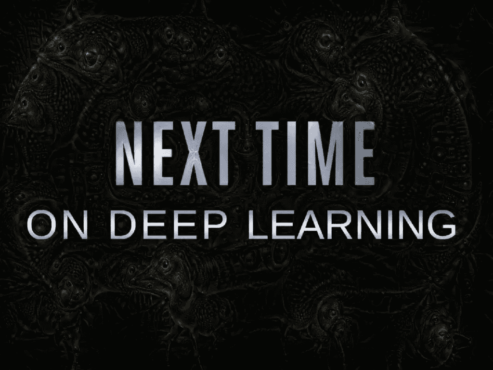

在这个深度学习讲座中，更多令人兴奋的事情即将到来。来自[深度学习讲座](https://www.youtube.com/watch?v=p-_Stl0t3kU&list=PLpOGQvPCDQzvgpD3S0vTy7bJe2pf_yJFj&index=1)的 [CC BY 4.0](https://creativecommons.org/licenses/by/4.0/) 下的图片。

好吧。那么，下一次在深度学习中，接下来会发生什么？好了，接下来是深度强化学习！非常酷的技术。我们将会有几个关于这个的视频，我们想真正向你展示这个范例。如何为玩某些游戏产生超人的表现？因此，我们的策略是，我们希望训练能够在特定环境中解决特定任务的代理。我们将向你展示一种从玩游戏本身来确定游戏策略的算法。在这里，神经网络正在超越感知，真正做出决策。如果你看了接下来的几个视频，你也会得到指导，如何在雅达利游戏中最终击败你所有的朋友。我们还将向你展示一个在围棋中击败所有人类的秘方。所以，请继续关注我们。观看接下来的几个视频。

综合题。 [CC 下的图片来自](https://creativecommons.org/licenses/by/4.0/)[深度学习讲座](https://www.youtube.com/watch?v=p-_Stl0t3kU&list=PLpOGQvPCDQzvgpD3S0vTy7bJe2pf_yJFj&index=1)的 4.0 。

如果你想和我们一起备考，看看下面几个问题就好了:为什么可视化很重要？每个人都应该知道“什么是反例？”。此外，你应该能够描述所使用的技术。基于梯度的可视化技术、基于优化的技术、概念论和反演技术。为什么在第三层之后切断你的网络并只保留激活是不安全的？当然，如果你知道网络架构，它们是可以反过来的。因此，如果你存储激活，它可能是不安全和匿名的。我们有一些进一步阅读的链接。特别是深度可视化工具箱真的很有用。特别是，如果你想学习更多关于注意力技巧的知识，我们在这个视频中只是粗略地介绍了一下，关于这个还有很多要说的。但是接下来我们将不得不深入序列建模和机器翻译，我们无法在本课程中详细介绍。非常感谢您的收听，希望在下一段视频中见到您。拜拜。

如果你喜欢这篇文章，你可以在这里找到更多的文章，或者看看我们的讲座。如果你想在未来了解更多的文章、视频和研究，我也会很感激关注 [YouTube](https://www.youtube.com/c/AndreasMaierTV) 、 [Twitter](https://twitter.com/maier_ak) 、[脸书](https://www.facebook.com/andreas.maier.31337)或 [LinkedIn](https://www.linkedin.com/in/andreas-maier-a6870b1a6/) 。本文以 [Creative Commons 4.0 归属许可](https://creativecommons.org/licenses/by/4.0/deed.de)发布，如果引用，可以转载和修改。如果你有兴趣从视频讲座中获得文字记录，试试[自动博客](http://autoblog.tf.fau.de/)。

# 链接

[约辛斯基等人:深度可视化工具箱](http://yosinski.com/deepvis)
[奥拉等人:特征可视化](https://distill.pub/2017/feature-visualization/)
[亚当哈雷:MNIST 演示](http://scs.ryerson.ca/~aharley/vis/conv/)

# 参考

[1] Dzmitry Bahdanau, Kyunghyun Cho, and Yoshua Bengio. “Neural Machine Translation by Jointly Learning to Align and Translate”. In: 3rd International Conference on Learning Representations, ICLR 2015, San Diego, 2015.
[2] T. B. Brown, D. Mané, A. Roy, et al. “Adversarial Patch”. In: ArXiv e-prints (Dec. 2017). arXiv: 1712.09665 [cs.CV].
[3] Jianpeng Cheng, Li Dong, and Mirella Lapata. “Long Short-Term Memory-Networks for Machine Reading”. In: CoRR abs/1601.06733 (2016). arXiv: 1601.06733.
[4] Jacob Devlin, Ming-Wei Chang, Kenton Lee, et al. “BERT: Pre-training of Deep Bidirectional Transformers for Language Understanding”. In: CoRR abs/1810.04805 (2018). arXiv: 1810.04805.
[5] Neil Frazer. Neural Network Follies. 1998\. URL: [https://neil.fraser.name/writing/tank/](https://neil.fraser.name/writing/tank/) (visited on 01/07/2018).
[6] Ross B. Girshick, Jeff Donahue, Trevor Darrell, et al. “Rich feature hierarchies for accurate object detection and semantic segmentation”. In: CoRR abs/1311.2524 (2013). arXiv: 1311.2524.
[7] Alex Graves, Greg Wayne, and Ivo Danihelka. “Neural Turing Machines”. In: CoRR abs/1410.5401 (2014). arXiv: 1410.5401.
[8] Karol Gregor, Ivo Danihelka, Alex Graves, et al. “DRAW: A Recurrent Neural Network For Image Generation”. In: Proceedings of the 32nd International Conference on Machine Learning. Vol. 37\. Proceedings of Machine Learning Research. Lille, France: PMLR, July 2015, pp. 1462–1471.
[9] Nal Kalchbrenner, Lasse Espeholt, Karen Simonyan, et al. “Neural Machine Translation in Linear Time”. In: CoRR abs/1610.10099 (2016). arXiv: 1610.10099.
[10] L. N. Kanal and N. C. Randall. “Recognition System Design by Statistical Analysis”. In: Proceedings of the 1964 19th ACM National Conference. ACM ’64\. New York, NY, USA: ACM, 1964, pp. 42.501–42.5020.
[11] Andrej Karpathy. t-SNE visualization of CNN codes. URL: [http://cs.stanford.edu/people/karpathy/cnnembed/](http://cs.stanford.edu/people/karpathy/cnnembed/) (visited on 01/07/2018).
[12] Alex Krizhevsky, Ilya Sutskever, and Geoffrey E Hinton. “ImageNet Classification with Deep Convolutional Neural Networks”. In: Advances In Neural Information Processing Systems 25\. Curran Associates, Inc., 2012, pp. 1097–1105\. arXiv: 1102.0183.
[13] Thang Luong, Hieu Pham, and Christopher D. Manning. “Effective Approaches to Attention-based Neural Machine Translation”. In: Proceedings of the 2015 Conference on Empirical Methods in Natural Language Lisbon, Portugal: Association for Computational Linguistics, Sept. 2015, pp. 1412–1421.
[14] A. Mahendran and A. Vedaldi. “Understanding deep image representations by inverting them”. In: 2015 IEEE Conference on Computer Vision and Pattern Recognition (CVPR). June 2015, pp. 5188–5196.
[15] Andreas Maier, Stefan Wenhardt, Tino Haderlein, et al. “A Microphone-independent Visualization Technique for Speech Disorders”. In: Proceedings of the 10th Annual Conference of the International Speech Communication Brighton, England, 2009, pp. 951–954.
[16] Volodymyr Mnih, Nicolas Heess, Alex Graves, et al. “Recurrent Models of Visual Attention”. In: CoRR abs/1406.6247 (2014). arXiv: 1406.6247.
[17] Chris Olah, Alexander Mordvintsev, and Ludwig Schubert. “Feature Visualization”. In: Distill (2017). [https://distill.pub/2017/feature-visualization.](https://distill.pub/2017/feature-visualization.)
[18] Prajit Ramachandran, Niki Parmar, Ashish Vaswani, et al. “Stand-Alone Self-Attention in Vision Models”. In: arXiv e-prints, arXiv:1906.05909 (June 2019), arXiv:1906.05909\. arXiv: 1906.05909 [cs.CV].
[19] Mahmood Sharif, Sruti Bhagavatula, Lujo Bauer, et al. “Accessorize to a Crime: Real and Stealthy Attacks on State-of-the-Art Face Recognition”. In: Proceedings of the 2016 ACM SIGSAC Conference on Computer and Communications CCS ’16\. Vienna, Austria: ACM, 2016, pp. 1528–1540\. A.
[20] K. Simonyan, A. Vedaldi, and A. Zisserman. “Deep Inside Convolutional Networks: Visualising Image Classification Models and Saliency Maps”. In: International Conference on Learning Representations (ICLR) (workshop track). 2014.
[21] J.T. Springenberg, A. Dosovitskiy, T. Brox, et al. “Striving for Simplicity: The All Convolutional Net”. In: International Conference on Learning Representations (ICRL) (workshop track). 2015.
[22] Dmitry Ulyanov, Andrea Vedaldi, and Victor S. Lempitsky. “Deep Image Prior”. In: CoRR abs/1711.10925 (2017). arXiv: 1711.10925.
[23] Ashish Vaswani, Noam Shazeer, Niki Parmar, et al. “Attention Is All You Need”. In: CoRR abs/1706.03762 (2017). arXiv: 1706.03762.
[24] Kelvin Xu, Jimmy Ba, Ryan Kiros, et al. “Show, Attend and Tell: Neural Image Caption Generation with Visual Attention”. In: CoRR abs/1502.03044 (2015). arXiv: 1502.03044.
[25] Jason Yosinski, Jeff Clune, Anh Mai Nguyen, et al. “Understanding Neural Networks Through Deep Visualization”. In: CoRR abs/1506.06579 (2015). arXiv: 1506.06579.
[26] Matthew D. Zeiler and Rob Fergus. “Visualizing and Understanding Convolutional Networks”. In: Computer Vision — ECCV 2014: 13th European Conference, Zurich, Switzerland, Cham: Springer International Publishing, 2014, pp. 818–833.
[27] Han Zhang, Ian Goodfellow, Dimitris Metaxas, et al. “Self-Attention Generative Adversarial Networks”. In: Proceedings of the 36th International Conference on Machine Learning. Vol. 97\. Proceedings of Machine Learning Research. Long Beach, California, USA: PMLR, Sept. 2019, pp. 7354–7363\. A.