# 用 Plotly 实现时间序列交换数据的可视化

> 原文：<https://towardsdatascience.com/visualization-for-timeseries-exchange-data-8c9f50d4d2d4?source=collection_archive---------17----------------------->

最近，我有机会处理 crypto exchange 公共数据，这使我能够使用最好的可视化工具之一的 [Plotly](https://plot.ly/) 库可视化地探索数据，因为它将使我们能够拥有通用的交互式图形，而不用担心编码部分——就像我过去使用 Bokeh 一样。

如果您使用笔记本进行分析，为了保持整洁，我建议您在一个. py 文件中编写帮助函数，然后导入它。

我将分享代码，这样您将能够看到 Plotly 是如何工作的，并将其用于您的数据

所以让我们开始吧！

## 了解数据

像往常一样，首先要做的是获得对数据的直觉，这样我们可以更有效地采用哪种可视化。

在这种情况下，数据是一组不同的文件，每天都包含关于订单深度的信息( **DOB 文件**)和交易(**交易文件**)。

第一个操作是收集所有文件并将其聚合，构建一个包含某个时间范围内(在本例中为四个月)所有数据的数据框架。

DOB 数据包含最好的 5 个要价和 5 个出价水平，包括价格和大小，从最好到最差以及时间戳数据。

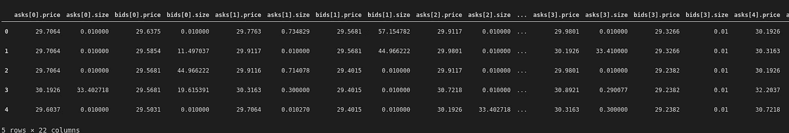

交易数据包含已执行交易的信息，包括价格、基数和接受方(买入或卖出)。

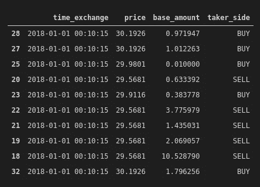

没有什么特别奇特的，所以让我们开始做一些 EDA。

## DOB EDA

箱线图是可视化数据分布的最酷的方式之一，所以让我们从它们开始，看看大小和价格

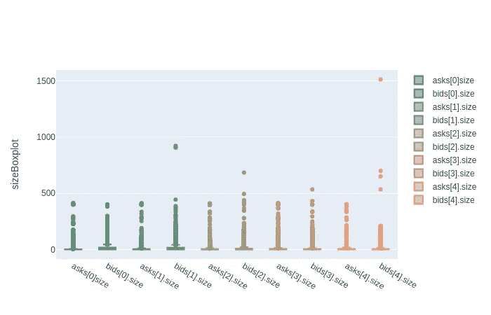

尺寸盒图

我们已经可以看到数据是倾斜的，因为中值非常低，并且有明显的异常值。让我们放大，Plotly 的一些东西，你可以直接在图形上做，同时有数字信息执行鼠标悬停。

此外，只需点击图例，就可以进行过滤。

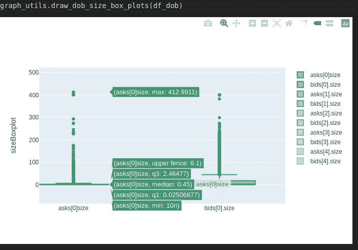

我们可以看到中间值是 0.45，最大值等于 412，中间有很多异常值。

代码:

```
import plotly.graph_objs as go# specific function
def draw_dob_size_box_plots(df_dob):
    _draw_dob_box_plots(df_dob, 'size')# generic "private" function
def _draw_dob_box_plots(df_dob, size_or_price):
    trace_asks0 = go.Box(
        y=df_dob['asks[0].' + size_or_price],
        name='asks[0]' + size_or_price,
        marker=dict(
            color='#3D9970'
        )
    )
    trace_bids0 = go.Box(
        y=df_dob['bids[0].' + size_or_price],
        name='bids[0].' + size_or_price,
        marker=dict(
            color='#3D9970'
        )
    )
    trace_asks1 = go.Box(
        y=df_dob['asks[1].' + size_or_price],
        name='asks[1].' + size_or_price,
        marker=dict(
            color='#6D9970'
        )
    )
    trace_bids1 = go.Box(
        y=df_dob['bids[1].' + size_or_price],
        name='bids[1].' + size_or_price,
        marker=dict(
            color='#6D9970'
        )
    )
    trace_asks2 = go.Box(
        y=df_dob['asks[2].' + size_or_price],
        name='asks[2].' + size_or_price,
        marker=dict(
            color='#9D9970'
        )
    )
    trace_bids2 = go.Box(
        y=df_dob['bids[2].' + size_or_price],
        name='bids[2].' + size_or_price,
        marker=dict(
            color='#9D9970'
        )
    )
    trace_asks3 = go.Box(
        y=df_dob['asks[3].' + size_or_price],
        name='asks[3].' + size_or_price,
        marker=dict(
            color='#BD9970'
        )
    )
    trace_bids3 = go.Box(
        y=df_dob['bids[3].' + size_or_price],
        name='bids[3].' + size_or_price,
        marker=dict(
            color='#BD9970'
        )
    )
    trace_asks4 = go.Box(
        y=df_dob['asks[4].' + size_or_price],
        name='asks[4].' + size_or_price,
        marker=dict(
            color='#ED9970'
        )
    )
    trace_bids4 = go.Box(
        y=df_dob['bids[4].' + size_or_price],
        name='bids[4].' + size_or_price,
        marker=dict(
            color='#ED9970'
        )
    )data = [trace_asks0, trace_bids0, trace_asks1, trace_bids1,                          trace_asks2, trace_bids2, \
            trace_asks3, trace_bids3, trace_asks4, trace_bids4]
    layout = go.Layout(
        yaxis=dict(
            title=size_or_price + 'Boxplot',
            zeroline=False
        )
    )
    fig = go.Figure(data=data, layout=layout)
    fig.show()
```

正如您所看到的，代码很简单:您从特定的源构建不同的数据可视化，设置特定的可视化选项，然后将所有这些放在一起。所以，用相对较少的线条，就有可能构建一个具有多重数据和交互的图形。

让我们在价格上做同样的事情


价格箱线图

在这里，数据不那么倾斜，但是异常值清晰可见。

如果你想了解更多关于箱线图的知识，从这里的[开始](https://en.wikipedia.org/wiki/Box_plot)。

当我们处理时间序列时，时间是一个相关的因素。让我们开始看看数据是如何随时间分布的。

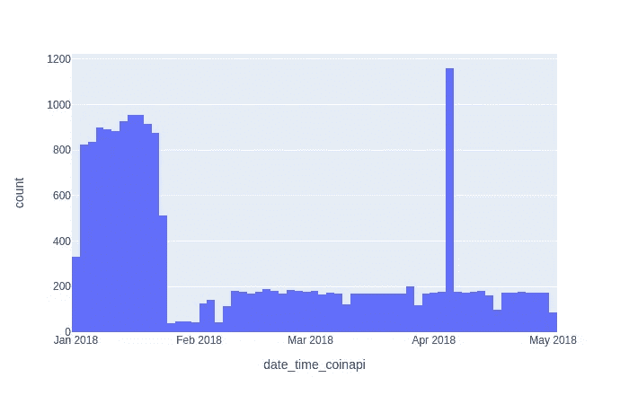

DOB 数据直方图

我们可以在一月份看到大量的元素，甚至在四月份看到一个峰值。

为了说明构建此图是多么容易，下面是使用的代码:

```
import plotly.express as pxdf = px.data.tips()
fig = px.histogram(df_dob, x=”date_time_coinapi”)
fig.show()
```

让我们看看买卖价格是如何随时间变化的。为了简单起见，我只放第一层，但是代码会呈现所有层。

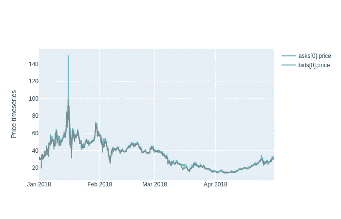

要价和出价第一级

放大查看一些数值超级简单。

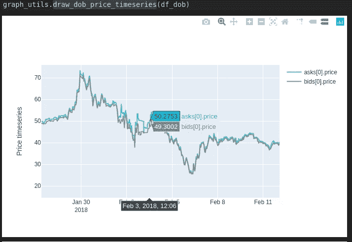

放大第一级的要价和出价

代码:

```
import plotly.graph_objs as go
def draw_dob_price_timeseries(df_dob):
    elements0 = ['asks[0].price','bids[0].price']
    elements1 = ['asks[1].price','bids[1].price']
    elements2 = ['asks[2].price','bids[2].price']
    elements3 = ['asks[3].price','bids[3].price']
    elements4 = ['asks[4].price','bids[4].price']
    elements = [elements0, elements1, elements2, elements3, elements4]
    for el in elements:
        _draw_dob_timeseries(df_dob, el, 'Price timeseries')def _draw_dob_timeseries(df_dob, elements, title):
    trace_asks0 = go.Scatter(
        x = df_dob.date_time_exchange,
        y=df_dob[elements[0]],
        name=elements[0],
        line = dict(color = '#17BECF'),
        opacity = 0.8 
    )
    trace_bids0 = go.Scatter(
        x = df_dob.date_time_exchange,
        y=df_dob[elements[1]],
        name=elements[1],
        line = dict(color = '#7F7F7F'),
        opacity = 0.8    
    )
    data = [trace_asks0, trace_bids0]
    layout = go.Layout(
        yaxis=dict(
            title=title,
            zeroline=False
        )
    )
    fig = go.Figure(data=data, layout=layout)
    fig.show()

def _draw_dob_box_plots(df_dob, size_or_price):
    trace_asks0 = go.Box(
        y=df_dob['asks[0].' + size_or_price],
        name='asks[0]' + size_or_price,
        marker=dict(
            color='#3D9970'
        )
    )
    trace_bids0 = go.Box(
        y=df_dob['bids[0].' + size_or_price],
        name='bids[0].' + size_or_price,
        marker=dict(
            color='#3D9970'
        )
    )
    trace_asks1 = go.Box(
        y=df_dob['asks[1].' + size_or_price],
        name='asks[1].' + size_or_price,
        marker=dict(
            color='#6D9970'
        )
    )
    trace_bids1 = go.Box(
        y=df_dob['bids[1].' + size_or_price],
        name='bids[1].' + size_or_price,
        marker=dict(
            color='#6D9970'
        )
    )
    trace_asks2 = go.Box(
        y=df_dob['asks[2].' + size_or_price],
        name='asks[2].' + size_or_price,
        marker=dict(
            color='#9D9970'
        )
    )
    trace_bids2 = go.Box(
        y=df_dob['bids[2].' + size_or_price],
        name='bids[2].' + size_or_price,
        marker=dict(
            color='#9D9970'
        )
    )
    trace_asks3 = go.Box(
        y=df_dob['asks[3].' + size_or_price],
        name='asks[3].' + size_or_price,
        marker=dict(
            color='#BD9970'
        )
    )
    trace_bids3 = go.Box(
        y=df_dob['bids[3].' + size_or_price],
        name='bids[3].' + size_or_price,
        marker=dict(
            color='#BD9970'
        )
    )
    trace_asks4 = go.Box(
        y=df_dob['asks[4].' + size_or_price],
        name='asks[4].' + size_or_price,
        marker=dict(
            color='#ED9970'
        )
    )
    trace_bids4 = go.Box(
        y=df_dob['bids[4].' + size_or_price],
        name='bids[4].' + size_or_price,
        marker=dict(
            color='#ED9970'
        ))data = [trace_asks0, trace_bids0, trace_asks1, trace_bids1, trace_asks2, trace_bids2, \
            trace_asks3, trace_bids3, trace_asks4, trace_bids4]
    layout = go.Layout(
        yaxis=dict(
            title=size_or_price + 'Boxplot',
            zeroline=False
        )
    )
    fig = go.Figure(data=data, layout=layout)
    fig.show()
```

这里的代码多了一点，但结构是一样的。

## 交易 EDA

让我们也从箱线图开始，关注买卖中的价格:

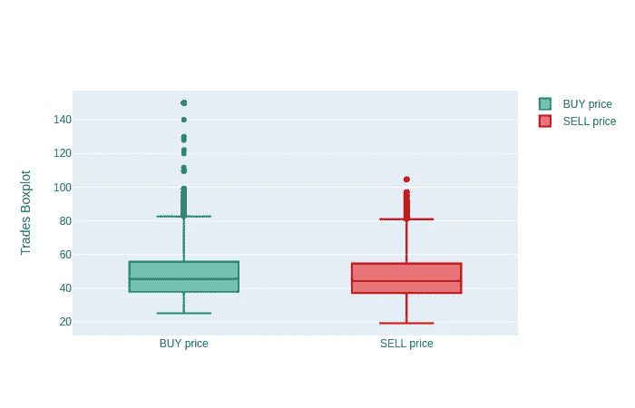

买入和卖出价格方框图

然后是一个条形图，显示买卖操作的数量:

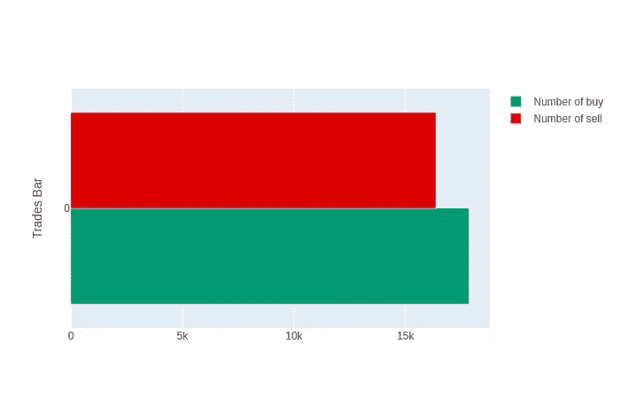

交易并排计算

```
import plotly.graph_objs as go
def draw_trades_bars(df_trades):
    trace0 = **go.Bar**(
        x = np.array(df_trades[df_trades.taker_side ==  'BUY'].price.count()),
        name = 'Number of buy',
        marker=dict(
            color='#009970')
    )trace1 = **go.Bar**(
        x = np.array(df_trades[df_trades.taker_side == 'SELL'].price.count()), 
        name = 'Number of sell',
        marker=dict(
            color='#DD0000')
    )

    data = [trace0, trace1]
    layout = go.Layout(
        yaxis=dict(
            title='Trades Bar',
            zeroline=False
        )
    )
    fig = go.Figure(data=data, layout=layout)
    fig.show()
```

如你所见，结构总是相同的，但是在这种情况下，我们使用 go。Bar 代替 go.Scatter

让我们看看交易柱状图:

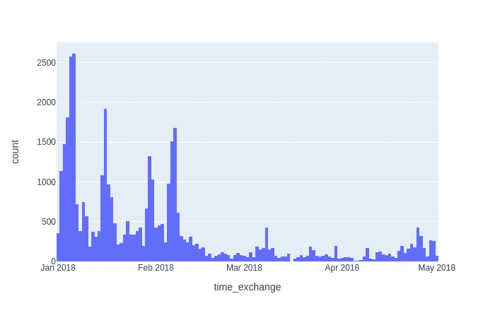

交易直方图

二月后，活动减少，没有峰值。

## 组合 EDA

让我们把所有的东西放在一起，看看我们是否能获得更多关于数据的直觉。

为了简化分析，我们将汇总两个数据，以 1 小时为间隔重新采样，并取 5 个值中的最大值。

```
RESAMPLE_TIME = '1H'
df_dob_resampled = df_dob.copy()
df_dob_resampled.index = df_dob_resampled['date_time_exchange'] 
df_dob_resampled = df_dob_resampled.**resample**(RESAMPLE_TIME).max()
df_dob_resampled.drop(columns=['date_time_exchange','date_time_coinapi'], inplace=True)df_dob_resampled['max_asks_size'] = df_dob_resampled[['asks[0].size','asks[1].size', 'asks[2].size', 'asks[3].size', 'asks[4].size']].**max**(axis=1)
df_dob_resampled['max_bids_size'] = df_dob_resampled[['bids[0].size','bids[1].size', 'bids[2].size', 'bids[3].size', 'bids[4].size']].**max**(axis=1)
df_dob_resampled['max_asks_price'] = df_dob_resampled[['asks[0].price','asks[1].price', 'asks[2].price', 'asks[3].price', 'asks[4].price']].**max**(axis=1)
df_dob_resampled['max_bids_price'] = df_dob_resampled[['bids[0].price','bids[1].price', 'bids[2].price', 'bids[3].price', 'bids[4].price']].**max**(axis=1)df_dob_resampled.drop(columns=[
                      'asks[0].size','asks[1].size', 'asks[2].size', 'asks[3].size', 'asks[4].size', \
                      'bids[0].size','bids[1].size', 'bids[2].size', 'bids[3].size', 'bids[4].size', \
                      'asks[0].price','asks[1].price', 'asks[2].price', 'asks[3].price', 'asks[4].price', \
                      'bids[0].price','bids[1].price', 'bids[2].price', 'bids[3].price', 'bids[4].price'], inplace=True)
```

得到这样的东西:

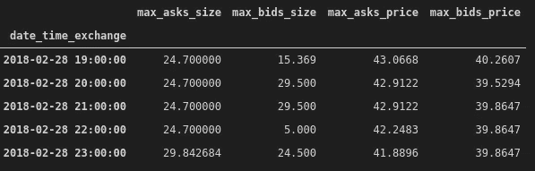

让我们对交易数据做同样的处理，分为卖出和买入:

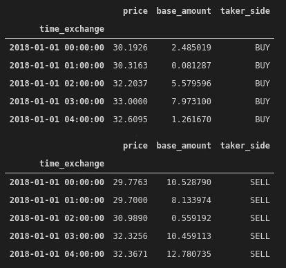

现在我们可以建立一个时间序列图，将 DOB 和交易放在一起，看看是否发生了一些奇怪的事情:


大约在一月中旬，有一个异常现象，让我们放大一下:

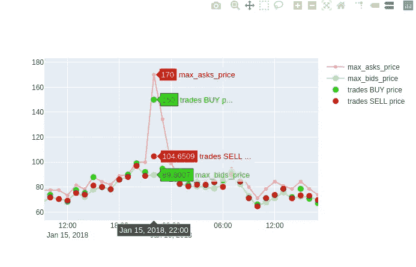

我们可以看到要价突然上升，这可能是“欺骗”试探性的信号，这是一种非法行为，买家操纵市场支付更高的价格，并由于其他买家行为的累积效应而将价格推得更高。

```
import plotly.graph_objs as go
def draw_max_timeseries(df_dob_resampled, df_trades_resampled_buy, df_trades_resampled_sell, title):
    trace0 = go.Scatter(
        x = df_dob_resampled.index,
        y = df_dob_resampled['max_asks_price'],
        mode = 'lines+markers',
        name='max_asks_price',
        line = dict(color = '#dd0000', shape = 'linear'),
        opacity = 0.3,
        connectgaps=True
    )
    trace1 = go.Scatter(
        x = df_dob_resampled.index,
        y = df_dob_resampled['max_bids_price'],
        name='max_bids_price',
        mode = 'lines+markers',
        marker = dict(
            size = 10,
            color = '#44dd00'),
        opacity = 0.3    
    )
    trace2 = go.Scatter(
        x = df_trades_resampled_buy.index,
        y = df_trades_resampled_buy.price,
        name='trades BUY price',
        mode = 'markers',
        marker = dict(
            size = 10,
            color = '#00dd00'),
        opacity = 0.8    
    )
    trace3 = go.Scatter(
        x = df_trades_resampled_sell.index,
        y = df_trades_resampled_sell.price,
        name='trades SELL price',
        mode = 'markers',
        marker = dict(
            size = 10,
            color = '#dd0000'),
        opacity = 0.8    
    )data = [trace0, trace1, trace2, trace3]
    layout = go.Layout(
        yaxis=dict(
            title=title,
            zeroline=True
        )
    )
    fig = go.Figure(data=data, layout=layout)
    fig.show()draw_max_timeseries(df_dob_resampled, df_trades_resampled_buy, df_trades_resampled_sell, 'Max aggregated data timeseries')
```

当我们将重采样时间设置为 1 小时时，如果我们想在该时间段内获得更多的粒度，我们必须对该间隔进行切片(让我们选择 4 小时)并进行重采样，例如使用 60 秒。我们开始吧！

```
RESAMPLE_TIME = '60s'
START_INTERVAL = '2018-01-15 22:00:00'
END_INTERVAL = '2018-01-16 02:00:00'
df_dob_resampled_interval = df_dob.copy()
df_dob_resampled_interval.index = df_dob_resampled_interval['date_time_exchange']df_dob_resampled_interval = df_dob_resampled_interval[START_INTERVAL:END_INTERVAL]df_dob_resampled_interval = df_dob_resampled_interval.resample(RESAMPLE_TIME).max()
df_dob_resampled_interval.drop(columns=['date_time_exchange','date_time_coinapi'], inplace=True)df_dob_resampled_interval['max_asks_size'] = df_dob_resampled_interval[['asks[0].size','asks[1].size', 'asks[2].size', 'asks[3].size', 'asks[4].size']].max(axis=1)
df_dob_resampled_interval['max_bids_size'] = df_dob_resampled_interval[['bids[0].size','bids[1].size', 'bids[2].size', 'bids[3].size', 'bids[4].size']].max(axis=1)
df_dob_resampled_interval['max_asks_price'] = df_dob_resampled_interval[['asks[0].price','asks[1].price', 'asks[2].price', 'asks[3].price', 'asks[4].price']].max(axis=1)
df_dob_resampled_interval['max_bids_price'] = df_dob_resampled_interval[['bids[0].price','bids[1].price', 'bids[2].price', 'bids[3].price', 'bids[4].price']].max(axis=1)df_dob_resampled_interval.drop(columns=[
                      'asks[0].size','asks[1].size', 'asks[2].size', 'asks[3].size', 'asks[4].size', \
                      'bids[0].size','bids[1].size', 'bids[2].size', 'bids[3].size', 'bids[4].size', \
                      'asks[0].price','asks[1].price', 'asks[2].price', 'asks[3].price', 'asks[4].price', \
                      'bids[0].price','bids[1].price', 'bids[2].price', 'bids[3].price', 'bids[4].price'], inplace=True)df_dob_resampled_interval.head()df_trades_resampled_interval = df_trades.copy()
df_trades_resampled_interval.index = df_trades_resampled_interval['time_exchange'] 
df_trades_resampled_interval = df_trades_resampled_interval[START_INTERVAL:END_INTERVAL]
df_trades_resampled_interval_buy = df_trades_resampled_interval[df_trades_resampled_interval.taker_side == 'BUY'].resample(RESAMPLE_TIME).max()
df_trades_resampled_interval_buy.drop(columns=['time_exchange', 'time_coinapi','guid'], inplace=True)
df_trades_resampled_interval_buy.head()df_trades_resampled_interval = df_trades.copy()
df_trades_resampled_interval.index = df_trades_resampled_interval['time_exchange']
df_trades_resampled_interval = df_trades_resampled_interval[START_INTERVAL:END_INTERVAL]
df_trades_resampled_interval_sell = df_trades_resampled_interval[df_trades_resampled_interval.taker_side == 'SELL'].resample(RESAMPLE_TIME).max()
df_trades_resampled_interval_sell.drop(columns=['time_exchange', 'time_coinapi', 'guid'], inplace=True)
df_trades_resampled_interval_sell.head()
```

现在我们有了这样的东西:


有 NaN 值不是问题，会被 Plotly 忽略。

让我们画出来:

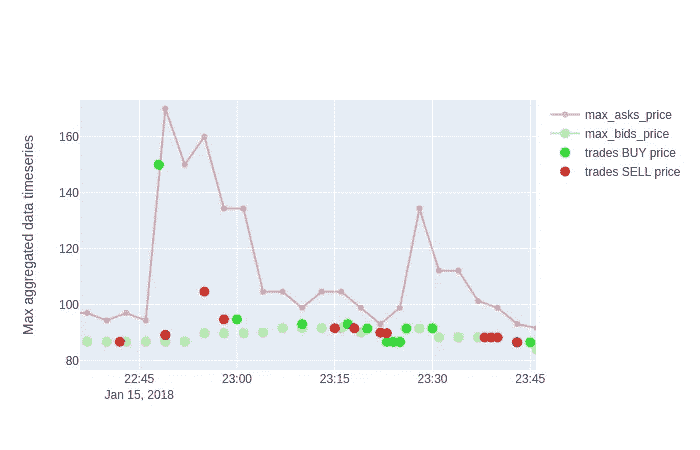

我们可以看到，在 22:45 左右出现了峰值，一小时后情况恢复正常，但只有一笔交易价格上涨，因此不存在累积效应。

# 结论

EDA 是对数据执行的基本活动，使用简单而强大的工具有效地执行 EDA 可以节省时间，从而可以专注于直觉而不是代码。

有几个库可以用来做数据可视化，当然 Plotly 是其中一个更强大、更容易使用的库，尤其是最新版本，所以获取一些数据并尝试一下吧！