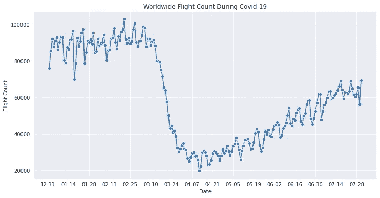
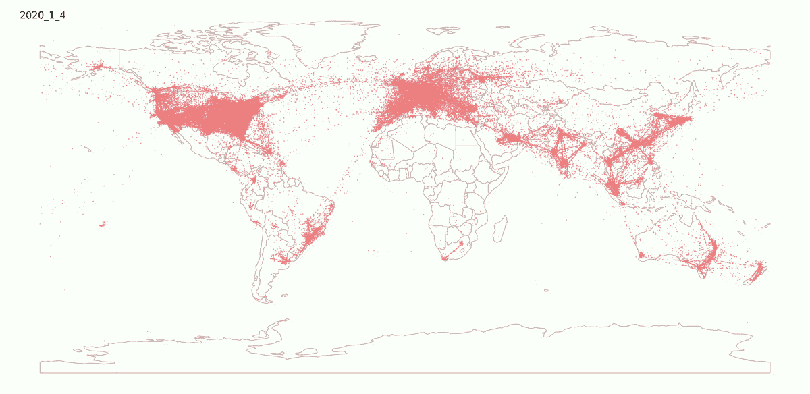
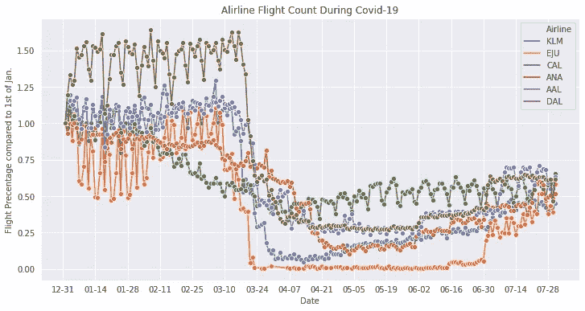
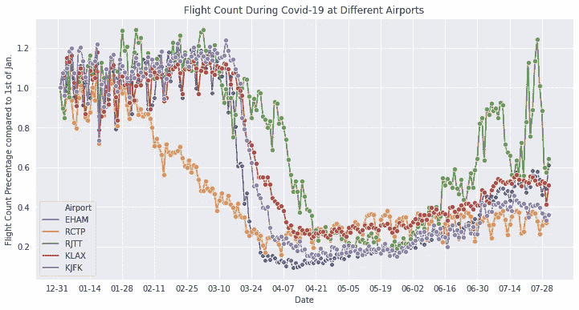
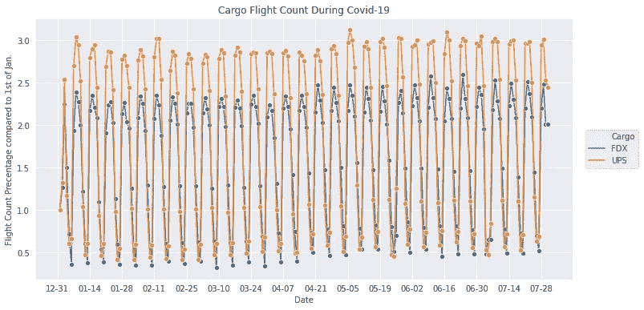

# 新冠肺炎疫情期间空中交通的可视化

> 原文：<https://towardsdatascience.com/visualization-of-air-traffic-during-covid-19-pandemic-c5941b049401?source=collection_archive---------19----------------------->

## 2020 年全球航班数据的探索性数据分析

阿列克谢·斯塔基在 [Unsplash](https://unsplash.com?utm_source=medium&utm_medium=referral) 上的照片

# 介绍

新冠肺炎·疫情严重影响了世界。为了减缓疫情，各国发布了旅行限制，社会距离的任务，锁定等。因此，很多企业都受到了影响。旅游业是遭受重创的行业之一。

由于旅行限制，世界各地的航班数量急剧下降。在这篇文章中，我将对飞行数据进行分析和可视化。

# 资料组

我使用的数据集是“来自 OpenSky Network 2020 的[众包空中交通数据”。它以多个 csv 文件(每月一个文件)的形式提供 2019 年 1 月 1 日至 2020 年 7 月 31 日的航班数据。在这项工作中，我使用了 2020 年 1 月 1 日至 2020 年 7 月 31 日的数据。](https://zenodo.org/record/3974209#.X1C349P7Q3Q)

该数据集具有以下特征:

> 呼号:显示在 ATC 屏幕上的航班标识符(通常前三个字母是为航空公司保留的:AFR 代表法航，DLH 代表汉莎航空，等等。)
> 
> **编号**:航班的商业编号，如果有的话(与呼号的匹配来自公共开放 API)
> 
> **icao24** :应答器唯一标识号；
> 
> **登记**:飞机尾号(如有)；
> 
> **类型码**:飞机型号类型(如有)；
> 
> **始发地**:航班始发地机场的四个字母代码(如有)；
> 
> **目的地**:该航班目的地机场的四个字母代码(如有)；
> 
> **first seen**:open sky 网络收到的第一条消息的 UTC 时间戳；
> 
> **last seen**:open sky 网络收到的最后一条消息的 UTC 时间戳；
> 
> **日**:开放天空网络收到最后一条消息的 UTC 日；
> 
> **纬度 _1** 、**经度 _1** 、**高度 _1** :飞机第一次探测到的位置；
> 
> **纬度 _2** 、**经度 _2** 、**高度 _2** :最后检测到的飞机位置。

# 形象化

经过一些数据处理后，我能够将数据可视化。

## 总菌数

先说航班总量。

很明显，航班数量在三月初下降了很多，这是那段时间全球封锁的结果。自那以后，由于缓慢的重新开放，航班数量逐渐增加，但仍未恢复到新冠肺炎之前的水平。

新冠肺炎期间的全球航班数量(*图片由作者*提供)

我也把数据放在地图上，如下图。很明显，红色斑点的密度在三月份下降，然后逐渐增加。

新冠肺炎期间地图上的全球航班(*图片作者*

## 乘飞机

让我们分解一下，看看每个航空公司的影响。数据集中有太多的航空公司，所以我只拿其中的一些作为例子。我乘坐了一家欧洲航空公司荷航(荷兰)，两家美国航空公司 AAL 和达美，两家亚洲航空公司全日空(日本)，加州航空(台湾)，以及一家廉价航空公司 EJU(易捷)。

与 1 月 1 日相比，3 月和 4 月的大部分航班数量大幅下降至 25%以下，易捷航空(EJU)甚至在 3 月至 6 月间降至 0。7 月底，这些航空公司的航班数量回升至 50%左右。

新冠肺炎期间各航空公司的航班数量(*图片由作者*提供)

> 台湾航空公司(CAL)是一个特例，它没有像其他航空公司一样在 3 月份急剧下降，而是从 1 月份开始逐渐下降，即使在最糟糕的时期也仍然保持在 50%左右。这可能是因为台湾政府很早就意识到了新冠肺炎。另一家亚洲航空公司(全日空)也显示了早期活动的减少。

## 乘机场

让我们看看机场。我以阿姆斯特丹(EHAM)、台北(RCTP)、东京(RJTT)、洛杉矶(KLAX)和纽约(JFK)为例。

它显示了类似的趋势，在 3 月和 4 月急剧下降到 20%,然后缓慢回升到 40 %- 60%。阿姆斯特丹机场比美国机场(洛杉矶和纽约)稍早减少了活动。东京机场稍早开始减少活动，但速度较慢。台北表现出不同的行为，它在一月底开始缓慢下降，这与台湾的 CAL 航空公司相似。

新冠肺炎期间每个机场的航班数量

## 货物

货运航班怎么样？

从联邦快递和 UPS 航班的数据来看，并没有真正受到冲击。

新冠肺炎期间每个机场的货运航班数量(*图片作者*

# 结论

*   新冠肺炎疫情开始时，航班流量显著下降，并已逐渐恢复。
*   廉价航空公司(Easyjet)从 3 月到 6 月几乎停止了航班，然后从 6 月开始逐渐恢复。
*   货运航班没有受到影响。

感谢阅读。